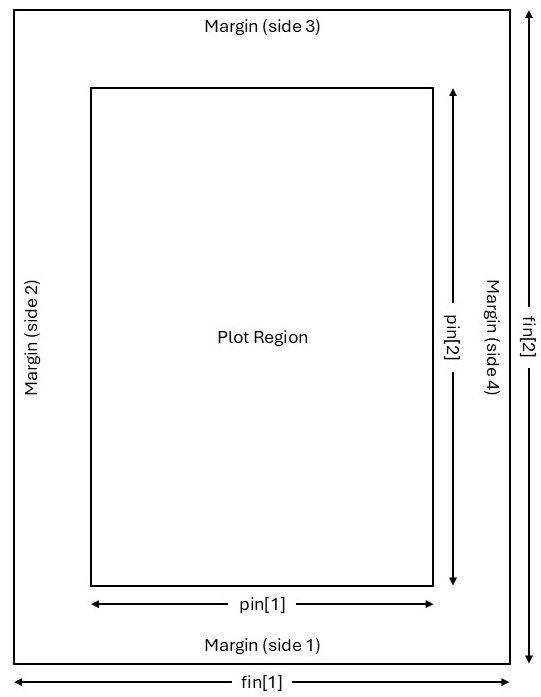

# Introducing traditional R graphics {#graphics}

A basic knowledge of R graphics is needed before directing attention to the art of writing programs (functions) in R. Therefore, in this chapter a brief overview is given of the basics of traditional R graphics. In a later chapter, after studying the principles of R programming, a second round of R graphics will follow.  

##	General

Study the graphical parameters by requesting

```{r, eval = FALSE}
?par
```

In Figure \@ref(fig:figRegion) the main components of a graph window are illustrated. Study this figure in detail. The *<span style="color:#FF9966">Plot Region</span>* together with the*<span style="color:#FF9966">Margins</span>*  is called the *<span style="color:#FF9966">Figure Region</span>*.


```{r, figRegion, echo=FALSE, fig.cap="The main components of a graph window and the parameters for controlling their sizes.  The parameter mai is a numerical vector of the form c(bottom, left, top, right) specifying the margins in inches while the parameter mar has a similar form specifying the respective margins as the number of lines. The default of mar is c(5, 4, 4, 2) + 0.1."}
library(knitr)

```


(a)	What is the difference between high-level and low-level plotting instructions?

(b)	Take note especially how the functions `windows()`, `win.graph()` or `x11()` are used as well as the different options available for these functions. 

(c)	The instruction `dev.new()` allows opening a new graph window in a platform-independent way.

(d)	In this chapter some high-level plotting instructions are studied. Each of these instructions results in a (new) graph window with a complete graph drawn.  The command `graphics.off()` deletes all open graphic devices.

(e)	Study the use of  `par()`,  `par(mfrow =)`  and  `par(mfcol =)`. Study the use of `par(new = TRUE)` to plot more than one figure on the same set of axes.

(f)	Study how the functions `graphics.off()` and `dev.off()`  work.

##	High-level plotting instructions { #highLevelPlotting }

(a)	Construct a barplot of the illiteracy of the states according to the `areagrp` (as defined in section \@ref(areagrp)) in the `state.x77` dataframe. *Hint*: The function `tapply()` operates on a vector given as its first argument.  Its second argument groups the first argument into groups so that the function given in its third argument can be applied to each of these groups. Study the following command:

```{r, eval = FALSE}
barplot (tapply (state.x77[, "Illiteracy"], areagrp, mean), 
         names=levels(areagrp), ylab = "Illiteracy", xlab = "Area of State", 
         main = "Barplot of Mean Illiteracy")
```

(b)	Construct, for the `state.x77` data set, box plots of illiteracy broken down by the income of the states. First use `cut()` to form three categories of state income:

```{r, cutIncome}
state.income <- cut (state.x77[ , "Income"], c(0, 4000, 5000, Inf),
                   labels=c("$4000 or less", "$4001-$5000", "more than $5001"))
```

<div style="margin-left: 25px; margin-right: 20px;">
Then use `boxplot()` together with `split()` to produce the desired graph:
</div>

```{r, eval = FALSE}
boxplot (split (state.x77[ , "Income"], state.income))
```

<div style="margin-left: 25px; margin-right: 20px;">
Add labels for the axes as well as a title for the figure.
</div>

(c)	Repeat the previous example but use argument `notch = TRUE`.

(d)	Attach the package `akima`. What is the usage of the function `interp()`? Discuss by constructing the following contour plot:

```{r, eval = FALSE}
contour (interp (state.center$x, state.center$y,  state.x77[,"Frost"])) 
```

(e) What is a *<span style="color:#FF9966">coplot</span>*? Discuss after giving the following instruction and referring to the role of the tilde (~) operator.

```{r, eval = FALSE}
coplot (state.x77[,"Illiteracy"] ~ state.x77[,"Area"] | state.x77[,"Income"])
```

(f) A *<span style="color:#FF9966">dotchart</span>* is constructed with function `dotchart()`. First some preparations are necessary:

```{r, dotchart}
incgroup <- cut(state.x77[,"Income"],  3, 
                labels = c("LowInc", "MediumInc", "HighInc"))
lifgroup <- cut(state.x77[,"Life Exp"], 2, 
                labels = c("LowExp", "HighExp"))
table.out <- tapply(state.x77 [,"Income"], list(lifgroup,incgroup), mean)
table.out
dotchart (table.out, 
          levels (factor (col (table.out), 
                          labels = levels (incgroup)))[col(table.out)], 
          factor(row(table.out), labels = levels(lifgroup)))
```

<div style="margin-left: 25px; margin-right: 20px;">
Complete the graph by adding a label to the x-axis and a heading for the graph.
</div>

(g)	Use function `faces()` available in package `aplpack` to construct Chernoff  faces for the Western states in the data set `state.x77`.  *Hint*: The Western states appear in rows 3, 5, 12, 26, 28, 37, 44, 47 and 50.  Explain what is represented by each of the facial features. First set argument `face.type = 0` and then `face.type = 1`.

(h)	Obtain a histogram of the life expectancy in the states of `state.x77`.

(i)	Execute the command

```{r, eval = FALSE}
pairs (state.x77)
```

<div style="margin-left: 25px; margin-right: 20px;">
Interpret the graph.
</div>

(j)	Three-dimensional graphs are constructed with function `persp()`.

```{r, eval = FALSE}
pts <- seq(from = -pi, to = pi, len = 20)
z <- outer(X = pts, Y = pts, function(x,y) sin(x)*cos(y))
persp(x = pts, y = pts, z, theta = 10, phi = 60, ticktype = 'detailed')
```

<div style="margin-left: 25px; margin-right: 20px;">
Discuss the meaning of each of the above instructions.  Experiment with different values for arguments `theta` and `phi`.
</div>

(k)	Obtain a pie chart of the object `areagrp` defined in section \@ref(areagrp). *Hint*: function `table()` may be useful here.

(l)	A cluster plot (dendrogram) can be constructed with function `plclust()` as follows:

```{r, eval = FALSE}
west.rows <- c(3, 5, 12, 26, 28, 37, 44, 47, 50)
distmat.west <- dist (scale (state.x77[west.rows,]))
plot(hclust(distmat.west), labels = rownames(state.x77)[west.rows])
```

<div style="margin-left: 25px; margin-right: 20px;">
Interpret the above instructions and the resulting plot.
</div>

(m)	Use the function `plot()` to plot $sin (\theta)$ as $\theta$ varies from  $–\pi$  to $\pi$.

(n)	Could you explain the different graphs resulting from the two calls to the `plot()` function above?

(o)	Obtain the empirical distribution function of variable `Life Exp` in the `state.x77` data set by using the functions `cut()`, `ecdf()` and `plot()`.

(p)	Check the normality of variable `Income` in the `state.x7`7 data set by using function `qqnorm()`.

(q)	Obtain a `qqplot` of the income of small states versus the income of large states in the data set `state.x77` where small and large are defined as below or above the median income, respectively.

```{r, eval = FALSE}
state.size <- cut (state.x77[,"Area"],  
                   c(0, median (state.x77[,"Area"]), max (state.x77[,"Area"])))
state.income <- split (state.x77[,"Income"], state.size)
qqplot(state.income[[1]], state.income[[2]], xlab="Income for small states", 
       ylab="income for large states")
```

(r) Use function `ts.plot()` to construct a time series plot of the sunspots data set.

##	Interactive communication with graphs

(a) Study the help files of the functions `text()`, `identify()` and `locator()`.

(b)	Illustrate the usage of `identify()` on a scatterplot of variables `Illiteracy` and `Life Exp` in the `state.x77` data set:

```{r, eval = FALSE}
plot (x = state.x77[,'Life Exp'], y = state.x77[,'Income'])
```

<div style="margin-left: 25px; margin-right: 20px;">
To create the scatterplot, then call
</div>

```{r, eval = FALSE}
identify (x = state.x77[,'Life Exp'], y = state.x77[,'Income'], 
          seq (along = rownames(state.x77)), n = 5)
```

<div style="margin-left: 25px; margin-right: 20px;">
Notice the change in the cursor; the cursor changes to a cross when moved over the graph.  Hover the cursor over a point to identify and click left mouse button. Repeat  $n = 5$ times.  Explain the result. Next, create the scatterplot once more and then call
</div>

```{r, eval = FALSE}
identify (x = state.x77[,'Life Exp'],  y = state.x77[,'Income'], 
          labels = rownames(state.x77)[seq (along = 
                                              rownames(state.x77))] , n = 5) 
```

<div style="margin-left: 25px; margin-right: 20px;">
Explain what has happened.
</div>

(c)	Illustrate the usage of `locator()` by:

<div style="margin-left: 25px; margin-right: 20px;">
*Joining $5$ user defined points on a graph interactively with straight lines*
</div>
    
```{r, eval = FALSE}
plot (x = state.x77[,'Life Exp'], y = state.x77[,'Income'])
locator(5, type = "l") 
```

<div style="margin-left: 25px; margin-right: 20px;">
Use mouse and select the five points on the graph. What happened on the graph? What happened in the commands window?

*Writing text interactively at a specified position on an existing graph*
</div>

```{r, eval = FALSE}
plot (x = state.x77[,'Life Exp'], y = state.x77[,'Income'])
text (locator (n = 1, type = "n"), label = "State with the highest income")
```

## 3D graphics: package rgl

Write and execute the following function.

```{r, eval = FALSE}
rgl.example <- function (size = 0.1, col = "green", alpha.3d = 0.6) 
{ require(rgl)
  datmat <- matrix (rnorm (30), ncol = 3)
  open3d()
  spheres3d (datmat,radius = size, color = col, alpha = alpha.3d)
  axes3d(col = "black")
  device.ID <- rgl.cur()
  answer <- readline ("Save 3D graph as a .png file? Y/N\n")
  while (!(answer == "Y" | answer == "y" | answer == "N" | answer == "n")) 
    answer <- readline("Save 3D graph as a .png file? Y/N\n")
  if (answer == "Y" | answer == "y") 
    repeat 
    { file.name <- readline ("Provide file name including full 
                              path NOT in quotes and SINGLE 
                              back slashes!\n")
      file.name <- paste (file.name, ".png", sep = "")
      snapshot3d (file = file.name)
      rgl.set (device.ID)
      answer2 <- readline("Save another 3D graph as a .png file? Y/N \n")
      if (answer2 == "Y" | answer2 == "y") next else break
    }
  else rgl.set (device.ID)
}
```

Study the above code and constructions in detail.

##	Exercise

::: {style="color: #80CC99;"}
1.	Obtain a graph of a $normal(100, 25)$ probability density function (p.d.f.).

2.	Plot on the same set of axes
    (i)  a central $beta(9, 5)$ p.d.f.; 
    (ii) a non-central $beta(9 5)$ p.d.f. with non-centrality parameter = $15$ and 
    (iii) a non-central $beta(9, 5)$ p.d.f. with non-centrality parameter = $40$. 
    
<div style="margin-left: 25px; margin-right: 20px;">
Add a suitable legend to the plot.
</div>
	
3. Use `persp()` to obtain a graph of any user specified bivariate function. The challenge is that the function specification must appear as the main title of the graph. In order to address this problem we need information about the arguments of `persp()`:

```{r, perspArg}
args (persp)
```

<div style="margin-left: 25px; margin-right: 20px;">
This is not very helpful so we try
</div>

```{r, perspMethods, error = 0}
methods (persp)
args (persp.default)
```

<div style="margin-left: 25px; margin-right: 20px;">
The reason for this error message follows from the above as that `persp.default` is not visible. The immediate visibility of a function is regulated by a package builder through the package’s namespace mechanism. Only object names that are exported are immediately visible; object names that are not exported are marked with an asterisk and are not visible. The functions 
`argsAnywhere()` and `getAnywhere()` are available to get information on asterisked object names:
</div>

```{r, Anywhere}
argsAnywhere (persp.default)
```

<div style="margin-left: 25px; margin-right: 20px;">
We notice that we can make use of the argument main in a call to `persp()` to provide our perspective plot with a title. However, main accepts only character strings and not mathematical expressions.  Furthermore, we have seen in the `persp()` example in section \@ref(highLevelPlotting) that the values for the argument `z` are conveniently found by a call to `outer()` using its argument `FUN`. However `FUN` requires a function. So we need the means to convert expressions into character strings and vice versa to convert character strings into expressions.

The following pairs of functions allow these conversions to be made:

Character strings (" ") →  expressions: `parse()` and `eval()`

Expressions (unquoted)  → character strings (" "): `deparse()` and `substitute()`
</div>

```{r, eval = FALSE}
pts <- seq (from = -3, to = 3, len = 50)
fun1 <- "2 * pi * exp(-(x^2 + y^2)/2)"
fun2 <- parse (text = paste ("function(x,y)", fun1))
```

<div style="margin-left: 25px; margin-right: 20px;">
Explain carefully what `parse()` is doing.
</div>

```{r, eval = FALSE}
zz <- outer (pts, pts, eval(fun2))
```

<div style="margin-left: 25px; margin-right: 20px;">
Explain carefully what `eval()` is doing.
</div>

```{r, eval = FALSE}
persp (x = pts, y = pts, z = zz, theta = 0, phi = 15, ticktype = "detailed", 
       main = paste("Persp plot of `"fun2,"`",sep=""))
```

<div style="margin-left: 25px; margin-right: 20px;">
Explain carefully the role of `paste()`.
</div>

4. Use the `volcano` data to:

    (i) Obtain a perspective plot using `persp()`.
	   
    (ii) 	Obtain an RGL plot of the `volcano` data.

:::

