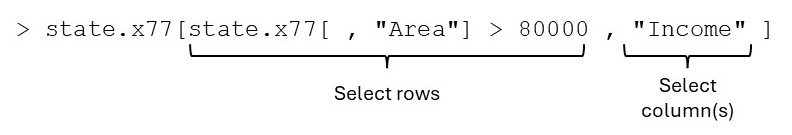

# Subscripting {#subscripting}

Vectorized arithmetic and subscripting are two cornerstones of R programming. Review section \@ref(highLevelPlotting) for several examples where subscripting has been used. In this chapter subscripting is studied in detail. Specifically, the following two related topics are studied:

*	Extracting parts of an object by using *<span style="color:#FF9966">subscripting</span>*.
* The combination and rearranging of data within data structures like matrices, dataframes and lists.

## Subscripting with vectors { #vectorSubscripting }

The different types of subscripting with vectors are summarized in Table \@ref(tab:SubscriptVectorTypes):

Table: (\#tab:SubscriptVectorTypes) Different types of subscripting vectors.

| *<span style="color:#CC99FF">Type</span>* | *<span style="color:#CC99FF">Effect</span>* | *<span style="color:#CC99FF">Example</span>* | 
| ------ | -------------------- | ----------- | 
| empty              |	Extract all values  | `x[ ]` | 
| integer, positive  |	Extract all values specified by the subscript | `x[c(2:5,8,12) ]` | 
| integer, negative  |	Extract all values except those specified by the subscript | `x[–c(2:5,8,12) ]` | 
| logical            |	Extract those values for which subscript is TRUE | `x[x > 5 ]` | 
| character          |	Extract those values whose names attributes correspond to those specified by the subscript  | `x[c("a","d") ]` | 

Logical subscripting provides a very powerful operation in R. A logical subscript is a vector of `TRUE`s and `FALSE`s that must be of the same length as the object being subscripted e.g.

```{r, logicalSubscript}
state.x77[ , "Area"] > 80000  
```

```{r, matrixSubscripting, echo=FALSE, out.width="80%"}
library(knitr)

```

```{r, subscript_matrix}
x <- c(10, 15, 12, NA, 18, 20)
is.na (x)
x[is.na (x)]
x[!is.na (x)]
mean (x)
mean (x[!is.na (x)])
mean (na.omit (x))
```

Logical subscripting allows finding the indices of those elements in a vector that meet a certain condition e.g.

```{r, subscript_indices}
(1:length (rownames (state.x77)))[state.x77[ ,"Income"] > 5000]
```

and to find the corresponding names of the states

```{r, subscript_names}
rownames(state.x77)[
  (1:length (rownames(state.x77)))[state.x77[ ,"Income"] > 5000]]
```

In addition to extracting elements, the above subscripting operations can also be used to modify selected elements of a vector e.g. changing NA-values to zero:

```{r, NA_to_zero}
x
x[is.na (x)] <- 0
x
```

When the right-hand side of the assignment above is a scalar value, each of the selected values will be changed to the specified scalar value; if the right-hand side is a vector, the selecting values will be changed in order, *<span style="color:#FF9966">recycling</span>* the values if more values were selected on the left-hand side than were available on the right-hand side.

##	Subscripting with matrices

Element and submatrix extraction of matrices are discussed below.

(a)	Revise the use of `matrix()`, `names()`, `dim()` and `dimnames()`.

(b)	A matrix in R is an *<span style="color:#FF9966">array</span>* with two indices. Arrays of order two and higher can be constructed with the function `dim()` or `array()`.

<div style="margin-left: 25px; margin-right: 20px;">
Let, for example, $\mathbf{a}$ be a vector consisting of $150$ elements. The instruction 
</div>

```{r, eval = FALSE}
dim(a) <- c(3, 5, 10) 
```

<div style="margin-left: 25px; margin-right: 20px;">
or the instruction
</div>

```{r, eval = FALSE}
a <- array (a, dim = c(3, 5, 10)) 
```

<div style="margin-left: 25px; margin-right: 20px;">
constructs a $3 \times 5 \times 10$ array.
</div>

* Matrices can therefore be formed as above, but the function `matrix()` is usually easier to use.
* The elements of a $p$-dimensional array can also be extracted using the one-index or two-index method as described below.

(c) The subscripting methods described in section \@ref(vectorSubscripting) can also be applied to both the first or second dimension of a matrix where the first dimension refers to the rows and the second dimension to the columns of the matrix.

(d) Note that the elements of a matrix can be referred to by the two-index method above or by a one index method. When the one index method is used it is assumed that the matrix has first been strung out *<span style="color:#FF9966">column</span>*-wise into a vector.

```{r, subscripting_with_matrix}
testmat.a <- matrix (c (17, 40, 20, 34, 21, 12, 14, 57, 
                        78, 37, 29, 64), nrow = 4)
testmat.a
testmat.b <- matrix (c (17, 40, 20, 34, 21, 12, 14, 57, 
                        78, 37, 29, 64), nrow = 4, byrow = TRUE)
testmat.b
```

<div style="margin-left: 25px; margin-right: 20px;">
Comment on the difference between `testmat.a` and `testmat.b`.
</div>

```{r, subscripting_with_matrix_2}
testmat.a[2,3]   # Two index matrix reference
testmat.a[10] 	# One index matrix reference
```

(e) Write a function to convert a one-index to a two-index matrix reference. Give an example of the usage of your function.

(f)	Write a function to convert a two-index to a one-index matrix reference. Give an example of the usage of your function.

(g)	Consider the following example to form submatrices:

```{r, submatrices}
testmat <- matrix(1:50, nrow = 10, byrow = TRUE)
testmat[1:2, c (3, 5)]
testmat[1:2, 3]
testmat[1:2, 3, drop=FALSE]
```

(h) Notice the difference between `testmat [1:2, 3]` and `testmat [1:2, 3, drop = FALSE]`. The first command results in the output to be given in the form of a vector while the optional `drop = FALSE` in the second command retains the matrix structure of the output. This distinction can have serious consequences when a procedure expects a matrix argument and not a vector.

(i)	Notice also that the output of both `testmat[1:2,3]` and `testmat[3, 1:2]` has a similar form: R makes no distinction between column vectors and row vectors; all one-dimensional collections of numbers are treated identically.

(j)	Apart from using vectors as subscripts to a matrix, a matrix can also be used as a subscript to a matrix. There are two cases:

    (A) a numeric subscripting matrix and
    (B) a logical subscripting matrix. 
    
#### Case A {-}

Here the subscripting numeric matrix must have exactly two columns: the first provide row indices and the second column indices.

(i)	If used on the right-hand side of an expression the result of a *case A* subscripting is a vector containing the values specified by the subscripting matrix. 

(ii) If used on the left-hand side of an assignment a numeric matrix first selects those elements specified by its row and column indices; then these values are replaced one by one with the objects specified by the right-hand side of the assignment. 

Here is an example of *case A* subscripting with the subscript matrix on the right-hand side of the assignment:

```{r, caseArhs}
xmat <- matrix (1:25, nrow = 5)
xmat
superdiag.index <- matrix (c (1:4, 2:5), ncol = 2, byrow = FALSE)
superdiag.values <- xmat[superdiag.index]
superdiag.values
```

*Case A* subscripting with the numeric subscript matrix on the left-hand side of the assignment:

```{r, caseAlfs}
subscript.mat <- matrix (c(1:3, 1:3, rep(1,3), rep(2,3)), ncol=2)
subscript.mat
xx <- matrix(NA, nrow=3,ncol=2)
xx 
xx[subscript.mat] <- c(10,12,14,100,120,140)
xx
```

#### Case B {-}

The logical subscripting matrix must be in size exactly similar to that matrix it is subscripting and will select those values corresponding to a `TRUE` in the subscripting matrix.

*Case B* with logical subscripting matrix at right-hand side of assignment:

```{r, caseBrhs}
testmat
aa <- testmat[testmat < 12]
aa
```

Note that the selected elements are placed column-wise in a vector.

*Case B* with logical subscripting matrix at left-hand side of assignment:

```{r, caseBlhs}
testmat[testmat < 12] <- 12
testmat
```

In order to restrict assignment to a subset of a matrix two sets of subscripts are needed. See example below:

```{r, subsetAssignment}
testmat <- matrix(1:50, nrow=10, byrow=TRUE)
testmat[, c(1,3)][testmat[,c(1,3)] <12] <- 12
testmat
```

Study the use of functions `row()` and `col()` in constructing logical matrices.

## Extracting elements of lists

(a)	Note the use of `list()` to collect objects into a list while elements are extracted with `$`

*	the function `names()`,

*	the single square brackets `[ ]` and

*	the double square brackets `[[ ]]`.

(b)	Study the following example carefully:

```{r, subscriptingLists, error = 0}
my.list <- list(el1 = 1:5, 
                el2 = c("a", "b", "c"), 
                el3 = matrix(1:16, ncol = 4), 
                el4 = c(12, 17, 23, 9))
my.list
my.list$el2
mode (my.list$el2)
my.list[el2]
my.list["el2"]
mode (my.list["el2"])
my.list[["el2"]]
mode (my.list[["el2"]])
```

<div style="margin-left: 25px; margin-right: 20px;">
Note: The above example shows that using the single pair of square brackets for subscripting a list always result in a list object to be returned. This is often the cause of an error message. See the example below.
</div>

```{r, subscriptingLists2, error = 0}
my.list[1]
mode (my.list[1])
my.list[[1]]
mode (my.list[[1]])
my.list[3][2,4]
my.list[[3]][2,4]
my.list$el3[2,4]
mean (my.list[4])
mean (my.list[[4]])
mean (my.list$el4)
```


<div style="margin-left: 25px; margin-right: 20px;">
Explain the differences and similarities between the symbols `[ ]`, `[[ ]]` and `$` when subscripting lists.
</div>

## Extracting elements from dataframes

(a)	Note the use of data.frame() for creating dataframes. A dataframe has a rectangular structure similar to a matrix but differs from a matrix in that its columns are not restricted to contain the same type of data. Each of its columns must contain the same sort of data but some columns can be numerical while others are factors for example.

(b)	Explain the difference between the objects created by the following two instructions:

```{r, matrixDataframeClasses}
my.matrix <- matrix (c (17, 40, 20, 34, 21, 12, 14, 57,
                        78, 37, 29, 64), nrow = 4, ncol = 3)
my.dataframe <- data.frame ( c(17, 40, 20, 34, 21, 12, 14, 57,
                               78, 37, 29, 64), nrow = 4, ncol = 3)
```

(c)	Note the following

```{r, matrixDataframeClasses2}
class(my.matrix)
class(my.dataframe)
is.list(data.frame)
mode(my.matrix)
mode(data.frame)
```

(d)	A sample of the behaviour of dataframes

```{r, dataframeBehavior}
my.dataframe.2 <- data.frame (C1 = c('a', 'b', 'c', 'd'), 
                              C2 = c(5, 9, 23, 17), 
                              C3 = c(TRUE, TRUE, FALSE, TRUE))
my.dataframe.2
my.dataframe.2[ ,1:2]
```

<div style="margin-left: 25px; margin-right: 20px;">
Dataframe behaves like a matrix
</div>

```{r, dataframeAsMatrix}
my.dataframe.2$C1
```

<div style="margin-left: 25px; margin-right: 20px;">
Dataframe behaves like a list
</div>

```{r, dataframeAsList}
as.matrix(my.dataframe.2)
```

<div style="margin-left: 25px; margin-right: 20px;">
Explain what has happened above.
</div>

(e)	The above examples show that a dataframe can be considered as a cross between a matrix and a list. Therefore, subscripting of dataframes generally can be performed using the basic techniques available for matrices and lists. 

(f)	An alternative technique is to extract the elements of a list by using the functions `attach()` and `names()`.  This technique is especially of importance in statistical modelling. What is a potential danger of this technique when attaching dataframes? This danger can be avoided by using `with()`.  Is this also true when modelling is performed? 

(g)	Review section \@ref(findData).  Study the help file of the function  `with()`.  What important usage has `with()`?


## Combining vectors, matrices, lists and dataframes

(a)	What is the result of the command  

```{r, eval = FALSE}
my.list <- vector ("list", k)?
```

(b)	Recall the function `c()` for creating vectors. When `c()` is used to combine a numeric vector and a character vector the result is a vector of mode “character”. Similarly, using `c()` to combine a vector with a list results in a list.

(c)	If `list()` is used to combine two or more vectors or lists the result is a list of all the objects.

(d)	The function `unlist()` can be used to convert all the elements of a list into a single vector.

```{r, unlistExample}
my.list
unlist(my.list)
```

<div style="margin-left: 25px; margin-right: 20px;">
Explain the above output.
</div>

(e)	Review the functions `cbind()`, `rbind()`, `append()`, `data.frame()`, `dim()`, `dimnames()`, `names()`, `colnames()`,  `rownames()`, `nrow()` and `ncol()`.

##	Rearranging the elements in a matrix

Study the usage of the functions `matrix()`, `t()` and `diag()`. These functions are useful to form submatrices of a matrix or to rearrange matrix elements. Note again the argument `byrow =` of `matrix()`.

## Exercise

::: {style="color: #80CC99;"}

1.	Write an R function to check if a given matrix is symmetric.

2.	Write an R function to extract (i)	the row(s) and (ii)	the columns containing the maximum value in the matrix.  Note that provision must be made that the maximum value can occur in more than one row (column). Furthermore, both the indices and actual values of the rows (columns) must be returned.  Illustrate the usage of your function with a suitable example.

3.	Describe the variables in the built-in data set `LifeCycleSavings`. Is this data set in the form of a matrix or a dataframe?

4.	Use subscripting to find the largest proportion of over 75 in those countries with a dpi of less than 1000 in the `LifeCycleSavings` data set. Also determine the country(ies) having this pop75 value.

5.	Consider the `LifeCycleSavings` data set.

    (i)	Use subscripting to find the mean aggregate savings for countries with a percentage of the population younger than 15 at least 10 times the percentage of the population over 75. 
    (ii)	Also find the mean aggregate savings for countries where the above ratio is less than 10.
    (iii)	Use function `t.test()`  to test if mean aggregate savings are different for the above two groups. 
    (iv)	Use notched box plots for an approximate test. 
   (v)	First, carefully study the output obtained in (iii) and (iv). Then interpret/discuss this output in detail.
   
6.	Consider the `state.x77` data set and the variable `state.region`. Find the state with the minimum income in each of the regions defined in state.region.

:::


