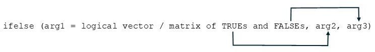

# Vectorized programming and mapping functions {#mapping}

In this chapter we continue the study the art of R programming. An important topic is a set of tools operating on objects like matrices, dataframes and lists as wholes. 

## Mapping functions to a matrix

(a)	What is understood by a mapping function and of what use are such functions?

(b)	The function `apply()`.

    (i)	What three arguments are required?
    
    (ii) Suppose the third argument is a function. How are the arguments of this function used within `apply()`?

<div style="margin-left: 40px; margin-right: 20px;">
* What is the result of the instruction `apply(is.na(x),2,all)`?

* What is the result of the instruction `x[ ,!apply(is.na(x), 2,all)]`?

* What is the result of the instruction `x[ ,!apply(is.na(x), 2,any)]`?

* Set the random seed to 137921. Obtain a matrix $\mathbf{A}:10 \times 6$ of random $n(0, 1)$ values. Use `apply()` to find the $10\%$ trimmed mean of each row.
</div>    
    
(c)	The function `sweep()`.

    (i)	What arguments are required?

    (i)	What are the similarities and differences between the arguments of `sweep()` and `apply()`?

    (iii)	Normalise the columns of a given matrix to have zero means and unit variances using `scale()`, `apply()` and `sweep()`. Which method is the fastest?
    
(d)	The function `ifelse()`.

The usage is illustrated in the following diagram.

```{r, ifelse, echo=FALSE, out.width="100%"}
library(knitr)

```

<div style="margin-left: 25px; margin-right: 20px;">
(i)	Note the difference between the function `ifelse()` and the control statement: `if` - `else`.

(ii)	What arguments are required?

(iii)	Study the help file in detail.
</div>    

(e)	The function `outer()`.

    (i)	What arguments are required?
    
    (ii)	Revise our previous example of `outer()` when constructing a perspective plot with `persp()`.
    
(f)	Work through the following examples and note in particular how the above functions are used together:

    (i)	Find the maximum value(s) in each column of the `LifeCycleSavings` data set.
    
    (ii) Use `apply()` together with `cut()` to divide each column of the LifeCycleSaving data set  into low, medium and high.
    
    (iii) Use `apply()` to plot each column of the `LifeCycleSaving` data set against the ratio of `pop75` to `pop15` on the x-axis. 
    
    (iv) Use `apply()` to find the coefficient of variation of each column of the `LifeCycleSaving` data set.
    
    (v)	Use `apply()` together with `cbind()` and `rbind()` to obtain a table of the minimum and  the maximum values of each column of the LifeCycleSaving data set. 
    
    (vi)	Repeat (v) using the airquality data set with and without the elimination of the NAs by using an appropriate function definition in the call to `apply()`.
    
    (vii)	Use `sweep()` to convert the `LifeCycleSaving` data set into standardized scores. Could `apply()` also be used for this task? Discuss.
    (viii) Use `ifelse()` to  convert negative values in a given vector to zero leaving positive values and missing values unchanged.  Illustrate.                              

## Mapping functions to vectors, dataframes and lists

(a)	Study the functions `lapply()`, `sapply()` and `split()`.

(b)	Carefully study what is produced by the command

```{r, splitExample}
lapply (split (data.frame (state.x77),   
               cut (data.frame (state.x77)$Illiteracy, 3)), pairs)
```

<div style="margin-left: 25px; margin-right: 20px;">
Note: in order to see all graphs in the R-GUI it is necessary to issue the command
</div>    

```{r, eval = FALSE}
par(ask=TRUE) 
```

<div style="margin-left: 25px; margin-right: 20px;">
before calling the function `lapply()`.
</div>    

(c)	Use `lapply()` to produce histograms of each of the variables in the `state.x77` data set such that each histogram has as title the correct variable name. The $x$- and $y$-axis must also be labelled correctly.

## The functions: `mapply()`, `rapply()` and `Vectorize()`

(a)	To apply a function to more than one list, `mapply()` is a multivariate version of `sapply()`. The first argument to `mapply()` is a function followed by the arguments for that function. The first argument function is applied to each of the elements in the following arguments.

```{r, mapplyExample}
mapply (function (x,y,z) {x+y+z}, x = c(2, 3), y = c(4,5), z = c(1,8))
mapply (function(x,y,z) { list (min (c(x,y,z)), max (c(x,y,z))) }, 
        x = c(2, 3), y = c(4, 5), z = c(1, 8))
```

(b)	Study the help-files of `rapply()` and `Vectorize()`.

## The mapping function tapply() for grouped data

(a)	Study the arguments of `tapply()`.

(b)	Consider the `LifeCycleSavings` data set. Create an object `ddpigrp` that groups the `LifeCycleSavings` data into four groups G1, G2, G3 and G4 such that G1 members have `ddpi` within $(0, 2.0]$, G2 members have `ddpi` within $(2.0, 3.5]$,  G3 members have `ddpi` within $(3.5, 5.0]$, and G4 members have `ddpi`  larger than $5.0$. Use  `tapply()` to obtain the mean aggregate personal savings of each of  the groups defined by `ddpigrp`.

(c)	If it is needed to break down a vector by more than one categorical variable, a list containing the grouping variables is used as the second argument to `tapply()`. Illustrate this by finding the mean aggregate personal savings of the groups in `ddpigrp` broken down by the `pop15` rating.

(d)	In order to use `tapply()` on more than one variable simultaneously `apply()` can be used to map `tapply()` to each of the variables in turn. Study the following command and its output carefully:

```{r, applytapply}
ddpigrp <- cut (LifeCycleSavings$ddpi, 
                breaks = c(0, 2, 3.5, 5, max(LifeCycleSavings$ddpi)),
                labels = paste0 ("G", 1:4))
apply (LifeCycleSavings [,c (1, 3, 4)], 2, function(x) 
                                           tapply (x, ddpigrp, mean)) 
```

(e) If `tapply()` is called without a third argument it returns a vector of the same length than its first argument containing an index into the output that normally would be produced.  Illustrate this behaviour and discuss its usage.

## The control of execution flow statement if-else and the control functions `ifelse()` and `switch()`

(a)	The primary tool for conditional computations is the `if` statement. It takes the form:

````{verbatim}
if (logical condition evaluating to either TRUE or FALSE)
	{
     First set consisting of one or more R expressions
 	}
else
	{
     Second set consisting of one or more R expressions
	} 
Expression3
````

(b)	In the above the `else` and its accompanying expression(s) are optional.

(c)	If-else statements can be nested.

(d)	Remember that the function `ifelse()` operates on objects as wholes as illustrated below:

```{r, ifelseWhole}
xx <- matrix(1:25, ncol=5)
xx
ifelse(xx < 10, 0, 1)
```

(e)	Note that the function `match()` can be used as an alternative to multiple if-else statements in certain cases. The function `match()` takes as first argument a vector, `x`, of values to be matched and as second argument, `table`, a vector of possible values to be matched against. A third argument `nomatch = NA` specifies the return value if no match occurs.  See the example below:

```{r, matchExample}
match (c (1:5, 3), c (2, 3))
match (c (1:5, 3), c (2, 3), nomatch = 0)
match (c (1:5, 3), c (3, 2), nomatch = 0)
```

(f)	The following example provides an illustration of the usage of `match()`:

```{r, matchMonths}
month.num <- 5:9
month.name <- c("May", "June", "July", "Aug", "Sept")
new.vec <-  month.name [match (airquality [, "Month"], month.num)]
out <- data.frame (airquality [ ,1:5], MonthName = new.vec, 
                   Day = airquality$Day)
out[c(1:5,148:153), ]
```

(g)	The function `switch()` provides an alternative to a set of nested if-else statements. It takes as first argument, `EXPR`, an integer value or a character string and as second argument, `...`, the list of alternatives. As an illustration:

```{r, switchExample}
centre <- function(x, type) 
  { switch(type,
           mean = mean(x),
           median = median(x),
           trimmed = mean(x, trim = 0.1))
  }

x <- rcauchy(10)
x
centre(x,"mean")
centre(x,"median")
centre(x,"trimmed")
```

(h)	The two logical control operators `&&` and `||` are useful when using if-else statements. These two operators operate on logical expressions in contrast to the operators `&` and `|` which operate on vectors/matrices.

## Loops in R

(a)	`for` loops: The general form is

````{verbatim}
for (name in values)
      { expression(s)
      }
````

<div style="margin-left: 25px; margin-right: 20px;">
This type of loop is useful if it is known in advance *<span style="color:#FF9966">how many times</span>* the statements in the loop are to be performed. In the above definition values can be either a vector or a list with elements not  restricted to be numeric:
</div>   

```{r, forExample}
for (i in 1:26) cat(i, letters[i],"\n")
for (letter in letters) cat(letter, "\n")
```

<div style="margin-left: 25px; margin-right: 20px;">
Consider a list consisting of several matrices, each with different numbers of rows but the same number of columns. Write an R function that will create a single matrix consisting of all the elements of the given list concatenated by rows.
</div>   

(b) `while` loops: The general form is

````{verbatim}
while (condition)
        { expression(s)
        }
````

<div style="margin-left: 25px; margin-right: 20px;">
This type of loop continues while condition evaluates to TRUE.
</div>   

(c)	Control inside loops: `next` and `break`

<div style="margin-left: 25px; margin-right: 20px;">
The command `next` is used to skip over any remaining statements in the loop and continue executing. The command `break` causes the immediate exit from the loop. In nested loops these commands apply to the most recently opened loop.
</div>   

(d)	`repeat` loops: The general form is

````{verbatim}
repeat { expression(s)
       }
````

<div style="margin-left: 25px; margin-right: 20px;">
This type of loop continues until a break command is encountered.
</div>   

(e)	Remember that many operations that might be handled by loops can be more efficiently performed in R by using the subscripting tools discussed earlier.

(f)	As a further example we will consider the calculation of the Pearson chi-squared statistic for the test of independence in a two-way classification table:

$$
\chi^2_p = \sum_{i=1}^r \sum_{j=1}^c \frac{(f_{ij}-e_{ij})^2}{e_{ij}}
$$


with $e_{ij} = \frac{f_{i.}f_{.j}}{f_{..}}$ the expected frequencies. This statistic can be calculated in R without using loops as follows:

```{r, eval = FALSE}
fi. <- ftable %*% rep (1, ncol (ftable))
f.j <- rep (1, nrow (ftable)) %*% ftable
e <- (fi. %*% f.j)/sum(fi.)
X2p <- sum ( (ftable-e)^2 /e)
```

Explicit loops in R can potentially be expensive in terms of time and memory. The functions `apply()`, `tapply()`, `sapply()` and `lapply()` should be used instead if possible. The expected frequencies in the previous example can, for example, be obtained as follows:

```{r, eval = FALSE}
e.freq <- outer (apply (ftable, 1, sum),  apply (ftable, 2, sum)) / sum(ftable)
```

## The execution time of R tasks

The functions `system.time()` and `proc.time()` provide information regarding the execution of R tasks. 

(a)	`proc.time` determines how much real and CPU time (in seconds) the currently running R process has already take:

```{r, proctimeExample}
proc.time()   # called with no arguments
```

(b) `system.time(expr)` calls the function `proc.time()`, evaluates `expr`, and then calls `proc.time()` once more, returning the difference between the two `proc.time()` calls:

```{r, systemtimeExample}
system.time (hist (rev (sort (rnorm (1000000)))))
```

<div style="margin-left: 25px; margin-right: 20px;">
Note that user and system times do not necessarily add up to elapsed time exactly.
</div>   

(c)	Write the necessary code using `proc.time()` directly to obtain the execution time of `hist (rev (sort (rnorm (1000000))))`.

(d)	As an application of `system.time()` and `proc.time()` perform the following simulation study: Given a covariance matrix $\mathbf{S}:p \times p$ the task is to compute the corresponding correlation matrix. The execution times of the following three methods are to be compared:

    (i)	Direct elementwise calculation of $r_{ij} = \frac{s_{ij}}{\sqrt{s_{ii}s_{jj}}}$ using two nested for loops;
    
    (ii) Two applications of `sweep()`;
    
    (iii) Matrix multiplication where $\mathbf{R}:p \times p = [diag(\mathbf{S})]^{-\frac{1}{2}} \mathbf{S} [diag(\mathbf{S})]^{-\frac{1}{2}}$  where $diag(\mathbf{A})$ denotes the diagonal matrix formed from $\mathbf{A}:p \times p$ by setting all its off-diagonal elements equal to zero.

<div style="margin-left: 25px; margin-right: 20px;">
Use `var()` and `rnorm()` to compute covariance matrices of different sizes $p$ from samples varying in size $n$. Study the role of $n$ and $p$ in the effectiveness (economy in execution time) of the above three methods. Display the results graphically. Remember that for valid comparisons the three methods must be executed with identical samples.
</div>   
   
## The calling of functions with argument lists

(a)	The function `do.call()` provides an alternative to the usual method of calling  functions by name. It allows specifying the name of the function with its arguments in the form of a list:

```{r, doCallExample}
mean ( c (1:100, 500), trim=0.1)
do.call ("mean", list( c (1:100, 500), trim=0.1))
```

(b)	 How does `do.call()` differ from the function `call()`?

(c)	As an illustration of the usage of `do.call()` study the following example: 

```{r, doCallExample2}
na.pattern <- function(frame)
{ nas <- is.na (frame)
  storage.mode (nas) <- "integer"
  table (do.call ("paste", c(as.data.frame(nas), sep = "")))
}
na.pattern(as.data.frame(airquality))
```

<div style="margin-left: 25px; margin-right: 20px;">
What can be learned from the above output?
</div>   

(d)	What is the difference between `as.integer()`, `storage.mode() <– "integer"`, `storage.mode()` and `mode()`?

## Evaluating R strings a commands

Recall from Figure \@ref(fig:expression) that the function `parse(text = "3 + 4")` returns the unevaluated expression `3 + 4`. In order to evaluate the expression use function `eval()`: `eval (parse (text = "3 + 4"))` returns `7`.

## Object oriented programming in R

Suppose we would like to investigate the body of function `plot()`. We know that this can be done by entering the function’s name at the R prompt:

```{r, plotFunc}
plot
```

The presence of `UseMethod("plot")` shows that `plot()` is a *<span style="color:#FF9966">generic</span>* function.  The *<span style="color:#FF9966">class</span>* of an object determines how it will be treated by a generic function i.e. what *<span style="color:#FF9966">method</span>* will be applied to it.  Function `setClass()` is used for setting the class attribute of an object. Function `methods()` is used to find out (a) what is the repertoire of methods of a generic function and (b) what methods are available for a certain class:

```{r, methods}
methods(plot) # repertoire of methods for FUNCTION plot()
methods(class="lm")  # what methods are available for CLASS lm
```

In broad terms there are currently three types of classes in use in R: The old classes or S3 classes and the newer S4 and S5 (also called *<span style="color:#FF9966">reference classes</span>*) classes. The newer classes can contain one or more *<span style="color:#FF9966">slots</span>* which can be accessed using the operator `@`. Central to the concept of object oriented programming is that a method can inherit from another method. The function `NextMethod()` provides a mechanism for *<span style="color:#FF9966">inheritance</span>*.

(a)	As an example of a generic function study the example in the help file of the function all.equal().
(b)	R provide many more facilities for writing object oriented functions. Consult R Language Definition Manual Chapter 5: Object-Oriented Programming for further details.
(c)	A statistical investigation is often concerned with survey or questionnaire data where respondents must select one of several categorical alternatives. The questdata below shows the responses made by 10 respondents on four questions. The alternatives for each question were measured on a five point categorical scale. We can refer to the questdata dataframe as the full data. This form of representing the data is not an effective way of storing the data when the number of respondents is large. A more compact way of saving the data without any loss in information is to store the data in the form of a response pattern matrix or dataframe.  The first row of questdata constitutes one particular response pattern namely ("b" "c" "a" "d"). A response pattern matrix (dataframe) shows all the unique response patterns together with the frequency with which each of the different response patterns has occurred.  Your challenge is to provide the necessary R functions to convert the full data into a response pattern representation, and conversely to recover the full data from its response pattern representation.  


> questdata
   Q1  Q2  Q3  Q4 
1  "b" "c" "a" "d"
2  "d" "d" "c" "a"
3  "a" "d" "c" "e"
4  "a" "d" "c" "e"
5  "b" "c" "a" "d"
6  "a" "d" "c" "e"
7  "b" "c" "a" "d"
8  "d" "d" "c" "a"
9  "c" "b" "a" "e"
10 "b" "c" "a" "d"
(i)	Create the R object questdata and then give the following instructions:
> unique(questdata[,1])
> duplicated(questdata)
> duplicated(questdata, MARGIN=1)
> duplicated(questdata, MARGIN=2)
> unique(questdata)
> unique(questdata,MARGIN=1)
> unique(questdata,MARGIN=2)
(ii)	Examine Table 3.6.2 and describe carefully the behaviour of the functions duplicated() and unique().
(iii)	Write an R function, say full2resp to obtain the response pattern representation of questionnaire data like those given above. Test your function on questdata.
(iv)	Write an R function, say full2resp to obtain the response pattern representation of questionnaire data like those given above. Test your function on questdata.
(v)	Write an R function, say resp2full to obtain the full data set given its response pattern representation.  Test your function on the response pattern representation of the questdata.


