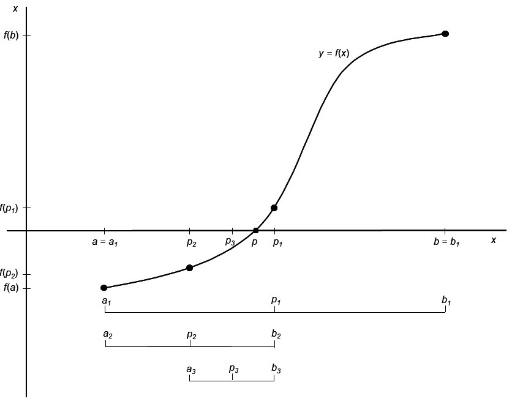
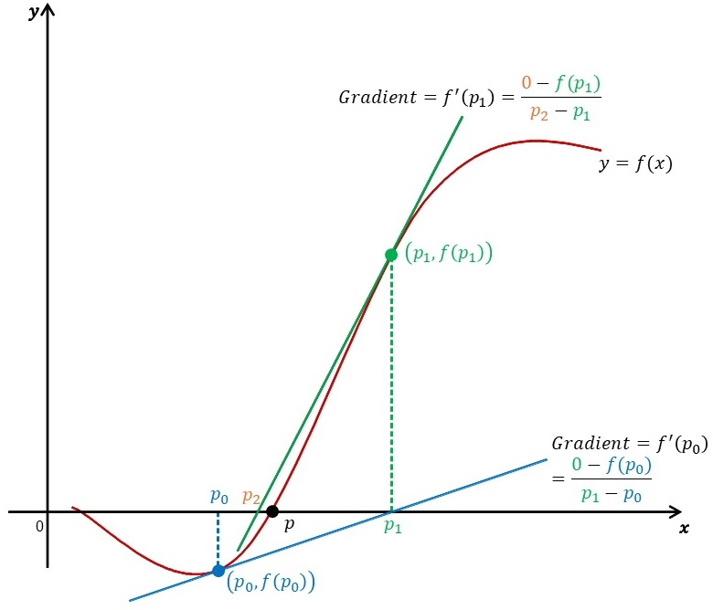

# Introduction to Optimisation {#optimisation}

Two related topics are briefly discussed in this chapter. First, the focus is on solving the equation $f(x)=0$.  The following two methods are considered (a) the bisection or binary search method and (b) the Newton-Raphson method. In the last two sections some principles underlying optimization are considered by briefly examining the usage of the function `optim()` for general optimization and the packages `lpSolve` and `Rsolnp` for constrained optimization.

## The bisection method for solving $f(x)=0$

The bisection method is based on the *<span style="color:#FF9966">Mean Value Theorem</span>* (MVT):  Let $f(x)$ be a continuous function defined over the interval $x∈[a,b]$ with the property that $f(a)$ and $f(b)$ have opposite signs.  According to the MVT there exists a value $p$ in $(a,b)$ such that $f(p)=0$.  In order to keep arguments simple it is assumed that the root of the equation is unique in this interval. The bisection method consists of

(i)	repeatedly halving subintervals of $[a,b]$ and
(ii) to determine in each step which half contains $p$.

The process is initialized by setting $a_1=1$ and $b_1=b$.  Let $p_1$ represents the midpoint of $[a_1,b_1 ]$, i.e. $p_1 = a_1 + \frac{b_1 - a_1}{2} = \frac{a_1 + b_1}{2}$. Suppose $f(p_1 )=0$ then $p=p_1$ so that we have the root. Suppose $f(p_1) \neq 0$ then $f(p_1)$ has similar sign to either $f(a_1)$ or $f(b_1)$.  If $f(p_1)$ and $f(a_1)$ have similar signs then $p∈(p_1,b_1)$ and we set $a_2=p_1$ and $b_2=b_1$. If $f(p_1)$ and $f(a_1)$ have opposite signs then $p∈(a_1,p_1)$ and we set $a_2=a_1$ and $b_2=p_1$. The whole process is now repeated with the interval $[a_2,b_2]$.   This process is illustrated in Figure \@ref(fig:bisection) and coded in the R function, `Bisection()`, given below.

```{r, bisection, echo=FALSE, warning = FALSE, message = FALSE, fig.cap="Principle underlying the bisection method for finding a root of f(x)=0.", out.width="100%"}
library(knitr)

```

```{r, bisectionFunc}
Bisection <- function (a, b, fun, eps=.Machine$double.eps^0.4,  maxiter=100) 
{ #  This function finds the root of continuous function   
  #  f(x) = 0 in the interval [a, b] where
  #  f(a) and f(b) have opposite signs.
  #  The function f() is given in the form of an R function in the argument fun
  
  Iter <- 1
  while (Iter <= maxiter)
    { fa <- fun(a)
      p <- a + (b-a)/2
      fp <- fun(p)
      if ((fp == 0) | ((b-a)/2 < eps))
       { p <- p
         break   }
      else
       { Iter <- Iter + 1
         if ( fa * fp > 0 )
           { a <- p
             fa <- fp   }
         else b <- p
       }
    }
  
  if (Iter >= maxiter)
    stop ("Process has not converged. Try increasing maxiter.\n")
  p
}
```

(a) Use the bisection method to solve the equation for any given $c$ and $n$

$$
c^2 + x^2 + \frac{2cx}{n-1} = n-2.
$$

<div style="margin-left: 25px; margin-right: 20px;">
The function must check whether $b>a$ and whether $f(a)$ and $f(b)$ have opposite signs.
</div>

(b)	Change the bisection function to provide for `fun` to accept several arguments. Demonstrate your function with the equation given in (a).

(c)	Consider the following data given by @DobsonBarnett2008

```{r, CycloneData, echo = FALSE, warning = FALSE, message = FALSE}
library (flextable)
set_flextable_defaults(fonts_ignore = TRUE)
data <- data.frame (season = 1:13,
                    cyclones = c(6, 5, 4, 6, 6, 3, 12, 7, 4, 2, 6, 7, 4))
flextable (data) |>
  delete_part (part = "header") |>
  add_header (season = "Season", cyclones = "Number of tropical cyclones") |> 
  theme_alafoli() |>
  align (align = "center", part = "header")
```

<div style="margin-left: 25px; margin-right: 20px;">
Suppose the number of cyclones can be modelled by a Poisson distribution with parameter $\theta$.

::: {style="color: #80CC99;"}

(i) Write down the log-likelihood function for determining the maximum likelihood (m.l.) estimate of $\theta$.

(ii) 	Use the function written in (b) without changing it to obtain the m.l. estimate of $\theta$ as well as the maximum of the log-likelihood.

(iii)	Use the R function `deriv()` to write a function based on the bisection principle for finding the maximum of $f(x,θ)$ with respect to $\theta$. Demonstrate its usage.

:::

</div>

::: {style="color: #80CC99;"}

(d)	Study the help file of the R function `uniroot()`. Answer questions (a) and (c) using `uniroot()`.

:::

## The Newton-Raphson method

Consider the following: Let $f(x)$ be a function that is at least twice differentiable over the interval $[a,b]$. The value of $x=p$ such that $f(p)=0$ needs to be found. Let $p_m∈[a,b]$ be an approximate value of $p$ such that $f'(p_m) \neq 0$ and $|p-p_m|$ is “small”.  Consider the Taylor power series expansion of $f(x)$ about $p_m$:

$$
f(x) = f(p_m) + (x - p_m)f'(p_m) + \frac{(x - p_m)^2}{2}f''(\xi(x))
$$

where $\xi(x)$ lies between $x$ and $p_m$. Since $f(p)=0$, it follows from the previous equation that

$$
0 = f(p) = f(p_m) + (p - p_m)f'(p_m) + \frac{(p - p_m)^2}{2}f''(\xi(p))
$$

but $|p-p_m|$ “small” implies that $(p-p_m )^2$ is much smaller and therefore

$$
0 \approx f(p_m) + (p - p_m)f'(p_m)
$$

so that

$$
p \approx p_m - \frac{f(p_m)}{f'(p_m)}
$$

From this follows the Newton-Raphson algorithm.  It starts with an initial approximation  $p_0$ and generates a sequence $\{p_m \}$ where

$$
p_{m+1} \approx p_m - \frac{f(p_m)}{f'(p_m)}
$$

for $m≥0$. In Figure \@ref(fig:NewtonRaphson) it is illustrated how the approximations are found by consecutive tangent lines.

```{r, NewtonRaphson, echo=FALSE, warning = FALSE, message = FALSE, fig.cap="Principle underlying the Newton-Raphson algorithm.", out.width="100%"}
library(knitr)

```

(a)	When the Newton-Raphson algorithm is used for finding m.l. estimates the score statistic, $U$, and its derivative viz. $U'$ are needed. The statistic $U'$ can be approximated by $E(U') = -\mathfrak{I} = -var(U)$.  When $U'$ is substituted by $E(U')$ in the Newton-Raphson algorithm the method is known as the *<span style="color:#FF9966">(Fisher) scoring method</span>*.

(b)	Write an R function to implement
    (i)  the Newton-Raphson algorithm and 
    (ii)  the scoring method for finding numerically the m.l. estimate of the scale  
      parameter of the Weibull-distribution

$$
f(y_1, \dots, y_n) = \prod_{i=1}^{n}{\frac{\lambda y_i^{\lambda-1}}{\theta^\lambda}exp \big[-(\frac{y_i}{\theta})^\lambda \big]}
$$

<div style="margin-left: 45px; margin-right: 20px;">
where $y_i>0$. Experiment with various initial values and convergence criteria. The following function serves as an example:
</div>

```{r, NewtonRaphsonFunc}
NewtonRaphson <- function(fun1, fun2, initval, maxiter = 20, 
                          eps = .Machine$double.eps^0.4, ...)
{ # initval = initial approximation of root
  # fun1 = function for which root is sought
  # fun2 = derivative of fun1 or the expected value of the 
  #                   derivative of the score statistic
  
  count <- 1
  Iter <- count
  Outvec <- as.vector (initval)
  Estim <- initval - fun1 (initval,...) /fun2 (initval,...)
  while (abs (Estim - initval) > eps)
    { count <- count + 1
      Iter <- c(Iter, count) 
      initval <- Estim
      Estim <- initval - fun1 (initval,...)/fun2 (initval,...)
      Outvec <- c(Outvec , Estim)
      if (count > maxiter) 
      { warning("Max number iterations reached without convergence") 
        break
      }
    }
  data.frame (IterNo = Iter,  Estim = Outvec)
}
```

::: {style="color: #80CC99;"}

The Weibull distribution is often used to model the time to failure (i.e. the survival time) of organisms or components. The parameter $\lambda$ determines the shape while $\theta$ is a scale parameter. The following table (from @AndrewsHerzberg1985 Table 29.1) contains the lifetimes of a random sample of pressure vessels:


```{r, VesselData, echo = FALSE, warning = FALSE, message = FALSE}
library (flextable)
set_flextable_defaults(fonts_ignore = TRUE)
data <- rbind (c(1051, 1337, 1389, 1921, 1942, 2322, 3629, 4006, 4012, 4063),
               c(4921, 5445, 5620, 5817, 5905, 5956, 6068, 6121, 6473, 7501),
               c(7886, 8108, 8546, 8666, 8831, 9106, 9711, 9806, 10205, 10396),
               c(10861, 11026, 11214, 11362, 11604, 11608, 11745, 11762, 11895, 	12044),
               c(13520, 13670, 14110, 14496, 15395, 16179, 17092, 17568, 17568, NA))
data <- data.frame (t(data))

flextable (data) |>
  delete_part (part = "header") |>
  colformat_num(big.mark = "", digits = 0) |>
  theme_alafoli() |>
  hline_bottom(border = officer::fp_border(color = "#333333", width = 0.75))
```

(c)	Use your implementation of the Newton-Raphson method to obtain the m.l. estimate for $\lambda$ and given $\theta = 2$.

(d)	Change  your Newton-Raphson function  so that the derivative is automatically calculated i.e. the function has only the arguments `fun`, `initval`, `maxiter`, eps`.

:::

## The R functions `optim()` and `constrOptim()`

(a)	In many cases closed form expressions do not exist for the maximum likelihood estimates of parameters. In such cases iterative procedures must be used to maximize the likelihood function. The functions `optim()` and `constrOptim()` in the package `stats` are useful in this regard. Study the help files of these two functions.

::: {style="color: #80CC99;"}

(b) It follows from (a) that argument `par` of `optim()` contains the initial values for the parameters to be estimated; its second argument, `fn` is the function to be minimized. The first argument of function `fn` is a vector representing the parameters to be estimated while its second argument provides for the sample data for evaluating the function. Use the function `optim()` to find the maximum of the likelihood function as well as the maximum likelihood estimates for the parameters in the case of a random sample of size 100 from a $beta(4,2)$-distribution. Investigate the role of different starting values as well as of changing the sample size.

(c)	Consider the `state.x77` data set.

    (i)	Center and scale the data.
    
    (ii) Use the function `dist()` to obtain a distance matrix for the 50 states. Let the computed distance between states $r$ and $s$ be given by $\delta_{rs}$.
    (iii)	Suppose $\mathbf{X}: 50 \times 2$ is an (unknown) matrix giving the coordinates of the companies in a two- dimensional display space such that the Euclidean distances $\{d_{rs} \}$ derived from $\mathbf{X}$ are the best approximations of the $\{\delta_{rs} \}$ in the sense that the following objective function is minimized:

$$
stress = \frac{1}{\sum_{r<s}{\delta_{rs}}} \sum_{r,s=1;r<s}^{n}{\frac{(d_{rs}-\delta_{rs})^2}{\delta_{rs}}}
$$

<div style="margin-left: 25px; margin-right: 20px;">
Use `optim()` to find $\mathbf{X}$.

(v)	Plot the 50 states as points in two dimensions such that the inter-state distances $\{d_{rs} \}$ are the best approximations of the true distances $\{\delta_{rs} \}$ in the full space. Calculate the value of $stress$.
</div>

:::

## Packages `quadprog`, `lpSolve` and `Rsolnp` for constrained optimization

The R data set `Boston` in package `MASS` contains 13 variables influencing house prices in Boston and the variable `medv` of median value of owner-occupied homes in thousands of dollar.

```{r, BostonData, warning = FALSE, message = FALSE}
require(MASS)
Price.median <- Boston$medv
Boston.vars <- as.matrix (Boston[,-ncol(Boston)])
n <- nrow(Boston.vars)
p <- ncol(Boston.vars)
```

(a)	Obtain the correlation between `Price.median` and each of the 13 variables.  Discuss the results.

Our challenge is to form a single composite function of the 13 variables that is the best indicator of the median price of 506 regions. The weights of this composite function are constrained to be non-negative and they must sum to one. The performance of the composite measure is judged according to the following criteria, each subjected to the constraints above:

*	Minimum sum of squared differences
*	Minimum of the sum of the absolute differences
*	Minimum median of the differences 

(i)	Minimum of squared differences

The objective function to be minimized can be written in the form

$$
min_\mathbf{b} \left( -\mathbf{d'b} + \frac{1}{2}\mathbf{b'Db} \right)
$$

subject to $\mathbf{A'b} \ge \mathbf{0}$.

*	Motivate the form of the above objective function in detail.
*	Study the helpfile of the function `solve.QP()` in package `quadprog`.

The minimisation can be accomplished by the following instructions:

```{r, BostonQuadprog, warning = FALSE, message = FALSE}
library (quadprog)
H <- Boston.vars
y <- Price.median
Dmat <- t(H) %*% H
dvec <- t(H) %*% y
Amat <- cbind(1, diag(p))
bvec <- c(1, rep(0, p))
solve.QP (Dmat = Dmat, dvec = dvec, Amat, bvec, meq = 1)
```

* Motivate the use of the above instructions.

*	Discuss the solution obtained.

(ii) Minimum of the sum of the absolute differences

The objective function can be written as

$$
min_\mathbf{a} \left( |y_1-\mathbf{m}_1'\mathbf{a}| + |y_2-\mathbf{m}_2'\mathbf{a}| + \dots + |y_n-\mathbf{m}_n'\mathbf{a}|    \right)
$$

subject to

$$
\left\{
\begin{array}{ll}
\sum_{j=1}^{p}{a_j} = 1\\
a_j \ge 0 \text{ for all } j
\end{array}
\right.
$$

The following algorithm can be used.

*Step 1*:	Replace every absolute term $|y_i-\mathbf{m}_i'\mathbf{a}|$ with a new variable $u_i$.

*Step 2*: 	Add the following two constraints for every new variable *u_i*:

$$
y_i - \mathbf{m}_i'\mathbf{a} \le u_i
$$

$$
-y_i + \mathbf{m}_i'\mathbf{a} \le u_i
$$

*Step 3*: Minimize $min_\mathbf{u}(u_1+u_2+\dots+u_n)$ subject to

$$
\left\{
\begin{array}{ll}
\sum_{j=1}^{p}{a_j} = 1\\
a_j \ge 0 \text{ for all } j\\
y_i - \mathbf{m}_i'\mathbf{a} \le u_i\\
-y_i + \mathbf{m}_i'\mathbf{a} \le u_i
\end{array}
\right.
\Leftrightarrow
\left\{
\begin{array}{ll}
\sum_{j=1}^{p}{a_j} = 1\\
a_j \ge 0 \text{ for all } j\\
\mathbf{m}_i'\mathbf{a} + u_i \ge y_i\\
\mathbf{m}_i'\mathbf{a} - u_i \ge y_i
\end{array}
\right.
$$

Note that variables must be non-negative. Let $\mathbf{y}:n×1=$ `Price.median` $>0$ and 
$\mathbf{M}:n×p=$ `Boston.vars` $>0$. Minimising the sum of the absolute differences is equivalent to

$$
min_{\mathbf{a},\mathbf{u}} \left(0a_1 + \dots + 0a_p + u_1 + \dots + u_n \right) \text{ subject to }
\left\{
\begin{array}{ll}
\sum_{j=1}^{p}{a_j} = 1\\
a_j \ge 0 \text{ for all } j\\
\mathbf{m}_i'\mathbf{a} + u_i \ge y_i\\
\mathbf{m}_i'\mathbf{a} - u_i \ge y_i
\end{array}
\right.
$$

Study the helpfile of the function `lp()` in the package `lpSolve`. The code below illustrates the usage of `lp()`.

```{r, Boston_lp, message = FALSE, warning = FALSE}
y.vec <- Price.median
temp1 <- c(rep(1, p), rep(0, n))
temp2 <- cbind (diag (p), matrix (0, nrow = p, ncol = n))
temp3 <- cbind (Boston.vars, diag (n))
temp4 <- cbind (Boston.vars, -diag (n))
colnames(temp3) <- colnames(temp4) <- NULL

library (lpSolve)
Cmat <- rbind (temp1, temp2, temp3, temp4)
const.dir <- c("=", rep(">=", p+n), rep("<=", n))
const.rhs <- c(1, rep(0, p), rep(1, n), rep(1,n))
objective.in <- c(rep(0, p), rep(1, n))
out <- lp (direction = "min", objective.in, const.mat = Cmat,
           const.dir, const.rhs)
# str(out)
a.vec <- out$solution[cumsum (out$solution) <= 1 + .Machine$double.eps^0.4]
a.vec
```

`out$solution` is a vector of $p+n$ values. The first $p$ are the elements of $\mathbf{a}$ that sum to one and are all non-negative.

`out$objval` is the minimum of the objective function attained by the solution above. Use `str(out)` to find the solution. Discuss the solution found.

A standardized version of the objective function

$$
min_\mathbf{a} \left( |y_1-\mathbf{m}_1'\mathbf{a}| + |y_2-\mathbf{m}_2'\mathbf{a}| + \dots + |y_n-\mathbf{m}_n'\mathbf{a}|    \right)
$$

is the function

$$
min_\mathbf{a} \left( \frac{|y_1-\mathbf{m}_1'\mathbf{a}|}{y_1} + \frac{|y_2-\mathbf{m}_2'\mathbf{a}|}{y_2} + \dots + \frac{|y_n-\mathbf{m}_n'\mathbf{a}|}{y_n}    \right)
$$

$$
= min_\mathbf{a} \left( \left|1 - \frac{\mathbf{m}_1'\mathbf{a}}{y_1} \right| + \left|1 - \frac{\mathbf{m}_2'\mathbf{a}}{y_2} \right| + \dots + |1 - \frac{\mathbf{m}_n'\mathbf{a}}{y_n}|    \right)
$$

for all positive $y_i$ subject to

$$
\left\{
\begin{array}{ll}
\sum_{j=1}^{p}{a_j} = 1\\
a_j \ge 0 \text{ for all } j
\end{array}
\right.
$$

The following modifications are now needed:

*Step 1*:	Replace every absolute term $\left|1 - \frac{\mathbf{m}_i'\mathbf{a}}{y_i} \right|$  with a new variable $u_i$.

*Step 2*: 	Add the following two constraints for every new variable $u_i$:

$$
1 - \frac{\mathbf{m}_i'\mathbf{a}}{y_i} \le u_i
$$

$$
-1 + \frac{\mathbf{m}_i'\mathbf{a}}{y_i} \le u_i
$$

*Step 3*: 	Minimize $min_\mathbf{u}(u_1+u_2+\dots+u_n)$ subject to

$$
\left\{
\begin{array}{ll}
\sum_{j=1}^{p}{a_j} = 1\\
a_j \ge 0 \text{ for all } j\\
1 - \frac{\mathbf{m}_i'\mathbf{a}}{y_i} \le u_i\\
-1 + \frac{\mathbf{m}_i'\mathbf{a}}{y_i} \le u_i
\end{array}
\right.
\Leftrightarrow
\left\{
\begin{array}{ll}
\sum_{j=1}^{p}{a_j} = 1\\
a_j \ge 0 \text{ for all } j\\
\frac{\mathbf{m}_i'\mathbf{a}}{y_i} + u_i \ge 1\\
\frac{\mathbf{m}_i'\mathbf{a}}{y_i} - u_i \ge 1
\end{array}
\right.
$$

As an example, consider the following R instructions:

```{r, Bostonlp_std, message = FALSE, warning = FALSE}
y.vec <- Price.median
B.star <- sweep (Boston.vars, 1, y.vec, "/")
temp1 <- c(rep(1, p), rep(0, n))
temp2 <- cbind (diag(p), matrix(0, nrow = p, ncol = n))
temp3 <- cbind(B.star, diag (n))
temp4 <- cbind(B.star, -diag (n))
colnames(temp3) <- colnames(temp4) <- NULL

library (lpSolve)
Cmat <- rbind(temp1, temp2, temp3, temp4)
const.dir <- c("=", rep(">=", p+n), rep("<=",n))
const.rhs <-   c(1, rep(0, p), rep(1, n), rep(1,n))
objective.in <- c(rep(0, p), rep(1, n))
out <- lp (direction = "min", objective.in, const.mat = Cmat, 
           const.dir, const.rhs)
a.vec <- out$solution [cumsum (out$solution) <= 1 + .Machine$double.eps^0.4]
a.vec
```

Discuss the solution by comparing it to solution found for the non-standardized objective function.

(iii)	Minimum median of the differences

In general this minimization requires starting values for the iterative scheme.  The choice of starting values may lead to a local optimum so that the global optimum is not found.  One approach is to repeat the iterative algorithm for many random starts and to choose the best result from these. 

Study the help file of function `gosolnp()` in package `Rsolnp`.  Note how to specify the random starts. The functions `MinMed()` and `MinMed2()` implement `gosolnp()` for finding the solution for finding the minimum median of the differences.

```{r, goslnp}
MinMed <- function (yvec, xmat, restarts = 1) 
{ if (length (yvec) != nrow (xmat)) 
    stop("Number of elements of yvec must equal number of   rows of xmat \n")
  p <- ncol(xmat)

  # fun1: objective function that will be minimized
  fun1 <- function(a, y, mat) median (abs (y-mat %*% a)) 

  # eqff and eqBB specify the equality constraint
  eqff <- function(a, y, mat) sum(a)
  eqBB <- 1

  # ineqff, ineqLBB and ineqUBB specify the inequality constraints
  ineqff <- function(a, y, mat) a
  ineqLBB <- rep(0, p)
  ineqUBB <- rep(1, p)

  # function gosolnp of package Rsolnp used for executing the optimization
  gosolnp(fun = fun1, eqfun = eqff, eqB  = eqBB, ineqfun = ineqff, 
          ineqLB = ineqLBB, ineqUB = ineqUBB, LB = rep(0,p), UB = rep(1,p), 
          n.restarts = restarts, y = yvec, mat = xmat)  
}

MinMed2 <- function (yvec, xmat, startvals = rep(1/ncol(xmat), ncol(xmat)), 
                     control = list (tol = 1.0e-7, delta = 1.0e-8)) 
{ # Similar to function MinMed but objective function in standardized form
  # and with specified starting values i.e. no random starts
  # The default startvalues is equal probs. 

  if (length (yvec) != nrow (xmat)) 
    stop("Number of elements of yvec must equal number of rows of xmat \n")
  p <- ncol(xmat)
  
  # fun1: objective function that will be minimized
  fun1 <- function(a, y, mat) median(abs(y-mat %*% a)/y) 

  # eqff and eqBB specify the equality constraint
  eqff <- function(a, y, mat) sum(a)
  eqBB <- 1
  
  # ineqff, ineqLBB and ineqUBB specify the inequality constraints
  ineqff <- function(a, y, mat) a
  ineqLBB <- rep(0, p)
  ineqUBB <- rep(1, p)

  # function gosolnp of package Rsolnp used for executing the optimization
  gosolnp (pars = startvals, fun = fun1, eqfun = eqff, eqB  = eqBB, 
         ineqfun = ineqff, ineqLB = ineqLBB, ineqUB = ineqUBB, LB = rep(0,p), 
         UB = rep(1,p), control = control,y = yvec, mat = xmat)  
  }
```

::: {style="color: #80CC99;"}

(b)	Call `MinMed()` with arguments `yvec = Price.median`, and `xmat = Boston.vars`, using 25 random starts.

```{r, BostonMinMed, eval = FALSE}
MinMed (yvec = Price.median, xmat = Boston.vars, restarts = 25)
```

(c) Call `MinMed2()` with arguments `yvec = Price.median`, and  `xmat = B.star`, using the default start values.  Repeat the call using as start values the result of the last call to 
`lp (direction = "min", objective.in, const.mat = Cmat, const.dir, const.rhs)` above.

```{r, BostonMinMed2, eval = FALSE}
MinMed2 (yvec = Price.median, xmat = B.star)
MinMed2 (yvec = Price.median, xmat = B.star, startvals = a.vec) 
```

:::