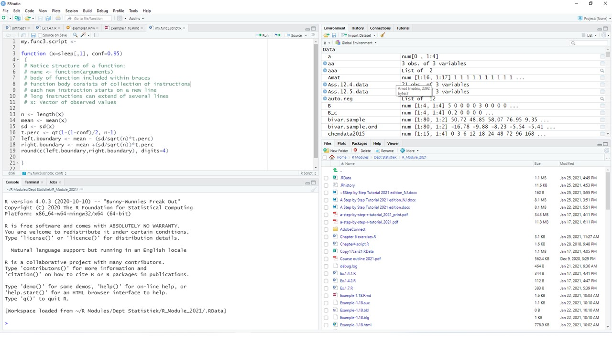

--- 
title: "Introduction into R Applications and Programming: A Tutorial"
author: "Niël J le Roux and Sugnet Lubbe"
date: "2025"
site: bookdown::bookdown_site
documentclass: book
bibliography: [book.bib]
url: https://github.com/sugnet/RTutorial
cover-image: frontcover.jpg
description: |
  Textbook for the R block module.
biblio-style: apalike
csl: harvard-stellenbosch-university.csl
link-citations: yes
# zetero.org/style for csl files
# The framework allows for easy customization of colors and fonts via the bslib R package

---

# Preface {-}

{width=100%}  


This book is an updated version of [@StepbyStep].

## Preface to A Step-by-Step R Tutorial (2013) {-}

The R system is an open-source software project for analyzing data and constructing graphics. It provides a general computer language for performing tasks like organizing data, statistical analyses, simulation studies, model fitting, building of complex graphics and many more. 

Central to the R system is the high-level R computer language. Its roots date back to the birth of the computer language S on May 5, 1976 at Bell Labs, Murray Hill, New Jersey [@Chambers2008]. In its early days S underwent several revisions and extensions mainly for implementation on the UNIX operating system. Eventually an enhanced version of S was licensed under the name S-PLUS and became available for the Windows operating system under the name S-PLUS for Windows. The earlier versions of R adhered to the principles of functional programming and with the release of version S3 in the middle eighties its building blocks were dynamically generated, self-describing objects. The publication The New S Language [@BeckerChambersWilks1988] provides a detailed description of S3. The next major development of S was the release of Statistical Models in S [@ChambersHastie1993] which involved the merging of the functional style of S with object-oriented programming concepts of classes and methods. However, S3 has only limited formal support for classes and methods. The introduction of S4 objects [@Chambers1998] introduced a new class and method system but retains S3 compatibility. In the meantime several versions of S-PLUS based upon S3 at first and later on S4 were released in the commercial market. 

The R language itself was introduced in a paper published by Ross Ihaka and Robert Gentleman of Auckland, New Zealand in 1996 [@IhakaGentleman1996]. This proposal was to a large extent compatible with S but included features from the Lisp/Scheme family of languages. An important aspect of R was its availability as an open-source system. 

Both R and S-PLUS can be considered to be clones of the same underlying S. That means that if you are able to program in the one you can quite easily program in the other but be warned: there are also fundamental differences between the two systems. 

In the first two decades of the twenty-first century interest in R has exceeded all possible expectations. Apart from a well-maintained core system with new releases every few months there are currently literally thousands of researchers contributing add-on packages on cutting-edge developments in statistics and data analysis. 

This book is a tutorial with a twofold aim; learning the basics of the R system and how to program efficiently in R. It is the result of an introductory course in S-PLUS taught at the University of Stellenbosch since 1995. The initial course was based on the book An Introduction to S and S-Plus [@Spector1994]. Since 2002 increasingly more emphasis was put on R to such an extent that it is currently exclusively devoted to R. This change necessitated the preparation of class notes for a ten-day (eight hours a day) tutorial course in R. The result is A Step-by-Step R Tutorial: An introduction into R applications and programming.

## Preface to A Step-by-Step R Tutorial (2021) {-}

Since the first publication of A Step-by-Step R Tutorial: An introduction into R applications and programming the R system has experienced a dramatic evolutionary process. This edition still maintains the twofold aim of the first edition while adapting its contents to the needs of the modernization that has been happening within the R system itself. Deprecated or outdated material has been omitted and new developments included. What follows is a brief description of these changes.

Chapter 1 contains a new section explaining how to use R Markdown for creating PDF and HTML documents from R output. Chapters 2, 3, 4 and 5 see only minor changes. In Chapter 6 changes are made in the data sets used as well as in some exercises being borrowed from later chapters in the first edition. In Chapter 7, ‘Writing R Functions’, a notable reference is made to the `Rcpp` package for the inclusion of C++ code into R. This package allows compiled code to be included  considerably easier and more robust. Vectorized programming and mapping functions are enhanced in Chapter 8 by a discussion of the function `mapply()`. A major addition is a discussion in section 8.14 for writing user-friendly applications using the package `shiny`. This replaces the usage of the function `menu()`. An exercise to create a simple shiny App is also included.

In the first part of Chapter 9, ‘Reading data files into R, formatting and printing’, methods for reading Microsoft Excel files have been updated; functions like `readRDS()` and `writeRDS()` for transporting R objects are introduced; and the `clipr` package is discussed. A major addition to this chapter is the section devoted to the functionality provided by the `tidyverse` collection of R packages for data manipulation and exploration; `tibbles` are discussed in detail as well as the pipe operator `%>%`,  tidy data is illustrated and the data manipulation functions of `dplyr` illustrated in detail.

Chapter 10, ‘R graphics: Round II’, has been considerably extended by the inclusion of a section on how to specify colours; a rewritten section on quantile plots and inclusion of material previously in Chapter 11. There is now a section on density estimation, which includes a discussion of density histograms and average shifted histograms. In the new section 10.14 the package `ggplot2` is discussed with many examples of its capabilities.

The chapter on ‘Modelling in R’ (Chapter 11) and the extensive discussion of the Analysis of Variance and Covariance  (Chapter 12) in the previous edition have been rewritten completely and consolidated into a new Chapter 11. The final chapter is now Chapter 12, ‘Introduction to Optimization’. Apart from a new data set the material is similar to that in Chapter 13 of the previous edition. 

<!--chapter:end:index.Rmd-->

# Introducing the R System {#intro}

##	Introduction

This chapter introduces the R system to the new R user. The Windows operating system is emphasized but most of the material covered also applies to other operating systems after allowing for the requirements of the particular operating system in use. Users with some experience with R should quickly glance through this chapter making sure they have mastered all topics covered here before proceeding with the main tutorial starting with Chapter 2.

In the computer age statistics has become inseparable from being able to write computer programs. Therefore, let us start with a reminder of the Fundamental Goal of S:

::: {style="color: #FF9966;"}
__*Conversion of an idea into useful software*__
:::

The challenge is to pursue this goal keeping in mind the Mission of R [@Chambers2008]:

::: {style="color: #FF9966;"}
__*... to enable the best and most thorough exploration of data possible*__
:::

and its Prime Directive [@Chambers2008]:

::: {style="color: #FF9966;"}
__*... places and obligation on all creators of software to program in such a way that the computations can be understood and trusted*__.
:::

##	Downloading the R system

[Website for downloading R](http://www.R-project.org).
 
To download R to your own computer: Navigate to *.../bin/windows/base* and save the file  *<span style="color:#BE99FF">R-x.y.z.-win.exe</span>* on your computer. Click this file to start the installation procedure and select the defaults unless you have a good reason not to do so. If you select ‘Create desktop icon’ during the installation phase, an icon similar to the one below should appear on the desktop. Alternatively, you can find R under *All Applications*. 


The core R system that is installed includes several *<span style="color:#FF9966">packages</span>*. Apart from these installed packages several thousands of dedicated *<span style="color:#FF9966">contributed packages</span>* are available to be downloaded by users in need of any of them.

##	A quick sample R session {#QuickSample}

Click the R icon created on your desktop to open the *<span style="color:#FF9966">Commands Window</span>* or *<span style="color:#FF9966">Console</span>*. Notice the R prompt `>` waiting for some instruction from the user. 

(a)	At the R prompt `>` enter `5 – 8`. We will follow the following convention to write instructions:


``` r
5 - 8
#> [1] -3
```

(b)	Repeat (a) but enter only 5 – and see what happens:


``` default
> 5 -
> +
> +
```

<div style="margin-left: 25px; margin-right: 20px;">
The above `+` is the secondary R prompt. It indicates that an instruction is unfinished. Either respond by completing the instruction or press the <span style="color:#BE99FF">Esc</span> key to start all over again from the primary prompt.
</div>

(c)	Enter 


``` r
xx <- 1:10
```
 
<div style="margin-left: 25px; margin-right: 20px;">
This instruction creates an R object with name (or label) `xx` containing the vector 
(1, 2, 3, 4, 5, 6, 7, 8, 10). 
</div>

(d)	Enter 


``` r
yy <- rnorm(n = 20, mean = 50, sd = 15) 
```

<div style="margin-left: 25px; margin-right: 20px;">
This instruction creates an R object with name `yy` containing a random sample of 20 values from a normal distribution with a mean of 50 and a standard deviation of 15. 
</div>

(e) Enter


``` r
xx
#>  [1]  1  2  3  4  5  6  7  8  9 10
```

<div style="margin-left: 25px; margin-right: 20px;">
The above example shows that <span style="color:#FF9966">when the name of an R object is entered at the prompt, R will respond by displaying the contents of the object</span>.
</div>

(f)	Obtain a representation of the contents of the object `yy` created in (d). 

(g)	A program in R is called a *<span style="color:#FF9966">function</span>*. Any function in R is also an R *<span style="color:#FF9966">object</span>* and therefore has a name (or label). It follows from (e) that if the name of a function is entered at the prompt, R will respond by displaying the contents of the function.  

    How then can an R function be executed i.e. how can an R function be called? Apart from its name an R function has a list of arguments enclosed within parentheses. An R function is called by entering its name followed by a list of arguments enclosed within parentheses. As an example, let us calculate the mean of the object `yy` created above by calling the function `mean`:


``` r
mean(yy) 
#> [1] 50.31071
```

<div style="margin-left: 25px; margin-right: 20px;">
Note that the prompt appear followed by the mean of object `yy`.
</div>

(h)	Objects created during an R session in the *<span style="color:#3399FF">workspace</span>* are stored in a database *<span style="color:#FF9696">.RData</span>* in the current folder. A listing of all the objects in a database can be obtained by calling the functions `ls()` or `objects()`. Now, first enter, at the R prompt, the instruction `objects` (or `ls`) and then the instruction `objects()` (or `ls()`). Explain what has happened.

(i)	Objects can be removed by the following instruction: `rm(name1, name2, ... )`.

(j)	Apart from the *<span style="color:#FF9966">console</span>* there are several other types of windows available in R e.g. graphs are displayed in graph windows. To illustrate, enter the following instructions at the R prompt in the console or commands window:


``` r
gr.data <- rnorm(1000) 
hist(gr.data)
```

<!-- --> 

<div style="margin-left: 25px; margin-right: 20px;">
These instructions have resulted in the opening of a graph window containing the required histogram and the user can switch from the console to the graph window and back again to the console.
</div>

(k)	The R session can be terminated by closing the window or entering `q()` at the R prompt. Either way the user is prompted to save the *<span style="color:#3399FF">workspace</span>*. If the user chooses not to save, all objects created during the session are lost. 

## Working with RStudio

Many users of R prefer working with *<span style="color:#BE99FF">RStudio</span>*.  *<span style="color:#BE99FF">RStudio</span>* is a free and open source integrated development environment for R which works with the standard version of R available from CRAN. It can be downloaded from the [RStudio](www.rstudio.com) home page to be run from your desktop (*<span style="color:#BE99FF">Windows</span>*, *<span style="color:#BE99FF">Mac</span>* or *<span style="color:#BE99FF">Linux</span>*). Full details about the functionality of *<span style="color:#BE99FF">RStudio</span>* are available from its home page. Here, only a brief introduction to *<span style="color:#BE99FF">RStudio</span>* is given.

When *<span style="color:#BE99FF">RStudio</span>* is installed on your computer the following icon is created on the desktop:

 

Clicking the above icon open the *<span style="color:#BE99FF">RStudio</span>* development environment as shown in Figure \@ref(fig:RStudioLayout). In order to open any R *<span style="color:#3399FF">workspace</span>* with *<span style="color:#BE99FF">RStudio</span>* drag the corresponding *<span style="color:#FF9696">.RData</span>* file to the above *<span style="color:#BE99FF">RStudio</span>* icon and drop it as soon as  ‘Open with RStudio’ becomes visible.

 

The bottom left-hand panel is the familiar R console.

The bottom right-hand panel is used for :
(a)	a listing of the files in the folder where the *<span style="color:#3399FF">workspace</span>* (*<span style="color:#FF9696">.RData</span>*) for the active project is kept
(b)	a listing of all installed packages available to be attached to the search path as well as menus for installing and updating packages
(c)	the graph windows (if any)
(d)	the Help facilities.

The top left-hand panel can be used for creating and managing script files (see \@ref(script)) while the top right-hand panel provides information on the objects in the current folder as well as the history of previous commands given in the console. 

##	R: an interpretive computer language

Essentially, in an interpretive language instructions are given one by one. Each instruction is then evaluated or interpreted in turn by an internal program called an *<span style="color:#FF9966">interpreter</span>* or *<span style="color:#FF9966">evaluator</span>* and some immediate action is taken. For example, the instruction given in \@ref(QuickSample)(a) is evaluated by the R evaluator resulting in the answer `–3` being returned. On the other hand, in \@ref(QuickSample)(b) the evaluator found the instruction to be incomplete and therefore asked for more information.

An advantage of an interpretive language is that intermediate results can be obtained quickly without having first to wait for a complete program to finish as is the case with a compiler language. In the latter case a complete program is translated (or compiled) by a program called a compiler. The compiled program can then be converted to a standalone application that can be called by other programs to perform a complete task. In general compiler languages handle computer memory relatively more efficiently and calculations are executed more speedily.
Communication with the R evaluator takes place through a set of instructions called *<span style="color:#FF9966">escape sequences</span>*. These escape sequences take the form of a backslash preceding a character. Examples of such escape sequences are:

`\n` 	new line 

`\r` 	carriage return 

`\t` 	go to next tab stop 

`\b` 	backspace 

`\a` 	bell 

`\f` 	form feed 

`\v` 	vertical tab

A consequence of the above role of the backslash in R is that a single backslash in a filename will not be properly recognized. Therefore, when referring in R to the following file path *<span style="color:#FF9696">"c:\\My Documents\\myFile.txt"</span>* all backslashes must be entered as double backslashes i.e. `"c:\\My Documents\\myFile.txt"` or as `"c:/My Documents/myFile.txt"`.

### Exercise

::: {style="color: #80CC99;"}
The `cat()` function can be used to write a text message to the console. Initialize a new R session and investigate the results of the following R instructions:


``` r
cat("aaa bbb")
cat("aaa bbb \n")
cat("aaa \n bbb \n")
cat("aaa \nbbb \n")
cat("aaa \t\t bbb \n") 
cat("aaa\b\b\bbbb \n") 
cat("aaa \n\a bbb \a\n") 
cat("1\a\n"); cat("2\a\n")
```

What is the purpose of the semi-colon in the line above? 

Could you distinguish the two soundings of the bell? Try the following:


``` r
cat("1\a\n"); Sys.sleep(2); cat("2\a\n") 
```

Could you now distinguish the two soundings of the bell? 

What is the purpose of the `Sys.sleep()` instruction?
:::

### Exercise

::: {style="color: #80CC99;"}
Write R code to achieve the following output:

`My name is:`

Bell sounds once. 

Your name appears on a new line. 

Two distinct sounds of the bell are heard and 

`Thank you` is visible on a new line.

The cursor appears on a new line.
:::

## Accessing the Help functionality

(a) Use


``` r
?mean
```

<div style="margin-left: 25px; margin-right: 20px;">
to obtain help on the usage of the R function `mean()`.
</div>

(b) Find out what is the difference between the instructions


``` r
?mean
```

<div style="margin-left: 25px; margin-right: 20px;">
and
</div>


``` r
??mean
```

(c) What help is available via the instruction


``` r
help.start()
```

(d) Use


``` r
?help.search()
```

<div style="margin-left: 25px; margin-right: 20px;">
to find out how to obtain help using the R function `help.search(xx)`. Note: For hep on an operator or reserved word quotes are needed, e.g.
</div>


``` r
?matrix
```

<div style="margin-left: 25px; margin-right: 20px;">
but
</div>


``` r
?"?"
```

<div style="margin-left: 25px; margin-right: 20px;">
or
</div>


``` r
?"for"
```

##	More R basics { #MoreBasics }

(a)	R as an *<span style="color:#FF9966">interactive</span>* language allows for fast acquisition of results.

(b)	R is a *<span style="color:#FF9966">functional</span>* language in two important senses: In a more technical sense it means the R model of computation relies more on *<span style="color:#FF9966">function evaluation</span>* than by procedural computations and changes of state. The second sense refers to the way how users communicate to R namely almost entirely through *<span style="color:#FF9966">function calls</span>*.

(c)	R as an *<span style="color:#FF9966">object-oriented</span>* language refers in a technical sense to the S4 or S5 type of objects with their associated classes and methods as mentioned in the Preface. In a less technical sense it means that everything in R is an object.

(d)	R objects will be studied in detail in later chapters. What is important for now, is the following: 

*	Everything in R is an object. 
* There are different types of objects e.g. function objects, data objects, graphics objects, character objects, numeric objects. 
* Usually objects are stored in the current folder called the *<span style="color:#FF9966">Global environment</span>*; recognized by R under the name `.GlobalEnv` and available in the file system under the name *<span style="color:#FF9696">.RData</span>*.
* Objects are created from the console by *<span style="color:#FF9966">assignment</span>* through the instruction 


``` r
name <- object
```

<div style="margin-left: 32px; margin-right: 20px;">
or
</div>


``` r
object <- name
```

* In R names are *<span style="color:#FF9966">case sensitive</span>* i.e. peter and Peter are two different objects. 
* Objects created by assignment during an R session are stored permanently in the Global environment (working directory) unless the user chooses not to save when terminating an R session. 
* Care must be exercised when creating a new object by assignment: if an object with the name my.object already exists in the Global environment and a new object is created by assigning it to the name my.object then the old my.object is over-written and it is replaced by the new object *<span style="color:#FF9966">without any warning</span>*. 
* Remember the way the R evaluator operates: if an object name is given at the R prompt the R evaluator responds by displaying the content of the object. Review the difference between the instructions 


``` r
q
```

<div style="margin-left: 32px; margin-right: 20px;">
and
</div>


``` r
q()
```


(e) The symbol `#` marks a comment. Everything following a `#` on a line is ignored by the R evaluator. Check for example the result of the instruction 


``` r
5+8 # +12
#> [1] 13
```

(f) Usage of the symbols `<-`, `=` and `==`. The symbol `<-` is used for assigning the object on its right-hand side to a name (label) on its left-hand side; the equality sign `=` is used for specifying the arguments of functions while the double equality symbol `==` is used for comparison purposes. In earlier versions of R these rules were strictly applied by the R evaluator. However, in recent versions of R the evaluator allows the equality sign also in the case for assigning an object to a name. We believe that reserving the equality sign only for argument specifications in functions leads to more clarity when writing complex functions and therefore we discourage its usage for creating objects by assignment. In this book creating objects by assignment will be exclusively carried out with the assignment symbol `<-`. 

(g)	The symbol `->` assigns the object on its left-hand side to the name (label) on its right-hand side. 

(h) Working with packages: The core installation includes several packages. To see them issue the command `search()` from the R prompt in the console. Notice that the first object in the search list is `.GlobalEnv`. This is followed by other objects. Packages are recognized by the string package followed by a colon and the name of the package. In order for a package to be used the following steps must be followed: if the package has been *<span style="color:#FF9966">installed</span>* previously it needs only to be *<span style="color:#FF9966">loaded</span>* into the search path using the command `library(packagename)` from the R prompt. This will load the package by default in the second position on the search path. If the package has not been installed previously it must first be installed. This is most easily done using the top menu Packages. The command `require(packagename)` appears to be identical to `library(packagename)`. The function `require()` is designed for use inside other functions as it gives a warning, rather than an error, if the package does not exist.

(i) More on the help (`?`) facility: Table \@ref(tab:HelpQueries) contains details about help available for some special keywords. 

Table: (\#tab:HelpQueries) Some useful keywords available for help queries.

| *<span style="color:#F7CE21">Help query</span>* | *<span style="color:#F7CE21">Explanation</span>* |
| ------ | --------------- |
| `?Arithmetic` |	Unary and binary operators to perform arithmetic on numeric and complex vectors |
| `?Comparison` |	Binary operators for comparison of values in vectors |
| `?Control` | The basic constructs for control of the flow in R instructions |
| `?dotsMethods` | The use of the special operator `...` | 
| `?Extract` | Operators to extract or replace parts of vectors, matrices, arrays and lists |
| `?Logic` | Logical operators for operating on logical and numeric vectors |
| `?.Machine` |	Information on the variable `.Machine` holding information on the numerical  characteristics of the machine R is running on |
| `?NumericConstants` |	How R parses numeric constants including `Inf`, `NaN`, `NA` |
| `?options` | Allow the user to set and examine a variety of global options which affect the way in which R computes and displays its results |
| `?Paren` |	Parentheses and braces in R |
| `?Quotes` | Single and double quotation marks. Back quote (backtick) and  backslash for starting an escape sequence |
| `?Reserved` |	Description of reserved words in R |
| `?Special` | Special mathematical functions related to the beta and gamma functions including permutations and combinations |
| `?Syntax` |	Outlines R syntax and gives the precedence of operators |

## Regular expressions in R: the basics

It follows from \@ref(MoreBasics)(d) that care must be taken when objects are assigned to names. Furthermore, the Global environment or any other R database may easily contain hundreds of objects. Therefore, a frequent task is to search for patterns in the names of objects e.g. searching for all object names starting with “Figure” or ending in “.dat”. The R function `objects()`  or `ls()` has arguments `pos` and `pattern` for specifying the position of a database to search and a pattern of characters appearing in a name (or string), respectively. The pattern argument can be given any *<span style="color:#FF9966">regular expression</span>*. Regular expressions provide a method of expressing patterns in character values and are used to perform various tasks in R. Here we are only considering the task of extracting certain specified objects in a database using the pattern argument of `objects()`  or `ls()`.

The syntax of regular expressions follows different rules to the syntax of ordinary R instructions. Moreover its syntax differs depending on the particular implementation a program uses. By default, R uses a set of regular expressions similar to those used by UNIX utilities, but function arguments are available for changing the default e.g. by setting argument `perl = TRUE`.

Regular expressions consist of three components: *<span style="color:#FF9966">single characters</span>*, *<span style="color:#FF9966">character classes</span>* and *<span style="color:#FF9966">modifiers</span>* operating on single characters and character classes.

Character classes are formed by using square brackets surrounding a set of characters to be matched e.g. `[abc123]`, `[a-z]`, `[a-zA-Z]`, `[0-9a-z]`.  Note the usage of the dash to indicate a range of values.

The modifiers operating on characters or character classes are summarized in Table \@ref(tab:RegExprMod).

Table: (\#tab:RegExprMod) Modifiers for regular expressions.

| *<span style="color:#F7CE21">Modifier</span>* | *<span style="color:#F7CE21">Operation</span>* |
| ------ | --------------- |
| `^` | Expression anchors at beginning of target string |
| `$` | Expression anchors at end of target string |
| `.` | Any single character except newline is matched |
| `|` |	Alternative patterns are separated |
| `( )` |	Patterns are grouped together |
| `*` |	Zero or more occurrences of preceding entity are matched |
| `?` |	Zero or one occurrences of preceding entity are matched |
| `+` |	One or more occurrences of preceding entity are matched |
| `{n}` |	Exactly n occurrences of preceding entity are matched |
| `{n,}` |	At least n occurrences of preceding entity are matched |
| `{n, m}` |	At least n and at most m occurrences of preceding entity are matched |

Because of their role as modifiers or in forming character classes the following characters must be preceded by a backslash when their literal meaning is needed:

	[  ]  {  }  (  )  ^  $  .  |  *  +  \

Note that in R this means that whenever one of the above characters needs to be escaped in a regular expression it must be preceded by double backslashes. Table \@ref(tab:RegExpr) contains some examples of regular expressions.

Table: (\#tab:RegExpr) Examples of regular expressions.

| *<span style="color:#F7CE21">Regular expression</span>* | *<span style="color:#F7CE21">Meaning</span>* |
| ------ | --------------- |
| `"[a-z][a-z][0-9]"` |	Matches a string consisting of two lower case letters followed by a digit |
| `"[a-z][a-z][0-9]$"` | Matches a string ending in two lower case letters followed by a digit |
| `"^[a-zA-Z]+\\."` |	Matches a string beginning with any number of lower or upper case letters followed by a period |
| `"(ab){2}(34){2}$"` |	Matches a string ending in `abab3434`

### Exercise

::: {style="color: #80CC99;"}
Initialize an R session 

(a)	Attach the MASS package in the second (the default) position on the search path by issuing the command


``` r
library(MASS)
```

(b)	Get a listing of all the objects in package MASS by requesting


``` r
objects(pos=2)
```

(c)	Explain the difference between `objects(pos=2, pat=".")` and `objects(pos=2, patt="\\.")`.
(d)	Obtain a listing of all objects with names starting with three letters followed by a digit.
(e)	Obtain a listing of all objects with names ending with three letters followed by a digit.
(f)	Obtain a listing of all objects with names ending in a period followed by exactly three or four letters.
:::

## 	From single instructions to sets of instructions: introducing R functions { #FunctionIntro }

Consider the following problem: the R data set `sleep` contains the extra hours of sleep of 20 patients after a drug treatment. Suppose this data set can be considered a sample from a normal population. A 95% confidence interval is required for the mean extra hours of sleep. It is known that the confidence interval is given by $\left[ \mathbf{\bar{x}}- \left( \frac{s}{\sqrt(n)} \right) t_{n-1,0.025}; \mathbf{\bar{x}}+ \left( \frac{s}{\sqrt(n)} \right) t_{n-1,0.025} \right]$. This problem can be solved by entering the following instructions one by one:


``` r
sleep.data <- sleep[ ,1]   
sleep.mean <- mean(sleep.data)   
sleep.sd <- sd(sleep.data)    
t.perc <- qt(0.975,19) 
left.boundary <- sleep.mean - (sleep.sd/sqrt(length(sleep.data)))*t.perc 
right.boundary <- sleep.mean + (sleep.sd/sqrt(length(sleep.data)))*t.perc
cat ("[", left.boundary, ";", right.boundary, "]\n")
#> [ 0.5955845 ; 2.484416 ]
```

In situations like the above, the problem can be addressed using a *<span style="color:#FF9966">script file</span>* or writing a *<span style="color:#FF9966">function</span>*. We are going to introduce two methods for writing functions in R:

(i) using a script file and
(ii) using the function `fix()`.

### Writing an R function using a script file { #script }

(a)	From the R top menu select *File; New script*.  A script window will open with a simultaneous change in the menu bar. 
(b)	Type the instructions in the script window.
(c)	Select all the typed text and run the script by clicking the run icon (or Ctrl+R).
(d)	Note what is shown in the R console window.
(e)	Script files are ordinary text files. They can be saved, edited and opened using any text editor.
(f)	By convention R script files have the extension <span style="color:#FF9696">xxxx.r</span>.
(g)	Next, change the spelling in the last two lines from `right.boundary` to `Right.boundary`. Select all the text and run the script.  Check the output appearing on the console. 
(h)	Script windows can also be used for creating an R function.
(i)	Create an R function by changing the text as shown below.


``` r
conf.int <- function (x = sleep[,1])
{
  x.mean <- mean(x)   
  x.sd <- sd(x)    
  t.perc <- qt(0.975,19) 
  left.boundary <- x.mean - (x.sd/sqrt(length(x)))*t.perc 
  right.boundary <- x.mean + (x.sd/sqrt(length(x)))*t.perc
  list (lower = left.boundary, upper = right.boundary)  
}
```

(j)	Select the text and notice what happens in the R commands window (the console).
(k)	Give the instruction `objects()` at the R prompt. What has happened?
(l) You can now run the function from the commands window (the console) by typing:


``` r
conf.int (x = sleep[,1])
#> $lower
#> [1] 0.5955845
#> 
#> $upper
#> [1] 2.484416
```


(l)	If you want to create and run the function `conf.int` in a script window then add the instruction `conf.func (x = sleep[,1])` as the last line in the script window. Now, select only this line and run it. Check the R console.
(m)	What will happen if a syntax error is made in the script window? Change the code in the script file as follows, deliberately deleting the last closing parenthesis in the last line of the function.  


``` r
conf.int <- function (x = sleep[,1])
{
  x.mean <- mean(x)   
  x.sd <- sd(x)    
  t.perc <- qt(0.975,19) 
  left.boundary <- x.mean - (x.sd/sqrt(length(x)))*t.perc 
  right.boundary <- x.mean + (x.sd/sqrt(length(x)))*t.perc
  list (lower = left.boundary, upper = right.boundary
}
conf.int (x = sleep[,1])
```

(n) Select *only the final line* and run it. Check the R console. No problem, the function executed correctly. This is because the code for `conf.int` in the script file was changed, but the updated object was not created by running it in the console.
(o) Select *all the code* in the script and run it.  Check the R console. Discuss.

### Writing an R function using `fix()`

When using `fix()` the built-in *<span style="color:#FF9966">R text editor</span>* can be used when using script files but in the windows environment <span style="color:#3399FF">notepad</span> or preferably [notepad++](www.notepad-plus-plus.org/download/) or [Tinn-R](https://tinn-r.org/en/) is preferred. 

The following instruction is necessary for changing the default editor to be used with `fix()`: 


``` r
options(editor = "notepad")
```

or


``` r
options(editor = "full path to the relevant exe file")
```

(a)	Enter `fix (my.func)` at the R prompt. A text editor will open. Type the instructions as shown below. 


``` default
function (x = sleep[,1])
{
  x.mean <- mean(x)`
  x.sd <- sd(x)
  t.perc <- qt(0.975,19)
  left.boundary <- x.mean - (x.sd/sqrt(length(x)))*t.perc
  right.boundary <- x.mean + (x.sd/sqrt(length(x)))*t.perc
  list (lower = left.boundary, upper = right.boundary)
}
```

<div style="margin-left: 32px; margin-right: 20px;">
Close the window. Check what happens in the R console.

You can now run the function from the commands window (the console) similar to in \@ref(script)(l), but changing the name of the function from `conf.int` to `my.func`.
</div>

(b)	What will happen if a syntax error is made when using fix? At the R prompt type `fix (my.func)`. Make a deliberate syntax error, e.g. delete the last closing brace. Close the text editor window. What happens in the console? What is to be done to correct the mistake?

(c)	Carefully study the message in the R console when a syntax error occurred in a function created by `fix()`:


``` default
> Error in edit(name, file, title, editor) :
	unexpected 'yyy' occurred on line xx
  	use a command like
  	x <- edit()
  	to recover
```


(d)	The following is the correct way to respond to the above message from the R evaluator:


``` r
my.func <- edit()
```

<div style="margin-left: 32px; margin-right: 20px;">
If you simply use `fix(my.func)` at this point, the R and the editor will revert to the version of the function *before* the previous edit.
</div>

::: {style="color: #FF9966;"}
**WARNING**

Before writing a function for solving any problem: make sure the problem is understood exactly; make 100% sure the relevant statistical theory is understood correctly. Failure to do so is careless and dangerous!
:::

## R Projects

The different windows in R are the Data window, Script window, Graph window and Menus and Dialog windows. The current *<span style="color:#3399FF">workspace</span>* in R is `.GlobalEnv`. The function `getwd()` is used to obtain the path to the current folder’s *<span style="color:#FF9696">.Rdata</span>* and *<span style="color:#FF9696">.Rhistory</span>*.

*Note*: In order to see the files *<span style="color:#FF9696">.Rdata</span>* and *<span style="color:#FF9696">.Rhistory</span>* being displayed as such, it may be necessary to turn off the option “Hide extensions for known file types” in *<span style="color:#BE99FF">Windows Explorer</span>*.

It is important to make provision for different *<span style="color:#3399FF">workspaces</span>* associated with different *<span style="color:#FF9966">projects</span>*. In R, different *<span style="color:#FF9696">.Rdata</span>* files in different folders would separate different projects. There is however much to gain in using *Projects* in *<span style="color:#BE99FF">RStudio</span>*.

### Creating a project in RStudio

From the top menu, select *File, New Project*. Follow the prompts to create a new project, either in an existing folder or creating a new folder for your project, say *<span style="color:#BE99FF">MyProject</span>*.

(a) Navigate to the folder *<span style="color:#BE99FF">MyProject</span>* in *<span style="color:#BE99FF">Windows Explorer</span>*.

(b) Notice a file *<span style="color:#FF9393">MyProject.Rproj</span>* has been created in the folder.

(c) By double-clicking on this file you open the project in *<span style="color:#BE99FF">RStudio</span>*. The advantages of opening the project this way are:

* your *<span style="color:#3399FF">workspace</span>* from the file *<span style="color:#FF9696">MyProject\.Rdata</span>* is automatically loaded

* by placing any related files like data set in the folder *<span style="color:#BE99FF">MyProject</span>* or a subfolder, say *<span style="color:#BE99FF">MyProject\\data</span>* means that in your code you only have to use relative folder references, i.e. refer to *<span style="color:#BE99FF">MyProject\\mydata.xlsx</span>* or *<span style="color:#BE99FF">MyProject\\data\\mydata.xlsx</span>* instead of something like *<span style="color:#BE99FF">c:\\users\\myname\\Documents\\MyProject\\data\\mydata.xlsx</span>*.

* the major advantage of relative references is that it is not specific to the computer and makes porting between devices possible

* sharing your project with a collaborator will simply entail copying the entire contents of the *<span style="color:#BE99FF">MyProject</span>* folder.

##	A note on computations by a computer

When writing R functions it is important to keep in mind that the way computations are performed by a computer are not always according to the rules of algebra. Two important occurrences are given below.  

* In mathematics the following statement is incorrect: `x = x + k` for $k \neq 0$ but in computer programming the statement `x = x + k` is legitimate and it means `x` is replaced by `x + k`.

* In general, the treatment of integers and real numbers for which R uses floating point representation happens at a fundamental level over which R has no control. Real numbers cannot necessarily be exactly represented in a computer – some can only be approximated. Furthermore, there are limitations to the minimum and maximum numbers that can be represented in a computer. This might lead to what is known as *<span style="color:#FF9966">underflow</span>* or *<span style="color:#FF9966">overflow</span>*.  A more detailed discussion appears in a later chapter.

Open an R session and issue the command   


``` r
.Machine
```

for details about the numerical environment of your computer.

## Built-in data sets in R

R contains several built-in data sets collected in the package `datasets`. This package is automatically attached to the search path. Type  `?datasets`  at the R prompt for details. Apart from these data sets several other data sets from other packages are also used in this book.

##	The use of `.First()` and `.Last()`
The function `.First()` is executed at the beginning of every R session. *<span style="color:#FF9966">This only works in R and not in RStudio</span>*.

Instead of having to specify


``` r
options(editor = "notepad")
```

each time an R session is initialized, create the following function and save in the <span style="color:#FF9696">.Rdata</span> before exiting R.


``` r
.First <- function() { options(editor = "notepad") }
```

to ensures that  Notepad is the text editor during any subsequent session.

Similar to `.First()` the function `.Last()` can be created for execution at the end of an R session.

### Security: an example of the usage of `.First()`

The `.First()` facility can be used to prevent access to a R *<span style="color:#3399FF">workspace</span>* by setting a password protection.  This can be done as follows:

Create a new *<span style="color:#3399FF">workspace</span>* for running the example on security. In this *<span style="color:#3399FF">workspace</span>* create the following R function 


``` r
password <- function()        # Note the structure of a function
{ cat("Password? \n")
  password <- readline()      # What is the usage of readline()? 
  if (password != "PASSWORD") 
    q(save="no")              # The meaning of !=  is "not equal to"
  else (cat("You can proceed \n"))
}				
```

Now create the function:


``` r
.First <- function()
{   #  What must you be careful of?
   password()
}
```

* Terminate your R session and open it again.
*	Discuss the construction and usage of the above functions.
*	Can you break the above security?
*	Can you make changes to the above security to make it more safe?

##	Options

Study the result of the instruction `> options()` in R.

## Creating PDF and HTML documents from R output: R Markdown

The R package `knitr` is used to obtain reproducible results from R code in the form of *<span style="color:#BE99FF">.pdf</span>* or *<span style="color:#BE99FF">.html</span>* documents. In addition to `knitr`, *<span style="color:#BE99FF">R Markdown</span>* can be used to create *<span style="color:#BE99FF">.html</span>*, *<span style="color:#BE99FF">.pdf</span>* or even *<span style="color:#BE99FF">MS Word</span>* documents. *<span style="color:#BE99FF">Markdown</span>* is a so-called markup language with plain-text-formating syntax. An *<span style="color:#BE99FF">R Markdown</span>* document is written in markdown and contains chunks of embedded R code. Although the `render()` function in the package `rmarkdown` can be used (similar to the `knit()` function from the package `knitr`), to create the output document from the *<span style="color:#BE99FF">R Markdown</span>* *<span style="color:#FF9696">.Rmd</span>* file, *<span style="color:#BE99FF">R Markdown</span>* is typically used in conjunction with *<span style="color:#3399FF">RStudio</span>*. In the top menu, select *File, New File, R Markdown…* to open the *<span style="color:#FF9696">example.Rmd</span>* file providing the user with the structure of an *<span style="color:#BE99FF">R Markdown</span>* file. For our illustration, we will select the output format as *<span style="color:#BE99FF">.html</span>*.

Edit the *<span style="color:#FF9696">example.Rmd</span>* file to contain the following:


```` default
---
title: "An Illustration of Some Capabilities of R Markdown"
author: "Niel le Roux and Sugnet Lubbe"
date: "22/01/2021"
output: html_document
---

```{r setup, include=FALSE}
knitr::opts_chunk$set(echo = TRUE)
```

## Short description

Code chunks in .Rmd files are delimited with ` ```{r} ` at the top where a chunk 
label and any chunk options can appear and  ` ``` ` at the end. In-line R code 
chunks are indicated with single ` `r ` on either side.

*****

Here is an example containing several chunks of code. Note that in the first 
chunk R code is not shown due to the option `echo = FALSE`. In the remaining 
chunks R code is shown due to the option above 'echo = TRUE'.

_Note R code not shown for this chunk._

```{r y, echo=FALSE}
y <- 1
y
```

```{r rnorm}
require(lattice)
set.seed(123)
x <- rnorm(1000, 20, 5)
```

We analyse data drawn from $\mathcal{N}(20,25)$. The mean is 
`r round(mean(x),3)`. The following code shows the distribution via a histogram

```{r histexample}
  hist(x)
```

and the code below via a boxplot.

```{r boxexample}
  boxplot(x)
```

The first element of \texttt{x} is `r x[1]`. Note the usage of ` \texttt{x} ` 
above.

*two plots side by side (option fig.show='hold')*

```{r side-by-side, fig.show='hold', out.width="50%"}
  par(mar=c(4,4,0.1,0.1), cex.lab=0.95, cex.axis=0.9, mgp=c(2,0.7,0), 
      tcl=-0.3, las=1)
  boxplot(x)
  hist(x,main="")
```

```{r linear_model}
  n <- 10
  x <- rnorm(n)
  y <- 2*x + rnorm(n)
  out <- lm(y ~ x)
  summary(out)$coef
```

````

At the top of the text editor, click on *Knit* to create the *<span style="color:#BE99FF">.html</span>* document. Note that with the down arrow, options *Knit to PDF* and *Knit to Word* can also be chosen. The output format is also specified in line 5 of the text file with `output: html_document`. Had we chosen *<span style="color:#BE99FF">.pdf</span>* as output format, it would be `output: pdf_document`. Typically, *<span style="color:#BE99FF">R Markdown</span>* is used for reporting, directly incorporating the R code and output. For more formal documents with Figure and Table caption references, tables of content, etc. the R package `bookdown` should be used. Install the package and replace the output statement with `output:bookdown::pdf_document2`. For more information on the use of bookdown, [click here](https://bookdown.org/). 

## Command line editing

Commands given in an R session are stored together with commands given in previous sessions in a file *<span style="color:#FF9696">.History</span>* in the same folder as the *<span style="color:#FF9696">.RData</span>* file. In an R session previous commands can be retrieved at the R prompt by pressing the *up* and *down* arrow keys. A previous command can then be edited using the *backspace*, *delete*, *home*, *end* keys as well as the shortcuts for *copy* and *paste*.


<!--chapter:end:01-intro.Rmd-->

# Managing objects {#objects}

After completing the introductory chapter you now know how to

* initialize an R session; 
* save your workspace;
* open an existing project;
*	execute simple tasks in R to obtain numerical, text or graphical results;
*	obtain help.

You know also that everything in R can be considered as some kind of an object. In this chapter the focus is on what properties the different objects have and how to manage objects in the workspace. 

##	Instructions and objects in R

###	General

Recall that

*	instructions are separated by a semi-colon or start on new lines;
*	the `#` symbol marks the rest of the line as comments;
*	the default R (primary) prompt is `>`; the secondary default prompt is `+`;
*	use of  `<-` to create objects.  (The equality sign (`=`) will also be accepted. However, avoid this practice and use

    + `=` only for function arguments;
    + `<-` for assignment;
    + `==` 	for comparison / control structures);

*	the use of  `->`  for assigning left-hand side to the name on right-hand side.
* the use of function `assign()` for assigning names to objects. (to be discussed in detail in Chapter \@ref(operators))

##### Examples {-}


``` r
aa <- 1:10
```

Assigning numeric vector to name "aa".  Assignment takes place in global environment.


``` r
Aa <- seq(from = 1,to = 10,by = 0.01); yy <- c("a","b","c")
c("a","b","c") -> bb 
```

Assigning character vector to name "bb".  


``` r
assign("aa", rnorm(10), pos = 1)
```

Note the use of the argument `pos`, " " or ' ' are used for characters. Be careful when mixing single quotes and double quotes. See below.


``` r
c("u",'v',"'w'",""x"",'"y"',''z'') -> cc
#> Error in parse(text = input): <text>:1:19: unexpected symbol
#> 1: c("u",'v',"'w'",""x
#>                       ^
```

``` r
c("u",'v',"'w'",'"x"','"y"',''z'') -> cc
#> Error in parse(text = input): <text>:1:31: unexpected symbol
#> 1: c("u",'v',"'w'",'"x"','"y"',''z
#>                                   ^
```

``` r
c("u",'v',"'w'",'"x"','"y"','z') -> cc 
cc
#> [1] "u"     "v"     "'w'"   "\"x\"" "\"y\"" "z"
```

*	Explain error message above.
*	Explain backslash above.


``` r
objects()
#> [1] "aa" "Aa" "bb" "cc" "yy"
aa
#>  [1] -1.30237657  1.35234865 -0.32712077  0.32666819
#>  [5]  0.12642658 -0.39484180 -0.72774624  0.09173947
#>  [9]  0.83248656  0.49906948
bb
#> [1] "a" "b" "c"
objects()[3]
#> [1] "bb"
parse(text=objects()[3])
#> expression(bb)
eval(parse(text=objects()[3]))
#> [1] "a" "b" "c"
rm(a,b)
#> Warning in rm(a, b): object 'a' not found
#> Warning in rm(a, b): object 'b' not found
rm(aa,bb)
objects()
#> [1] "Aa" "cc" "yy"
rm("cc")
objects()
#> [1] "Aa" "yy"
```

###	Objects in R

(a)	Everything is an object but there are many different types of objects.

(b)	Study and also take note of the following *<span style="color:#FF9966">naming conventions</span>*:

*	Allowed are upper or lower case letters, numbers 0 – 9, full stop(s) and underscore(s).
*	Must not begin with a number.
*	R is case sensitive i.e. `John`  and `john` refer to different objects.
*	Use full stops (periods) or underscores to break up a name into meaningful words.
*	Avoid `c`, `s`, `t`, `C`, `F`,  `T`,  `diff`  as well as other reserved words for naming an object.  

(c)	The use of the functions `conflicts()` and `find()` when naming objects. The instruction `conflicts (detail = TRUE)` outputs details on whether and where objects with identical names exist on the search path e.g.


``` r
conflicts(detail=TRUE)
#> $`package:graphics`
#> [1] "plot"
#> 
#> $`package:methods`
#> [1] "body<-"    "kronecker"
#> 
#> $`package:base`
#> [1] "body<-"    "kronecker" "plot"
```

The instruction `find ("object")` outputs details on whether and where objects with the name object exist on the search path e.g.


``` r
find("kronecker")
#> [1] "package:methods" "package:base"
```

(d)	Objects can possess several attributes e.g.  

*	mode    (The way an object is internally stored)
*	length
*	names
*	dim
*	class

#### Examples {-}


``` r
a <- 1:10
class(a)
#> [1] "integer"
b <- factor(c("a","b","c"))
class(b)
#> [1] "factor"
b
#> [1] a b c
#> Levels: a b c
mode(a)
#> [1] "numeric"
mode(b)
#> [1] "numeric"
length(a)
#> [1] 10
length(b)
#> [1] 3
dim(a)
#> NULL
mat <- matrix(1:12,nrow=4)
mat
#>      [,1] [,2] [,3]
#> [1,]    1    5    9
#> [2,]    2    6   10
#> [3,]    3    7   11
#> [4,]    4    8   12
dim(mat)
#> [1] 4 3
mode(mat)
#> [1] "numeric"
logic <- c(TRUE,TRUE,FALSE,TRUE)
mode(logic)
#> [1] "logical"
class(logic)
#> [1] "logical"
```

<div style="margin-left: 30px; margin-right: 20px;">
Levels show that it is a categorical variable (object).

Mode `numeric` tells us that the categorical variable (object) `b` is internally stored as a set of numeric codes.
</div>

(e)	Special attention is given to the class and mode of integers. An object of type integer is stored internally more effectively than an integer represented in double format.


``` r
x <- 5
y <- 5L
typeof(x)
#> [1] "double"
typeof(y)
#> [1] "integer"
class(x)
#> [1] "numeric"
class(y)
#> [1] "integer"
mode(x)
#> [1] "numeric"
mode(y)
#> [1] "numeric"
```

(f)	Objects in R are *<span style="color:#FF9966">vectors</span>*,  *<span style="color:#FF9966">functions</span>* or *<span style="color:#FF9966">lists</span>*.  There are no scalars - instead vectors of length one are used. In addition to the above three types, there are several other types of objects.

(g)	Objects that are created during a session are permanently stored in the *<span style="color:#FF9696">.RData</span>* file in the folder containing the *<span style="color:#3399FF">workspace</span>* (unless not saved at termination).

(h)	Objects that are created within a function exist only for as long as the function is being executed. 

(i)	Use of `rm()` and `rm(list = ListOfNames)` to remove objects from the *<span style="color:#3399FF">workspace</span>*.

(j)	Use of `objects()` or equivalently `ls()` to obtain a list of object names in a data base (by default the *<span style="color:#3399FF">workspace</span>*). Note the optional arguments `pos`, `all.names` and `pattern` to specify which database to be considered and what object names to include. 

(k)	How can an object be printed to the screen?

(l)	*<span style="color:#FF9966">Warning:</span>* If a new object is assigned to a name that already exists in the working directory the old object is overwritten without warning and it cannot be retrieved again.

### Data in R

(a)	R has several built-in data sets. Use `?datasets` and/or `library(help= "datasets")` for details.  Note that the two instructions return different information.

(b)	Study the help file of `c()`.

(c)	Study the help file of `scan()`.

(d)	Study the help files of `read.table()` and `read.csv()`. Care must be taken with data containing characters (text) and categorical variables. Reading data into R will be discussed in detail in Chapter \@ref(data).

###	Generation of data

Study the operators and functions `:`,  `seq()`, `rep()`, `rev()`, `rnorm()`, `runif()` with the following instructions:


``` r
1:10
8:3
seq(from=1, to=10, length=10)
seq(from=2, to=10, length=5)
rev(10:1)
rnorm (20, mean=50, sd=5)
runif (10, min=1, max=3)
```

The function `rmvnorm()` for generating multivariate normal samples is in the `mvtnorm` R package.  This package must first be loaded by using the instruction


``` r
library(mvtnorm)
```

Alternatively, for generating multivariate normally data there is also a function `mvrnorm()` in R package `MASS`.

##	Introduction to functions in R

We introduced R functions in section \@ref(FunctionIntro). The basic structure of an R function is as follows:


``` r
func.name <- function(list of arguments)
{
  # R code
}
```

When the function `func.name()` is called, the code in `{ }` is executed.

The arguments of a function can be inspected by using the command


``` r
args(name of function)
```

The function `str(x)` provides information on the object `x`.  If `x` is a function its output is similar to that of `args()`. Default values are given to function arguments using the construction (`argument name = value`). It is good programming practice to make extensively use of comments to describe arguments and / or what a particular chunk of code does.
What is the usage of the following function:


``` r
cube <- function(a) a^3
```

In the above function the argument a is called a *<span style="color:#FF9966">dummy argument</span>*. What will happen to an object `a` in the working directory?

Functions are called by replacing the *<span style="color:#FF9966">formal arguments</span>* by the *<span style="color:#FF9966">actual arguments</span>*.  This can be done *<span style="color:#FF9966">by position</span>* or *<span style="color:#FF9966">by name</span>*.  *Hint*: It is less error prone to call functions using named arguments. Create the following function


``` r
Demofunc <- function(vec = 1:10, m,k)
 { # Function to subtract a specified constant from
   # each element of a given vector and after subtraction
   # divide each element by a second specified constant.
   # The result of the above transformation is returned.
 (vec - m)/ k 
}
```

Execute the following function calls and explain the output

``` r
Demofunc(3, 2, 5)
#> [1] 0.2
Demofunc(2,5)
#> Error in Demofunc(2, 5): argument "k" is missing, with no default
Demofunc(m = 2, k = 5)
#>  [1] -0.2  0.0  0.2  0.4  0.6  0.8  1.0  1.2  1.4  1.6
Demofunc(m = 2, k = 5, vec = 1:100)
#>   [1] -0.2  0.0  0.2  0.4  0.6  0.8  1.0  1.2  1.4  1.6  1.8
#>  [12]  2.0  2.2  2.4  2.6  2.8  3.0  3.2  3.4  3.6  3.8  4.0
#>  [23]  4.2  4.4  4.6  4.8  5.0  5.2  5.4  5.6  5.8  6.0  6.2
#>  [34]  6.4  6.6  6.8  7.0  7.2  7.4  7.6  7.8  8.0  8.2  8.4
#>  [45]  8.6  8.8  9.0  9.2  9.4  9.6  9.8 10.0 10.2 10.4 10.6
#>  [56] 10.8 11.0 11.2 11.4 11.6 11.8 12.0 12.2 12.4 12.6 12.8
#>  [67] 13.0 13.2 13.4 13.6 13.8 14.0 14.2 14.4 14.6 14.8 15.0
#>  [78] 15.2 15.4 15.6 15.8 16.0 16.2 16.4 16.6 16.8 17.0 17.2
#>  [89] 17.4 17.6 17.8 18.0 18.2 18.4 18.6 18.8 19.0 19.2 19.4
#> [100] 19.6
```

Note the use of  `prompt()` and `package.skeleton()` to provide a new function with a help-file.

The final expression in an R function is automatically returned when the function completes execution.


``` r
my.func <- function(a=5) 
{  a+2
}
my.func()
#> [1] 7
```

When a function consists of a single line, it can be written more succinctly


``` r
my.func <- function(a=5) {  a+2  }
my.func()
#> [1] 7
```

or even without the `{ }`:


``` r
my.func <- function(a=5) a+2
my.func()
#> [1] 7
```

In general, functions will consist of more lines of code and often multiple outputs are returned. If only a single output object needs to be returned, the object can be created in the last line of the code


``` r
my.func <- function(a=5)
  {  number <- (a+3)^2
     number/a
  }
my.func()
#> [1] 12.8
```

or with a `return()` statement:


``` r
my.func <- function(a=5)
  {  number <- (a+3)^2
     return(number/a)
  }
my.func()
#> [1] 12.8
```

In general, all the outputs are combined and returned as a `list`. The final expression in the function creates the list object:


``` r
my.func <- function(a=5)
  {  number <- (a+3)^2
     list(number/a)
  }
my.func()
#> [[1]]
#> [1] 12.8
```

To return multiple outputs, the list is simply extended as shown below:


``` r
my.func <- function(a=5)
  {  number <- (a+3)^2
     list(number, number/a)
  }
my.func()
#> [[1]]
#> [1] 64
#> 
#> [[2]]
#> [1] 12.8
```

It is good practice to name the output objects in the list, such as:


``` r
my.func <- function(a=5)
  {  number <- (a+3)^2
     list(number = number, ratio = number/a)
  }
my.func()
#> $number
#> [1] 64
#> 
#> $ratio
#> [1] 12.8
```

Finally, to place the output into an object for further processing, the function is assigned to an object name:


``` r
my.func <- function(a=5)
  {  number <- (a+3)^2
     list(number = number, ratio = number/a)
  }
out <- my.func()
out
#> $number
#> [1] 64
#> 
#> $ratio
#> [1] 12.8
```

##	How R finds data { #findData }

In order to understand how objects are found by R it is necessary to have some understanding of the concepts

*	Environment
*	Frame
*	Search path
*	Parent environment 
*	Inheritance.

The mechanism that R uses to organize objects is based on frames and environments. A *<span style="color:#FF9966">frame</span>* is a collection of named objects and an *<span style="color:#FF9966">environment</span>* consists of a frame together with a pointer or reference to another environment called the *<span style="color:#FF9966">parent environment</span>*. Environments are nested so that the *<span style="color:#3399FF">parent environment</span>* is the environment that directly contains the current *<span style="color:#3399FF">environment</span>*. At the start of an R session a *<span style="color:#3399FF">workspace</span>* is created which always has an associated environment, the *<span style="color:#3399FF">global environment</span>*. The global environment occupies the first position on the *<span style="color:#FF9966">search path</span>* and is accessed by a call to `globalenv()`. Packages and databases can be added to the search path by a call to `attach()` and removed from the search path by a call to `detach()`. 

*	What is an R *<span style="color:#FF9966">package</span>*?  What is the difference between *<span style="color:#FF9966">installing</span>* and *<span style="color:#FF9966">loading</span>* a package?
*	Work through the following example:


``` r
search()
#> [1] ".GlobalEnv"        "package:stats"    
#> [3] "package:graphics"  "package:grDevices"
#> [5] "package:utils"     "package:datasets" 
#> [7] "package:methods"   "Autoloads"        
#> [9] "package:base"
```

To attach the package `MASS`


``` r
library (MASS)
```

By default `MASS` is attached in the second position in the search path.


``` r
search()
#>  [1] ".GlobalEnv"        "package:MASS"     
#>  [3] "package:stats"     "package:graphics" 
#>  [5] "package:grDevices" "package:utils"    
#>  [7] "package:datasets"  "package:methods"  
#>  [9] "Autoloads"         "package:base"
```

We use `detach` to remove `MASS` from the search path.


``` r
detach("package:MASS")
search()
#> [1] ".GlobalEnv"        "package:stats"    
#> [3] "package:graphics"  "package:grDevices"
#> [5] "package:utils"     "package:datasets" 
#> [7] "package:methods"   "Autoloads"        
#> [9] "package:base"
```

To obtain the parent of the global environment


``` r
parent.env(.GlobalEnv)
#> <environment: package:stats>
#> attr(,"name")
#> [1] "package:stats"
#> attr(,"path")
#> [1] "C:/Program Files/R/R-4.5.1/library/stats"
parent.env(parent.env(.GlobalEnv))
#> <environment: package:graphics>
#> attr(,"name")
#> [1] "package:graphics"
#> attr(,"path")
#> [1] "C:/Program Files/R/R-4.5.1/library/graphics"
parent.env(parent.env(parent.env(.GlobalEnv)))
#> <environment: package:grDevices>
#> attr(,"name")
#> [1] "package:grDevices"
#> attr(,"path")
#> [1] "C:/Program Files/R/R-4.5.1/library/grDevices"
environmentName(parent.env(parent.env(parent.env(.GlobalEnv))))
#> [1] "package:grDevices"
```

When the R evaluator looks for an object and it cannot find the name in the global environment it will search the parent of the global environment. It will carry on the search along the search path until the first occurrence of the name.  If the name is not found it will return the message `Error: object 'xx' not found`. The usage of the double colon `::` and the triple colon `:::` is to access the intended object when more than one object with the same name exist on the search path.  These two operators use the *<span style="color:#3399FF">namespace</span>* facility of R packages. The *<span style="color:#FF9966">namespace</span>* of a package allow the creator of a package to hide functions and data that are meant only for internal use; it provides a way through the operators `::` and `:::` to an object within a particular package. Thus a namespace prevent functions from breaking down when a user selects a name that clashes with one in the package. The double-colon operator `::` selects objects from a particular namespace. Only functions that are exported from the package can be retrieved in this way.  The triple-colon operator `:::` acts like the double-colon operator but also allows access to hidden objects. Packages are often inter-dependent, and loading one may cause others to be automatically loaded. Such automatically loaded packages are not added to the search list. 

We note that the *<span style="color:#FF9966">function</span>* call `getAnywhere()`, which searches multiple packages can be used for finding hidden objects. When a function is called, R creates a new (temporary) environment which is enclosed in the current (calling) environment. Objects created in the new environment are not available in the parent environment and dies with it when the function terminates. Objects in the calling environment are available for use in the new environment created when a function is called. 

Similarly, when an *<span style="color:#FF9966">expression</span>* is evaluated a hierarchy of environments is created. Search for objects continue up this hierarchy and if necessary to the global environment and from there up onto the search path.

* Study the use of the arguments `pos`, `all.names`, and `pattern` of the function `objects()`.
*	Study the behaviour of the functions `conflicts()` and `exists()` in the examples below:


``` r
conflicts()
#> [1] "body<-"    "kronecker" "plot"
conflicts(detail=TRUE)
#> $`package:graphics`
#> [1] "plot"
#> 
#> $`package:methods`
#> [1] "body<-"    "kronecker"
#> 
#> $`package:base`
#> [1] "body<-"    "kronecker" "plot"
exists("kronecker")
#> [1] TRUE
exists("kronecker", where = 1)
#> [1] TRUE
exists("kronecker", where = 1, inherits = FALSE)
#> [1] FALSE
exists("kronecker", where = 2)
#> [1] TRUE
exists("kronecker", where = 2, inherits = FALSE)
#> [1] FALSE
exists("kronecker", where = 7, inherits = FALSE)
#> [1] TRUE
exists("kronecker", where = 8, inherits = FALSE)
#> [1] FALSE
exists("kronecker", where = 9, inherits = FALSE)
#> [1] TRUE
```

* Study the above code carefully and then explain what inheritance does.
* The example below leads to the same conclusion as above but is more complicated at this stage.  Its behaviour will become clear as we work through the coming chapters.


``` r
sapply(search(), function(x) exists("kronecker", where = x, inherits=FALSE))
#>        .GlobalEnv     package:stats  package:graphics 
#>             FALSE             FALSE             FALSE 
#> package:grDevices     package:utils  package:datasets 
#>             FALSE             FALSE             FALSE 
#>   package:methods         Autoloads      package:base 
#>              TRUE             FALSE              TRUE
```

* Direct access to objects down the search path can be achieved with the function `get()`. 
The function `get()` takes as its first argument the name of an object as a character string. The optional argument `pos` can be used to specify where on the search list to look for the object.  As an illustration explain the outcomes of the following function calls:


``` r
get ("%o%") 
#> function (X, Y) 
#> outer(X, Y)
#> <bytecode: 0x0000020531c4c990>
#> <environment: namespace:base>
mean <- mean (rnorm (1000))
get (mean)
#> Error in get(mean): invalid first argument
get ("mean") 
#> [1] -0.02192818
get ("mean", pos = 1) 
#> [1] -0.02192818
get ("mean", pos = 2)
#> function (x, ...) 
#> UseMethod("mean")
#> <bytecode: 0x0000020529b13530>
#> <environment: namespace:base>
rm (mean)
```

* Instead of attaching databases the function `with()` is often to be preferred. Discuss the usage of `with()` by referring to the instructions:


``` r
with (beaver1, mean(time))
#> [1] 1312.018
with (beaver2, mean(time))
#> [1] 1446.2
```

##	The organisation of data (data structures)

Study the help files of `list()`, `matrix()`, `data.frame()` and `c()` carefully.

A *<span style="color:#FF9966">list</span>* is created with the function `list()`.  A list is the basic means of storing a collection of data objects in R when the modes and/or lengths of the objects are different. List elements are accessed using `[[ ]]` or `$` when the objects are named. List objects are named using the construction


``` r
my.list <- list(name1 = 1:10, name2 = mean)
my.list
#> $name1
#>  [1]  1  2  3  4  5  6  7  8  9 10
#> 
#> $name2
#> function (x, ...) 
#> UseMethod("mean")
#> <bytecode: 0x0000020529b13530>
#> <environment: namespace:base>
```

and elements are retrieved using the instruction


``` r
my.list[[2]]
#> function (x, ...) 
#> UseMethod("mean")
#> <bytecode: 0x0000020529b13530>
#> <environment: namespace:base>
my.list$name2
#> function (x, ...) 
#> UseMethod("mean")
#> <bytecode: 0x0000020529b13530>
#> <environment: namespace:base>
```

A *<span style="color:#FF9966">matrix</span>* in R is a rectangular collection of data, all of the same mode (e.g. numeric, character/text or logical). It is formed with the construction 


``` r
my.matrix <- matrix(1:12, ncol=3, nrow=4, byrow=FALSE)
my.matrix
#>      [,1] [,2] [,3]
#> [1,]    1    5    9
#> [2,]    2    6   10
#> [3,]    3    7   11
#> [4,]    4    8   12
```

Matrix elements are accessed using `my.matrix[i,j]`. The functions `nrow()`, `ncol()`, `dim()`, `dimnames()`, `colnames()` and `rownames()` are useful when working with matrices.

A *<span style="color:#FF9966">dataframe</span>* is also a rectangular collection of data but the columns can be of different modes. It can be regarded as a cross between a list and a matrix. Dataframes are constructed with the function `data.frame()`.

Study the help files of the above functions. 
 
##	Time series
Study the usage of the function `ts()`.

## The functions `as.xxx()` and `is.xxx()`

The function `as.xxx()` transforms an object as best as possible to a specified type e.g. `as.matrix(mydata)` transforms the numerical dataframe to a numerical matrix. `is.xxx()` tests if the argument is of a certain type e.g. `is.matrix(mydata)` evaluates to false if `mydata` does not satisfy all the conditions of a matrix.

## Simple manipulations; numbers and vectors
	
* Explain vector calculations and the recycling principle by referring to the example below.


``` r
c(1,3,5,9) + c(1,2,3)
#> Warning in c(1, 3, 5, 9) + c(1, 2, 3): longer object length
#> is not a multiple of shorter object length
#> [1]  2  5  8 10
```

* Logical vectors. Explain the behaviour of the instruction below


``` r
sum (c (TRUE, FALSE, TRUE, TRUE, FALSE))
#> [1] 3
```

* Missing values: `NA` (indicate a missing value in the data),  `NaN` (not a number)


``` r
10/0
#> [1] Inf
0/0
#> [1] NaN
```

* Character vectors:  see section \@ref(character)

* Subscripting vectors: see section \@ref(vectorSubscripting)

## Objects, their modes and attributes

* Vector elements must be of same mode: logical, numeric, complex, character
*	Empty object; once created (e.g.  `xx <- numeric()`) components may be added (e.g. `xx[5] <- 22`)
*	Getting and setting attributes: The functions `attr()` and `attributes()`
*	Class of an object and the function  `unclass()` for removing class.

## Representation of objects
We have already seen that a representation of an object can be obtained by calling (entering) its name:


``` r
cars
#>    speed dist
#> 1      4    2
#> 2      4   10
#> 3      7    4
#> 4      7   22
#> 5      8   16
#> 6      9   10
#> 7     10   18
#> 8     10   26
#> 9     10   34
#> 10    11   17
#> 11    11   28
#> 12    12   14
#> 13    12   20
#> 14    12   24
#> 15    12   28
#> 16    13   26
#> 17    13   34
#> 18    13   34
#> 19    13   46
#> 20    14   26
#> 21    14   36
#> 22    14   60
#> 23    14   80
#> 24    15   20
#> 25    15   26
#> 26    15   54
#> 27    16   32
#> 28    16   40
#> 29    17   32
#> 30    17   40
#> 31    17   50
#> 32    18   42
#> 33    18   56
#> 34    18   76
#> 35    18   84
#> 36    19   36
#> 37    19   46
#> 38    19   68
#> 39    20   32
#> 40    20   48
#> 41    20   52
#> 42    20   56
#> 43    20   64
#> 44    22   66
#> 45    23   54
#> 46    24   70
#> 47    24   92
#> 48    24   93
#> 49    24  120
#> 50    25   85
```

It is often not convenient to have a full representation returned of an object as above. The functions `head()`, `str()` and `summary()` are available for extracting a partial representation of an object: 


``` r
head(cars)
#>   speed dist
#> 1     4    2
#> 2     4   10
#> 3     7    4
#> 4     7   22
#> 5     8   16
#> 6     9   10
summary(cars)
#>      speed           dist       
#>  Min.   : 4.0   Min.   :  2.00  
#>  1st Qu.:12.0   1st Qu.: 26.00  
#>  Median :15.0   Median : 36.00  
#>  Mean   :15.4   Mean   : 42.98  
#>  3rd Qu.:19.0   3rd Qu.: 56.00  
#>  Max.   :25.0   Max.   :120.00
str(cars)
#> 'data.frame':	50 obs. of  2 variables:
#>  $ speed: num  4 4 7 7 8 9 10 10 10 11 ...
#>  $ dist : num  2 10 4 22 16 10 18 26 34 17 ...
```

There are many more R functions provided for getting information of what an R object represents. Some of these functions like `mode()`, `class()`, `length()`, `levels()`, `is.xxx()` and `as.xxx()`  have already been encountered and others will be given in the chapters to come.    


``` r
length(cars) 
#> [1] 2
length(as.matrix(cars))
#> [1] 100
dim(cars)
#> [1] 50  2
is.matrix(cars)
#> [1] FALSE
is.data.frame(cars)
#> [1] TRUE
is.list(cars)
#> [1] TRUE
mode(cars)
#> [1] "list"
class(cars)
#> [1] "data.frame"
levels(cars)
#> NULL
```

##	Exercise

::: {style="color: #80CC99;"}

### Exercise

According to the central limit theorem (CLT) the distribution of the sum (or mean) of independently, identically distributed stochastic variables converges to a normal distribution with an increase in the number variables. The binomial distribution can be expressed as the sum of independently, identically distributed Bernoulli stochastic variables and therefore converges in distribution to the normal distribution. The lognormal distribution in contrast cannot be expressed as a sum.

Make use of the function `rbinom()` to generate a sample of size 10 from a binomial distribution modelling 20 coin flips with a probability of $0.4$ for returning “heads”. Use the function `hist()` to graph the results. Repeat with sample sizes $50$, $100$, $1000$, $10000$ and $100000$. 
Repeat the whole study with a success probability of $0.5$, $0.3$, $0.1$ and $0.05$. Discuss your findings.

Now repeat the same exercise using (a) the lognormal distribution with the function `rlnorm()` and (b) the uniform distribution over the interval $[10; 25]$ with the function `runif(min = 10, max = 25)`. Comment on your findings.

### Exercise

Assume that a random sample of size $n$ is available from a certain distribution. A bootstrap sample is obtained by sampling with replacement a sample of size $n$ from the given sample. One of the uses of the bootstrap is to obtain an estimate of the standard error of a statistic. For example, a bootstrap estimate of the standard error of $\bar{X}$ can be obtained as follows:

*	Generate independently of each other $B$ bootstrap samples.
*	Calculate the mean of the B bootstrap samples, i.e. calculate $\bar{x}_1^*, \bar{x}_2^*, \dots, \bar{x}_B^*$.
*	Calculate $\bar{\bar{x}} = \frac{1}{B} \sum_{i=1}^{B}{\bar{x}_i^*}$.
*	Calculate $\hat{se}(b) = \sqrt{\frac{1}{B-1} \sum_{i=1}^{B}{(\bar{x}_i^*-\bar{\bar{x}})^2}}$.

(a)	Generate a random sample of size $25$ from a $normal (100; 255)$ distribution.

(b)	Use R to obtain graphical representations and statistics of the characteristics of the sample.

(c) Program the necessary instructions in R to obtain bootstrap estimates of the standard error of the sample mean as well as the sample median. Use $50$, $100$, $500$ and $1000$ for $B$ (the number of bootstrap repetitions). How do your answers compare with what is theoretically expected?

(d)	Program the necessary R instructions to obtain graphical representations of the bootstrap distribution in (c).

### Exercise

Generate a random sample of size $50$ from a multivariate normal distribution with mean vector $(118, 396, 118, 400)$ and a covariance matrix so that the variances of the variables are given by $778$, $1810$, $580$ and $2535$ respectively. Variables 1 and 2 have a covariance of $-642.5$ and variables 3 and 4 have a covariance of $-670$.  The other variables are uncorrelated. Store the sample as a matrix object and then program the necessary R instructions to calculate the sample covariance matrix and sample mean vector.

### Exercise

Execute the instruction `set.seed(101023)`.

Next, obtain $400$ random $normal (0; 1)$ values and arrange them in a matrix with $20$ rows and $20$ columns. Finally, write an R function to calculate and return (i) the sum of all the elements in the matrix, (ii) the eigenvalues of the matrix, (iii) the inverse of the matrix as well as (iv) the rank of the matrix <span style="text-decoration:underline">making use of the eigenvalues</span>. *Hint*: Read the help of the functions `eigen()` and `solve()`.)

:::


<!--chapter:end:02-objects.Rmd-->

# R operators and functions {#operators}

After completing Chapters 1 and 2 it is assumed that the following are now familiar:

*	How to communicate with R;
*	How to manage workspaces;
*	How to perform simple tasks using R.

In this chapter we take a closer look at the behaviour of some of the most common 

*	R operators
*	R functions.

##	Arithmetic operators

(a)	Study the use of the operators in Table \@ref(tab:ArithOperators).

Table: (\#tab:ArithOperators) Arithmetic operators.

| *<span style="color:#F7CE21">Operator</span>* | *<span style="color:#F7CE21">Function</span>* | *<span style="color:#F7CE21">Operator</span>* | *<span style="color:#F7CE21">Function</span>* |
| ------ | --------------- | ------ | --------------- |
| `+`   |	Addition              | `^`   | Exponentiation |
| `-`   |	Subtraction           | `%/%` | Integer divide |
| `*`   |	Multiplication        | `%%`  | Modulus        |
| `/`   |	Division              | `:`   | Sequence       |
| `%*%` |	Matrix multiplication | `-`   | Uniry minus    |

<div style="margin-left: 25px; margin-right: 20px;">
Note that the arithmetic operators are also functions.  That this is so follows by studying the following examples:
</div>


``` r
3+7
#> [1] 10
"+"(3,7)
#> [1] 10
17 %% 3
#> [1] 2
"%%"(17,3)
#> [1] 2
```


(b)	Rules for operator expressions with vector arguments.

<div style="margin-left: 25px; margin-right: 20px;">
  Study the results of the following R instructions.
</div>
  

``` r
cars [,2] * 12 * 25.4 / 1000
#>  [1]  0.6096  3.0480  1.2192  6.7056  4.8768  3.0480  5.4864
#>  [8]  7.9248 10.3632  5.1816  8.5344  4.2672  6.0960  7.3152
#> [15]  8.5344  7.9248 10.3632 10.3632 14.0208  7.9248 10.9728
#> [22] 18.2880 24.3840  6.0960  7.9248 16.4592  9.7536 12.1920
#> [29]  9.7536 12.1920 15.2400 12.8016 17.0688 23.1648 25.6032
#> [36] 10.9728 14.0208 20.7264  9.7536 14.6304 15.8496 17.0688
#> [43] 19.5072 20.1168 16.4592 21.3360 28.0416 28.3464 36.5760
#> [50] 25.9080
7%/%3
#> [1] 2
7%%3
#> [1] 1
matrix(1,nrow=4,ncol=4) * matrix(3,nrow=4,ncol=4)
#>      [,1] [,2] [,3] [,4]
#> [1,]    3    3    3    3
#> [2,]    3    3    3    3
#> [3,]    3    3    3    3
#> [4,]    3    3    3    3
matrix(1,nrow=4,ncol=4) %*% matrix(3,nrow=4,ncol=4)
#>      [,1] [,2] [,3] [,4]
#> [1,]   12   12   12   12
#> [2,]   12   12   12   12
#> [3,]   12   12   12   12
#> [4,]   12   12   12   12
```

<div style="margin-left: 25px; margin-right: 20px;">
  Explain the following instructions and output from R:
</div>
  

``` r
1:12 + 1:3
#>  [1]  2  4  6  5  7  9  8 10 12 11 13 15
1:10 + 1:2
#>  [1]  2  4  4  6  6  8  8 10 10 12
1:10 + 1:3
#> Warning in 1:10 + 1:3: longer object length is not a
#> multiple of shorter object length
#>  [1]  2  4  6  5  7  9  8 10 12 11
```

<div style="margin-left: 25px; margin-right: 20px;">
In the above examples it is illustrated that R uses *<span style="color:#FF9966">vectorized arithmetic</span>* i.e. it operates on vectors as wholes. Sometimes the *<span style="color:#FF9966">recycling principle</span>* is applied with or without a warning.  It is a good R programming habit to make use of vectorizing calculations where possible. The effect of the recycling principle must be kept in mind since it might lead to unwanted results.
</div>

(c)	Missing values, infinity and “not a number”.

<div style="margin-left: 25px; margin-right: 20px;">
A missing value in R is denoted by NA. The result of a computation involving NAs is always NA e.g.
</div>
  


``` r
mean(c(1,3,NA,12,5))
#> [1] NA
0/0
#> [1] NaN
5/0
#> [1] Inf
-5/0
#> [1] -Inf
5/(-0)
#> [1] -Inf
```

<div style="margin-left: 25px; margin-right: 20px;">
The result of a computation that cannot be represented as a number e.g. `0/0` is denoted by `NaN`.
Note: some computational results are differently reported by R as the corresponding algebraic equivalents, `5/0` in R is given by `Inf` while algebraically it is undefined.
</div>

(d)	Scientific notation

<div style="margin-left: 25px; margin-right: 20px;">
R uses decimal notation as well as scientific notation for arithmetic calculations. Scientific notation is not to be confused with $exp()$.
</div>
  

``` r
60000000
#> [1] 6e+07
1/6000000
#> [1] 1.666667e-07
exp(15)
#> [1] 3269017
exp(-15)
#> [1] 3.059023e-07
```

(e)	How are numbers represented in a computer’s memory? What are the implications of this?
  
<div style="margin-left: 25px; margin-right: 20px;">
Computers use ON/OFF (or 1/0) switches for encoding information. A single switch is called a *<span style="color:#FF9966">bit</span>* and a group of eight bits is called a *<span style="color:#FF9966">byte</span>*. A single integer is represented exactly in a computer by a fixed number of bytes i.e. 32 or 64 bits. There are several schemes according to which integers are represented by bits in a computer. This representation in a computer takes place at a level where R has no control over it but R stores information about the computing environment in an object `.Machine`. The element `.Machine$integer.max` returns the largest integer that can be represented in the computer on which R is running e.g.
</div>
  

``` r
.Machine$integer.max
#> [1] 2147483647
```

<div style="margin-left: 25px; margin-right: 20px;">
Although the above method of representing integers by strings of bits provides a very efficient way of storing integers in a computer R usually treats integers similar to real numbers by using *<span style="color:#FF9966">floating point representation</span>*.  In binary floating point notation a number x is written as a sequence of zeros and ones (the *<span style="color:#FF9966">mantissa</span>*) times two with an exponent say $m$: $x=b_0 b_1 b_2…×2^m$ where $b_0=1$ except when $x=0$.

In practice there is only a limited number of $b$’s available and the exponent is also limited therefore, in general, not all real numbers can be represented exactly in a computer  –  they can at most be approximated. The smallest number $x$ such that  $1 + x$ can be distinguished from $1$ in a computer is called *<span style="color:#FF9966">machine epsilon</span>*. In R this can be obtained from `.Machine$double.eps` e.g.
</div>
  

``` r
.Machine$double.eps
#> [1] 2.220446e-16
```

<div style="margin-left: 25px; margin-right: 20px;">
Although floating point representation allows computation with very small (in magnitude) and very large numbers the above limitations can lead to *<span style="color:#FF9966">underflow</span>* or *<span style="color:#FF9966">overflow</span>* which can have disastrous consequences in practice. Writing good code in R must take the above seriously into account.
</div>
  
##	Logical operators
  
Logical operators result in `TRUE`, `FALSE` or `NA`. Study the use of the logical operators in Table \@ref(tab:LogicOperators).  *<span style="color:#FF9966">Warning</span>*:  While it is perfectly legitimate to write


``` r
x[x == -1] <- 0
x[x == 1] <- 0 
```

it is incorrect to specify


``` r
x[x == NA] <- 0
x[x = = NaN] <- 0 
```

The correct code in the latter case is


``` r
x[is.na(x)] <- 0
x[is.nan(x)] <- 0
```

What are the consequences of the above code? Also take note of the functions `any()` and `all()`.  These two functions are useful when combining logical objects. Give the necessary instructions to carry out the following tasks:

::: {style="color: #80CC99;"}
(a)	Check if any of the states in the `state.x77` data set have populations with an illiteracy rate that is not larger than $1.6$ and a Murder rate of more than $10.0$. 
(b)	Check if there is at least one state with income greater than $\$5000$ and life expectancy less than $70.0$ years.
(c)	Check if all states with an income of more than $\$5000$ has an illiteracy of below $2.0$.
:::

<div style="margin-left: 25px; margin-right: 20px;">
What is meant by a control logical operator?
</div>

Table: (\#tab:LogicOperators) Logical operators.

| *<span style="color:#F7CE21">Operator</span>* | *<span style="color:#F7CE21">Function</span>*  |
| ------ | --------------- | 
| `>`   |	Greater than |
| `<`   |	Less than |
| `<=`  |	Less than or equal to  |
| `>=`  |	Greater than or equal to  |
| `==`  |	Equality  |
| `&`   | Elementwise and |
| `|`   | Elementwise or |
| `&&`  | Control and |
| `||`  | Control or |
| `!`   | Unary not |
| `!=`  | Not equal to |

(d)	Carry out the instructions:


``` r
mata <- matrix(1:4, ncol = 2)
matb <- matrix(c(10, 20, 30, 40), ncol = 2)
mata
#>      [,1] [,2]
#> [1,]    1    3
#> [2,]    2    4
matb
#>      [,1] [,2]
#> [1,]   10   30
#> [2,]   20   40
mata>1 & matb>1
#>       [,1] [,2]
#> [1,] FALSE TRUE
#> [2,]  TRUE TRUE
mata>1 | matb>1
#>      [,1] [,2]
#> [1,] TRUE TRUE
#> [2,] TRUE TRUE
mata>1 && matb>1
#> Error in mata > 1 && matb > 1: 'length = 4' in coercion to 'logical(1)'
mata>1 || matb>1
#> Error in mata > 1 || matb > 1: 'length = 4' in coercion to 'logical(1)'
```

<div style="margin-left: 25px; margin-right: 20px;">
Comment on the above.
</div>

(e)	What is the result of `sum(c(TRUE, !FALSE, FALSE, TRUE, TRUE))`?
(f)	What is the result of `sum(c(TRUE, !FALSE, FALSE, NA, TRUE))` ? 

<div style="margin-left: 25px; margin-right: 20px;">
Explain
</div>

##	The operators `<-`, `<<-` and `~`

Before considering the use of these operators answer the following:

(a)	What will happen to an object `aa` in the working directory if within a function the following assignment is made `aa <- 20`?
(b)	Now, study the help file of `<<-` and then answer (a) if the operator `<-` has been replaced with the operator `<<-`. *<span style="color:#FF9966">Warning</span>*: use `<<-` very carefully.

(c)	The tilde operator is used in modelling functions, e.g. `lm (length ~ age)`.

##	Operator precedence

Study the precedence rules as summarized in Table 3.4.1. The rules followed are shown in Table \@ref(tab:Precedence) from top to bottom and left to right. Note the use of 

*	parentheses `( )` for function arguments and changing  precedence, 
*	braces `{ }` for demarcating blocks of instructions
*	and brackets `[ ]` for subscripting.

The correct way of extracting the fifth element of a sequence like 1:20 is


``` r
(1:20)[5]
#> [1] 5
```

Table: (\#tab:Precedence) Precedence rules.

| *<span style="color:#F7CE21">Operator</span>* | *<span style="color:#F7CE21">What it does</span>*  |
| ------ | --------------- |
| `$`                | List and dataframe subscripting |
| `[]`, `[[]]`       | Vector and matrix subscripting; list subscripting |
| `^`                | Exponentiation |
| `%*%`, `%/%`, `%%` | Matrix multiplication; integer divide; modulus |
| `*`, `/`           | Multiplication and division |
| `+`, `-`           | Addition and subtraction |
| `<`, `>`, `<=`, `>=`, `==`, `!=` | Logical comparisons |
| `!`                              | Unary not |
| `&`, `|`, `&&`, `||`             | Logical and; logical or; control and; control or |
| `<-`, `<<-`        | Assignment |

Explain the result of the following R instructions:


``` r
20 / 4 * 12 ^2 - 6 + 1
#> [1] 715
(20 / 4) * (12 ^2) + (-6 + 14)
#> [1] 728
20 / 4 * 12 ^(2 - 6 + 14)
#> [1] 309586821120
20 / 4 * (12 ^2 - 6 + 14)
#> [1] 760
```

##	Some mathematical functions

###	General mathematical functions

`abs()`,  `exp()`,  `log(x, base = exp(1))`,  `log10()`,  `gamma()`,  `sign()`,   `sqrt()`

###	Trigonometric functions
See Table \@ref(tab:TrigFunc).

Table: (\#tab:TrigFunc) Trigonometric functions.

| *<span style="color:#F7CE21">Operator</span>* | *<span style="color:#F7CE21">Function</span>*  | | *<span style="color:#F7CE21">Operator</span>* | *<span style="color:#F7CE21">Function</span>* |
| ------ | --------------- |------ | --------------- |
| `cos()`  | cosine             | `acos()`  | arc cosine  |
| `sin()`  | sine               | `asin()`  | arc sine    |
| `tan()`  | tangent            | `atan()`  | arc tangent |
| `cosh()` | hyperbolic cosine  | `acosh()` | arc hyperbolic cosine  |
| `sinh()` | hyperbolic sine    | `asinh()` | arc hyperbolic sine    |
| `tanh()` | hyperbolic tangent | `atanh()` | arc hyperbolic tangent |

###	Complex numbers
`Arg()`,  `Conj()`, `Mod()`, `Re()`, `Im()`

###	Functions for rounding and truncating
`round()`,  `ceiling()`,  `floor()`,  `trunc()`

Study the help files of the above functions. Check all arguments.

###	Functions for matrices
Study Table \@ref(tab:MatrixFunc) in detail.

Two other functions that play an important role in matrix calculations are the functions `rbind()` and `cbind()` for concatenating matrices row-wise or column-wise. Also revise the functions  `matrix()`, `dim()`,  `dimnames()`, `colnames()`, `rownames()` as well as `scan()` and `read.table()`.

Table: (\#tab:MatrixFunc) Functions for matrices.

| *<span style="color:#F7CE21">Function</span>* | *<span style="color:#F7CE21">What it does</span>*  | 
| ------ | --------------- |
| `chol()`  | Cholesky decomposition       | 
| `crossprod()`  | Matrix crossproduct     | 
| `diag()`  | Create identity matrix, diagonal matrix or extract diagonal elements depending on its argument  | 
| `eigen()`  | Finding eigenvectors and eigenvalues  | 
| `kronecker()`  | Computing the kronecker product of two matrices  | 
| `outer()`  | Outer product of two vectors  | 
| `scale()`  | Centring and scaling a data matrix  | 
| `solve()`  | Finding the inverse of a nonsingular matrix | 
| `svd()`  | Singular value decomposition of a rectangular matrix | 
| `qr()`  | QR orthogonalization | 
| `t()`  | Transpose of a matrix | 

(a) The function `chol()` performs a Cholesky decomposition of the square, symmetric, positive definite matrix $\mathbf{A}=\mathbf{U}'\mathbf{U}$ where $\mathbf{U}$ is an upper triangular matrix.

(b)	The function `crossprod (A, B)` returns the matrix $\mathbf{A'B}$.

(c)	The function `diag(arg)` performs various actions depending on its argument: if `arg` is a positive integer `diag(arg)` returns an identity matrix of the given size; if `arg` is a vector `diag(arg)` returns a diagonal matrix with diagonal elements the respective elements of the given vector; if `arg` is a matrix then `diag(arg)` returns a vector containing the diagonal elements of the given matrix.

(d)	What is the difference between `diag(A)` and `diag(diag(A))` where `A` is a square matrix?

(e)	The function `eigen()` operates on a square matrix and returns a list with named elements `values` and `vectors` containing respectively, the eigenvalues and eigenvectors. Study the help file of `eigen()` carefully.

(f)	The function `kronecker()` returns the Kronecker product $\mathbf{A} \otimes \mathbf{B}$ of matrices $\mathbf{A}$ and $\mathbf{B}$.

(g)	The function `outer (x, y, f)` operates on two vectors $x:n\times 1$ and $y:p\times 1$ to return a matrix of size $n \times p$ with $ij$th element the result of applying the function `f` on `x[i]` and `y[j]`. The default for `f` is `*`.

(h)	The function `scale()` has three arguments: a matrix as first argument; a second argument `center` and a third argument `scale`. If `center = FALSE`, no centring of the columns of the matrix argument is performed, if set to `TRUE` (the default), the mean value of each column is subtracted from the respective columns, if given a vector of values these values are subtracted from the respective columns. If `scale = FALSE`, no scaling of the columns of the matrix argument is performed, if set to `TRUE` (the default) each column is divided by its standard deviation, if given a vector of values then each column is divided by the corresponding value.

(i)	The function `solve (A, b)` is used for solving the equation $\mathbf{Ax=b}$ for $\mathbf{x}$, where $\mathbf{b}$ can be either a vector or a matrix with $\mathbf{A}$ being a square matrix. If argument `b` is missing it is taken to be the identity matrix so that the inverse of argument `A` is returned.

(j)	The function `svd()` returns the singular value decomposition of its matrix argument $\mathbf{A=UDV}'$. It returns a list with three components: `u` the orthogonal or orthonormal matrix $\mathbf{U}$; `d` the vector containing the ordered singular values of the rectangular matrix $\mathbf{A}$; `v` the orthogonal or orthonormal matrix $\mathbf{V}$.

(k)	The function `qr()` performs a QR decomposition of any arbitrary matrix $\mathbf{M=QR}$ with $\mathbf{Q}$ and orthogonal matrix and $\mathbf{R}$ an upper triangular matrix. Study the help file of `qr()` for full details and usages of the function. Note that the matrices $\mathbf{Q}$ and $\mathbf{R}$ can be obtained directly by calling `qr.Q(qr())` and `qr.R(qr())`, respectively.

::: {style="color: #80CC99;"}

(l)	What is the meaning of each of the following instructions?

<div style="margin-left: 25px; margin-right: 20px;">
`rbind(a,b)`; `rbind(1,x)`; `rbind(a = 1:5,b = 10:14,c=20:24)`; `cbind( a= 1:5, b=10:14, c=20:24)`
</div>

(m)	Write a function to calculate the determinant of a square matrix. Name this function `det.own()` in order to distinguish it from the built in R function `det()`.

(n)	When the user is satisfied with a function, it is often necessary to have it available for all R projects. It is useful to assign all such functions to the same data base or folder. Use the function `assign (x, object, pos = , envir = )` to store the function `det.own()` in your own R functions folder. The argument `x` in `assign()` is a character string for assigning a name to the object. The function `remove (list of objects names, pos = , envir = )` can be used to remove objects from your own or any other database. *Hint*: First create a file and then use `attach()` to add it to the R search path.


``` r
save(file= " C:\\MyFunctions").  
```

<div style="margin-left: 25px; margin-right: 20px;">
Study how `save()` works.
</div>


``` r
attach("C:\\MyFunctions", pos=2). 
```

<div style="margin-left: 25px; margin-right: 20px;">
Study how `attach()` works.
</div>


``` r
assign("det.own", det.own, pos=2). 
```

<div style="margin-left: 25px; margin-right: 20px;">
Study how `assign()` works.
</div>


``` r
save(list=objects(2), file = "C:\\MyFunctions")
```

<div style="margin-left: 25px; margin-right: 20px;">
Explain the use of the argument `list=objects(2)`. To summarize: The construction `NAME <- object` is a simple way to assign an object to a name. This form of assignment always takes place in the global environment (the workspace).  Assignment can also be performed using the functions `save()` and `assign()` as illustrated above. The latter form of assignment is more complicated but the assignment is not restricted to the global environment.
</div>

(o)	The result of the function `gamma(x)` is $(x-1)!$ if $x$ is a non-negative whole number. Now write a function `fact()` to calculate $x!$. This function must make provision for $0!$ as well as for a negative number or a fraction that is read in by mistake. *Hint*: First study the usage of the if statement by requesting help `?Control`, recall Table \@ref(tab:HelpQueries). Store this function in your folder of R functions. How will you go about to make `fact()` and `det.own()` available for any R project?

(p)	The function `lgamma(x)` returns the logarithms of $\Gamma(x)$. Write a function to calculate the value of $f(n) = \frac{\Gamma(\frac{n-1}{2})}{\Gamma(\frac{1}{2})\Gamma(\frac{n-2}{2})}$. Calculate the value of $f(n)$ for $n = -10, 10, 100, 500, 1000$.

:::

###	Sorting functions

Note the use of the functions `sort()`, `order()` and `rank()`. First construct `MatX`  using the functions `scan()` and  `matrix()`.  Explain in detail what `order()` does by sorting all the columns of `MatX`  according to the values in the first column of the matrix.

$$
MatX = \begin{bmatrix}
         4 & 80 & 12\\
         5 & 70 & 70\\
         6 & 30 & 19\\
         2 & 40 & 80\\
         4 & 90 & 40\\
         1 & 60 & 50\\
         7 & 10 & 20\\
         3 & 30 & 200
       \end{bmatrix}
$$

### Some functions for data manipulation

Study the functions in Table \@ref(tab:DataManipulation).

Table: (\#tab:DataManipulation) Functions for data manipulation.

| *<span style="color:#F7CE21">Function</span>* | *<span style="color:#F7CE21">What it does</span>*  | 
| ------ | --------------- |
| `append()`     | Combine vectors; more flexibility than `c()`  | 
| `c()`          | Create vectors  | 
| `duplicated()` | Extract duplicated values  | 
| `match()`      | Match values in pairs of vectors  | 
| `pmatch()`     | Partial matching  | 
| `replace()`    | Replace specified values in vectors  | 
| `unique()`     | Extract unique values  | 

::: {style="color: #80CC99;"}

(a)	Insert the vector (101, 102, 103, 104, 105) into the vector (10, 11, 12, 13, 14, 15, 16, 17, 18, 19, 20) after its fifth element by utilising the argument `after` of the function `append()`.

(b)	The function `replace()` requires three arguments `x`, `list` and `vals`. The values in `x` with indices given in `list` is replaced by the successive values in `vals` making use of the recycling principle if needed. Explain this by replacing in the vector (10, 2, 7, 20, 5, 8, 9, 20, 9, 1,1 15), the values 10, 20 and 15 with zeros.

(c)	Find the unique values in the vector (10, 2, 7, 20, 5, 8, 9, 20, 9, 1, 15).

(d)	Find the duplicated values in the vector (10, 2, 7, 20, 5, 8, 9, 20, 9, 1, 15, 20, 20, 15).

(e)	Explain the usage of `match()` by considering the difference between


``` r
match (c(10,2,7,20,5,8,9,20,9,1,15), c(10,20,15))
#>  [1]  1 NA NA  2 NA NA NA  2 NA NA  3
match (c(10,20,15), c(10,2,7,20,5,8,9,20,9,1,15))
#> [1]  1  4 11
```

(f)	Illustrate the difference between `match()` and `pmatch()` by considering the names of the days of the week.

:::

###	Basic statistical functions

Study the functions in detail in  Table \@ref(tab:StatFunc).

Table: (\#tab:StatFunc) Basic statistical functions.

| *<span style="color:#F7CE21">Function</span>* | *<span style="color:#F7CE21">What it does</span>*  | *<span style="color:#F7CE21">Comments</span>*  | 
| ------ | --------------- | --------------- |
| `cor()`      | Correlation  | One or two arguments |
| `cumsum()`   | Cumulative sum of elements of a vector |   |
| `mean()`     | Arithmetic mean | Optional argument `trim =`  |
| `median()`   | Median | Accepts variable number of arguments  |
| `min()`      | Minimum value | Accepts variable number of arguments  |
| `max()`      | Maximum value | Accepts variable number of arguments  |
| `prod()`     | Product of elements of a vector | Accepts variable number of arguments  |
| `cumprod()`  | Cumulative product of elements of a vector |    |
| `quantile()` | Returns specified quantiles |    |
| `range()`    | Minimum and maximum of a vector |  Accepts variable number of arguments  |
| `sample()`   | Random sample |  With or without replacement  |
| `sum()`      | Arithmetic sum |  Also used for counting  |
| `var()`      | Variance and covariance; uses n-1 as denominator |  Accepts vectors or matrices  |
| `sd()`       | Standard deviation; uses n-1 as denominator |  Accept a vector as argument  |

Note also the functions `pmax()` and `pmin()`.

::: {style="color: #80CC99;"}

(a)	Find the average Life Expectancy of the states in the `state.x77` data set.
(b)	Find the 5% trimmed mean for Illiteracy of the states in the `state.x77` data set.
(c)	Find the correlation between the Illiteracy and the Income of the states in the `state.x77` data set.
(d)	Find the covariance matrix of all the variables in the `state.x77` data set.
(e)	Find the range for Murder in the `state.x77` data set.
(f)	Obtain the details of a random sample of 10 states in the `state.x77` data set.
(g)	Obtain two independent random permutations of the numbers $1, 2, \dots, 10$.
(h)	Write a function for computing the coefficient of kurtosis for a random sample. Test your function on the Frost variable in the `state.x77` data set.
(i)	Write a function for computing the coefficient of skewness for a random sample. Test your function on the Murder variable in the `state.x77` data set.
(j)	Write a function to compute the harmonic mean of a numeric vector. Test your function on the Life Expectancy of the states in the `state.x77` data set. Compare your answer to your answer in (a).

:::

###	Probability distributions in R

First, execute the R-instruction


``` r
help.search("distribution")
```

to obtain a list of available statistical distributions in R.  Each distribution has an identifying name preceded by one of the letters *<span style="color:#FF9966">d</span>*, *<span style="color:#FF9966">p</span>*, *<span style="color:#FF9966">q</span>* or *<span style="color:#FF9966">r</span>*.  In the case of an F-distribution, for example, the identifier is just the letter `f` and for a normal distribution the identifier is `norm`.  Preceding the distribution’s identifier by one of the letters `d`, `p`, `q` or `r` returns a density value, a probability, a quantile or a random sample for the specified distribution (probability density function or probability mass function). See Figure \@ref(fig:Fdist) for an explanation. 


\begin{figure}
\includegraphics[width=1\linewidth]{pics/F-distribution} \caption{Meaning of the letters d, p and q when preceding an R distribution identifier.}(\#fig:Fdist)
\end{figure}

### Functions for categorical variables { #areagrp }

Apart from being *<span style="color:#FF9966">numeric</span>* or *<span style="color:#FF9966">logical</span>*, data in R can also be *<span style="color:#FF9966">categorical</span>* (*<span style="color:#FF9966">factor</span>* in R) or character strings. Study in detail the functions operating on factor data in Table \@ref(tab:CatFunc).

::: {style="color: #80CC99;"}

(a)	Use `cut()` to create an object `areagrp` to divide the `state.x77` data set into three groups representing the states with area within the intervals $(0, 10 000]$,$(10 000, 100 000]$ and $(100 000, Inf]$, respectively. *Hint*: First study the arguments of `cut()`.

(b)	Repeat (a) with argument `labels = ??` to specify each state as being *Small*, *Medium* or *Large* with respect to its area.

(c)	Use `unclass()` to obtain the numeric codes associated with each level of `areagrp`.

(d)	Repeat (a) to obtain `areagrp2` containing five equally spaced categories.

(e)	Repeat (a) to obtain `areagrp3` containing five groups with each containing $20\%$ of the data.

(f)	Use `cut()` to create an object `illitgrp` to divide the `state.x77` data set into five groups representing the states with illiteracy within the interval $[0, 0.50)$, $[0.50, 1.00)$, $[1.00, 1.50)$, $[1.50, 2.00)$ and $[2.00, 5.00)$, respectively.

(g)	Obtain a two-way table of the `state.x77` data set according to `areagrp` and `illitgrp`.

:::

Table: (\#tab:CatFunc) Basic functions for categorical variables.

| *<span style="color:#F7CE21">Function</span>* | *<span style="color:#F7CE21">What it does</span>*  |
| ------ | --------------- |
| `cut()`      | Creates categories out of a continuous variable |
| `factor()`   | Encodes a vector as a **_nominal_** categorical variable  |
| `ordered()`  | Encodes a vector as a **_ordinal_** categorical variable when argument ordered is set to TRUE  |
| `levels()`   | Displays or sets the levels of  a factor variable  |
| `pretty()`   | Creates convenient break points for a categorical variable  |
| `split()`    | Breaks up an array according to the value of a categorical variable  |
| `table()`    | Counts the number of observations cross-classified by categories  |
| `unclass()` | Returns the numeric codes for representing the levels of a factor variable  |


### Functions for character manipulation { #character }

Study the functions in Table \@ref(tab:CharFunc) in detail.

Table: (\#tab:CharFunc) Basic functions for character manipulation.

| *<span style="color:#F7CE21">Function</span>* | *<span style="color:#F7CE21">What it does</span>*  |
| ------ | --------------- |
| `abbreviate()` | Generates abbreviations of character values |
| `cat()`        | Display,messages and/or values on screen or send to file  |
| `grep()`       | Search for patterns in characters |
| `nchar()`      | Number of characters in a string |
| `paste()`      | Combine values into character strings |
| `strsplit()`   | Split the elements of a character vector $\times$ into substrings |
| `substring()`  | Extracts parts of character strings |

(a)	What is the returned value of `grep ("ia", state.name)`?

(b)	Discuss the usage of `grep ("ia", state.name)`.

(c)	Discuss the output of `objects (pos = grep("stats", search()))`.

(d)	Use `paste()` to create variable names: var1, var2, …, var100.

(e)	Repeat (d) to create variable names: var_1, var_2, …, var_100.

(f)	Discuss the output of:


``` default
substring (paste (letters, collapse = ""),  
             1:nchar (paste (letters, collapse="")), 
             1:nchar (paste (letters, collapse="")))
```

(g)	From the Help menu, select Manuals (in PDF) and open the Introduction to R document. Obtain a copy of the first two paragraphs of the Preface on page 1 of this book in the R commands window. Use this copy to calculate the number of words as well as the total number of characters (including spaces between words) in the passage.

<div style="margin-left: 25px; margin-right: 20px;">
We are going to use several of the functions in Table \@ref(tab:CharFunc) to perform this task in steps. Proceed as follows in R after copying the relevant passage to the clipboard:


``` r
TextPar <- scan(file = "clipboard", what = "")
```
To obtain  a vector containing each of the words as a separate element.


``` r
TextPar <- paste (TextPar, collapse = " ")
```
To convert `TextPar` into a vector containing one element consisting of all the words concatenated and separated by spaces into a single character string. Add the correct line breaks ("\\n") in `TextPar` using e.g. `fix()`.


``` r
TextPar <- strsplit(x = TextPar, split = '\n')
```


``` default
mode(TextPar)
[1] "list"

mode(unlist(TextPar))
[1] "character" 
```


``` r
TextPar <- unlist(TextPar)
```
To change `TextPar` into a character vector.


``` r
nchar(TextPar)
length(TextPar)
```

</div>

##	Differentiation and integration

###	Symbolic differentiation

Study the help files of `D()` and `deriv()`.

###	Integration

Study the help file of `integrate()`.

### Exercise

::: {style="color: #80CC99;"}

(1)	It is known from elementary statistics that approximately 68% of data from a normal distribution with a mean of zero and a standard deviation of unity will have an absolute value less than unity. Use the `sum()` and `rnorm()` functions to find the proportion of $n$ random $normal (0, 1)$ variables whose absolute value is less than $1.0$. Repeat with different values for $n$ to investigate how widely the results vary.

(2)	Define: conditional inverse and generalized (Moore-Penrose) inverse for  matrix $\mathbf{X}: p \times q$ and make provision for $p = q$,  $p > q$ and $p < q$.  First, show how the svd of $\mathbf{X}$ can be used to obtain a conditional inverse, $\mathbf{X}^c$ for $\mathbf{X}$. Now use the above information to write an R function for calculating $\mathbf{X}^c$ for any given $\mathbf{X}$. The function must provide a test to check if the calculated conditional inverse is indeed a conditional inverse. Illustrate the usage of your function. 

(3)	Give the necessary instructions to:
	  (i) read into R an external text data file consisting of $10$ sample observations with each consisting of one character variable and two numerical variables.
	  (ii) read into R a large external text data file consisting of $50$ numerical variables but unknown number of records. Each record in this data file takes up 5 lines.  The variables in the R object must have the names X1, ..., X50.
	  
(4)	Discuss the meaning of the following R instructions:
    (i) `y <- x[!is.na(x)]`
    (ii) `z <- (x + y)[!is.na(x) & x >0]`
    (iii) `a <- x[-(1:5)]`
    (iv) `x[is.na(x)] <- 0`

:::

<!--chapter:end:03-operators.Rmd-->

# Introducing traditional R graphics {#graphics}

A basic knowledge of R graphics is needed before directing attention to the art of writing programs (functions) in R. Therefore, in this chapter a brief overview is given of the basics of traditional R graphics. In a later chapter, after studying the principles of R programming, a second round of R graphics will follow.  

##	General

Study the graphical parameters by requesting


``` r
?par
```

In Figure \@ref(fig:figRegion) the main components of a graph window are illustrated. Study this figure in detail. The *<span style="color:#FF9966">Plot Region</span>* together with the *<span style="color:#FF9966">Margins</span>*  is called the *<span style="color:#FF9966">Figure Region</span>*.


\begin{figure}
\includegraphics[width=1\linewidth]{pics/figMargins} \caption{The main components of a graph window and the parameters for controlling their sizes.  The parameter mai is a numerical vector of the form c(bottom, left, top, right) specifying the margins in inches while the parameter mar has a similar form specifying the respective margins as the number of lines. The default of mar is c(5, 4, 4, 2) + 0.1.}(\#fig:figRegion)
\end{figure}


(a)	What is the difference between high-level and low-level plotting instructions?

(b)	Take note especially how the functions `windows()`, `win.graph()` or `x11()` are used as well as the different options available for these functions. 

(c)	The instruction `dev.new()` allows opening a new graph window in a platform-independent way.

(d)	In this chapter some high-level plotting instructions are studied. Each of these instructions results in a (new) graph window with a complete graph drawn.  The command `graphics.off()` deletes all open graphic devices.

(e)	Study the use of  `par()`,  `par(mfrow =)`  and  `par(mfcol =)`. Study the use of `par(new = TRUE)` to plot more than one figure on the same set of axes.

(f)	Study how the functions `graphics.off()` and `dev.off()`  work.

##	High-level plotting instructions { #highLevelPlotting }

(a)	Construct a barplot of the illiteracy of the states according to the `areagrp` (as defined in section \@ref(areagrp)) in the `state.x77` dataframe. *Hint*: The function `tapply()` operates on a vector given as its first argument.  Its second argument groups the first argument into groups so that the function given in its third argument can be applied to each of these groups. Study the following command:


``` r
barplot (tapply (state.x77[, "Illiteracy"], areagrp, mean), 
         names=levels(areagrp), ylab = "Illiteracy", xlab = "Area of State", 
         main = "Barplot of Mean Illiteracy")
```

(b)	Construct, for the `state.x77` data set, box plots of illiteracy broken down by the income of the states. First use `cut()` to form three categories of state income:


``` r
state.income <- cut (state.x77[ , "Income"], c(0, 4000, 5000, Inf),
                   labels=c("$4000 or less", "$4001-$5000", "more than $5001"))
```

<div style="margin-left: 25px; margin-right: 20px;">
Then use `boxplot()` together with `split()` to produce the desired graph:
</div>


``` r
boxplot (split (state.x77[ , "Income"], state.income))
```

<div style="margin-left: 25px; margin-right: 20px;">
Add labels for the axes as well as a title for the figure.
</div>

(c)	Repeat the previous example but use argument `notch = TRUE`.

(d)	Attach the package `akima`. What is the usage of the function `interp()`? Discuss by constructing the following contour plot:


``` r
contour (interp (state.center$x, state.center$y,  state.x77[,"Frost"])) 
```

(e) What is a *<span style="color:#FF9966">coplot</span>*? Discuss after giving the following instruction and referring to the role of the tilde (~) operator.


``` r
coplot (state.x77[,"Illiteracy"] ~ state.x77[,"Area"] | state.x77[,"Income"])
```

(f) A *<span style="color:#FF9966">dotchart</span>* is constructed with function `dotchart()`. First some preparations are necessary:


``` r
incgroup <- cut(state.x77[,"Income"],  3, 
                labels = c("LowInc", "MediumInc", "HighInc"))
lifgroup <- cut(state.x77[,"Life Exp"], 2, 
                labels = c("LowExp", "HighExp"))
table.out <- tapply(state.x77 [,"Income"], list(lifgroup,incgroup), mean)
table.out
#>           LowInc MediumInc HighInc
#> LowExp  3640.917  4698.417    5807
#> HighExp 4039.600  4697.667    5348
dotchart (table.out, 
          levels (factor (col (table.out), 
                          labels = levels (incgroup)))[col(table.out)], 
          factor(row(table.out), labels = levels(lifgroup)))
```

<!-- --> 

<div style="margin-left: 25px; margin-right: 20px;">
Complete the graph by adding a label to the x-axis and a heading for the graph.
</div>

(g)	Use function `faces()` available in package `aplpack` to construct Chernoff  faces for the Western states in the data set `state.x77`.  *Hint*: The Western states appear in rows 3, 5, 12, 26, 28, 37, 44, 47 and 50.  Explain what is represented by each of the facial features. First set argument `face.type = 0` and then `face.type = 1`.

(h)	Obtain a histogram of the life expectancy in the states of `state.x77`.

(i)	Execute the command


``` r
pairs (state.x77)
```

<div style="margin-left: 25px; margin-right: 20px;">
Interpret the graph.
</div>

(j)	Three-dimensional graphs are constructed with function `persp()`.


``` r
pts <- seq(from = -pi, to = pi, len = 20)
z <- outer(X = pts, Y = pts, function(x,y) sin(x)*cos(y))
persp(x = pts, y = pts, z, theta = 10, phi = 60, ticktype = 'detailed')
```

<div style="margin-left: 25px; margin-right: 20px;">
Discuss the meaning of each of the above instructions.  Experiment with different values for arguments `theta` and `phi`.
</div>

(k)	Obtain a pie chart of the object `areagrp` defined in section \@ref(areagrp). *Hint*: function `table()` may be useful here.

(l)	A cluster plot (dendrogram) can be constructed with function `plclust()` as follows:


``` r
west.rows <- c(3, 5, 12, 26, 28, 37, 44, 47, 50)
distmat.west <- dist (scale (state.x77[west.rows,]))
plot(hclust(distmat.west), labels = rownames(state.x77)[west.rows])
```

<div style="margin-left: 25px; margin-right: 20px;">
Interpret the above instructions and the resulting plot.
</div>

::: {style="color: #80CC99;"}

(m)	Use the function `plot()` to plot $sin (\theta)$ as $\theta$ varies from  $–\pi$  to $\pi$.

(n)	Could you explain the different graphs resulting from the two calls in (l) and (m) to the `plot()` function above?

(o)	Obtain the empirical distribution function of variable `Life Exp` in the `state.x77` data set by using the functions `cut()`, `ecdf()` and `plot()`.

(p)	Check the normality of variable `Income` in the `state.x7`7 data set by using function `qqnorm()`.

(q)	Obtain a `qqplot` of the income of small states versus the income of large states in the data set `state.x77` where small and large are defined as below or above the median income, respectively.


``` r
state.size <- cut (state.x77[,"Area"],  
                   c(0, median (state.x77[,"Area"]), max (state.x77[,"Area"])))
state.income <- split (state.x77[,"Income"], state.size)
qqplot(state.income[[1]], state.income[[2]], xlab="Income for small states", 
       ylab="income for large states")
```

(r) Use function `ts.plot()` to construct a time series plot of the sunspots data set.

:::

##	Interactive communication with graphs

(a) Study the help files of the functions `text()`, `identify()` and `locator()`.

(b)	Illustrate the usage of `identify()` on a scatterplot of variables `Illiteracy` and `Life Exp` in the `state.x77` data set:


``` r
plot (x = state.x77[,'Life Exp'], y = state.x77[,'Income'])
```

<div style="margin-left: 25px; margin-right: 20px;">
To create the scatterplot, then call
</div>


``` r
identify (x = state.x77[,'Life Exp'], y = state.x77[,'Income'], 
          seq (along = rownames(state.x77)), n = 5)
```

<div style="margin-left: 25px; margin-right: 20px;">
Notice the change in the cursor; the cursor changes to a cross when moved over the graph.  Hover the cursor over a point to identify and click left mouse button. Repeat  $n = 5$ times.  Explain the result. Next, create the scatterplot once more and then call
</div>


``` r
identify (x = state.x77[,'Life Exp'],  y = state.x77[,'Income'], 
          labels = rownames(state.x77)[seq (along = 
                                              rownames(state.x77))] , n = 5) 
```

<div style="margin-left: 25px; margin-right: 20px;">
Explain what has happened.
</div>

(c)	Illustrate the usage of `locator()` by:

<div style="margin-left: 25px; margin-right: 20px;">
(i) Joining $5$ user defined points on a graph interactively with straight lines.
</div>
    

``` r
plot (x = state.x77[,'Life Exp'], y = state.x77[,'Income'])
locator(5, type = "l") 
```

<div style="margin-left: 25px; margin-right: 20px;">
Use mouse and select the five points on the graph. What happened on the graph? What happened in the commands window?

(ii) Writing text interactively at a specified position on an existing graph.
</div>


``` r
plot (x = state.x77[,'Life Exp'], y = state.x77[,'Income'])
text (locator (n = 1, type = "n"), label = "State with the highest income")
```

## 3D graphics: package rgl

Write and execute the following function.


``` r
rgl.example <- function (size = 0.1, col = "green", alpha.3d = 0.6) 
{ require(rgl)
  datmat <- matrix (rnorm (30), ncol = 3)
  open3d()
  spheres3d (datmat,radius = size, color = col, alpha = alpha.3d)
  axes3d(col = "black")
  device.ID <- rgl.cur()
  answer <- readline ("Save 3D graph as a .png file? Y/N\n")
  while (!(answer == "Y" | answer == "y" | answer == "N" | answer == "n")) 
    answer <- readline("Save 3D graph as a .png file? Y/N\n")
  if (answer == "Y" | answer == "y") 
    repeat 
    { file.name <- readline ("Provide file name including full 
                              path NOT in quotes and SINGLE 
                              back slashes!\n")
      file.name <- paste (file.name, ".png", sep = "")
      snapshot3d (file = file.name)
      rgl.set (device.ID)
      answer2 <- readline("Save another 3D graph as a .png file? Y/N \n")
      if (answer2 == "Y" | answer2 == "y") next else break
    }
  else rgl.set (device.ID)
}
```

Study the above code and constructions in detail.

##	Exercise

::: {style="color: #80CC99;"}
1.	Obtain a graph of a $normal(100, 25)$ probability density function (p.d.f.).

2.	Plot on the same set of axes
    (i)  a central $beta(9, 5)$ p.d.f.; 
    (ii) a non-central $beta(9 5)$ p.d.f. with non-centrality parameter = $15$ and 
    (iii) a non-central $beta(9, 5)$ p.d.f. with non-centrality parameter = $40$. 
    
<div style="margin-left: 25px; margin-right: 20px;">
Add a suitable legend to the plot.
</div>
	
3. Use `persp()` to obtain a graph of any user specified bivariate function. The challenge is that the function specification must appear as the main title of the graph. In order to address this problem we need information about the arguments of `persp()`:


``` r
args (persp)
#> function (x, ...) 
#> NULL
```

<div style="margin-left: 25px; margin-right: 20px;">
This is not very helpful so we try
</div>


``` r
methods (persp)
#> [1] persp.default*
#> see '?methods' for accessing help and source code
args (persp.default)
#> Error: object 'persp.default' not found
```

<div style="margin-left: 25px; margin-right: 20px;">
The reason for this error message follows from the above as that `persp.default` is not visible. The immediate visibility of a function is regulated by a package builder through the package’s namespace mechanism. Only object names that are exported are immediately visible; object names that are not exported are marked with an asterisk and are not visible. The functions 
`argsAnywhere()` and `getAnywhere()` are available to get information on asterisked object names:
</div>


``` r
argsAnywhere (persp.default)
#> function (x = seq(0, 1, length.out = nrow(z)), y = seq(0, 1, 
#>     length.out = ncol(z)), z, xlim = range(x), ylim = range(y), 
#>     zlim = range(z, na.rm = TRUE), xlab = NULL, ylab = NULL, 
#>     zlab = NULL, main = NULL, sub = NULL, theta = 0, phi = 15, 
#>     r = sqrt(3), d = 1, scale = TRUE, expand = 1, col = "white", 
#>     border = NULL, ltheta = -135, lphi = 0, shade = NA, box = TRUE, 
#>     axes = TRUE, nticks = 5, ticktype = "simple", ...) 
#> NULL
```

<div style="margin-left: 25px; margin-right: 20px;">
We notice that we can make use of the argument main in a call to `persp()` to provide our perspective plot with a title. However, main accepts only character strings and not mathematical expressions.  Furthermore, we have seen in the `persp()` example in section \@ref(highLevelPlotting) that the values for the argument `z` are conveniently found by a call to `outer()` using its argument `FUN`. However `FUN` requires a function. So we need the means to convert expressions into character strings and vice versa to convert character strings into expressions.

The following pairs of functions allow these conversions to be made:

Character strings (" ") →  expressions: `parse()` and `eval()`

Expressions (unquoted)  → character strings (" "): `deparse()` and `substitute()`
</div>


``` r
pts <- seq (from = -3, to = 3, len = 50)
fun1 <- "2 * pi * exp(-(x^2 + y^2)/2)"
fun2 <- parse (text = paste ("function(x,y)", fun1))
```

<div style="margin-left: 25px; margin-right: 20px;">
Explain carefully what `parse()` is doing.
</div>


``` r
zz <- outer (pts, pts, eval(fun2))
```

<div style="margin-left: 25px; margin-right: 20px;">
Explain carefully what `eval()` is doing.
</div>


``` r
persp (x = pts, y = pts, z = zz, theta = 0, phi = 15, ticktype = "detailed", 
       main = paste("Persp plot of `"fun2,"`",sep=""))
```

<div style="margin-left: 25px; margin-right: 20px;">
Explain carefully the role of `paste()`.
</div>

4. Use the `volcano` data to:

    (i) Obtain a perspective plot using `persp()`.
	   
    (ii) 	Obtain an RGL plot of the `volcano` data.

:::


<!--chapter:end:04-graphics.Rmd-->

# Subscripting {#subscripting}

Vectorized arithmetic and subscripting are two cornerstones of R programming. Review section \@ref(highLevelPlotting) for several examples where subscripting has been used. In this chapter subscripting is studied in detail. Specifically, the following two related topics are studied:

*	Extracting parts of an object by using *<span style="color:#FF9966">subscripting</span>*.
* The combination and rearranging of data within data structures like matrices, dataframes and lists.

## Subscripting with vectors { #vectorSubscripting }

The different types of subscripting with vectors are summarized in Table \@ref(tab:SubscriptVectorTypes):

Table: (\#tab:SubscriptVectorTypes) Different types of subscripting vectors.

| *<span style="color:#F7CE21">Type</span>* | *<span style="color:#F7CE21">Effect</span>* | *<span style="color:#F7CE21">Example</span>* | 
| ------ | -------------------- | ----------- | 
| empty              |	Extract all values  | `x[ ]` | 
| integer, positive  |	Extract all values specified by the subscript | `x[c(2:5,8,12) ]` | 
| integer, negative  |	Extract all values except those specified by the subscript | `x[–c(2:5,8,12) ]` | 
| logical            |	Extract those values for which subscript is TRUE | `x[x > 5 ]` | 
| character          |	Extract those values whose names attributes correspond to those specified by the subscript  | `x[c("a","d") ]` | 

Logical subscripting provides a very powerful operation in R. A logical subscript is a vector of `TRUE`s and `FALSE`s that must be of the same length as the object being subscripted e.g.


``` r
state.x77[ , "Area"] > 80000  
#>        Alabama         Alaska        Arizona       Arkansas 
#>          FALSE           TRUE           TRUE          FALSE 
#>     California       Colorado    Connecticut       Delaware 
#>           TRUE           TRUE          FALSE          FALSE 
#>        Florida        Georgia         Hawaii          Idaho 
#>          FALSE          FALSE          FALSE           TRUE 
#>       Illinois        Indiana           Iowa         Kansas 
#>          FALSE          FALSE          FALSE           TRUE 
#>       Kentucky      Louisiana          Maine       Maryland 
#>          FALSE          FALSE          FALSE          FALSE 
#>  Massachusetts       Michigan      Minnesota    Mississippi 
#>          FALSE          FALSE          FALSE          FALSE 
#>       Missouri        Montana       Nebraska         Nevada 
#>          FALSE           TRUE          FALSE           TRUE 
#>  New Hampshire     New Jersey     New Mexico       New York 
#>          FALSE          FALSE           TRUE          FALSE 
#> North Carolina   North Dakota           Ohio       Oklahoma 
#>          FALSE          FALSE          FALSE          FALSE 
#>         Oregon   Pennsylvania   Rhode Island South Carolina 
#>           TRUE          FALSE          FALSE          FALSE 
#>   South Dakota      Tennessee          Texas           Utah 
#>          FALSE          FALSE           TRUE           TRUE 
#>        Vermont       Virginia     Washington  West Virginia 
#>          FALSE          FALSE          FALSE          FALSE 
#>      Wisconsin        Wyoming 
#>          FALSE           TRUE
```


\includegraphics[width=0.8\linewidth]{pics/matrixSubscripting} 


``` r
x <- c(10, 15, 12, NA, 18, 20)
is.na (x)
#> [1] FALSE FALSE FALSE  TRUE FALSE FALSE
x[is.na (x)]
#> [1] NA
x[!is.na (x)]
#> [1] 10 15 12 18 20
mean (x)
#> [1] NA
mean (x[!is.na (x)])
#> [1] 15
mean (na.omit (x))
#> [1] 15
```

Logical subscripting allows finding the indices of those elements in a vector that meet a certain condition e.g.


``` r
(1:length (rownames (state.x77)))[state.x77[ ,"Income"] > 5000]
#> [1]  2  5  7 13 20 28 30 34
```

and to find the corresponding names of the states


``` r
rownames(state.x77)[
  (1:length (rownames(state.x77)))[state.x77[ ,"Income"] > 5000]]
#> [1] "Alaska"       "California"   "Connecticut" 
#> [4] "Illinois"     "Maryland"     "Nevada"      
#> [7] "New Jersey"   "North Dakota"
```

In addition to extracting elements, the above subscripting operations can also be used to modify selected elements of a vector e.g. changing NA-values to zero:


``` r
x
#> [1] 10 15 12 NA 18 20
x[is.na (x)] <- 0
x
#> [1] 10 15 12  0 18 20
```

When the right-hand side of the assignment above is a scalar value, each of the selected values will be changed to the specified scalar value; if the right-hand side is a vector, the selecting values will be changed in order, *<span style="color:#FF9966">recycling</span>* the values if more values were selected on the left-hand side than were available on the right-hand side.

##	Subscripting with matrices

Element and submatrix extraction of matrices are discussed below.

(a)	Revise the use of `matrix()`, `names()`, `dim()` and `dimnames()`.

(b)	A matrix in R is an *<span style="color:#FF9966">array</span>* with two indices. Arrays of order two and higher can be constructed with the function `dim()` or `array()`.

<div style="margin-left: 25px; margin-right: 20px;">
Let, for example, $\mathbf{a}$ be a vector consisting of $150$ elements. The instruction 
</div>


``` r
dim(a) <- c(3, 5, 10) 
```

<div style="margin-left: 25px; margin-right: 20px;">
or the instruction
</div>


``` r
a <- array (a, dim = c(3, 5, 10)) 
```

<div style="margin-left: 25px; margin-right: 20px;">
constructs a $3 \times 5 \times 10$ array.
</div>

* Matrices can therefore be formed as above, but the function `matrix()` is usually easier to use.
* The elements of a $p$-dimensional array can also be extracted using the one-index or two-index method as described below.

(c) The subscripting methods described in section \@ref(vectorSubscripting) can also be applied to both the first or second dimension of a matrix where the first dimension refers to the rows and the second dimension to the columns of the matrix.

(d) Note that the elements of a matrix can be referred to by the two-index method above or by a one index method. When the one index method is used it is assumed that the matrix has first been strung out *<span style="color:#FF9966">column</span>*-wise into a vector.


``` r
testmat.a <- matrix (c (17, 40, 20, 34, 21, 12, 14, 57, 
                        78, 37, 29, 64), nrow = 4)
testmat.a
#>      [,1] [,2] [,3]
#> [1,]   17   21   78
#> [2,]   40   12   37
#> [3,]   20   14   29
#> [4,]   34   57   64
testmat.b <- matrix (c (17, 40, 20, 34, 21, 12, 14, 57, 
                        78, 37, 29, 64), nrow = 4, byrow = TRUE)
testmat.b
#>      [,1] [,2] [,3]
#> [1,]   17   40   20
#> [2,]   34   21   12
#> [3,]   14   57   78
#> [4,]   37   29   64
```

<div style="margin-left: 25px; margin-right: 20px;">
Comment on the difference between `testmat.a` and `testmat.b`.
</div>


``` r
testmat.a[2,3]   # Two index matrix reference
#> [1] 37
testmat.a[10] 	# One index matrix reference
#> [1] 37
```

::: {style="color: #80CC99;"}

(e) Write a function to convert a one-index to a two-index matrix reference. Give an example of the usage of your function.

(f)	Write a function to convert a two-index to a one-index matrix reference. Give an example of the usage of your function.

:::

(g)	Consider the following example to form submatrices:


``` r
testmat <- matrix(1:50, nrow = 10, byrow = TRUE)
testmat[1:2, c (3, 5)]
#>      [,1] [,2]
#> [1,]    3    5
#> [2,]    8   10
testmat[1:2, 3]
#> [1] 3 8
testmat[1:2, 3, drop=FALSE]
#>      [,1]
#> [1,]    3
#> [2,]    8
```

(h) Notice the difference between `testmat [1:2, 3]` and `testmat [1:2, 3, drop = FALSE]`. The first command results in the output to be given in the form of a vector while the optional `drop = FALSE` in the second command retains the matrix structure of the output. This distinction can have serious consequences when a procedure expects a matrix argument and not a vector.

(i)	Notice also that the output of both `testmat[1:2,3]` and `testmat[3, 1:2]` has a similar form: R makes no distinction between column vectors and row vectors; all one-dimensional collections of numbers are treated identically.

(j)	Apart from using vectors as subscripts to a matrix, a matrix can also be used as a subscript to a matrix. There are two cases:

    (A) a numeric subscripting matrix and
    (B) a logical subscripting matrix. 
    
#### Case A {-}

Here the subscripting numeric matrix must have exactly two columns: the first provide row indices and the second column indices.

(i)	If used on the right-hand side of an expression the result of a *case A* subscripting is a vector containing the values specified by the subscripting matrix. 

(ii) If used on the left-hand side of an assignment a numeric matrix first selects those elements specified by its row and column indices; then these values are replaced one by one with the objects specified by the right-hand side of the assignment. 

Here is an example of *case A* subscripting with the subscript matrix on the right-hand side of the assignment:


``` r
xmat <- matrix (1:25, nrow = 5)
xmat
#>      [,1] [,2] [,3] [,4] [,5]
#> [1,]    1    6   11   16   21
#> [2,]    2    7   12   17   22
#> [3,]    3    8   13   18   23
#> [4,]    4    9   14   19   24
#> [5,]    5   10   15   20   25
superdiag.index <- matrix (c (1:4, 2:5), ncol = 2, byrow = FALSE)
superdiag.values <- xmat[superdiag.index]
superdiag.values
#> [1]  6 12 18 24
```

*Case A* subscripting with the numeric subscript matrix on the left-hand side of the assignment:


``` r
subscript.mat <- matrix (c(1:3, 1:3, rep(1,3), rep(2,3)), ncol=2)
subscript.mat
#>      [,1] [,2]
#> [1,]    1    1
#> [2,]    2    1
#> [3,]    3    1
#> [4,]    1    2
#> [5,]    2    2
#> [6,]    3    2
xx <- matrix(NA, nrow=3,ncol=2)
xx 
#>      [,1] [,2]
#> [1,]   NA   NA
#> [2,]   NA   NA
#> [3,]   NA   NA
xx[subscript.mat] <- c(10,12,14,100,120,140)
xx
#>      [,1] [,2]
#> [1,]   10  100
#> [2,]   12  120
#> [3,]   14  140
```

#### Case B {-}

The logical subscripting matrix must be in size exactly similar to that matrix it is subscripting and will select those values corresponding to a `TRUE` in the subscripting matrix.

*Case B* with logical subscripting matrix at right-hand side of assignment:


``` r
testmat
#>       [,1] [,2] [,3] [,4] [,5]
#>  [1,]    1    2    3    4    5
#>  [2,]    6    7    8    9   10
#>  [3,]   11   12   13   14   15
#>  [4,]   16   17   18   19   20
#>  [5,]   21   22   23   24   25
#>  [6,]   26   27   28   29   30
#>  [7,]   31   32   33   34   35
#>  [8,]   36   37   38   39   40
#>  [9,]   41   42   43   44   45
#> [10,]   46   47   48   49   50
aa <- testmat[testmat < 12]
aa
#>  [1]  1  6 11  2  7  3  8  4  9  5 10
```

Note that the selected elements are placed column-wise in a vector.

*Case B* with logical subscripting matrix at left-hand side of assignment:


``` r
testmat[testmat < 12] <- 12
testmat
#>       [,1] [,2] [,3] [,4] [,5]
#>  [1,]   12   12   12   12   12
#>  [2,]   12   12   12   12   12
#>  [3,]   12   12   13   14   15
#>  [4,]   16   17   18   19   20
#>  [5,]   21   22   23   24   25
#>  [6,]   26   27   28   29   30
#>  [7,]   31   32   33   34   35
#>  [8,]   36   37   38   39   40
#>  [9,]   41   42   43   44   45
#> [10,]   46   47   48   49   50
```

In order to restrict assignment to a subset of a matrix two sets of subscripts are needed. See example below:


``` r
testmat <- matrix(1:50, nrow=10, byrow=TRUE)
testmat[, c(1,3)][testmat[,c(1,3)] <12] <- 12
testmat
#>       [,1] [,2] [,3] [,4] [,5]
#>  [1,]   12    2   12    4    5
#>  [2,]   12    7   12    9   10
#>  [3,]   12   12   13   14   15
#>  [4,]   16   17   18   19   20
#>  [5,]   21   22   23   24   25
#>  [6,]   26   27   28   29   30
#>  [7,]   31   32   33   34   35
#>  [8,]   36   37   38   39   40
#>  [9,]   41   42   43   44   45
#> [10,]   46   47   48   49   50
```

Study the use of functions `row()` and `col()` in constructing logical matrices.

## Extracting elements of lists

(a)	Note the use of `list()` to collect objects into a list while elements are extracted with `$`

*	the function `names()`,

*	the single square brackets `[ ]` and

*	the double square brackets `[[ ]]`.

(b)	Study the following example carefully:


``` r
my.list <- list(el1 = 1:5, 
                el2 = c("a", "b", "c"), 
                el3 = matrix(1:16, ncol = 4), 
                el4 = c(12, 17, 23, 9))
my.list
#> $el1
#> [1] 1 2 3 4 5
#> 
#> $el2
#> [1] "a" "b" "c"
#> 
#> $el3
#>      [,1] [,2] [,3] [,4]
#> [1,]    1    5    9   13
#> [2,]    2    6   10   14
#> [3,]    3    7   11   15
#> [4,]    4    8   12   16
#> 
#> $el4
#> [1] 12 17 23  9
my.list$el2
#> [1] "a" "b" "c"
mode (my.list$el2)
#> [1] "character"
my.list[el2]
#> Error: object 'el2' not found
my.list["el2"]
#> $el2
#> [1] "a" "b" "c"
mode (my.list["el2"])
#> [1] "list"
my.list[["el2"]]
#> [1] "a" "b" "c"
mode (my.list[["el2"]])
#> [1] "character"
```

<div style="margin-left: 25px; margin-right: 20px;">
Note: The above example shows that using the single pair of square brackets for subscripting a list always result in a list object to be returned. This is often the cause of an error message. See the example below.
</div>


``` r
my.list[1]
#> $el1
#> [1] 1 2 3 4 5
mode (my.list[1])
#> [1] "list"
my.list[[1]]
#> [1] 1 2 3 4 5
mode (my.list[[1]])
#> [1] "numeric"
my.list[3][2,4]
#> Error in my.list[3][2, 4]: incorrect number of dimensions
my.list[[3]][2,4]
#> [1] 14
my.list$el3[2,4]
#> [1] 14
mean (my.list[4])
#> Warning in mean.default(my.list[4]): argument is not
#> numeric or logical: returning NA
#> [1] NA
mean (my.list[[4]])
#> [1] 15.25
mean (my.list$el4)
#> [1] 15.25
```


<div style="margin-left: 25px; margin-right: 20px;">
Explain the differences and similarities between the symbols `[ ]`, `[[ ]]` and `$` when subscripting lists.
</div>

## Extracting elements from dataframes

(a)	Note the use of data.frame() for creating dataframes. A dataframe has a rectangular structure similar to a matrix but differs from a matrix in that its columns are not restricted to contain the same type of data. Each of its columns must contain the same sort of data but some columns can be numerical while others are factors for example.

(b)	Explain the difference between the objects created by the following two instructions:


``` r
my.matrix <- matrix (c (17, 40, 20, 34, 21, 12, 14, 57,
                        78, 37, 29, 64), nrow = 4, ncol = 3)
my.dataframe <- data.frame ( c(17, 40, 20, 34, 21, 12, 14, 57,
                               78, 37, 29, 64), nrow = 4, ncol = 3)
```

(c)	Note the following


``` r
class(my.matrix)
#> [1] "matrix" "array"
class(my.dataframe)
#> [1] "data.frame"
is.list(data.frame)
#> [1] FALSE
mode(my.matrix)
#> [1] "numeric"
mode(data.frame)
#> [1] "function"
```

(d)	A sample of the behaviour of dataframes


``` r
my.dataframe.2 <- data.frame (C1 = c('a', 'b', 'c', 'd'), 
                              C2 = c(5, 9, 23, 17), 
                              C3 = c(TRUE, TRUE, FALSE, TRUE))
my.dataframe.2
#>   C1 C2    C3
#> 1  a  5  TRUE
#> 2  b  9  TRUE
#> 3  c 23 FALSE
#> 4  d 17  TRUE
my.dataframe.2[ ,1:2]
#>   C1 C2
#> 1  a  5
#> 2  b  9
#> 3  c 23
#> 4  d 17
```

<div style="margin-left: 25px; margin-right: 20px;">
Dataframe behaves like a matrix
</div>


``` r
my.dataframe.2$C1
#> [1] "a" "b" "c" "d"
```

<div style="margin-left: 25px; margin-right: 20px;">
Dataframe behaves like a list
</div>


``` r
as.matrix(my.dataframe.2)
#>      C1  C2   C3     
#> [1,] "a" " 5" "TRUE" 
#> [2,] "b" " 9" "TRUE" 
#> [3,] "c" "23" "FALSE"
#> [4,] "d" "17" "TRUE"
```

<div style="margin-left: 25px; margin-right: 20px;">
Explain what has happened above.
</div>

(e)	The above examples show that a dataframe can be considered as a cross between a matrix and a list. Therefore, subscripting of dataframes generally can be performed using the basic techniques available for matrices and lists. 

(f)	An alternative technique is to extract the elements of a list by using the functions `attach()` and `names()`.  This technique is especially of importance in statistical modelling. What is a potential danger of this technique when attaching dataframes? This danger can be avoided by using `with()`.  Is this also true when modelling is performed? 

(g)	Review section \@ref(findData).  Study the help file of the function  `with()`.  What important usage has `with()`?


## Combining vectors, matrices, lists and dataframes

(a)	What is the result of the command  


``` r
my.list <- vector ("list", k)?
```

(b)	Recall the function `c()` for creating vectors. When `c()` is used to combine a numeric vector and a character vector the result is a vector of mode “character”. Similarly, using `c()` to combine a vector with a list results in a list.

(c)	If `list()` is used to combine two or more vectors or lists the result is a list of all the objects.

(d)	The function `unlist()` can be used to convert all the elements of a list into a single vector.


``` r
my.list
#> $el1
#> [1] 1 2 3 4 5
#> 
#> $el2
#> [1] "a" "b" "c"
#> 
#> $el3
#>      [,1] [,2] [,3] [,4]
#> [1,]    1    5    9   13
#> [2,]    2    6   10   14
#> [3,]    3    7   11   15
#> [4,]    4    8   12   16
#> 
#> $el4
#> [1] 12 17 23  9
unlist(my.list)
#>  el11  el12  el13  el14  el15  el21  el22  el23  el31  el32 
#>   "1"   "2"   "3"   "4"   "5"   "a"   "b"   "c"   "1"   "2" 
#>  el33  el34  el35  el36  el37  el38  el39 el310 el311 el312 
#>   "3"   "4"   "5"   "6"   "7"   "8"   "9"  "10"  "11"  "12" 
#> el313 el314 el315 el316  el41  el42  el43  el44 
#>  "13"  "14"  "15"  "16"  "12"  "17"  "23"   "9"
```

<div style="margin-left: 25px; margin-right: 20px;">
Explain the above output.
</div>

(e)	Review the functions `cbind()`, `rbind()`, `append()`, `data.frame()`, `dim()`, `dimnames()`, `names()`, `colnames()`,  `rownames()`, `nrow()` and `ncol()`.

##	Rearranging the elements in a matrix

Study the usage of the functions `matrix()`, `t()` and `diag()`. These functions are useful to form submatrices of a matrix or to rearrange matrix elements. Note again the argument `byrow =` of `matrix()`.

## Exercise

::: {style="color: #80CC99;"}

1.	Write an R function to check if a given matrix is symmetric.

2.	Write an R function to extract (i)	the row(s) and (ii)	the columns containing the maximum value in the matrix.  Note that provision must be made that the maximum value can occur in more than one row (column). Furthermore, both the indices and actual values of the rows (columns) must be returned.  Illustrate the usage of your function with a suitable example.

3.	Describe the variables in the built-in data set `LifeCycleSavings`. Is this data set in the form of a matrix or a dataframe?

4.	Use subscripting to find the largest proportion of over 75 in those countries with a dpi of less than 1000 in the `LifeCycleSavings` data set. Also determine the country(ies) having this pop75 value.

5.	Consider the `LifeCycleSavings` data set.

    (i)	Use subscripting to find the mean aggregate savings for countries with a percentage of the population younger than 15 at least 10 times the percentage of the population over 75. 
    (ii)	Also find the mean aggregate savings for countries where the above ratio is less than 10.
    (iii)	Use function `t.test()`  to test if mean aggregate savings are different for the above two groups. 
    (iv)	Use notched box plots for an approximate test. 
   (v)	First, carefully study the output obtained in (iii) and (iv). Then interpret/discuss this output in detail.
   
6.	Consider the `state.x77` data set and the variable `state.region`. Find the state with the minimum income in each of the regions defined in state.region.

:::


<!--chapter:end:05-subscripting.Rmd-->

# Revision tasks {#revision}

In general, the purpose of writing a program in R is to address some practical problem directly or indirectly. To prepare the student for seriously writing R functions (programs) this chapter consists of a mixture of revision tasks. While some of these tasks are straight forward others need more thought and preparation before starting with the writing of R code. In Section \@ref(guidelines) some guidelines are considered for writing R code to address a practical problem.  

##	Guidelines for problem solving by writing R code { #guidelines }

(a)	Make sure the problem is clearly understood.  You cannot write good code for something that is not correctly grasped.

(b)	Break complex problems into simpler components. Formulate these simpler components in terms of specific questions to be answered.

(c)	Think in terms of the way R operates e.g. vectorized arithmetic, recycling principle, operating on objects as wholes/units, subscripting, R data structures . . . 

(d)	Spend time to prepare your data.

(e)	Ask yourself the question what information do you need before attempting to write code for coming up with an answer. Then, what facilities are provided in R to get the necessary information and once the information is available what manipulations are needed to code useful output.

(f)	Write dedicated code for answering the specific questions in (b). 

(g)	Do not neglect the debugging/optimizing phase of code that succeeds in providing a first round answer.

##	Exercise {#Ex6}

::: {style="color: #80CC99;"}

1.	Use R to obtain a five-point summary of the variable `dpi` in the `LifeCycleSavings` data set. Illustrate the difference between the working of `fivenum()` and `quantile()`. *Hint*: See `boxplot.stats()` for the definition of hinges.

2.	Display the pdf of a $normal (100, 15)$ distribution graphically. The area under the density bounded by the 70th and 90th percentiles must appear in red.

3. Use R to obtain the following graphical representations:

    (i)	The pdf as well as the cdf of a $F (15, 10)$ and a $F (10, 15)$ stochastic variable. These graphs must be on one graph window with the same set of axes for both F-distributions and be supplied with suitable titles. Furthermore, they must be line graphs that contain no other plotting characters except lines. 
    
    (ii)	Obtain representations as line graphs of the inverses of the above cdfs on a single separate graph page.


4.	First set the seed to 172389 and then generate a random sample of size 500 from a $normal (100, 20)$ distribution. Give the necessary R instructions to determine the class frequencies in the class intervals “Smaller than 50”,  “50 to 75–“,  “75 to 90–“,  “90 to 100”,  “100+ to 110”,  “Larger than 110”.

5.	Generate a random sample of size 80 from a bivariate normal distribution with mean vector $(50, 100)$. The variances of the two variables are 900 and 2500 respectively with a correlation 0.90. Store the sample in an R matrix object and obtain a scatterplot in the form of

    (i)  a point diagram and
    (ii)  a line graph of the sample.
	
	
6. Define the harmonic mean for a vector of observations. What conditions must be satisfied by the observations?

    (i)	Write your own function for calculating a harmonic mean and use it to calculate the harmonic mean of variable `dpi` in the `LifeCycleSavings` data set. 
    
    (ii)	Calculate the ordinary mean of variable `dpi` in the `LifeCycleSavings` data set. Compare the answer with the answer in (a).  Which answer would you use in practice? Motivate.
	
7. Fisher’s linear discriminant function in the case of two groups is defined as follows:

<div style="margin-left: 25px; margin-right: 20px;">
$LDF = (\mathbf{\bar{x}}_1 - \mathbf{\bar{x}}_2)' \mathbf{S}^{-1} \mathbf{x}$ where $\mathbf{S} = [(n_1-1)\mathbf{S}_1 + (n_2-1)\mathbf{S}_2]/(n_1 + n_2 - 2)$ with $\mathbf{\bar{x}}_i$ and $\mathbf{S}_i$ the vector of means and the covariance matrix of the $i$th group (sample), respectively.
    
The corresponding classification function is written as $CF =(\mathbf{\bar{x}}_1 - \mathbf{\bar{x}}_2)' \mathbf{S}^{-1} \mathbf{x} - \frac{1}{2} (\mathbf{\bar{x}}_1 - \mathbf{\bar{x}}_2)' \mathbf{S}^{-1} (\mathbf{\bar{x}}_1 + \mathbf{\bar{x}}_2)$. The expression $(\mathbf{\bar{x}}_1 - \mathbf{\bar{x}}_2)' \mathbf{S}^{-1}$ is referred to as the discriminant coefficients.
    
In agreement with section \@ref(guidelines) make sure what an $LDF$ and a $CF$ entail. The `crabs` data set in package `MASS` consists of 200 rows and 8 columns, describing 5 morphological measurements on 50 crabs each of two colour forms and both sexes, of the species *Leptograpsus variegatus* collected at Fremantle, Western Australia.

(i)	Obtain the covariance matrix for each of the two species of crabs.
    
(ii)	Obtain the vector of means for each of the two species of crabs.
    
(iii)	Use standard R functions operating on matrices to write a function or code that calculates the discriminant coefficients for the given linear discriminant function. 
    
(iv) Write a function that determines the linear discriminant function and return
    
* the discriminant coefficients;
    
* The CF for each observation.
    
(v)	Repeat the discriminant analysis above, discriminating between male and female crabs, ignoring differences in species.

(vi) Compare your results to using the `lda()` function in the package `MASS` with the command
</div>


``` r
predict (lda (sex ~ FL + RW + CL + CW + BD, data=crabs))$class
```

8. Consider the matrix $\mathbf{A}:n \times m$. What is understood by the column space $V(\mathbf{A})$ and the orthogonal complement $V^⊥(\mathbf{A})$? The R function `svd()` can be used to obtain an orthogonal basis for $V(\mathbf{A})$ when the rank of $\mathbf{A}$ is $k$. We also want to determine an orthogonal basis for $V^⊥(\mathbf{A})$. How can the function `svd()` be used to simultaneously find a basis for $V(\mathbf{A})$ and for $V^⊥(\mathbf{A})$? 

<div style="margin-left: 25px; margin-right: 20px;">
The above propositions can be proved as follows: Assume that $n≥m$ and that an orthonormal basis for $V(\mathbf{A})$  as well as for $V^⊥(\mathbf{A})$ must be found.  Append $n-m$ zero vectors of size $n$ to the matrix $\mathbf{A}$. Write $\mathbf{A}^0$ for the appended matrix and perform the function `svd()` on  $\mathbf{A}^0$. It follows that $\mathbf{A}^0 = \mathbf{UDV}'$  so that $\mathbf{A}^0 \mathbf{V} = \mathbf{UD}$, i.e. 

$$
\begin{bmatrix} 
\mathbf{A}^0 \mathbf{v}_{(1)} & \mathbf{A}^0 \mathbf{v}_{(2)} & \dots & \mathbf{A}^0 \mathbf{v}_{(n)}
\end{bmatrix} = \begin{bmatrix} 
d_1 \mathbf{u}_{(1)} & d_2 \mathbf{u}_{(2)} & \dots & d_n \mathbf{u}_{(n)}
\end{bmatrix}.
$$
Now $\mathbf{A}^0 \mathbf{v}_{(i)} \in V(\mathbf{A}^0) = V(\mathbf{A})$. (*Motivate in detail*.) It follows that $\mathbf{u}_{(i)} \in V(\mathbf{A}), i = 1, 2, \dots, k$ . (*Motivate in detail*.) Therefore the columns of $\mathbf{U}$ that correspond to the non-zero $d$s form an orthonormal basis for $V(\mathbf{A})$  while the columns of $\mathbf{U}$ that correspond to the zero $d$s form an orthonormal basis for the orthogonal complement of $V(\mathbf{A})$. Motivate the last statement in detail.
</div>

9.	Based on the results in (8) above, write an R function that returns $rank(\mathbf{A})$, an orthogonal basis for $V(\mathbf{A})$ and an orthogonal basis for $V^⊥(\mathbf{A})$. Test your function on the matrix:

$$
\mathbf{A} = \begin{bmatrix} 
                    1 & 1 & 2 \\
                    2 & 2 & 4 \\
                    3 & 2 & 7 \\
                    -1 & -5 & 2 \\
                    2 & 7 & -1
              \end{bmatrix} 
$$


10.	In many graphical displays whose purpose it is to represent distances in two dimensions,  it is essential that the scales of the axes are geometrically accurate. This is called the aspect ratio of the graph and the R graphics parameter `par` is used for controlling the aspect ratio of graphics in R. The default value of `par` generally does not ensure that the scales of the horizontal and vertical axes are geometrically accurate. For ensuring geometrically accurate scales the setting `asp = 1` must be explicitly specified e.g. `plot(x =, y =, asp = 1)`.

<div style="margin-left: 25px; margin-right: 20px;">
We are going to investigate the effect of the aspect ratio on graphs by writing our own function for drawing a circle. In agreement with section \@ref(guidelines) we will start our project by reviewing some basic concepts regarding coordinates for graphical purposes. Figure \@ref(fig:coordinates) summarizes how to reference a point in geometric space by using (a) Cartesian coordinates and (b) polar coordinates.
</div>
  
\begin{figure}
\includegraphics[width=1\linewidth]{pics/coordinates} \caption{Cartesian and polar coordinates for referencing a point on a graph.}(\#fig:coordinates)
\end{figure}

<div style="margin-left: 25px; margin-right: 20px;">
(i)	Consider the following function for drawing a circle with a specified radius and centred at the origin:
</div>
  

``` r
my.circle <- function (r = 1, xrange = -2:2, yrange = -2:2) 
{ plot (x = xrange, y = yrange, type = 'n', xlab = '', ylab = '',
        xaxt = 'n', yaxt = 'n')
  theta <- seq(from = 0, to = 2 * pi, by = 0.01) 
  # Notice the use of radians.
  lines (x = r*cos(theta), y = r*sin(theta))
  abline(h = 0)
  abline(v = 0)
}
```

<div style="margin-left: 52px; margin-right: 20px;">
  Run the above function and consider the graph window. Increase and decrease the size of the graph window by dragging its edges.  Does the figure look like a circle?
  </div>
  
<div style="margin-left: 25px; margin-right: 20px;">
  (ii) Next, add the argument `asp = 1` to the call to `plot` in `my.circle`. Run the changed function; change the size of the graph window. What happens?
  
  (iii)	What changes are necessary for producing a circle centred at any point in a geometrical space? Make the necessary changes in `my.circle()` for constructing a circle centred at any user specified point on a graph.
</div>

11.	What is understood by a p-dimensional ellipsoid?
  
    (i)	Give a mathematical expression in matrix notation that describes an ellipsoid in p dimensions.

    (ii) Describe the axes of the ellipsoid in terms of eigenvalues and eigenvectors.

    (iii) Let $p = 2$. Simplify the expression for the ellipse concerned in terms of scalar quantities.

    (iv) Use `plot()` and write an R-function to draw an ellipse.  Make provision for the centre point to be at $(0, 0)$ as well as at an arbitrary $(x_1,x_2)$ point; for no correlation between the two variables as well as for positive and negative correlation.

    (v)	Use your function written in (iv) to illustrate differences between plot (using the default value of argument `asp`) and plot with `asp=1`.


12.	During experimental design it is often useful to predict the value of the dependent variable at every combination of the levels of the factor variables. Write an R function for this task that makes provision for any number of factor arguments and that also provides a dataframe with the factors as the columns and every combination of levels as the rows.  Every levels-combination can only appear once. The function must be user friendly and must test if a given independent variable is a factor variable. *Hint*: Study the help file of `expand.grid()`.

13.	Consider the following game. You are given a computer screen containing a rectangle filled at random with evenly spaced letters. Repetitions of the same letter are allowed. The challenge to the user is to sequentially select the first $n$ letters of the alphabet as quickly as possible. The user must read each line from left to right and from top to bottom. Going backwards is not allowed. The time to complete the task is taken as well as whether the rules have been obeyed. Program an R version of this game.

:::
 


<!--chapter:end:06-revision.Rmd-->

# Writing functions in R {#functions}

Although we have already written various functions in R, in this chapter the writing of R functions will be approached systematically.

##	General
A good way to learn about functions or to write a new function is to look at existing ones. As an example consider that we would like to write a function to implement a novel plotting procedure. So we start by taking a look at the existing `plot` function. 


``` r
plot
#> function (x, y, ...) 
#> UseMethod("plot")
#> <bytecode: 0x000002039c1332c8>
#> <environment: namespace:base>
```

This is not very helpful so we give the instruction:


``` r
methods(plot)
#>  [1] plot.acf*           plot.data.frame*   
#>  [3] plot.decomposed.ts* plot.default       
#>  [5] plot.dendrogram*    plot.density*      
#>  [7] plot.ecdf           plot.factor*       
#>  [9] plot.formula*       plot.function      
#> [11] plot.hclust*        plot.histogram*    
#> [13] plot.HoltWinters*   plot.isoreg*       
#> [15] plot.lm*            plot.medpolish*    
#> [17] plot.mlm*           plot.ppr*          
#> [19] plot.prcomp*        plot.princomp*     
#> [21] plot.profile*       plot.profile.nls*  
#> [23] plot.raster*        plot.spec*         
#> [25] plot.stepfun        plot.stl*          
#> [27] plot.table*         plot.ts            
#> [29] plot.tskernel*      plot.TukeyHSD*     
#> see '?methods' for accessing help and source code
```

If we decide to take a look at `plot.default` we can do so by


``` r
plot.default
#> function (x, y = NULL, type = "p", xlim = NULL, ylim = NULL, 
#>     log = "", main = NULL, sub = NULL, xlab = NULL, ylab = NULL, 
#>     ann = par("ann"), axes = TRUE, frame.plot = axes, panel.first = NULL, 
#>     panel.last = NULL, asp = NA, xgap.axis = NA, ygap.axis = NA, 
#>     ...) 
#> {
#>     localAxis <- function(..., col, bg, pch, cex, lty, lwd) Axis(...)
#>     localBox <- function(..., col, bg, pch, cex, lty, lwd) box(...)
#>     localWindow <- function(..., col, bg, pch, cex, lty, lwd) plot.window(...)
#>     localTitle <- function(..., col, bg, pch, cex, lty, lwd) title(...)
#>     xlabel <- if (!missing(x)) 
#>         deparse1(substitute(x))
#>     ylabel <- if (!missing(y)) 
#>         deparse1(substitute(y))
#>     xy <- xy.coords(x, y, xlabel, ylabel, log)
#>     if (is.null(xlab)) 
#>         xlab <- xy$xlab
#>     if (is.null(ylab)) 
#>         ylab <- xy$ylab
#>     if (is.null(xlim)) 
#>         xlim <- range(xy$x[is.finite(xy$x)])
#>     if (is.null(ylim)) 
#>         ylim <- range(xy$y[is.finite(xy$y)])
#>     dev.hold()
#>     on.exit(dev.flush())
#>     plot.new()
#>     localWindow(xlim, ylim, log, asp, ...)
#>     panel.first
#>     plot.xy(xy, type, ...)
#>     panel.last
#>     if (axes) {
#>         localAxis(if (is.null(y)) 
#>             xy$x
#>         else x, side = 1, gap.axis = xgap.axis, ...)
#>         localAxis(if (is.null(y)) 
#>             x
#>         else y, side = 2, gap.axis = ygap.axis, ...)
#>     }
#>     if (frame.plot) 
#>         localBox(...)
#>     if (ann) 
#>         localTitle(main = main, sub = sub, xlab = xlab, ylab = ylab, 
#>             ...)
#>     invisible()
#> }
#> <bytecode: 0x000002039cb3f028>
#> <environment: namespace:graphics>
```

Since our new plotting method is aimed at categorical data we decide rather to take a look at `plot.factor`.   But this is an asterisked function and hence is not visible:


``` r
plot.factor
#> Error: object 'plot.factor' not found
```

Asterisked functions can be inspected using the following method:


``` r
getAnywhere(plot.factor)
#> A single object matching 'plot.factor' was found
#> It was found in the following places
#>   registered S3 method for plot from namespace graphics
#>   namespace:graphics
#> with value
#> 
#> function (x, y, legend.text = NULL, ...) 
#> {
#>     if (missing(y) || is.factor(y)) {
#>         dargs <- list(...)
#>         axisnames <- dargs$axes %||% if (!is.null(dargs$xaxt)) 
#>             dargs$xaxt != "n"
#>         else TRUE
#>     }
#>     if (missing(y)) {
#>         barplot(table(x), axisnames = axisnames, ...)
#>     }
#>     else if (is.factor(y)) {
#>         if (is.null(legend.text)) 
#>             spineplot(x, y, ...)
#>         else {
#>             args <- c(list(x = x, y = y), list(...))
#>             args$yaxlabels <- legend.text
#>             do.call("spineplot", args)
#>         }
#>     }
#>     else if (is.numeric(y)) 
#>         boxplot(y ~ x, ...)
#>     else NextMethod("plot")
#> }
#> <bytecode: 0x000002039bd9f3e0>
#> <environment: namespace:graphics>
```


(a)	How are default values assigned to arguments of functions?

(b)	What is the default behaviour of  `plot.factor()`?

(c)	What tasks can be achieved with `pmatch()` and what is understood by partial matching? What will happen if `plot.factor()` is called with (i) `legend.text = 'AA=Agecat'`;  (ii) `leg = 'AA=Agecat'`? Explain.

(d)	Discuss the usage of `missing()`.

(e)	Give an example of the usage of the function `stop(message= " ")`.

(f)	Give an example of the usage of the function `warning(message= " ")`.

(g)	What is the usage of the function `warnings()`?

(h)	Why can functions be called without specifying any arguments e.g. `q()`? 

(i)	If the body of a function consists only of a single instruction it is not necessary to enclose it with braces.

(j)	The convention is to use the last evaluated statement as a function’s return value. If several objects are to be returned gather them in a list.

(k)	The function `return()` with a single object or a list of objects is useful to interrupt a function at some intermediate stage and return an object or a list of objects at that particular stage. This is usually done when a function is under development.

(l)	Sometimes there is no meaningful value to return e.g. when a function is written primarily to produce some plot. In cases like this the function `invisible()` can be used as the last statement of the function. As an example of the usage of `invisible()` give the following instructions:


``` r
boxplot(rnorm(100), plot = TRUE)
```

<!-- --> 

``` r
boxplot(rnorm(100), plot = FALSE)
#> $stats
#>             [,1]
#> [1,] -2.13673866
#> [2,] -0.47854052
#> [3,]  0.07906728
#> [4,]  0.79507583
#> [5,]  2.08596468
#> 
#> $n
#> [1] 100
#> 
#> $conf
#>            [,1]
#> [1,] -0.1221641
#> [2,]  0.2802987
#> 
#> $out
#> [1]  3.271010 -2.674717
#> 
#> $group
#> [1] 1 1
#> 
#> $names
#> [1] "1"
```

Now look at the end of function `boxplot.default()` to see how `invisible()` has been implemented.

(m)	Libraries (packages) of R functions.  Attaching and detaching libraries to the search path. (Revise Chapter \@ref(intro))

(n)	Creating a new function using scripts or `fix()`. (Revise Chapter \@ref(intro))

(o)	Editing an existing function using scripts or `fix()`. (Revise Chapter \@ref(intro)) 

(p)	Note that when writing a function a line can be interrupted at any place and be continued on a next line. *<span style="color:#FF9966">Warning:  Be careful not to put the break point where it marks the completion of an executable statement.</span>* Explain.

##	Writing a new function

Determining the indices of elements in a vector or matrix that meet a certain condition: the function `where()`

(a)	Write the following function: 


``` r
where <- function(x, cond)
{ # Argument cond must evaluate to a logical value
     if(!is.matrix(x))
       seq(along = x)[cond]
     else matrix(c(row(x)[cond], col(x)[cond]), ncol = 2)
}
```

(b)	Inspect the *airquality* data set using the command `str(airquality)`.

(c)	Use the `where()` function to find the indices of (i) the `NA`s, (ii) the maximum value  and   (iii) the minimum value in the airquality data set.

(d)	Repeat (b) using the built-in function `which()`.

## Checking for object name clashes

(a)	What happens if an R object is given the same name as an existing object?

(b)	Discuss the usages of the functions `apropos()`, `conflicts()`, `find()` and  `match()` for the naming of objects.

(c)	Remember that when a function is called the R evaluator first looks in the *<span style="color:#3399FF">global environment</span>* for a function with this name and subsequently in each of the attached packages or date bases in the order shown by `search()`. The evaluator generally stops searching when the name is found for the first time. If two attached packages have functions with the same name one of them will *<span style="color:#FF9966">mask</span>* the object in the other.  For example, the function `gam()` exists in two packages: `gam` and `mgcv`. If both were attached the command  


``` r
library (mgcv)
#> Loading required package: nlme
#> This is mgcv 1.9-3. For overview type 'help("mgcv-package")'.
library (gam)
#> Loading required package: splines
#> Loading required package: foreach
#> Loaded gam 1.22-6
#> 
#> Attaching package: 'gam'
#> The following objects are masked from 'package:mgcv':
#> 
#>     gam, gam.control, gam.fit, s
find("gam")
#> [1] "package:gam"  "package:mgcv"
```

<div style="margin-left: 25px; margin-right: 20px;">
will return both version.
</div>

(d)	The operator `::` can be used to access the intended version of `gam()` by using the call  `mgcv::gam()`  or `gam::gam()`.

(e)	When writing R packages the *<span style="color:#3399FF">namespace</span>* of the package provides another mechanism for ensuring that the correct version of a function is used. Note in this regard that the operator `:::` can be used to access objects that are not exported.

## Returning multiple values

### Exercise

::: {style="color: #80CC99;"}

Write an R function that returns the mean, median, variance, minimum, maximum and coefficient of variation of a numeric vector of sample data. The different components must be accessible by name. Test your function with the value of `rnorm(1000)`. *Hint*: Use the construct `list (mean = ..., median = ..., ...)`.

:::

##	Local variables and evaluation environments

(a)	Where is an object stored that is created by a script or `fix()`?

(b)	Where are local objects (objects that are created during the execution of a function) stored?

(c)	Explain how the *<span style="color:#3399FF">evaluation environment</span>* works.

(d)	What is understood by the *<span style="color:#3399FF">global environment</span>*?

(e)	Study the R help-file w.r.t. the operator `<<-`.  When is it useful to use this operator?  What are the dangers inherent to this operator?

(f)	What is understood by the scope of an expression or function? 

The symbols which occur in the body of a function can be divided into three classes: *<span style="color:#FF9966">formal parameters</span>*, *<span style="color:#FF9966">local variables</span>* and *<span style="color:#FF9966">free variables</span>*. The formal parameters of a function are those appearing within the parentheses denoting the argument list of the function. Their values are determined by the process of *<span style="color:#FF9966">binding</span>* the actual function arguments to the formal parameters. Local variables are created by the evaluation of expressions in the body of the functions. Variables which are neither formal parameters nor local variables are called free variables. Free variables become local variables when they are assigned to. Consider the following function definition.


``` r
fun <- function(datvec) {
          mean <- mean(datvec)
          print(mean)
          plot(datvec)
          plot(Traffic)
       }
```

In this function, `datvec` is a formal parameter, the object `mean` on the left-hand of the assignment symbol is a local variable (not to be confused with the function `mean()` on the right-hand side of the assignment symbol) while `Traffic` is a free variable. In R the free variable bindings are resolved by first looking in the *<span style="color:#3399FF">environment</span>* in which the function was created. This is called *<span style="color:#FF9966">lexical scope</span>*. 

If the following function call is made from the prompt in the working directory `fun(1:25)` the  formal parameter `datvec` within the body of the function is assigned the value `1:25` (the actual argument) and its mean is assigned to the local object `mean`. If the free parameter `Traffic` is found in the *<span style="color:#3399FF">global environment</span>* or in a data base on the search path the required graph will be created else an error message will be sent to the console. Perform the above call. 

##	Cleaning up

(a)	Study how the function `on.exit()` is used. This function can be used to reset options that are changed during an R-session back to their original values when the session is ended or a function terminates with an error message. It is also convenient for removal of temporary files.

(b)	Study the uses of the functions `.First()` and `.Last()`. 

(c)	Write a function that automatically opens a graph window with a square plot region when an R-session is started.

##	Variable number of arguments: argument `...`

(a)	Consider the following situation: You want to write a function for a complex task. At a particular stage a graph of some intermediate results is to be constructed.  This requires the calling function to contain a call to the `hist()` function. Here is an example of a chunk of code for executing this task:


``` r
complexfun <- function(datmat,colgraph)
	{ datmat <- scale(datmat) 
       # Several lines of complex code here 
      hist(datmat, col = colgraph)              }
```

A call like `complexfun(rnorm(1000), 'yellow')` can now be executed for the desired result. The problem is that the hist function has several arguments that you would like to be able to access by passing suitable actual values to them through the calling function `complexfun`. Instead of having to resort to provide a complete set of arguments in the argument list of `complexfun` R provides a neat way of addressing this situation: The argument `...` which acts like any other formal argument except that it can represent a variable number of arguments. To see how the argument `...`  works change the above function to:


``` r
complexfun2 <- function(datmat, ... )
 { datmat <- scale(datmat) 
       # Several lines of complex code here 
   hist(datmat, ... )    }
```

Arguments represented by argument `...` in the argument list of hist are passed to hist through the argument `...` appearing in the arguments list of function `complexfun2`:


``` r
complexfun2(datmat = rnorm(1000), col = 'yellow', 
        probability = TRUE, xlim = c(-5,5))
```

(b)	Write a function that will retrieve the maximum length of any of an unspecified number of arguments of a specified mode. This is another example of the use of the `...` argument:


``` r
maxlen <- function (mode.use="numeric", ...) 
  { my.list <- list(...)
    out <- 0
    for(x in my.list) 
      print (mode(x)) #if(mode(x) == mode.use) out <- max(out,length(x))
    out
  }
```

Note that the named argument must be specified as such in the function call:


``` r
maxlen(1:10, 1:15, 1:3, letters)
#> [1] "numeric"
#> [1] "numeric"
#> [1] "character"
#> [1] 0
maxlen(mode.use="numeric", 1:10, 1:15, 1:3, letters)
#> [1] "numeric"
#> [1] "numeric"
#> [1] "numeric"
#> [1] "character"
#> [1] 0
maxlen(1:10, 1:15, 1:3, letters, mode.use="character")
#> [1] "numeric"
#> [1] "numeric"
#> [1] "numeric"
#> [1] "character"
#> [1] 0
maxlen(mode.use="character", 1:10, 1:15, 1:3, letters)
#> [1] "numeric"
#> [1] "numeric"
#> [1] "numeric"
#> [1] "character"
#> [1] 0
```

## Retrieving names of arguments: functions `deparse()` and `substitute()`

There are many practical situations requiring the conversion of mathematical expressions into character strings (text) or, conversely, requiring the conversion of text into mathematical expressions. The tools (functions) provided in R for achieving such conversions are summarized in Figure \@ref(fig:expression).

\begin{figure}
\includegraphics[width=0.8\linewidth]{pics/expressions} \caption{Converting text into mathematical expression or mathematical expressions into text.}(\#fig:expression)
\end{figure}

::: {style="color: #80CC99;"}

* Task:  write an R function that will plot two vectors using as axis labels the names of the objects passed as arguments to the function. 

:::

It follows from Figure \@ref(fig:expression) that the function `substitute()` takes an expression as argument and returns it unevaluated. In order to evaluate the return value of `substitute()` the function `eval()` must be used. The function `deparse()` takes as argument an unevaluated expression and converts it into a character string.  Now we are ready to write the following function:


``` r
labplot <- function (x,y) 
{ xname <- deparse(substitute(x))
 yname <- deparse(substitute(y))
 plot(x,y, xlab=xname, ylab=yname, main = paste("Plot of",
        yname,"versus", xname))
}
```

(a)	Study and illustrate the usage of function `labplot()`.

(b)	From Figure \@ref(fig:expression) it also follows that the function `parse()` does the opposite of `deparse()` by converting a character string into an unevaluated expression. The latter unevaluated expression can be evaluated when needed using `eval()`.

##	Operators

Execute the following instruction


``` r
objects('package:base')[1:31]
#>  [1] "-"                 "-.Date"           
#>  [3] "-.POSIXt"          "!"                
#>  [5] "!.hexmode"         "!.octmode"        
#>  [7] "!="                "$"                
#>  [9] "$.DLLInfo"         "$.package_version"
#> [11] "$<-"               "$<-.data.frame"   
#> [13] "$<-.POSIXlt"       "%%"               
#> [15] "%*%"               "%/%"              
#> [17] "%||%"              "%in%"             
#> [19] "%o%"               "%x%"              
#> [21] "&"                 "&&"               
#> [23] "&.hexmode"         "&.octmode"        
#> [25] "("                 "*"                
#> [27] "*.difftime"        "/"                
#> [29] "/.difftime"        ":"                
#> [31] "::"
```

in order to obtain some examples of operators available in R.

(a)	*<span style="color:#FF9966">Operators are special R functions.</span>* Discuss this statement. In what respects do operators differ from ordinary R functions? 

::: {style="color: #80CC99;"}

(b)	Write an operator `%E%` to determine the Euclidean distance between two vectors and give an example of its usage. *Hint*: when creating operators with `fix()` or using scripts the name must be given as a character string e.g. `fix("%E%")`.

:::

## Replacement functions

Execute the following instruction


``` r
objects('package:base')[300:400]
#>   [1] "c.factor"                  
#>   [2] "c.noquote"                 
#>   [3] "c.numeric_version"         
#>   [4] "c.POSIXct"                 
#>   [5] "c.POSIXlt"                 
#>   [6] "c.warnings"                
#>   [7] "call"                      
#>   [8] "callCC"                    
#>   [9] "capabilities"              
#>  [10] "casefold"                  
#>  [11] "cat"                       
#>  [12] "cbind"                     
#>  [13] "cbind.data.frame"          
#>  [14] "ceiling"                   
#>  [15] "char.expand"               
#>  [16] "character"                 
#>  [17] "charmatch"                 
#>  [18] "charToRaw"                 
#>  [19] "chartr"                    
#>  [20] "chkDots"                   
#>  [21] "chol"                      
#>  [22] "chol.default"              
#>  [23] "chol2inv"                  
#>  [24] "choose"                    
#>  [25] "chooseOpsMethod"           
#>  [26] "chooseOpsMethod.default"   
#>  [27] "class"                     
#>  [28] "class<-"                   
#>  [29] "clearPushBack"             
#>  [30] "close"                     
#>  [31] "close.connection"          
#>  [32] "close.srcfile"             
#>  [33] "close.srcfilealias"        
#>  [34] "closeAllConnections"       
#>  [35] "col"                       
#>  [36] "colMeans"                  
#>  [37] "colnames"                  
#>  [38] "colnames<-"                
#>  [39] "colSums"                   
#>  [40] "commandArgs"               
#>  [41] "comment"                   
#>  [42] "comment<-"                 
#>  [43] "complex"                   
#>  [44] "computeRestarts"           
#>  [45] "conditionCall"             
#>  [46] "conditionCall.condition"   
#>  [47] "conditionMessage"          
#>  [48] "conditionMessage.condition"
#>  [49] "conflictRules"             
#>  [50] "conflicts"                 
#>  [51] "Conj"                      
#>  [52] "contributors"              
#>  [53] "cos"                       
#>  [54] "cosh"                      
#>  [55] "cospi"                     
#>  [56] "crossprod"                 
#>  [57] "Cstack_info"               
#>  [58] "cummax"                    
#>  [59] "cummin"                    
#>  [60] "cumprod"                   
#>  [61] "cumsum"                    
#>  [62] "curlGetHeaders"            
#>  [63] "cut"                       
#>  [64] "cut.Date"                  
#>  [65] "cut.default"               
#>  [66] "cut.POSIXt"                
#>  [67] "data.class"                
#>  [68] "data.frame"                
#>  [69] "data.matrix"               
#>  [70] "date"                      
#>  [71] "debug"                     
#>  [72] "debuggingState"            
#>  [73] "debugonce"                 
#>  [74] "declare"                   
#>  [75] "default.stringsAsFactors"  
#>  [76] "delayedAssign"             
#>  [77] "deparse"                   
#>  [78] "deparse1"                  
#>  [79] "det"                       
#>  [80] "detach"                    
#>  [81] "determinant"               
#>  [82] "determinant.matrix"        
#>  [83] "dget"                      
#>  [84] "diag"                      
#>  [85] "diag<-"                    
#>  [86] "diff"                      
#>  [87] "diff.Date"                 
#>  [88] "diff.default"              
#>  [89] "diff.difftime"             
#>  [90] "diff.POSIXt"               
#>  [91] "difftime"                  
#>  [92] "digamma"                   
#>  [93] "dim"                       
#>  [94] "dim.data.frame"            
#>  [95] "dim<-"                     
#>  [96] "dimnames"                  
#>  [97] "dimnames.data.frame"       
#>  [98] "dimnames<-"                
#>  [99] "dimnames<-.data.frame"     
#> [100] "dir"                       
#> [101] "dir.create"
```

and notice that some object names appear in pairs with the name of one member of the pair ending in `<-`.  Examples are `dim<-`, `levels<-`, `diag<-`, `names<-`, `rownames<-`, `colnames<-` and `dimnames<-`.  Functions having names ending in `<-` are called *<span style="color:#FF9966">replacement</span>* functions. A replacement function appears on the left-hand side of the assignment symbol using the name without the `<-` to replace contents of the objects appearing in its argument list by the contents of the object appearing at the right-hand side of the assignment symbol e.g.:


``` r
X <- matrix (1:12, ncol = 3, dimnames = 
               list (paste0 ("Row", 1:4), paste0 ("X", 1:3)))
a <- rownames(X) # Function rownames in action.
rownames(X) <- 1:nrow(X) # Replacement function 'rownames<-' in action.
```

How can the object `diag<-` be inspected and is it different from the object `diag`? Compare the result of the following function calls:


``` r
getAnywhere('diag')
#> 2 differing objects matching 'diag' were found
#> in the following places
#>   package:base
#>   namespace:Matrix
#>   namespace:base
#> Use [] to view one of them
getAnywhere('diag<-')
#> 2 differing objects matching 'diag<-' were found
#> in the following places
#>   package:base
#>   namespace:Matrix
#>   namespace:base
#> Use [] to view one of them
```

In what respects do replacement functions differ from other functions?  

In order to write a replacement function the following rules must be met:

(i)	the function name must end in `<-`

(ii)	the function must return the complete object with suitable changes made

(iii)	the final argument of the function corresponding to the replacement data on the right-hand side of the assignment, must be named  `value`

(iv)	usually a companion function exists having the same name without the `<-`.

As an example, write a replacement function `undefined()` that will replace missing values in a data object with the values on its right-hand side:


``` r
"undefined<-" <- function (x, codes = numeric(), value) 
  { if (length(codes) > 0) x[x %in% codes] <- NA
    x[is.na(x)] <- value
    x
  }
```

The above function can be created or edited using `fix("undefined<-")`. Illustrate the usage of `undefined()`.

## Default values and lazy evaluation

(a)	The function `match.arg()` is useful for selecting a default value from one of a set of possible values.  Consider the following example:


``` r
choice <- function(method=c("PCA","CVA","CA","NONLIN"))
   { match.arg(method)  }
choice()
#> [1] "PCA"
choice("CVA")
#> [1] "CVA"
choice("xx")
#> Error in match.arg(method): 'arg' should be one of "PCA", "CVA", "CA", "NONLIN"
```

(b)	Functions in the R language are governed by a principle known as *<span style="color:#FF9966">lazy evaluation</span>* which means that a default value is not evaluated until it is actually needed within the function body. As a result of lazy evaluation it might happen in a function call that some default values are never evaluated.

## The dynamic loading of external routines

Compiled code can run in some instances much faster than corresponding code in R. The functions `.C()` and `.Fortran()` allow users to make use of programs written in *<span style="color:#BE99ff">C</span>* or *<span style="color:#BE99ff">Fortran</span>* in their R functions. How this is done is illustrated below. Study this example carefully and consult the help files for more details when needed.

First an R function is created to compute the matrix product of two matrices:


``` r
matmult <- function (A,B) 
 { if(ncol(A) != nrow(B)) stop("A and B not conformable with                 
                       respect to matrix multiplication \n")
   n <- nrow(A)
   q <- ncol(B)
   Cmat <- matrix(NA, nrow=n, ncol=q)
   for(i in 1:n)
      { for(j in 1:q) Cmat[i,j] <- sum(A[i,] * B[,j])
      }
  Cmat
  }
```

Next a *<span style="color:#BE99ff">Fortran</span>* subroutine is written for performing matrix multiplication. The *<span style="color:#BE99ff">Fortran</span>* code  for this subroutine is given below:


``` default
      SUBROUTINE MATM (A1, A2B1, B2, A, B, OUT)
C     This subroutine performs matrix multiplication.
C     This should be improved with optimized code (such as 
C     from Linpack, etc.)
      IMPLICIT NONE
      INTEGER A1, A2B1, B2
      DOUBLE PRECISION A(A1,A2B1), B(A2B1,B2), OUT(A1,B2)
C     DUMMIES
      INTEGER I, J, K
      DO 300,J=1,B2
        DO 200,I=1,A1
          OUT(I,J)=0
          DO 100,K=1,A2B1
            OUT(I,J)=OUT(I,J)+A(I,K)*B(K,J)
100   CONTINUE
200   CONTINUE
300   CONTINUE
      END
```

Next a dynamic link library (*<span style="color:#BE99ff">.dll</span>*) is made from the *<span style="color:#BE99ff">Fortran</span>* subroutine. The easiest way to do this is to use the command `R CMD SHLIB matm.f` from the *<span style="color:#BE99ff">Command Prompt</span>*. The *<span style="color:#BE99ff">.dll</span>* is available as *<span style="color:#BE99ff">C:\matm64.dll</span>*.

Now an R function is to be written where the *<span style="color:#BE99ff">Fortran</span>* code is called:


``` r
matmult.Fortran <-function (A,B) 
 { if(ncol(A) != nrow(B)) stop("A and B not conformable with 
                       respect to matrix multiplication \n")
    n <- nrow(A)
    q <- ncol(B)
    p <- ncol(A)
    Cmat <- matrix(0, nrow=n, ncol=q)
    storage.mode(A) <- "double"
    storage.mode(B) <- "double"
    storage.mode(Cmat) <- "double"
    value <- .Fortran("matm", as.integer(n), as.integer(p), 
                          as.integer(q), A, B, matprod=Cmat)
    value$matprod        }
```

In order to use `matmult.Fortran()` the correct *<span style="color:#BE99ff">.dll</span>* must be loaded into the current folder using the function `dyn.load()`:


``` r
dyn.load("full path\\matm64.dll")
```

Compare the answers and execution time of `matmult()` and  `matmult.Fortran()` for different sized matrices.

The `Rcpp` package has made the inclusion of *<span style="color:#BE99ff">C++</span>* code into R considerably easier and more robust. For a detailed description of the package see [Rcpp vignette intro](https://cran.r-project.org/web/packages/Rcpp/vignettes/Rcpp-introduction.pdf).


<!--chapter:end:07-functions.Rmd-->

# Vectorized programming and mapping functions {#mapping}

In this chapter we continue the study the art of R programming. An important topic is a set of tools operating on objects like matrices, dataframes and lists as wholes. 

## Mapping functions to a matrix

(a)	What is understood by a mapping function and of what use are such functions?

(b)	The function `apply()`.

    (i)	What three arguments are required?
    
    (ii) Suppose the third argument is a function. How are the arguments of this function used within `apply()`?

<div style="margin-left: 40px; margin-right: 20px;">
* What is the result of the instruction `apply(is.na(x),2,all)`?

* What is the result of the instruction `x[ ,!apply(is.na(x), 2,all)]`?

* What is the result of the instruction `x[ ,!apply(is.na(x), 2,any)]`?

::: {style="color: #80CC99;"}

* Set the random seed to 137921. Obtain a matrix $\mathbf{A}:10 \times 6$ of random $n(0, 1)$ values. Use `apply()` to find the $10\%$ trimmed mean of each row.

:::

</div>    

(c)	The function `sweep()`.

    (i)	What arguments are required?

    (i)	What are the similarities and differences between the arguments of `sweep()` and `apply()`?

    (iii)	Normalise the columns of a given matrix to have zero means and unit variances using `scale()`, `apply()` and `sweep()`. Which method is the fastest?

(d)	The function `ifelse()`.

The usage is illustrated in the following diagram.


\includegraphics[width=1\linewidth]{pics/ifelse} 

<div style="margin-left: 25px; margin-right: 20px;">
(i)	Note the difference between the function `ifelse()` and the control statement: `if` - `else`.

(ii)	What arguments are required?

(iii)	Study the help file in detail.
</div>    

(e)	The function `outer()`.

    (i)	What arguments are required?
    
    (ii)	Revise our previous example of `outer()` when constructing a perspective plot with `persp()`.
    
(f)	Work through the following examples and note in particular how the above functions are used together:

    (i)	Find the maximum value(s) in each column of the `LifeCycleSavings` data set.
    
    (ii) Use `apply()` together with `cut()` to divide each column of the LifeCycleSaving data set  into low, medium and high.
    
    (iii) Use `apply()` to plot each column of the `LifeCycleSaving` data set against the ratio of `pop75` to `pop15` on the x-axis. 
    
    (iv) Use `apply()` to find the coefficient of variation of each column of the `LifeCycleSaving` data set.
    
    (v)	Use `apply()` together with `cbind()` and `rbind()` to obtain a table of the minimum and  the maximum values of each column of the LifeCycleSaving data set. 
    
    (vi)	Repeat (v) using the airquality data set with and without the elimination of the NAs by using an appropriate function definition in the call to `apply()`.
    
    (vii)	Use `sweep()` to convert the `LifeCycleSaving` data set into standardized scores. Could `apply()` also be used for this task? Discuss.
    (viii) Use `ifelse()` to  convert negative values in a given vector to zero leaving positive values and missing values unchanged.  Illustrate.                              

## Mapping functions to vectors, dataframes and lists

(a)	Study the functions `lapply()`, `sapply()` and `split()`.

(b)	Carefully study what is produced by the command


``` r
lapply (split (data.frame (state.x77),   
               cut (data.frame (state.x77)$Illiteracy, 3)), pairs)
```

<!-- --> <!-- --> <!-- --> 

```
#> $`(0.498,1.27]`
#> NULL
#> 
#> $`(1.27,2.03]`
#> NULL
#> 
#> $`(2.03,2.8]`
#> NULL
```

<div style="margin-left: 25px; margin-right: 20px;">
Note: in order to see all graphs in the R-GUI it is necessary to issue the command
</div>    


``` r
par(ask=TRUE) 
```

<div style="margin-left: 25px; margin-right: 20px;">
before calling the function `lapply()`.
</div>    

::: {style="color: #80CC99;"}

(c)	Use `lapply()` to produce histograms of each of the variables in the `state.x77` data set such that each histogram has as title the correct variable name. The $x$- and $y$-axis must also be labelled correctly.

:::

## The functions: `mapply()`, `rapply()` and `Vectorize()`

(a)	To apply a function to more than one list, `mapply()` is a multivariate version of `sapply()`. The first argument to `mapply()` is a function followed by the arguments for that function. The first argument function is applied to each of the elements in the following arguments.


``` r
mapply (function (x,y,z) {x+y+z}, x = c(2, 3), y = c(4,5), z = c(1,8))
#> [1]  7 16
mapply (function(x,y,z) { list (min (c(x,y,z)), max (c(x,y,z))) }, 
        x = c(2, 3), y = c(4, 5), z = c(1, 8))
#>      [,1] [,2]
#> [1,] 1    3   
#> [2,] 4    8
```

(b)	Study the help-files of `rapply()` and `Vectorize()`.

## The mapping function tapply() for grouped data

(a)	Study the arguments of `tapply()`.

::: {style="color: #80CC99;"}

(b)	Consider the `LifeCycleSavings` data set. Create an object `ddpigrp` that groups the `LifeCycleSavings` data into four groups G1, G2, G3 and G4 such that G1 members have `ddpi` within $(0, 2.0]$, G2 members have `ddpi` within $(2.0, 3.5]$,  G3 members have `ddpi` within $(3.5, 5.0]$, and G4 members have `ddpi`  larger than $5.0$. Use  `tapply()` to obtain the mean aggregate personal savings of each of  the groups defined by `ddpigrp`.

(c)	If it is needed to break down a vector by more than one categorical variable, a list containing the grouping variables is used as the second argument to `tapply()`. Illustrate this by finding the mean aggregate personal savings of the groups in `ddpigrp` broken down by the `pop15` rating.

:::

(d)	In order to use `tapply()` on more than one variable simultaneously `apply()` can be used to map `tapply()` to each of the variables in turn. Study the following command and its output carefully:


``` r
ddpigrp <- cut (LifeCycleSavings$ddpi, 
                breaks = c(0, 2, 3.5, 5, max(LifeCycleSavings$ddpi)),
                labels = paste0 ("G", 1:4))
apply (LifeCycleSavings [,c (1, 3, 4)], 2, function(x) 
                                           tapply (x, ddpigrp, mean)) 
#>           sr    pop75       dpi
#> G1  7.855385 1.790769  712.1677
#> G2  8.230625 2.456250 1497.0731
#> G3 11.959000 3.189000 1569.4910
#> G4 11.831818 1.834545  584.6964
```

(e) If `tapply()` is called without a third argument it returns a vector of the same length than its first argument containing an index into the output that normally would be produced.  Illustrate this behaviour and discuss its usage.

## The control of execution flow statement if-else and the control functions `ifelse()` and `switch()`

(a)	The primary tool for conditional computations is the `if` statement. It takes the form:


``` default
if (logical condition evaluating to either TRUE or FALSE)
	{
     First set consisting of one or more R expressions
 	}
else
	{
     Second set consisting of one or more R expressions
	} 
Expression3
```

(b)	In the above the `else` and its accompanying expression(s) are optional.

(c)	If-else statements can be nested.

(d)	Remember that the function `ifelse()` operates on objects as wholes as illustrated below:


``` r
xx <- matrix(1:25, ncol=5)
xx
#>      [,1] [,2] [,3] [,4] [,5]
#> [1,]    1    6   11   16   21
#> [2,]    2    7   12   17   22
#> [3,]    3    8   13   18   23
#> [4,]    4    9   14   19   24
#> [5,]    5   10   15   20   25
ifelse(xx < 10, 0, 1)
#>      [,1] [,2] [,3] [,4] [,5]
#> [1,]    0    0    1    1    1
#> [2,]    0    0    1    1    1
#> [3,]    0    0    1    1    1
#> [4,]    0    0    1    1    1
#> [5,]    0    1    1    1    1
```

(e)	Note that the function `match()` can be used as an alternative to multiple if-else statements in certain cases. The function `match()` takes as first argument a vector, `x`, of values to be matched and as second argument, `table`, a vector of possible values to be matched against. A third argument `nomatch = NA` specifies the return value if no match occurs.  See the example below:


``` r
match (c (1:5, 3), c (2, 3))
#> [1] NA  1  2 NA NA  2
match (c (1:5, 3), c (2, 3), nomatch = 0)
#> [1] 0 1 2 0 0 2
match (c (1:5, 3), c (3, 2), nomatch = 0)
#> [1] 0 2 1 0 0 1
```

(f)	The following example provides an illustration of the usage of `match()`:


``` r
month.num <- 5:9
month.name <- c("May", "June", "July", "Aug", "Sept")
new.vec <-  month.name [match (airquality [, "Month"], month.num)]
out <- data.frame (airquality [ ,1:5], MonthName = new.vec, 
                   Day = airquality$Day)
out[c(1:5,148:153), ]
#>     Ozone Solar.R Wind Temp Month MonthName Day
#> 1      41     190  7.4   67     5       May   1
#> 2      36     118  8.0   72     5       May   2
#> 3      12     149 12.6   74     5       May   3
#> 4      18     313 11.5   62     5       May   4
#> 5      NA      NA 14.3   56     5       May   5
#> 148    14      20 16.6   63     9      Sept  25
#> 149    30     193  6.9   70     9      Sept  26
#> 150    NA     145 13.2   77     9      Sept  27
#> 151    14     191 14.3   75     9      Sept  28
#> 152    18     131  8.0   76     9      Sept  29
#> 153    20     223 11.5   68     9      Sept  30
```

(g)	The function `switch()` provides an alternative to a set of nested if-else statements. It takes as first argument, `EXPR`, an integer value or a character string and as second argument, `...`, the list of alternatives. As an illustration:


``` r
centre <- function(x, type) 
  { switch(type,
           mean = mean(x),
           median = median(x),
           trimmed = mean(x, trim = 0.1))
  }

x <- rcauchy(10)
x
#>  [1]  -3.57418193  -4.79099735 -79.33502520  -0.56487078
#>  [5]  -2.26986973   0.10738869   0.39858952   0.04250825
#>  [9]  -0.14499379   1.45061262
centre(x,"mean")
#> [1] -8.868084
centre(x,"median")
#> [1] -0.3549323
centre(x,"trimmed")
#> [1] -1.349553
```

(h)	The two logical control operators `&&` and `||` are useful when using if-else statements. These two operators operate on logical expressions in contrast to the operators `&` and `|` which operate on vectors/matrices.

## Loops in R

(a)	`for` loops: The general form is


``` default
for (name in values)
      { expression(s)
      }
```

<div style="margin-left: 25px; margin-right: 20px;">
This type of loop is useful if it is known in advance *<span style="color:#FF9966">how many times</span>* the statements in the loop are to be performed. In the above definition values can be either a vector or a list with elements not  restricted to be numeric:
</div>   


``` r
for (i in 1:26) cat(i, letters[i],"\n")
#> 1 a 
#> 2 b 
#> 3 c 
#> 4 d 
#> 5 e 
#> 6 f 
#> 7 g 
#> 8 h 
#> 9 i 
#> 10 j 
#> 11 k 
#> 12 l 
#> 13 m 
#> 14 n 
#> 15 o 
#> 16 p 
#> 17 q 
#> 18 r 
#> 19 s 
#> 20 t 
#> 21 u 
#> 22 v 
#> 23 w 
#> 24 x 
#> 25 y 
#> 26 z
for (letter in letters) cat(letter, "\n")
#> a 
#> b 
#> c 
#> d 
#> e 
#> f 
#> g 
#> h 
#> i 
#> j 
#> k 
#> l 
#> m 
#> n 
#> o 
#> p 
#> q 
#> r 
#> s 
#> t 
#> u 
#> v 
#> w 
#> x 
#> y 
#> z
```

<div style="margin-left: 25px; margin-right: 20px;">
Consider a list consisting of several matrices, each with different numbers of rows but the same number of columns. Write an R function that will create a single matrix consisting of all the elements of the given list concatenated by rows.
</div>   

(b) `while` loops: The general form is


``` default
while (condition)
        { expression(s)
        }
```

<div style="margin-left: 25px; margin-right: 20px;">
This type of loop continues while condition evaluates to TRUE.
</div>   

(c)	Control inside loops: `next` and `break`

<div style="margin-left: 25px; margin-right: 20px;">
The command `next` is used to skip over any remaining statements in the loop and continue executing. The command `break` causes the immediate exit from the loop. In nested loops these commands apply to the most recently opened loop.
</div>   

(d)	`repeat` loops: The general form is


``` default
repeat { expression(s)
       }
```

<div style="margin-left: 25px; margin-right: 20px;">
This type of loop continues until a break command is encountered.
</div>   

(e)	Remember that many operations that might be handled by loops can be more efficiently performed in R by using the subscripting tools discussed earlier.

(f)	As a further example we will consider the calculation of the Pearson chi-squared statistic for the test of independence in a two-way classification table:

$$
\chi^2_p = \sum_{i=1}^r \sum_{j=1}^c \frac{(f_{ij}-e_{ij})^2}{e_{ij}}
$$


with $e_{ij} = \frac{f_{i.}f_{.j}}{f_{..}}$ the expected frequencies. This statistic can be calculated in R without using loops as follows:


``` r
fi. <- ftable %*% rep (1, ncol (ftable))
f.j <- rep (1, nrow (ftable)) %*% ftable
e <- (fi. %*% f.j)/sum(fi.)
X2p <- sum ( (ftable-e)^2 /e)
```

Explicit loops in R can potentially be expensive in terms of time and memory. The functions `apply()`, `tapply()`, `sapply()` and `lapply()` should be used instead if possible. The expected frequencies in the previous example can, for example, be obtained as follows:


``` r
e.freq <- outer (apply (ftable, 1, sum),  apply (ftable, 2, sum)) / sum(ftable)
```

## The execution time of R tasks

The functions `system.time()` and `proc.time()` provide information regarding the execution of R tasks. 

(a)	`proc.time` determines how much real and CPU time (in seconds) the currently running R process has already take:


``` r
proc.time()   # called with no arguments
#>    user  system elapsed 
#>    0.57    0.04    3.01
```

(b) `system.time(expr)` calls the function `proc.time()`, evaluates `expr`, and then calls `proc.time()` once more, returning the difference between the two `proc.time()` calls:


``` r
system.time (hist (rev (sort (rnorm (1000000)))))
```

<!-- --> 

```
#>    user  system elapsed 
#>    0.18    0.00    0.20
```

<div style="margin-left: 25px; margin-right: 20px;">
Note that user and system times do not necessarily add up to elapsed time exactly.
</div>   

::: {style="color: #80CC99;"}

(c)	Write the necessary code using `proc.time()` directly to obtain the execution time of `hist (rev (sort (rnorm (1000000))))`.

(d)	As an application of `system.time()` and `proc.time()` perform the following simulation study: Given a covariance matrix $\mathbf{S}:p \times p$ the task is to compute the corresponding correlation matrix. The execution times of the following three methods are to be compared:

    (i)	Direct elementwise calculation of $r_{ij} = \frac{s_{ij}}{\sqrt{s_{ii}s_{jj}}}$ using two nested for loops;
    
    (ii) Two applications of `sweep()`;
    
    (iii) Matrix multiplication where $\mathbf{R}:p \times p = [diag(\mathbf{S})]^{-\frac{1}{2}} \mathbf{S} [diag(\mathbf{S})]^{-\frac{1}{2}}$  where $diag(\mathbf{A})$ denotes the diagonal matrix formed from $\mathbf{A}:p \times p$ by setting all its off-diagonal elements equal to zero.

<div style="margin-left: 25px; margin-right: 20px;">
Use `var()` and `rnorm()` to compute covariance matrices of different sizes $p$ from samples varying in size $n$. Study the role of $n$ and $p$ in the effectiveness (economy in execution time) of the above three methods. Display the results graphically. Remember that for valid comparisons the three methods must be executed with identical samples.
</div>   

:::

## The calling of functions with argument lists

(a)	The function `do.call()` provides an alternative to the usual method of calling  functions by name. It allows specifying the name of the function with its arguments in the form of a list:


``` r
mean ( c (1:100, 500), trim=0.1)
#> [1] 51
do.call ("mean", list( c (1:100, 500), trim=0.1))
#> [1] 51
```

(b)	 How does `do.call()` differ from the function `call()`?

(c)	As an illustration of the usage of `do.call()` study the following example: 


``` r
na.pattern <- function(frame)
{ nas <- is.na (frame)
  storage.mode (nas) <- "integer"
  table (do.call ("paste", c(as.data.frame(nas), sep = "")))
}
na.pattern(as.data.frame(airquality))
#> 
#> 000000 010000 100000 110000 
#>    111      5     35      2
```

<div style="margin-left: 25px; margin-right: 20px;">
What can be learned from the above output?
</div>   

(d)	What is the difference between `as.integer()`, `storage.mode() <– "integer"`, `storage.mode()` and `mode()`?

## Evaluating R strings a commands

Recall from Figure \@ref(fig:expression) that the function `parse(text = "3 + 4")` returns the unevaluated expression `3 + 4`. In order to evaluate the expression use function `eval()`: `eval (parse (text = "3 + 4"))` returns `7`.

## Object oriented programming in R

Suppose we would like to investigate the body of function `plot()`. We know that this can be done by entering the function’s name at the R prompt:


``` r
plot
#> function (x, y, ...) 
#> UseMethod("plot")
#> <bytecode: 0x000001ecea12a8f0>
#> <environment: namespace:base>
```

The presence of `UseMethod("plot")` shows that `plot()` is a *<span style="color:#FF9966">generic</span>* function.  The *<span style="color:#FF9966">class</span>* of an object determines how it will be treated by a generic function i.e. what *<span style="color:#FF9966">method</span>* will be applied to it.  Function `setClass()` is used for setting the class attribute of an object. Function `methods()` is used to find out (a) what is the repertoire of methods of a generic function and (b) what methods are available for a certain class:


``` r
methods(plot) # repertoire of methods for FUNCTION plot()
#>  [1] plot.acf*           plot.data.frame*   
#>  [3] plot.decomposed.ts* plot.default       
#>  [5] plot.dendrogram*    plot.density*      
#>  [7] plot.ecdf           plot.factor*       
#>  [9] plot.formula*       plot.function      
#> [11] plot.hclust*        plot.histogram*    
#> [13] plot.HoltWinters*   plot.isoreg*       
#> [15] plot.lm*            plot.medpolish*    
#> [17] plot.mlm*           plot.ppr*          
#> [19] plot.prcomp*        plot.princomp*     
#> [21] plot.profile*       plot.profile.nls*  
#> [23] plot.raster*        plot.spec*         
#> [25] plot.stepfun        plot.stl*          
#> [27] plot.table*         plot.ts            
#> [29] plot.tskernel*      plot.TukeyHSD*     
#> see '?methods' for accessing help and source code
methods(class="lm")  # what methods are available for CLASS lm
#>  [1] add1           alias          anova         
#>  [4] case.names     coerce         confint       
#>  [7] cooks.distance deviance       dfbeta        
#> [10] dfbetas        drop1          dummy.coef    
#> [13] effects        extractAIC     family        
#> [16] formula        hatvalues      influence     
#> [19] initialize     kappa          labels        
#> [22] logLik         model.frame    model.matrix  
#> [25] nobs           plot           predict       
#> [28] print          proj           qr            
#> [31] residuals      rstandard      rstudent      
#> [34] show           simulate       slotsFromS3   
#> [37] summary        variable.names vcov          
#> see '?methods' for accessing help and source code
```

In broad terms there are currently three types of classes in use in R: The old classes or S3 classes and the newer S4 and S5 (also called *<span style="color:#FF9966">reference classes</span>*) classes. The newer classes can contain one or more *<span style="color:#FF9966">slots</span>* which can be accessed using the operator `@`. Central to the concept of object oriented programming is that a method can inherit from another method. The function `NextMethod()` provides a mechanism for *<span style="color:#FF9966">inheritance</span>*.

(a)	As an example of a generic function study the example in the help file of the function `all.equal()`.

(b)	R provides many more facilities for writing object oriented functions. Consult the [R Language Definition Manual](https://cran.r-project.org/doc/manuals/r-release/R-lang.pdf) Chapter 5: Object-Oriented Programming for further details.

(c)	A statistical investigation is often concerned with survey or questionnaire data where respondents must select one of several categorical alternatives. The `questdata` below shows the responses made by 10 respondents on four questions. The alternatives for each question were measured on a five point categorical scale. We can refer to the `questdata dataframe` as the full data. This form of representing the data is not an effective way of storing the data when the number of respondents is large. A more compact way of saving the data without any loss in information is to store the data in the form of a *<span style="color:#FF9966">response pattern</span>* matrix or dataframe.  The first row of `questdata` constitutes one particular response pattern namely `("b" "c" "a" "d")`. A response pattern matrix (dataframe) shows all the unique response patterns together with the frequency with which each of the different response patterns has occurred.  Your challenge is to provide the necessary R functions to convert the full data into a response pattern representation, and conversely to recover the full data from its response pattern representation.  


``` r
questdata <- rbind (c("b", "c", "a", "d"),
                    c("d", "d", "c", "a"),
                    c("a", "d", "c", "e"),
                    c("a", "d", "c", "e"),
                    c("b", "c", "a", "d"),
                    c("a", "d", "c", "e"),
                    c("b", "c", "a", "d"),
                    c("d", "d", "c", "a"),
                    c("c", "b", "a", "e"),
                    c("b", "c", "a", "d"))
colnames(questdata) <- c("Q1", "Q2", "Q3", "Q4")
```

<div style="margin-left: 40px; margin-right: 20px;">
(i)	Create the R object `questdata` and then give the following instructions:


``` r
unique (questdata [,1])
#> [1] "b" "d" "a" "c"
duplicated (questdata)
#>  [1] FALSE FALSE FALSE  TRUE  TRUE  TRUE  TRUE  TRUE FALSE
#> [10]  TRUE
duplicated (questdata, MARGIN = 1)
#>  [1] FALSE FALSE FALSE  TRUE  TRUE  TRUE  TRUE  TRUE FALSE
#> [10]  TRUE
duplicated (questdata, MARGIN = 2)
#>    Q1    Q2    Q3    Q4 
#> FALSE FALSE FALSE FALSE
unique (questdata)
#>      Q1  Q2  Q3  Q4 
#> [1,] "b" "c" "a" "d"
#> [2,] "d" "d" "c" "a"
#> [3,] "a" "d" "c" "e"
#> [4,] "c" "b" "a" "e"
unique (questdata, MARGIN = 1)
#>      Q1  Q2  Q3  Q4 
#> [1,] "b" "c" "a" "d"
#> [2,] "d" "d" "c" "a"
#> [3,] "a" "d" "c" "e"
#> [4,] "c" "b" "a" "e"
unique (questdata, MARGIN = 2)
#>       Q1  Q2  Q3  Q4 
#>  [1,] "b" "c" "a" "d"
#>  [2,] "d" "d" "c" "a"
#>  [3,] "a" "d" "c" "e"
#>  [4,] "a" "d" "c" "e"
#>  [5,] "b" "c" "a" "d"
#>  [6,] "a" "d" "c" "e"
#>  [7,] "b" "c" "a" "d"
#>  [8,] "d" "d" "c" "a"
#>  [9,] "c" "b" "a" "e"
#> [10,] "b" "c" "a" "d"
```

(ii)	Examine Table \@ref(tab:MatrixFunc) and carefully describe the behaviour of the functions `duplicated()` and `unique()`.

::: {style="color: #80CC99;"}

(iii)	Write an R function, say `full2resp` to obtain the response pattern representation of questionnaire data like those given above. Test your function on `questdata`.

(iv)	Write an R function, say `resp2full` to obtain the full data set given its response pattern representation.  Test your function on the response pattern representation of the `questdata`.

:::
</div>    

## Recursion

Functions in R can call themselves. This process is called *<span style="color:#FF9966">recursion</span>* and it is implemented in R programming by the function `Recall()`.

(a) As an example we will use recursion to calculate $x(x+1)(x+2)\dots(x+k)$ with $k$ a positive integer: 


``` r
recurs.example <- function (x, k) 
{ # Function to calculate x(x+1)(x+2).....(x+k)
  # where k is a positive integer.
     if (k < 0 ) 
      stop("k not allowed to be negative or non-integer")
    else if( k == 0) x
       else(x+k) * Recall(x,k-1)
   }
```

<div style="margin-left: 25px; margin-right: 20px;">
Investigate if `recurs.example()` works correctly.
</div>    

(b)	Explain how recursion works by studying the output of the following function for values of $r = 1, 2, 3, 4, 5, 6$:


``` r
Recursiontest <- function (r)
{ if (r <= 0) NULL
  else { cat("Write = ", r, "\n")
         Recall (r - 1)
         Recall (r - 2)
       }
}
Recursiontest(1)
#> Write =  1
#> NULL
Recursiontest(2)
#> Write =  2 
#> Write =  1
#> NULL
Recursiontest(3)
#> Write =  3 
#> Write =  2 
#> Write =  1 
#> Write =  1
#> NULL
Recursiontest(4)
#> Write =  4 
#> Write =  3 
#> Write =  2 
#> Write =  1 
#> Write =  1 
#> Write =  2 
#> Write =  1
#> NULL
Recursiontest(5)
#> Write =  5 
#> Write =  4 
#> Write =  3 
#> Write =  2 
#> Write =  1 
#> Write =  1 
#> Write =  2 
#> Write =  1 
#> Write =  3 
#> Write =  2 
#> Write =  1 
#> Write =  1
#> NULL
Recursiontest(6)
#> Write =  6 
#> Write =  5 
#> Write =  4 
#> Write =  3 
#> Write =  2 
#> Write =  1 
#> Write =  1 
#> Write =  2 
#> Write =  1 
#> Write =  3 
#> Write =  2 
#> Write =  1 
#> Write =  1 
#> Write =  4 
#> Write =  3 
#> Write =  2 
#> Write =  1 
#> Write =  1 
#> Write =  2 
#> Write =  1
#> NULL
```

::: {style="color: #80CC99;"}

(c)	Use recursion and the function `Recall()` to write an R function to calculate $x!$.

(d)	Use recursion to write an R function that generates a matrix  whose rows contain subsets of size $r$  of the first $n$ elements of the vector `v`.   Ignore the possibility of repeated values in `v` and give this vector the default value of `1:n`.

:::

##	Environments in R

Study the following parts from the *R Language definition Manual*:  § 3.5 Scope of variables; Chapter 4:  *Functions*.

Consider an R function `xx(argument)`.  Write an R function to add a constant to the correct object (i.e. the object in the correct *<span style="color:#3399FF">environment</span>*) that corresponds to `argument`.  In order to answer this question, you must determine in which *<span style="color:#3399FF">environment</span>* `argument` exists and evaluation must take place in this *<span style="color:#3399FF">environment</span>*.  Possible candidates to consider are the *<span style="color:#3399FF">parent frame</span>*, the *<span style="color:#3399FF">global environment</span>* and the search list.   Assume that only the first data basis on the search list is not read-only so that in cases where argument can be found anywhere in the search list it can be assigned to the first data basis. *Hint*:  Study how the following functions work: `assign()`, `deparse()`, `invisible()`, `exists()`, `substitute()`, `sys.parent()`. 

## “Computing on the language”

Read *R Language Definition Manual Chapter 6: Computing on the language*.

##	Writing user friendly applications: the package shiny

The `shiny` package in R allows one to create an interactive environment inside R. As an example, the code below generates data from a bivariate normal distribution and makes a scatter plot of the two variables. With shiny a sliding bar is added where the user can adjust the correlation between the two variables.

A shiny app consists of a user interface (`ui`) a `server` function and the `shinyApp` function that uses the `ui` object and the `server` function to build a Shiny app object. For the sliding bar, the function `sliderInput()` is used. Table \@ref(tab:InputElements) provides a list of different input elements.

The `server` function uses the `inputs` – the `cor.val` in this example – to produce an `output` – the scatter plot in this example – using a reactive expression – the `plot` command in this example. The `server` function and thus the reactive expression is called with every change in the `input`, i.e. the plot is executed with the updated `cor.val`. The `output` produced by die `server` function – `scatter` in this example – is plotted in the `mainPanel` with the function `plotOutput`.

Table: (\#tab:InputElements) Input elements for shiny apps.

|                 |                 |                 | 
| --------------- | --------------- | --------------- | 
| `actionButton()`       |	`fileInput()`      | `sliderInput()`    | 
| `checkboxGroupInput()` |	`numericInput()`   | `submitButton()`   | 
| `checkboxInput()`      |	`passwordInput()`  | `textAreaInput()`  | 
| `dateInput()`          |	`radioButtons()`   | `textInput()`      | 
| `dateRangeInput()`     |	`selectInput()`    | `varSelectInput()` | 


``` r
library(shiny)

ui <- pageWithSidebar(
      headerPanel("Bivariate normal plot"),
      # App title

      sidebarPanel(
      # Sidebar panel for inputs

          sliderInput(inputId = "cor.val",
                      label = "Correlation",
                      min = -1,
                      max = 1,
                      value = 0,
                      step = 0.01
          )
      ),

      mainPanel(
      # Main panel for scatter plot

          textOutput("caption"),
          plotOutput("scatter")
      )
   )

server <- function(input, output) {
         require(MASS)
         sigma <- diag(2)

         output$caption <- renderText({ paste ("Bivariate normal data with 
                                correlation", input$cor.val)
                           })
         output$scatter <- renderPlot({  
                              sigma[1,2] <- sigma[2,1] <- input$cor.val
                              X <- mvrnorm(1000, mu=c(0,0), sigma)
                              plot(X,asp=1,col="red",pch=15)
                           })
      }

shinyApp(ui, server)
```

::: {style="color: #80CC99;"}

Adjust the shiny app above by adding three more input sources:

i.	The number of observations to be generated.

ii.	Selecting the mean vector for the bivariate normal from the following options

* $\mathbf{\mu}' = [0, 0]$
* $\mathbf{\mu}' = [10, 2]$
* $\mathbf{\mu}' = [-3, -3]$
* $\mathbf{\mu}' = [8, 207]$

iii.	Having a series of radio buttons to choose the colour for the observations in the plot.

:::

## Exercise

::: {style="color: #80CC99;"}

(a)	Write an R function to determine which positive whole number elements $≤10^{10}$  of a given vector are prime and to return these primes.  Test this function with randomly generated vectors.

(b)	Repeat (a) using recursion.

(c)	Write a Shiny App that allows the user to choose between one of the data sets:`LifeCycleSavings` and `state.x77` as a data matrix $\mathbf{X}:n \times p$. The unweighted Minkowski metric for the pairwise distance between observation $i$ and observation $j$ is defined as $d_{ij} = \left( \sum_{k=1}^p{|x_{ik}-x_{jk}|^λ} \right)^{(1/λ)}$, $λ≥1$. Make provision for the user to choose the value of $\lambda$ to be used to calculate the pairwise distances between all the rows of the data matrix. Note that $λ=1$ is the Manhattan distance and $λ=2$ is the Euclidean distance. Use $λ=2$ as your default value.

:::

##	The function on.exit()

What does the function `on.exit()` do?

One use of the special argument `...` together with the `on.exit()`  function is to allow a user to make temporary changes to graphical parameters of a graphical display  within a function.  This can be done as follows:  


``` r
function(...)
 { oldpar <- par(...)
   on.exit(par(oldpar))  
   or on.exit(par(c(par(oldpar),par(mfrow = c(1,1)))))
   new plot instructions
   ..............................
  }
```

In the above it is assumed that only arguments of `par()` can be substituted when the function concerned is called. A further use of `on.exit()` is for temporarily changing *<span style="color:#FF9966">options</span>*.

## Error tracing

Any error that is generated during the execution of a function will record details of the calls that were being executed at the time.  These details can be shown by using the function `traceback()`.  The function `dump.frames()` gives more detailed information, but it must be used sparingly because it can create very large objects in the *<span style="color:#3399FF">workspace</span>*. The function `options (error = xx)` can be used to specify the action taken when an error occurs. The recommended option during program development is `options(error = recover)`.  This ensures that an error during an interactive session will call `recover()` from  the lowest relevant function call, usually the call that produced the error. You can then browse in this or any of the currently active calls to recover arbitrary information about the state of computation at the time of the error.  An alternative is to set `options(error = dump.frames)`.  This will save all the data in the calls that were active when an error occurred. Calling `debugger()` later on produce a similar result to `recover()`.  

The following is a summary of the most common error tracing facilities in R:

Table: (\#tab:ErrorTracing) Error tracing facilities.

|         |                 | 
| ------- | --------------- |
| `print()`, `cat()` | The printing of key values within a function is often all that is needed. | 
| `traceback()`      | Must be used together with `dump.frames()`. | 
| `options(warn=2)`  | Changes warning to an error that causes a dump. | 
| `options(error=)`  | Changes the function that is used for the dump action. |
| `last.dump()`      | The object in the *<span style="color:#3399FF">.RData</span>* that contains a list of calls to dump. | 
| `debugger()`       | Function to inspect last.dump for an error. |
| `browser()`        | Function that can be used within a function to interrupt the latter’s execution so that variables within the local frame concerned can be inspected. |
| `trace()`          | Places tracing information before or within functions.  Can be used to place calls to the browser at given positions within a function. |
| `untrace()`        | Switches all or some of the functions of `trace()` off. |

(a)	Study the *R Language Manual Definition Chapter 9: Debugging* for a summary of error tracing facilities in R . Note especially how the functions `print()`, `cat()`, `traceback()`, `browser()`, `trace()`, `untrace()`, `debug()`, `undebug()` and `options(warn=2 or error=)` work.

(b)	Study usage of: `options(error = dump.frames);  debugger()`

(c)	Study usage of: `options(error = dump.frames)`

(d)	Study usage of  the objects  `last.dump` and `.Traceback`.

## Error handling: The function `try()`

As an example of the need to be able to handle errors properly consider a simulation study involving a large number of repetitive calculations.


``` r
Example.8.18.a <- function (iter = 500)
{ select.sample <- function (x) 
  { temp <- rnorm (100, m = 50, s = 20)
    if (any (temp < 0)) stop("Negative numbers not allowed")
    mean(log(temp))                                                         }
  out <- lapply(1:iter, function(i) select.sample(i))
  out
}
```

With `iter` set to a large value, inevitably a call to `Example.8.18.a()` will result in an error message:


``` default
> Example.8.18.a()
Error in select.sample(i) : Negative numbers not allowed.
```

To see how `try()` can be used make the following change in `Example.8.18.a()`:


``` r
Example.8.18.b <- function (iter = 500)
{ select.sample <- function (x) 
  { temp <- rnorm (100, m = 50, s = 20)
    if (any (temp < 0)) stop("Negative numbers not allowed")
    mean(log(temp))                                                         }
  out <- lapply(1:iter, function(i) 
                        try(select.sample(i), silent = TRUE))
  out
}
```

A typical chunk of output from a call to `Example.8.18.b()` is


``` default
> Example.8.18.b(2)
[[1]]
[1] 3.804975
[[2]]
[1] "Error in select.sample(i) : Negative numbers not allowed\n"
attr(,"class")
[1] "try-error"
attr(,"condition")
<simpleError in select.sample(i): Negative numbers not allowed>
```

Notice that execution of `Example.8.18.b` was not halted prematurely. From the above output we can make some final changes to our example function:


``` r
Example.8.18.c <- function (iter = 500)
{ select.sample <- function (x) 
  { temp <- rnorm (100, m = 50, s = 20)
    if (any (temp < 0)) stop("Negative numbers not allowed")
    mean(log(temp))                                                         }
  out <- lapply(1:iter, function(i) 
                        try(select.sample(i), silent = TRUE))
  out <- lapply(out, function(x)
                     { if (is.null (attr (x,"condition"))) x <- x
                       else x <- attr(x, "condition")
                     })
  Error.report <- lapply(out, function(x) 
                              ifelse(!is.numeric(x), x, "No Error"))
  Numeric.results <- unlist(lapply(out, function(x)   
                                        ifelse (is.numeric(x), x, NA)))
  list (Error.report = Error.report, Numeric.results = Numeric.results) 
}
```

Study the output of a call to `Example.8.18.c` and comment on the merits of `try()` in this example.


<!--chapter:end:08-mapping.Rmd-->

# Reading data files into R, formatting and printing { #data }

## Reading Microsoft Excel files into R

The following three ways can be used to read an Excel file into R as an object:

(a)	The file can be stored as a *<span style="color:#BE99FF">.txt</span>*  or *<span style="color:#BE99FF">.csv</span>* file and then `read.table()`, `scan()` or `read.csv()` can be used to read the file into R.

(b)	Directly read the *<span style="color:#BE99FF">.xlsx</span>* file into R with the `readxl` package. List the sheet names with `excel_sheets()`. Specify a worksheet by name or number with a command like `objectname <- read_excel(xlsx_example, sheet = "Sheet1")`.

(c)	The *<span style="color:#BE99FF">.xlsx</span>* file can also be read into R with the `xlsx` package. The R functions `read.xlsx()` and `read.xlsx2()` can be used to read the contents of an Excel worksheet into an R data.frame. The difference between these two functions is that `read.xlsx()` preserves the data type. It tries to guess the class type of the variable corresponding to each column in the worksheet. Note that, the `read.xlsx()` function is slow for large data sets (worksheet with more than 100 000 cells). The `read.xlsx2()` function is faster on big files compared to `read.xlsx()` function. The commands have the following format: `objectname <- read.xlsx (file, sheetIndex, header = TRUE,  colClasses=NA)` and `objectname <- read.xlsx2 (file, sheetIndex, header = TRUE, colClasses="character")`.

(d)	Select the data in *<span style="color:#BE99FF">Excel</span>* (Data can also be selected in any other application such as *<span style="color:#BE99FF">Word</span>* or a text editor). Copy the selected range. In R: `objectname <- read.table (file = "clipboard")`. *Hint*: Be careful with empty cells in *<span style="color:#BE99FF">Excel</span>*: some preparation of the *<span style="color:#BE99FF">Excel</span>* file might be needed.

(e)	To avoid problems with end-of-file characters that can occur when using the method in (d), the package `clipr` can be used.


``` r
library (clipr)
objectname <- read_clip_tbl (header = TRUE, row.names = 1)
```

<div style="margin-left: 25px; margin-right: 20px;">
The functions `clear_clip()` and `write_clip()` can also be very useful.
</div>

## Reading other data files into R

The R package `foreign()` provides functions for reading data from other packages into R:


``` r
library(foreign)
objects(name="package:foreign")
#>  [1] "data.restore"  "lookup.xport"  "read.arff"    
#>  [4] "read.dbf"      "read.dta"      "read.epiinfo" 
#>  [7] "read.mtp"      "read.octave"   "read.S"       
#> [10] "read.spss"     "read.ssd"      "read.systat"  
#> [13] "read.xport"    "write.arff"    "write.dbf"    
#> [16] "write.dta"     "write.foreign"
```

Study the helpfiles of these functions for reading into R binary data, *<span style="color:#BE99FF">SAS</span>* XPORT format, *<span style="color:#BE99FF">Weka</span>* Attribute-Relation File Format, the Xbase family of database languages *<span style="color:#BE99FF">dBase</span>*, *<span style="color:#BE99FF">Clipper</span>* and *<span style="color:#BE99FF">FoxPro</span>*, *<span style="color:#BE99FF">Stata</span>*, *<span style="color:#BE99FF">Epi</span>* Info and Data files, *<span style="color:#BE99FF">Minitab</span>* portable worksheets, *<span style="color:#BE99FF">Octave</span>* text files, data.dump files that were produced in *<span style="color:#BE99FF">S</span>* version 3, *<span style="color:#BE99FF">SPSS</span>* save or export files, *<span style="color:#BE99FF">SAS</span>* data sets to be converted to *<span style="color:#BE99FF">.ssd</span>* format^[This function requires SAS to be installed since it creates and run a SAS program that converts the data set to .ssd format and uses `read.xport()` to obtain a dataframe.] and *<span style="color:#BE99FF">Systat</span>* files.

## Sending output to a file

The function `sink("filename")` can be used to divert output that normally appears in the console to a file.  The option `options (echo = TRUE)` ensures that the R instructions will also be included in the file. The instruction `sink()` makes output to appear in the console again.

How do the functions `write(x)` and `sink("filename")` differ?   Study the arguments of `write()` thoroughly.

## Writing R objects for transport

The R function `save(..., file = )` writes an external representation of R objects to the specified file. The names of the objects to be saved should appear either as symbols (or character strings) in `...` or as a character vector in list. These objects can be read back from the file using the function `load (file = )`. Study how these two functions work by consulting the help files.  The functions `save()` and `load()` are very useful for transporting R objects between computers. 

The functions `saveRDS (object = , file = )` and `object.name <- readRDS (file = )` write a single R object to a file, and restore it named `object.name`. Care has to be taken with the deprecated functions `dump()` and `source()`. If R objects were saved to a file using `dump()`, it should be restored to an R workspace with `source()`, not `load()`.

## The use of the file .Rhistory and the function `history()`

The file *<span style="color:#FF9696">.Rhistory</span>* is created in the same folder where the *<span style="color:#FF9696">.Rdata</span>* exists. It can be inspected with any text editor or with *<span style="color:#BE99FF">MS Word</span>* and as such provides an exact record of all activity in the R console (commands window).

Study the help file of the function  `history()`.

## Command re-editing

(a)	Use of the up and down arrows to recall previous commands. Delete, Backspace, Home and End keys for editing.

(b)	Note the use of the script window to execute entire functions or selected instructions only.

## Customized printing

The basic tool for customized printing is the function `cat()`.   This function can be used to output messages to the console or to a file.  Note the different arguments that are available for `cat()`:

(i)	By default output is display on the screen; for output to be directed to a file, use argument `file = "file name including path"`.

(ii)	By default output directed to a file replaces previous contents of the file; use argument `append = TRUE` to append new output to previous contents.

(iii)	Use `sep = "xx"` to automatically insert characters between the unnamed arguments to `cat()` in the output.

(iv)	To automatically insert new lines in the output use `fill = TRUE`.

(v)	The `labels =` argument allows insertion of a character string at the beginning of each output line. If labels is a vector its values are used cyclically.

Write today’s date as given by the function date() in the form `“The date today is:   Day of the week,  xx, month,  20xx.”` as an heading to a file. *Hint*: recall functions `cat()`, `match()`, `substring()`, `paste()`,  `replace()`.

##	Formatting numbers

(a)	Study how the functions `round()` and `signif()`  together with `cat()` can be used to set the number of decimals that are printed.

(b)	Study the use of `options(digits=xx)`.

(c)	Study how the function `format()` works. Note the use of `format()` together with `paste()` and `cat()`.

(d)	What does `print()` do?

(e)	Study the help file of `write.table()`.

(f)	The functions `prmatrix()` or `print()` can be used to output matrices to the console during execution of a function. This is very convenient for inspecting intermediate results.  Determine how the latter function differs from `cat()`.

(g)	Note the difference between the following statements:


``` r
colnames(state.x77)
#> [1] "Population" "Income"     "Illiteracy" "Life Exp"  
#> [5] "Murder"     "HS Grad"    "Frost"      "Area"
format(colnames(state.x77))
#> [1] "Population" "Income    " "Illiteracy" "Life Exp  "
#> [5] "Murder    " "HS Grad   " "Frost     " "Area      "
```

(h)	Study the following example carefully:


``` r
format.mns <- format (apply (state.x77, 2, mean))
format.names <- format (colnames (state.x77))
descrip.mns <- paste("Mean for variable", format.names, " = ", format.mns)
cat(descrip.mns, fill = max(nchar(descrip.mns)))
#> Mean for variable Population  =   4246.4200 
#> Mean for variable Income      =   4435.8000 
#> Mean for variable Illiteracy  =      1.1700 
#> Mean for variable Life Exp    =     70.8786 
#> Mean for variable Murder      =      7.3780 
#> Mean for variable HS Grad     =     53.1080 
#> Mean for variable Frost       =    104.4600 
#> Mean for variable Area        =  70735.8800
```

## Printing tables

Study the example below of how to represent the maximum and minimum value of the variables in the  state.x77 data set in a table with the names of the countries corresponding to the values.


``` r
mins <- apply(state.x77, 2, min)
maxs <- apply(state.x77, 2, max)
min.name <- character(ncol(state.x77))
min.name
#> [1] "" "" "" "" "" "" "" ""
for(i in 1:8) min.name[i] <- rownames(state.x77)[state.x77[,i] == mins[i]][1]
max.name <- character(8)
for(i in 1:8) max.name[i] <- rownames(state.x77)[state.x77 [,i] == maxs[i]][1]
my.table <- data.frame(mins, min.name, maxs, max.name)
dimnames(my.table) <- list(names(mins),c("Minimum", 
                                         "State with Min",
                                         "Maximum",
                                         "State with Max"))
colnames(my.table)[3] <- paste("     ", colnames(my.table)[3])
my.table
#>            Minimum State with Min       Maximum
#> Population  365.00         Alaska       21198.0
#> Income     3098.00    Mississippi        6315.0
#> Illiteracy    0.50           Iowa           2.8
#> Life Exp     67.96 South Carolina          73.6
#> Murder        1.40   North Dakota          15.1
#> HS Grad      37.80 South Carolina          67.3
#> Frost         0.00         Hawaii         188.0
#> Area       1049.00   Rhode Island      566432.0
#>            State with Max
#> Population     California
#> Income             Alaska
#> Illiteracy      Louisiana
#> Life Exp           Hawaii
#> Murder            Alabama
#> HS Grad              Utah
#> Frost              Nevada
#> Area               Alaska
```

An alternative version of the above table could be obtained with the following instructions:


``` r
cat (paste (format (    c  (" ", "Statistic", " ", names(mins))),
            format ( paste ("  ", c("  ", "Minimum", " ", format(mins)))),
            format (    c  ("State having", "Minimum", " ", min.name)),
            format (paste  ("       ", c(" ", "Maximum", " ", format(maxs)))),
            format (    c  ("State having","Maximum", " ", max.name))), 
              fill=TRUE)
#>                       State having                    State having 
#> Statistic     Minimum Minimum                Maximum  Maximum      
#>                                                                    
#> Population     365.00 Alaska                  21198.0 California   
#> Income        3098.00 Mississippi              6315.0 Alaska       
#> Illiteracy       0.50 Iowa                        2.8 Louisiana    
#> Life Exp        67.96 South Carolina             73.6 Hawaii       
#> Murder           1.40 North Dakota               15.1 Alabama      
#> HS Grad         37.80 South Carolina             67.3 Utah         
#> Frost            0.00 Hawaii                    188.0 Nevada       
#> Area          1049.00 Rhode Island           566432.0 Alaska
```

Make the necessary changes in the above lines of code to improve the column spacing.

## Communicating with the operating system

Study how the function `system()` works using the instructions:  *“time”*,  *“date”* and *“dir”*.  *Hint*:  First study the help file of the R function `system()` and then the following instructions:


``` r
system (paste (Sys.getenv ("COMSPEC"), "/c", "time \t"),                      
         show.output.on.console = TRUE, invisible = TRUE)
system (paste (Sys.getenv ("COMSPEC"), "/c", "date \t"),                  
         show.output.on.console = TRUE, invisible = TRUE)
system (paste (Sys.getenv ("COMSPEC"), "/c", "dir c:\\"),                  
         show.output.on.console = TRUE, invisible = TRUE)
```

The R function `system()` can also be used together with Notepad  to create a text file during an R session:


``` r
system (paste (Sys.getenv ("COMSPEC"), "/c", 
               "notepad c:\\temp\\test.txt"),
        show.output.on.console = TRUE, invisible = TRUE)
```

(a)	Use `system()` to create a text file without terminating the R session. 
(b)	Use `system()` to write a function  `myfile.exists()` that checks if any specified file exists.

##	Exercise

::: {style="color: #80CC99;"}

1.	Construct tables displaying the values of all variables in the state.x77 data set separately for each region as defined in the R object `state.region`.

2.	Print a table from the state.x77 data set such that for each variable, an asterisk is placed after the maximum value for that variable. The numbers must line up correctly.

:::

## Tidyverse

*<span style="color:#FF9966">Tidyverse</span>* is a collection or *ecosystem* of R packages that use the same data structures for data manipulation and exploration. With the command `library (tidyverse)`, the core packages listed in Table \@ref(tab:TidyverseCore) will also be loaded. A selection of other packages from the tidyverse collection is given in Table \@ref(tab:TidyverseOther).

Table: (\#tab:TidyverseCore) Additional core tidyverse packages.

| *<span style="color:#F7CE21">Package</span>* | *<span style="color:#F7CE21">Purpose</span>*  |
| ------ | --------------- | 
| `dplyr`   |	Data manipulation |
| `tidyr`   |	Data tidying |
| `tibble`  |	Similar to data frames |
| `readr`   |	Data import |
| `ggplot2` |	Data visualisation (see Chapter 10) |
| `stringr` |	String manipulation |
| `forcats` |	Factor variable manipulation |
| `purr`    |	Functional programming |

Table: (\#tab:TidyverseOther) Selection of packages from tidyverse.

| *<span style="color:#F7CE21">Package</span>* | *<span style="color:#F7CE21">Purpose</span>*  |
| ------ | --------------- | 
| `hms`, `lubridate` |	Working with date/time vectors |
| `feather`          |	Sharing with *<span style="color:#BE99FF">Python</span>* and other languages |
| `haven`            |	Importing *<span style="color:#BE99FF">SPSS</span>*, *<span style="color:#BE99FF">SAS</span>* and *<span style="color:#BE99FF">Stata</span>* files |
| `httr`             |	Sharing with web interfaces |
| `jsonlite`         |	*<span style="color:#BE99FF">Java</span>* script (JSON) |
| `rvest`            |	Web scraping |
| `readxl`           |	Reading *<span style="color:#BE99FF">.xls</span>* and *<span style="color:#BE99FF">.xlsx</span>* files |
| `xml2`             |	*<span style="color:#BE99FF">XML</span>* |
| `modelr`           |	Modelling within a pipeline |
| `broom`            |	Turning models into tidy data |


### Tibbles

A *<span style="color:#FF9966">tibble</span>* is a new version of a dataframe. Tibbles have an enhanced `print()` method which makes them easier to use with large datasets containing complex objects. To create a tibble from the dataframe iris, we use the commands:


``` r
library ("tidyverse")
iris.tibble <- tibble(iris)
iris.tibble
#> # A tibble: 150 x 5
#>    Sepal.Length Sepal.Width Petal.Length Petal.Width Species
#>           <dbl>       <dbl>        <dbl>       <dbl> <fct>  
#>  1          5.1         3.5          1.4         0.2 setosa 
#>  2          4.9         3            1.4         0.2 setosa 
#>  3          4.7         3.2          1.3         0.2 setosa 
#>  4          4.6         3.1          1.5         0.2 setosa 
#>  5          5           3.6          1.4         0.2 setosa 
#>  6          5.4         3.9          1.7         0.4 setosa 
#>  7          4.6         3.4          1.4         0.3 setosa 
#>  8          5           3.4          1.5         0.2 setosa 
#>  9          4.4         2.9          1.4         0.2 setosa 
#> 10          4.9         3.1          1.5         0.1 setosa 
#> # i 140 more rows
```

Tibbles can also be formed from vectors automatically creating a column vector.


``` r
tibble(x = fruit)   # data set fruit in package stringr
#> # A tibble: 80 x 1
#>    x           
#>    <chr>       
#>  1 apple       
#>  2 apricot     
#>  3 avocado     
#>  4 banana      
#>  5 bell pepper 
#>  6 bilberry    
#>  7 blackberry  
#>  8 blackcurrant
#>  9 blood orange
#> 10 blueberry   
#> # i 70 more rows
```

Matrices are also easily converted to tibbles.


``` r
X <- matrix (1:12,ncol=3)
tibble(X)
#> # A tibble: 4 x 1
#>   X[,1]  [,2]  [,3]
#>   <int> <int> <int>
#> 1     1     5     9
#> 2     2     6    10
#> 3     3     7    11
#> 4     4     8    12
```

Even lists can be converted to tibbles.


``` r
my.list <- list(a = 1:10, beta = exp(-3:3), 
                logic = c(TRUE,FALSE,FALSE,TRUE))

my.list
#> $a
#>  [1]  1  2  3  4  5  6  7  8  9 10
#> 
#> $beta
#> [1]  0.04978707  0.13533528  0.36787944  1.00000000
#> [5]  2.71828183  7.38905610 20.08553692
#> 
#> $logic
#> [1]  TRUE FALSE FALSE  TRUE
tibble (my.list)
#> # A tibble: 3 x 1
#>   my.list     
#>   <named list>
#> 1 <int [10]>  
#> 2 <dbl [7]>   
#> 3 <lgl [4]>
```

To create a tibble from scratch we can use the command:


``` r
my.dat <- tibble(x = 1:5, y = 1, z = y - x ^ 2)
my.dat
#> # A tibble: 5 x 3
#>       x     y     z
#>   <int> <dbl> <dbl>
#> 1     1     1     0
#> 2     2     1    -3
#> 3     3     1    -8
#> 4     4     1   -15
#> 5     5     1   -24
```

There are three major differences between tibbles and dataframes.

(a) As seen above, the print method for tibbles only shows the first 10 rows and uses fonts and colours for emphasis. It also only shows the columns that fit onto the screen and provides a summary of each column type. You can control the default print behaviour by setting options: `options(tibble.print_max = n, tibble.print_min = m)`. If there are more than $n$ rows, print only $m$ rows. Use `options(tibble.print_min = Inf)` to always show all rows and `options(tibble.width = Inf)` to always print all columns, regardless of the width of the screen.

(b) Tibbles are stricter with subsetting, always returning another tibble.


``` r
my.dat["y"]
#> # A tibble: 5 x 1
#>       y
#>   <dbl>
#> 1     1
#> 2     1
#> 3     1
#> 4     1
#> 5     1
```

<div style="margin-left: 25px; margin-right: 20px;">
To extract a column, there are three options:
</div>


``` r
my.dat$x
#> [1] 1 2 3 4 5
my.dat[["y"]]
#> [1] 1 1 1 1 1
my.dat[[3]]
#> [1]   0  -3  -8 -15 -24
```

<div style="margin-left: 25px; margin-right: 20px;">
Tibbles never do partial matching, and will return NULL with a warning if the column does not exist.
</div>

(c) Tibbles are also stricter with recycling, only allowing values of length one to be recycled. The first column with length different to one determines the number of rows in the tibble and conflicts will lead to an error. To create a tibble with zero rows, use the first row to have $0 \neq 1$ rows with the command


``` r
tibble(a = integer(), b = 1)
#> # A tibble: 0 x 2
#> # i 2 variables: a <int>, b <dbl>
```

### Pipe operator

The pipe operator, `|>`, pipes an object forward into a function or call expression, something like `x |> f`, rather than $f(x)$.  A simple example to achieve the same result as the three commands with two intermediate objects, `car_data` and `cyl_means` created, would be a single call as shown below:


``` r
car_data <- mtcars[mtcars$hp > 100,]
cyl_means <- apply(car_data, 2, function(x, cyl) 
                                  { tapply(x, cyl, mean)
                                  }, cyl=car_data$cyl)
cyl_means
#>        mpg cyl     disp       hp     drat       wt     qsec
#> 4 25.90000   4 108.0500 111.0000 3.940000 2.146500 17.75000
#> 6 19.74286   6 183.3143 122.2857 3.585714 3.117143 17.97714
#> 8 15.10000   8 353.1000 209.2143 3.229286 3.999214 16.77214
#>          vs        am     gear     carb
#> 4 1.0000000 1.0000000 4.500000 2.000000
#> 6 0.5714286 0.4285714 3.857143 3.428571
#> 8 0.0000000 0.1428571 3.285714 3.500000
  
mtcars |>
  filter(hp > 100) |>
  group_by(cyl) |>
  summarise(across(everything(), mean))
#> # A tibble: 3 x 11
#>     cyl   mpg  disp    hp  drat    wt  qsec    vs    am
#>   <dbl> <dbl> <dbl> <dbl> <dbl> <dbl> <dbl> <dbl> <dbl>
#> 1     4  25.9  108.  111   3.94  2.15  17.8 1     1    
#> 2     6  19.7  183.  122.  3.59  3.12  18.0 0.571 0.429
#> 3     8  15.1  353.  209.  3.23  4.00  16.8 0     0.143
#> # i 2 more variables: gear <dbl>, carb <dbl>
```

The first pipe operator `%>%` was created in the package `magrittr`. This package is automatically loaded when `tidyverse` is attached. The following call with therefore have a similar outcome:


``` r
mtcars %>%
  filter(hp > 100) %>%
  group_by(cyl) %>%
  summarise(across(everything(), mean))
#> # A tibble: 3 x 11
#>     cyl   mpg  disp    hp  drat    wt  qsec    vs    am
#>   <dbl> <dbl> <dbl> <dbl> <dbl> <dbl> <dbl> <dbl> <dbl>
#> 1     4  25.9  108.  111   3.94  2.15  17.8 1     1    
#> 2     6  19.7  183.  122.  3.59  3.12  18.0 0.571 0.429
#> 3     8  15.1  353.  209.  3.23  4.00  16.8 0     0.143
#> # i 2 more variables: gear <dbl>, carb <dbl>
```

From R version 4.1.0 the pipe operator `|>` is directly built into R and can therefore be used at any time without having to attach another package.

The dataframe (or tibble) is piped forward to the function `filter()`, i.e. telling R that the variable `hp` belongs to `mtcars` and the sub-tibble with only `hp > 100` values, is piped forward to the `group_by()` function. 

### Tidy data

Tidy data is data where every column represents a single variable, every row is a single observation and in every cell is a single value. The terms ‘variable’ and ‘observation’ are important – a variable contains all values that measure the same feature across units; an observation contains all values on a single unit, across features. For creating a tidy data set there are five main types of operations:

####	Pivotting

The functions `pivot_longer()` and `pivot_wider()` are used to convert data into long or wide format respectively. Consider the long data set Rabbit in package `MASS`.


``` r
library (MASS)
#> 
#> Attaching package: 'MASS'
#> The following object is masked from 'package:dplyr':
#> 
#>     select
tibble (Rabbit)
#> # A tibble: 60 x 5
#>    BPchange   Dose Run   Treatment Animal
#>       <dbl>  <dbl> <fct> <fct>     <fct> 
#>  1     0.5    6.25 C1    Control   R1    
#>  2     4.5   12.5  C1    Control   R1    
#>  3    10     25    C1    Control   R1    
#>  4    26     50    C1    Control   R1    
#>  5    37    100    C1    Control   R1    
#>  6    32    200    C1    Control   R1    
#>  7     1      6.25 C2    Control   R2    
#>  8     1.25  12.5  C2    Control   R2    
#>  9     4     25    C2    Control   R2    
#> 10    12     50    C2    Control   R2    
#> # i 50 more rows
```

The command below, pivots the tibble into a wide format.


``` r
rabbit <- Rabbit |> 
  pivot_wider(names_from = c(Animal, Treatment, Run), values_from = BPchange)
rabbit
#> # A tibble: 6 x 11
#>     Dose R1_Control_C1 R2_Control_C2 R3_Control_C3
#>    <dbl>         <dbl>         <dbl>         <dbl>
#> 1   6.25           0.5          1             0.75
#> 2  12.5            4.5          1.25          3   
#> 3  25             10            4             3   
#> 4  50             26           12            14   
#> 5 100             37           27            22   
#> 6 200             32           29            24   
#> # i 7 more variables: R4_Control_C4 <dbl>,
#> #   R5_Control_C5 <dbl>, R1_MDL_M1 <dbl>, R2_MDL_M2 <dbl>,
#> #   R3_MDL_M3 <dbl>, R4_MDL_M4 <dbl>, R5_MDL_M5 <dbl>
```

For the converse, the command below pivots the wide tibble, `rabbit`, to long format. 


``` r
rabbit |> pivot_longer(cols = -Dose, names_to = "Treat.comb", 
                       values_to = "BPchange")
#> # A tibble: 60 x 3
#>     Dose Treat.comb    BPchange
#>    <dbl> <chr>            <dbl>
#>  1  6.25 R1_Control_C1     0.5 
#>  2  6.25 R2_Control_C2     1   
#>  3  6.25 R3_Control_C3     0.75
#>  4  6.25 R4_Control_C4     1.25
#>  5  6.25 R5_Control_C5     1.5 
#>  6  6.25 R1_MDL_M1         1.25
#>  7  6.25 R2_MDL_M2         1.4 
#>  8  6.25 R3_MDL_M3         0.75
#>  9  6.25 R4_MDL_M4         2.6 
#> 10  6.25 R5_MDL_M5         2.4 
#> # i 50 more rows
```

Note that the column headings now form a single variable. To separate the combination of variables into different columns, we need the following command:
  

``` r
rabbit |> 
  pivot_longer(cols = -Dose,
               names_to = c("animal","treatment","run"),
               names_pattern ="(.*)_(.*)_(.*)",
               values_to = "BPchange")
#> # A tibble: 60 x 5
#>     Dose animal treatment run   BPchange
#>    <dbl> <chr>  <chr>     <chr>    <dbl>
#>  1  6.25 R1     Control   C1        0.5 
#>  2  6.25 R2     Control   C2        1   
#>  3  6.25 R3     Control   C3        0.75
#>  4  6.25 R4     Control   C4        1.25
#>  5  6.25 R5     Control   C5        1.5 
#>  6  6.25 R1     MDL       M1        1.25
#>  7  6.25 R2     MDL       M2        1.4 
#>  8  6.25 R3     MDL       M3        0.75
#>  9  6.25 R4     MDL       M4        2.6 
#> 10  6.25 R5     MDL       M5        2.4 
#> # i 50 more rows
```

#### Rectangling {#rectangling}

Rectangling is used to place lists in clean data rectangular format. Consider the list below:
  

``` r
df <- tibble(
  character = c("Toothless", "Dory"),
  metadata = list(
    list(
      species = "dragon",
      color = "black",
      films = c(
        "How to Train Your Dragon",
        "How to Train Your Dragon 2",
        "How to Train Your Dragon: The Hidden World"
      )
    ),
    list(
      species = "blue tang",
      color = "blue",
      films = c("Finding Nemo", "Finding Dory")
    )
  )
)
df
#> # A tibble: 2 x 2
#>   character metadata        
#>   <chr>     <list>          
#> 1 Toothless <named list [3]>
#> 2 Dory      <named list [3]>
```

The following command places the two list items of metadata in a tibble with two rows, one for Toothless and one for Dory. Each of the three components – species, color and films – forms a column in the new tibble.


``` r
df |> unnest_auto(metadata)
#> Using `unnest_wider(metadata)`; elements have 3 names in common
#> # A tibble: 2 x 4
#>   character species   color films    
#>   <chr>     <chr>     <chr> <list>   
#> 1 Toothless dragon    black <chr [3]>
#> 2 Dory      blue tang blue  <chr [2]>
```

In addition to the function `unnest_auto()`, the functions `unnest_wider()` and `unnest_longer()` places the list components into columns or rows respectively. The `unnest_auto()` selects the most appropriate of `unnest_wider()` or `unnest_longer()`. In the first line of the output above, the `unnest_auto()` function states Using `'unnest_wider(metadata)'`, indicating that the wider application was used for this list.

The function `hoist()` can be used to reach down multiple layers. 


``` r
df |> hoist(metadata, "species", 
            first_film = list("films", 1L),                
            third_film = list("films", 3L))
#> # A tibble: 2 x 5
#>   character species   first_film     third_film metadata    
#>   <chr>     <chr>     <chr>          <chr>      <list>      
#> 1 Toothless dragon    How to Train ~ How to Tr~ <named list>
#> 2 Dory      blue tang Finding Nemo   <NA>       <named list>
```

Note that `hoist()` also allows us to extract only certain components.

####	Nesting

In nesting, a tibble of lists are created. In the example below, we create a tibble with three rows – one for each species – and two columns where each element in the second column is a $50 \times 4$ matrix of the four variables measured on $50$ samples from that particular species.


``` r
iris |> nest(data = !Species)
#> # A tibble: 3 x 2
#>   Species    data             
#>   <fct>      <list>           
#> 1 setosa     <tibble [50 x 4]>
#> 2 versicolor <tibble [50 x 4]>
#> 3 virginica  <tibble [50 x 4]>
```

We can also create tibbles with three columns where the data is grouped by ‘Petal’ and ‘Sepal’ in the first instance and by ‘width’ and ‘length’ in the second.


``` r
iris |> nest(petal = starts_with("Petal"), sepal = starts_with("Sepal"))
#> # A tibble: 3 x 3
#>   Species    petal             sepal            
#>   <fct>      <list>            <list>           
#> 1 setosa     <tibble [50 x 2]> <tibble [50 x 2]>
#> 2 versicolor <tibble [50 x 2]> <tibble [50 x 2]>
#> 3 virginica  <tibble [50 x 2]> <tibble [50 x 2]>

iris |> nest(width = contains("Width"), length = contains("Length"))
#> # A tibble: 3 x 3
#>   Species    width             length           
#>   <fct>      <list>            <list>           
#> 1 setosa     <tibble [50 x 2]> <tibble [50 x 2]>
#> 2 versicolor <tibble [50 x 2]> <tibble [50 x 2]>
#> 3 virginica  <tibble [50 x 2]> <tibble [50 x 2]>
```

The function `unnest()` is similar to the functions discussed in \@ref(rectangling), and can be used to simultaneously `unlist` several column from a simple table containing lists.
  

``` r
df <- tibble(x = 1:3,
             y = list(NULL,
                      tibble(a = 1, b = 2),
                      tibble(a = 1:3, b = 3:1)))
df
#> # A tibble: 3 x 2
#>       x y               
#>   <int> <list>          
#> 1     1 <NULL>          
#> 2     2 <tibble [1 x 2]>
#> 3     3 <tibble [3 x 2]>
  
df |> unnest(y)
#> # A tibble: 4 x 3
#>       x     a     b
#>   <int> <dbl> <dbl>
#> 1     2     1     2
#> 2     3     1     3
#> 3     3     2     2
#> 4     3     3     1

df %>% unnest(y, keep_empty = TRUE)
#> # A tibble: 5 x 3
#>       x     a     b
#>   <int> <dbl> <dbl>
#> 1     1    NA    NA
#> 2     2     1     2
#> 3     3     1     3
#> 4     3     2     2
#> 5     3     3     1
  
df <- tibble(a = list(c("a", "b"), "c"),
             b = list(1:2, 3),
             c = c(11, 22))
df
#> # A tibble: 2 x 3
#>   a         b             c
#>   <list>    <list>    <dbl>
#> 1 <chr [2]> <int [2]>    11
#> 2 <chr [1]> <dbl [1]>    22
  
df |> unnest(c(a, b))
#> # A tibble: 3 x 3
#>   a         b     c
#>   <chr> <dbl> <dbl>
#> 1 a         1    11
#> 2 b         2    11
#> 3 c         3    22

df |> unnest(a) %>% unnest(b)
#> # A tibble: 5 x 3
#>   a         b     c
#>   <chr> <dbl> <dbl>
#> 1 a         1    11
#> 2 a         2    11
#> 3 b         1    11
#> 4 b         2    11
#> 5 c         3    22
```
  
#### Splitting and combining
  
We use the functions `separate()` and `extract()` for separating columns and `unite()` to combine columns into a single column. The function `separate()` divides the data, while `extract()` picks out a part of the data.


``` r
df <- data.frame(x = c(NA, "a.b", "a.d", "b.c"))
df  
#>      x
#> 1 <NA>
#> 2  a.b
#> 3  a.d
#> 4  b.c
  
df |> separate(x, c("A", "B"))
#>      A    B
#> 1 <NA> <NA>
#> 2    a    b
#> 3    a    d
#> 4    b    c

df |> separate(x, c(NA, "B"))
#>      B
#> 1 <NA>
#> 2    b
#> 3    d
#> 4    c
  
df |> extract(x, "A")
#>      A
#> 1 <NA>
#> 2    a
#> 3    a
#> 4    b

df |> extract(x, c("A", "B"),"([[:alnum:]]+).([[:alnum:]]+)")
#>      A    B
#> 1 <NA> <NA>
#> 2    a    b
#> 3    a    d
#> 4    b    c
  
df <- expand_grid(x = c("a", NA), y = c("b", NA))
df
#> # A tibble: 4 x 2
#>   x     y    
#>   <chr> <chr>
#> 1 a     b    
#> 2 a     <NA> 
#> 3 <NA>  b    
#> 4 <NA>  <NA>
  
df |> unite("z", x:y, remove = FALSE)
#> # A tibble: 4 x 3
#>   z     x     y    
#>   <chr> <chr> <chr>
#> 1 a_b   a     b    
#> 2 a_NA  a     <NA> 
#> 3 NA_b  <NA>  b    
#> 4 NA_NA <NA>  <NA>

df |> unite("z", x:y, na.rm = TRUE, remove = FALSE)
#> # A tibble: 4 x 3
#>   z     x     y    
#>   <chr> <chr> <chr>
#> 1 "a_b" a     b    
#> 2 "a"   a     <NA> 
#> 3 "b"   <NA>  b    
#> 4 ""    <NA>  <NA>
```
  
#### Dealing with missing values
  
The functions `complete()`, `drop_na()`, `fill()` and `replace_na()` are the most important for treatment of missing values.
  

``` r
df <- tibble(group = c(1:2, 1),
             item_id = c(1:2, 2),
             item_name = c("a", "b", "b"),
             value1 = 1:3,
             value2 = 4:6)
df
#> # A tibble: 3 x 5
#>   group item_id item_name value1 value2
#>   <dbl>   <dbl> <chr>      <int>  <int>
#> 1     1       1 a              1      4
#> 2     2       2 b              2      5
#> 3     1       2 b              3      6
  
df |> complete(group, nesting(item_id, item_name))
#> # A tibble: 4 x 5
#>   group item_id item_name value1 value2
#>   <dbl>   <dbl> <chr>      <int>  <int>
#> 1     1       1 a              1      4
#> 2     1       2 b              3      6
#> 3     2       1 a             NA     NA
#> 4     2       2 b              2      5

df |> complete(group, nesting(item_id, item_name), 
                 fill = list(value1 = 0))
#> # A tibble: 4 x 5
#>   group item_id item_name value1 value2
#>   <dbl>   <dbl> <chr>      <int>  <int>
#> 1     1       1 a              1      4
#> 2     1       2 b              3      6
#> 3     2       1 a              0     NA
#> 4     2       2 b              2      5

df <- tibble(x = c(1, 2, NA), y = c("a", NA, "b"))
df
#> # A tibble: 3 x 2
#>       x y    
#>   <dbl> <chr>
#> 1     1 a    
#> 2     2 <NA> 
#> 3    NA b
  
df |> replace_na(list(x = 0, y = "unknown"))
#> # A tibble: 3 x 2
#>       x y      
#>   <dbl> <chr>  
#> 1     1 a      
#> 2     2 unknown
#> 3     0 b
  
df |> drop_na()
#> # A tibble: 1 x 2
#>       x y    
#>   <dbl> <chr>
#> 1     1 a

df |> drop_na(x)
#> # A tibble: 2 x 2
#>       x y    
#>   <dbl> <chr>
#> 1     1 a    
#> 2     2 <NA>
```
  
### Package `dplyr` {#dplyr}

The main data manipulation functions is found in the package `dplyr`. The functions are referred to as “verbs”, since each performs a particular operation of data manipulation. The verbs are grouped in Table \@ref(tab:dplyr) according to operations on columns, rows or groups of rows.

Table: (\#tab:dplyr) Verbs for data manipulation in dplyr.

| *<span style="color:#F7CE21">Verb</span>* | *<span style="color:#F7CE21">Operates on</span>*  |
| ------ | --------------- | 
| `select()`   |	Columns |
| `rename()`   |	Columns |
| `mutate()`   |	Columns |
| `relocate()` |	Columns |
| `filter()`   |	Rows |
| `arrange()`  |	Rows |
| `slice()`    |	Rows |
| `group_by()` |	Rows |
| `summarise()`|	Group of rows |

The functioning of the verbs will be illustrated with `UScereal` in the package `MASS`.


``` r
library (MASS)
cereal <- tibble (UScereal)
cereal
#> # A tibble: 65 x 11
#>    mfr   calories protein   fat sodium fibre carbo sugars
#>    <fct>    <dbl>   <dbl> <dbl>  <dbl> <dbl> <dbl>  <dbl>
#>  1 N         212.   12.1   3.03   394. 30.3   15.2  18.2 
#>  2 K         212.   12.1   3.03   788. 27.3   21.2  15.2 
#>  3 K         100     8     0      280  28     16     0   
#>  4 G         147.    2.67  2.67   240   2     14    13.3 
#>  5 K         110     2     0      125   1     11    14   
#>  6 G         173.    4     2.67   280   2.67  24    10.7 
#>  7 R         134.    2.99  1.49   299.  5.97  22.4   8.96
#>  8 P         134.    4.48  0      313.  7.46  19.4   7.46
#>  9 Q         160     1.33  2.67   293.  0     16    16   
#> 10 G          88     4.8   1.6    232   1.6   13.6   0.8 
#> # i 55 more rows
#> # i 3 more variables: shelf <int>, potassium <dbl>,
#> #   vitamins <fct>
```

The function `select()` allows for extracting one or more columns from a data set. The columns can be names or referred to by index. Using the function `everything()` in conjunction with `select()` is useful to sort or reorder the columns of a data set.


``` r
dplyr::select (cereal, calories)        # select only column calories
#> # A tibble: 65 x 1
#>    calories
#>       <dbl>
#>  1     212.
#>  2     212.
#>  3     100 
#>  4     147.
#>  5     110 
#>  6     173.
#>  7     134.
#>  8     134.
#>  9     160 
#> 10      88 
#> # i 55 more rows

dplyr::select (cereal, calories, fat)   # select two columns
#> # A tibble: 65 x 2
#>    calories   fat
#>       <dbl> <dbl>
#>  1     212.  3.03
#>  2     212.  3.03
#>  3     100   0   
#>  4     147.  2.67
#>  5     110   0   
#>  6     173.  2.67
#>  7     134.  1.49
#>  8     134.  0   
#>  9     160   2.67
#> 10      88   1.6 
#> # i 55 more rows

dplyr::select (cereal, c(5,7:8))        # select by index
#> # A tibble: 65 x 3
#>    sodium carbo sugars
#>     <dbl> <dbl>  <dbl>
#>  1   394.  15.2  18.2 
#>  2   788.  21.2  15.2 
#>  3   280   16     0   
#>  4   240   14    13.3 
#>  5   125   11    14   
#>  6   280   24    10.7 
#>  7   299.  22.4   8.96
#>  8   313.  19.4   7.46
#>  9   293.  16    16   
#> 10   232   13.6   0.8 
#> # i 55 more rows

dplyr::select (cereal, -c(1,9,11))      # select columns to exclude
#> # A tibble: 65 x 8
#>    calories protein   fat sodium fibre carbo sugars
#>       <dbl>   <dbl> <dbl>  <dbl> <dbl> <dbl>  <dbl>
#>  1     212.   12.1   3.03   394. 30.3   15.2  18.2 
#>  2     212.   12.1   3.03   788. 27.3   21.2  15.2 
#>  3     100     8     0      280  28     16     0   
#>  4     147.    2.67  2.67   240   2     14    13.3 
#>  5     110     2     0      125   1     11    14   
#>  6     173.    4     2.67   280   2.67  24    10.7 
#>  7     134.    2.99  1.49   299.  5.97  22.4   8.96
#>  8     134.    4.48  0      313.  7.46  19.4   7.46
#>  9     160     1.33  2.67   293.  0     16    16   
#> 10      88     4.8   1.6    232   1.6   13.6   0.8 
#> # i 55 more rows
#> # i 1 more variable: potassium <dbl>

                   # reorder with calories first, followed by fibre
dplyr::select (cereal, calories, fibre, everything()) 
#> # A tibble: 65 x 11
#>    calories fibre mfr   protein   fat sodium carbo sugars
#>       <dbl> <dbl> <fct>   <dbl> <dbl>  <dbl> <dbl>  <dbl>
#>  1     212. 30.3  N       12.1   3.03   394.  15.2  18.2 
#>  2     212. 27.3  K       12.1   3.03   788.  21.2  15.2 
#>  3     100  28    K        8     0      280   16     0   
#>  4     147.  2    G        2.67  2.67   240   14    13.3 
#>  5     110   1    K        2     0      125   11    14   
#>  6     173.  2.67 G        4     2.67   280   24    10.7 
#>  7     134.  5.97 R        2.99  1.49   299.  22.4   8.96
#>  8     134.  7.46 P        4.48  0      313.  19.4   7.46
#>  9     160   0    Q        1.33  2.67   293.  16    16   
#> 10      88   1.6  G        4.8   1.6    232   13.6   0.8 
#> # i 55 more rows
#> # i 3 more variables: shelf <int>, potassium <dbl>,
#> #   vitamins <fct>
```

The `rename()` function changes one of more column names. The companion function `rename_with()` can be used to apply a function to column headings, such as `tolower()` and `toupper()` to change the case of column headings.


``` r
rename (cereal, Manufacturer=mfr)
#> # A tibble: 65 x 11
#>    Manufacturer calories protein   fat sodium fibre carbo
#>    <fct>           <dbl>   <dbl> <dbl>  <dbl> <dbl> <dbl>
#>  1 N                212.   12.1   3.03   394. 30.3   15.2
#>  2 K                212.   12.1   3.03   788. 27.3   21.2
#>  3 K                100     8     0      280  28     16  
#>  4 G                147.    2.67  2.67   240   2     14  
#>  5 K                110     2     0      125   1     11  
#>  6 G                173.    4     2.67   280   2.67  24  
#>  7 R                134.    2.99  1.49   299.  5.97  22.4
#>  8 P                134.    4.48  0      313.  7.46  19.4
#>  9 Q                160     1.33  2.67   293.  0     16  
#> 10 G                 88     4.8   1.6    232   1.6   13.6
#> # i 55 more rows
#> # i 4 more variables: sugars <dbl>, shelf <int>,
#> #   potassium <dbl>, vitamins <fct>

rename_with (cereal, toupper, starts_with("F"))
#> # A tibble: 65 x 11
#>    mfr   calories protein   FAT sodium FIBRE carbo sugars
#>    <fct>    <dbl>   <dbl> <dbl>  <dbl> <dbl> <dbl>  <dbl>
#>  1 N         212.   12.1   3.03   394. 30.3   15.2  18.2 
#>  2 K         212.   12.1   3.03   788. 27.3   21.2  15.2 
#>  3 K         100     8     0      280  28     16     0   
#>  4 G         147.    2.67  2.67   240   2     14    13.3 
#>  5 K         110     2     0      125   1     11    14   
#>  6 G         173.    4     2.67   280   2.67  24    10.7 
#>  7 R         134.    2.99  1.49   299.  5.97  22.4   8.96
#>  8 P         134.    4.48  0      313.  7.46  19.4   7.46
#>  9 Q         160     1.33  2.67   293.  0     16    16   
#> 10 G          88     4.8   1.6    232   1.6   13.6   0.8 
#> # i 55 more rows
#> # i 3 more variables: shelf <int>, potassium <dbl>,
#> #   vitamins <fct>
```

New variables can be added or created from existing columns with the function `mutate()`. The newly formed variables are immediately available for creating more variables. Variables can be removed by transforming them to `NULL` or using the `.keep` argument.


``` r
mutate (cereal, fat.vs.pr = fat/protein, mfr=NULL) |>
     dplyr::select (fat.vs.pr, everything())
#> # A tibble: 65 x 11
#>    fat.vs.pr calories protein   fat sodium fibre carbo
#>        <dbl>    <dbl>   <dbl> <dbl>  <dbl> <dbl> <dbl>
#>  1     0.250     212.   12.1   3.03   394. 30.3   15.2
#>  2     0.250     212.   12.1   3.03   788. 27.3   21.2
#>  3     0         100     8     0      280  28     16  
#>  4     1         147.    2.67  2.67   240   2     14  
#>  5     0         110     2     0      125   1     11  
#>  6     0.667     173.    4     2.67   280   2.67  24  
#>  7     0.5       134.    2.99  1.49   299.  5.97  22.4
#>  8     0         134.    4.48  0      313.  7.46  19.4
#>  9     2.00      160     1.33  2.67   293.  0     16  
#> 10     0.333      88     4.8   1.6    232   1.6   13.6
#> # i 55 more rows
#> # i 4 more variables: sugars <dbl>, shelf <int>,
#> #   potassium <dbl>, vitamins <fct>

mutate (cereal, fat.vs.pr = fat/protein, 
                 comb.var = sodium + fat.vs.pr,
                 new.var=1:nrow(cereal), .keep="used")
#> # A tibble: 65 x 6
#>    protein   fat sodium fat.vs.pr comb.var new.var
#>      <dbl> <dbl>  <dbl>     <dbl>    <dbl>   <int>
#>  1   12.1   3.03   394.     0.250     394.       1
#>  2   12.1   3.03   788.     0.250     788.       2
#>  3    8     0      280      0         280        3
#>  4    2.67  2.67   240      1         241        4
#>  5    2     0      125      0         125        5
#>  6    4     2.67   280      0.667     281.       6
#>  7    2.99  1.49   299.     0.5       299.       7
#>  8    4.48  0      313.     0         313.       8
#>  9    1.33  2.67   293.     2.00      295.       9
#> 10    4.8   1.6    232      0.333     232.      10
#> # i 55 more rows
```

Why is it useful to pipe the mutated tibble above to select? In comparison, `relocate()` makes it easy to move blocks of columns.


``` r
relocate (cereal, shelf)
#> # A tibble: 65 x 11
#>    shelf mfr   calories protein   fat sodium fibre carbo
#>    <int> <fct>    <dbl>   <dbl> <dbl>  <dbl> <dbl> <dbl>
#>  1     3 N         212.   12.1   3.03   394. 30.3   15.2
#>  2     3 K         212.   12.1   3.03   788. 27.3   21.2
#>  3     3 K         100     8     0      280  28     16  
#>  4     1 G         147.    2.67  2.67   240   2     14  
#>  5     2 K         110     2     0      125   1     11  
#>  6     3 G         173.    4     2.67   280   2.67  24  
#>  7     1 R         134.    2.99  1.49   299.  5.97  22.4
#>  8     3 P         134.    4.48  0      313.  7.46  19.4
#>  9     2 Q         160     1.33  2.67   293.  0     16  
#> 10     1 G          88     4.8   1.6    232   1.6   13.6
#> # i 55 more rows
#> # i 3 more variables: sugars <dbl>, potassium <dbl>,
#> #   vitamins <fct>

relocate (cereal, cal=calories, .before = fat)
#> # A tibble: 65 x 11
#>    mfr   protein   cal   fat sodium fibre carbo sugars shelf
#>    <fct>   <dbl> <dbl> <dbl>  <dbl> <dbl> <dbl>  <dbl> <int>
#>  1 N       12.1   212.  3.03   394. 30.3   15.2  18.2      3
#>  2 K       12.1   212.  3.03   788. 27.3   21.2  15.2      3
#>  3 K        8     100   0      280  28     16     0        3
#>  4 G        2.67  147.  2.67   240   2     14    13.3      1
#>  5 K        2     110   0      125   1     11    14        2
#>  6 G        4     173.  2.67   280   2.67  24    10.7      3
#>  7 R        2.99  134.  1.49   299.  5.97  22.4   8.96     1
#>  8 P        4.48  134.  0      313.  7.46  19.4   7.46     3
#>  9 Q        1.33  160   2.67   293.  0     16    16        2
#> 10 G        4.8    88   1.6    232   1.6   13.6   0.8      1
#> # i 55 more rows
#> # i 2 more variables: potassium <dbl>, vitamins <fct>

relocate(cereal, where(is.factor), .after=last_col())
#> # A tibble: 65 x 11
#>    calories protein   fat sodium fibre carbo sugars shelf
#>       <dbl>   <dbl> <dbl>  <dbl> <dbl> <dbl>  <dbl> <int>
#>  1     212.   12.1   3.03   394. 30.3   15.2  18.2      3
#>  2     212.   12.1   3.03   788. 27.3   21.2  15.2      3
#>  3     100     8     0      280  28     16     0        3
#>  4     147.    2.67  2.67   240   2     14    13.3      1
#>  5     110     2     0      125   1     11    14        2
#>  6     173.    4     2.67   280   2.67  24    10.7      3
#>  7     134.    2.99  1.49   299.  5.97  22.4   8.96     1
#>  8     134.    4.48  0      313.  7.46  19.4   7.46     3
#>  9     160     1.33  2.67   293.  0     16    16        2
#> 10      88     4.8   1.6    232   1.6   13.6   0.8      1
#> # i 55 more rows
#> # i 3 more variables: potassium <dbl>, mfr <fct>,
#> #   vitamins <fct>
```

The `filter()` function select rows from a tibble, based on any operator that evaluates to a column of `TRUE` / `FALSE` values equal to the number of rows.


``` r
filter (cereal, fat<1)
#> # A tibble: 23 x 11
#>    mfr   calories protein   fat sodium fibre carbo sugars
#>    <fct>    <dbl>   <dbl> <dbl>  <dbl> <dbl> <dbl>  <dbl>
#>  1 K         100     8        0   280  28     16     0   
#>  2 K         110     2        0   125   1     11    14   
#>  3 P         134.    4.48     0   313.  7.46  19.4   7.46
#>  4 R         110     2        0   280   0     22     3   
#>  5 K         100     2        0   290   1     21     2   
#>  6 K         110     1        0    90   1     13    12   
#>  7 K         110     2        0   220   1     21     3   
#>  8 R         133.    2.67     0   253.  1.33  24     6.67
#>  9 K         147.    1.33     0   267.  1.33  18.7  14.7 
#> 10 K         125     3.75     0     0   3.75  17.5   8.75
#> # i 13 more rows
#> # i 3 more variables: shelf <int>, potassium <dbl>,
#> #   vitamins <fct>

filter (cereal, fat<1, mfr=="K")
#> # A tibble: 12 x 11
#>    mfr   calories protein   fat sodium fibre carbo sugars
#>    <fct>    <dbl>   <dbl> <dbl>  <dbl> <dbl> <dbl>  <dbl>
#>  1 K         100     8        0   280  28     16     0   
#>  2 K         110     2        0   125   1     11    14   
#>  3 K         100     2        0   290   1     21     2   
#>  4 K         110     1        0    90   1     13    12   
#>  5 K         110     2        0   220   1     21     3   
#>  6 K         147.    1.33     0   267.  1.33  18.7  14.7 
#>  7 K         125     3.75     0     0   3.75  17.5   8.75
#>  8 K         179.    4.48     0   358.  7.46  20.9  17.9 
#>  9 K         100     3        0   320   1     20     3   
#> 10 K         180     4        0     0   4     30    12   
#> 11 K         110     2        0   290   0     22     3   
#> 12 K         110     6        0   230   1     16     3   
#> # i 3 more variables: shelf <int>, potassium <dbl>,
#> #   vitamins <fct>

filter (cereal, fat<1 | mfr=="K")
#> # A tibble: 32 x 11
#>    mfr   calories protein   fat sodium fibre carbo sugars
#>    <fct>    <dbl>   <dbl> <dbl>  <dbl> <dbl> <dbl>  <dbl>
#>  1 K         212.   12.1   3.03   788. 27.3   21.2  15.2 
#>  2 K         100     8     0      280  28     16     0   
#>  3 K         110     2     0      125   1     11    14   
#>  4 P         134.    4.48  0      313.  7.46  19.4   7.46
#>  5 R         110     2     0      280   0     22     3   
#>  6 K         100     2     0      290   1     21     2   
#>  7 K         110     1     0       90   1     13    12   
#>  8 K         220     6     6      280   8     20    14   
#>  9 K         110     2     0      220   1     21     3   
#> 10 R         133.    2.67  0      253.  1.33  24     6.67
#> # i 22 more rows
#> # i 3 more variables: shelf <int>, potassium <dbl>,
#> #   vitamins <fct>

filter(cereal, between(sugars, 10, 20))
#> # A tibble: 38 x 11
#>    mfr   calories protein   fat sodium fibre carbo sugars
#>    <fct>    <dbl>   <dbl> <dbl>  <dbl> <dbl> <dbl>  <dbl>
#>  1 N         212.   12.1   3.03   394. 30.3   15.2   18.2
#>  2 K         212.   12.1   3.03   788. 27.3   21.2   15.2
#>  3 G         147.    2.67  2.67   240   2     14     13.3
#>  4 K         110     2     0      125   1     11     14  
#>  5 G         173.    4     2.67   280   2.67  24     10.7
#>  6 Q         160     1.33  2.67   293.  0     16     16  
#>  7 G         160     1.33  4      280   0     17.3   12  
#>  8 G         220     6     4      280   4     26     14  
#>  9 G         110     1     1      180   0     12     13  
#> 10 K         110     1     0       90   1     13     12  
#> # i 28 more rows
#> # i 3 more variables: shelf <int>, potassium <dbl>,
#> #   vitamins <fct>
```

The verb `arrange()` refers to sorting the rows according to the values in one or more columns.


``` r
arrange (cereal, fibre)
#> # A tibble: 65 x 11
#>    mfr   calories protein   fat sodium fibre carbo sugars
#>    <fct>    <dbl>   <dbl> <dbl>  <dbl> <dbl> <dbl>  <dbl>
#>  1 Q        160     1.33  2.67   293.      0  16    16   
#>  2 G        160     1.33  4      280       0  17.3  12   
#>  3 G        110     1     1      180       0  12    13   
#>  4 R        110     2     0      280       0  22     3   
#>  5 G        110     1     1      180       0  12    13   
#>  6 P        147.    1.33  1.33   180       0  17.3  16   
#>  7 P        114.    2.27  0       51.1     0  12.5  17.0 
#>  8 G        147.    1.33  1.33   373.      0  20    12   
#>  9 P         82.7   0.752 0      135.      0  10.5   8.27
#> 10 G         73.3   1.33  0.667  173.      0  14     2   
#> # i 55 more rows
#> # i 3 more variables: shelf <int>, potassium <dbl>,
#> #   vitamins <fct>

arrange (cereal, -fibre)
#> # A tibble: 65 x 11
#>    mfr   calories protein   fat sodium fibre carbo sugars
#>    <fct>    <dbl>   <dbl> <dbl>  <dbl> <dbl> <dbl>  <dbl>
#>  1 N         212.   12.1   3.03   394. 30.3   15.2  18.2 
#>  2 K         100     8     0      280  28     16     0   
#>  3 K         212.   12.1   3.03   788. 27.3   21.2  15.2 
#>  4 P         440    12     0      680  12     68    12   
#>  5 P         364.    9.09  9.09   227.  9.09  39.4  12.1 
#>  6 P         179.    4.48  1.49   299.  8.96  16.4  20.9 
#>  7 K         220     6     6      280   8     20    14   
#>  8 P         134.    4.48  0      313.  7.46  19.4   7.46
#>  9 P         179.    4.48  2.99   239.  7.46  17.9  14.9 
#> 10 K         179.    4.48  0      358.  7.46  20.9  17.9 
#> # i 55 more rows
#> # i 3 more variables: shelf <int>, potassium <dbl>,
#> #   vitamins <fct>

arrange (cereal, fat, desc(mfr))
#> # A tibble: 65 x 11
#>    mfr   calories protein   fat sodium fibre carbo sugars
#>    <fct>    <dbl>   <dbl> <dbl>  <dbl> <dbl> <dbl>  <dbl>
#>  1 R        110     2         0  280    0     22     3   
#>  2 R        133.    2.67      0  253.   1.33  24     6.67
#>  3 R         97.3   0.885     0  212.   0     20.4   1.77
#>  4 Q         50     1         0    0    0     13     0   
#>  5 P        134.    4.48      0  313.   7.46  19.4   7.46
#>  6 P        114.    2.27      0   51.1  0     12.5  17.0 
#>  7 P        440    12         0  680   12     68    12   
#>  8 P         82.7   0.752     0  135.   0     10.5   8.27
#>  9 N        134.    4.48      0    0    5.97  28.4   0   
#> 10 N        134.    4.48      0    0    4.48  29.9   0   
#> # i 55 more rows
#> # i 3 more variables: shelf <int>, potassium <dbl>,
#> #   vitamins <fct>
```

The function `slice()` also allows for the selection of rows and works with a few helper functions: `slice_head()`, `slice_tail()`, `slice_sample()`, `slice_min()` and `slice_max()` to select the first few, last few, random sample, rows with lowest values or rows with highest values, respectively.


``` r
slice (cereal, 10:20)
#> # A tibble: 11 x 11
#>    mfr   calories protein   fat sodium fibre carbo sugars
#>    <fct>    <dbl>   <dbl> <dbl>  <dbl> <dbl> <dbl>  <dbl>
#>  1 G          88     4.8   1.6    232   1.6   13.6    0.8
#>  2 G         160     1.33  4      280   0     17.3   12  
#>  3 G         220     6     4      280   4     26     14  
#>  4 G         110     1     1      180   0     12     13  
#>  5 R         110     2     0      280   0     22      3  
#>  6 K         100     2     0      290   1     21      2  
#>  7 K         110     1     0       90   1     13     12  
#>  8 G         110     1     1      180   0     12     13  
#>  9 K         220     6     6      280   8     20     14  
#> 10 K         110     2     0      220   1     21      3  
#> 11 G         133.    2.67  1.33   187.  2.67  14.7   13.3
#> # i 3 more variables: shelf <int>, potassium <dbl>,
#> #   vitamins <fct>

slice (cereal, -(10:20))
#> # A tibble: 54 x 11
#>    mfr   calories protein   fat sodium fibre carbo sugars
#>    <fct>    <dbl>   <dbl> <dbl>  <dbl> <dbl> <dbl>  <dbl>
#>  1 N         212.   12.1   3.03   394. 30.3   15.2  18.2 
#>  2 K         212.   12.1   3.03   788. 27.3   21.2  15.2 
#>  3 K         100     8     0      280  28     16     0   
#>  4 G         147.    2.67  2.67   240   2     14    13.3 
#>  5 K         110     2     0      125   1     11    14   
#>  6 G         173.    4     2.67   280   2.67  24    10.7 
#>  7 R         134.    2.99  1.49   299.  5.97  22.4   8.96
#>  8 P         134.    4.48  0      313.  7.46  19.4   7.46
#>  9 Q         160     1.33  2.67   293.  0     16    16   
#> 10 R         133.    2.67  0      253.  1.33  24     6.67
#> # i 44 more rows
#> # i 3 more variables: shelf <int>, potassium <dbl>,
#> #   vitamins <fct>

slice_tail (cereal, n=3)
#> # A tibble: 3 x 11
#>   mfr   calories protein   fat sodium fibre carbo sugars
#>   <fct>    <dbl>   <dbl> <dbl>  <dbl> <dbl> <dbl>  <dbl>
#> 1 R         149.    4.48  1.49   343.  4.48  25.4   4.48
#> 2 G         100     3     1      200   3     17     3   
#> 3 G         147.    2.67  1.33   267.  1.33  21.3  10.7 
#> # i 3 more variables: shelf <int>, potassium <dbl>,
#> #   vitamins <fct>

slice_sample (cereal, n=8)
#> # A tibble: 8 x 11
#>   mfr   calories protein   fat sodium fibre carbo sugars
#>   <fct>    <dbl>   <dbl> <dbl>  <dbl> <dbl> <dbl>  <dbl>
#> 1 G         110     1     1     140    0     13    12   
#> 2 Q         200     8     2     270    4     28    12   
#> 3 K         212.   12.1   3.03  788.  27.3   21.2  15.2 
#> 4 Q         149.    5.97  2.99  224.   2.99  17.9   8.96
#> 5 R         133.    2.67  0     253.   1.33  24     6.67
#> 6 K         147.    1.33  0     267.   1.33  18.7  14.7 
#> 7 K         147.    2.67  1.33   93.3  1.33  12    20   
#> 8 G         173.    4     2.67  280    2.67  24    10.7 
#> # i 3 more variables: shelf <int>, potassium <dbl>,
#> #   vitamins <fct>

slice_max (cereal, sodium, n=4)
#> # A tibble: 4 x 11
#>   mfr   calories protein   fat sodium fibre carbo sugars
#>   <fct>    <dbl>   <dbl> <dbl>  <dbl> <dbl> <dbl>  <dbl>
#> 1 K         212.   12.1   3.03   788.  27.3  21.2   15.2
#> 2 P         440    12     0      680   12    68     12  
#> 3 N         212.   12.1   3.03   394.  30.3  15.2   18.2
#> 4 G         147.    1.33  1.33   373.   0    20     12  
#> # i 3 more variables: shelf <int>, potassium <dbl>,
#> #   vitamins <fct>
```

A grouped object can be formed with the `group_by()` function. At first glance, it appears similar to the ungrouped tibble, but grouping will prove useful further data manipulations.


``` r
cereal.mfr <- group_by(cereal, mfr)

cereal.mfr          # looks no different
#> # A tibble: 65 x 11
#> # Groups:   mfr [6]
#>    mfr   calories protein   fat sodium fibre carbo sugars
#>    <fct>    <dbl>   <dbl> <dbl>  <dbl> <dbl> <dbl>  <dbl>
#>  1 N         212.   12.1   3.03   394. 30.3   15.2  18.2 
#>  2 K         212.   12.1   3.03   788. 27.3   21.2  15.2 
#>  3 K         100     8     0      280  28     16     0   
#>  4 G         147.    2.67  2.67   240   2     14    13.3 
#>  5 K         110     2     0      125   1     11    14   
#>  6 G         173.    4     2.67   280   2.67  24    10.7 
#>  7 R         134.    2.99  1.49   299.  5.97  22.4   8.96
#>  8 P         134.    4.48  0      313.  7.46  19.4   7.46
#>  9 Q         160     1.33  2.67   293.  0     16    16   
#> 10 G          88     4.8   1.6    232   1.6   13.6   0.8 
#> # i 55 more rows
#> # i 3 more variables: shelf <int>, potassium <dbl>,
#> #   vitamins <fct>

class(cereal)
#> [1] "tbl_df"     "tbl"        "data.frame"

class(cereal.mfr)   # but it is a grouped object
#> [1] "grouped_df" "tbl_df"     "tbl"        "data.frame"
```

The `summarise()` function allows for the computation of descriptive statistics. Operating on an ungrouped object, the overall statistic is computed, while the grouped object will provide the required statistics by group.


``` r
summarise(cereal.mfr, mean.cal = mean(calories), 
          median.carbo = median(carbo))
#> # A tibble: 6 x 3
#>   mfr   mean.cal median.carbo
#>   <fct>    <dbl>        <dbl>
#> 1 G         138.         15.7
#> 2 K         150.         20  
#> 3 N         160.         28.4
#> 4 P         195.         17.3
#> 5 Q         136.         16  
#> 6 R         125.         22.4

group_by(cereal, mfr, shelf) |> 
    summarise(mean.cal = mean(calories))
#> `summarise()` has grouped output by 'mfr'. You can override
#> using the `.groups` argument.
#> # A tibble: 15 x 3
#> # Groups:   mfr [6]
#>    mfr   shelf mean.cal
#>    <fct> <int>    <dbl>
#>  1 G         1    121. 
#>  2 G         2    117. 
#>  3 G         3    165. 
#>  4 K         1    117. 
#>  5 K         2    134. 
#>  6 K         3    174. 
#>  7 N         1    134. 
#>  8 N         3    212. 
#>  9 P         1     98.2
#> 10 P         2    147. 
#> 11 P         3    235. 
#> 12 Q         2    143. 
#> 13 Q         3    125  
#> 14 R         1    123. 
#> 15 R         3    133.

summarise(cereal, mean.cal = mean(calories), max.fat = max(fat), 
          median.carbo = median(carbo), sum.sugar = tibble(fivenum(sugars)))
#> Warning: Returning more (or less) than 1 row per `summarise()` group
#> was deprecated in dplyr 1.1.0.
#> i Please use `reframe()` instead.
#> i When switching from `summarise()` to `reframe()`,
#>   remember that `reframe()` always returns an ungrouped
#>   data frame and adjust accordingly.
#> Call `lifecycle::last_lifecycle_warnings()` to see where
#> this warning was generated.
#> # A tibble: 5 x 4
#>   mean.cal max.fat median.carbo sum.sugar$`fivenum(sugars)`
#>      <dbl>   <dbl>        <dbl>                       <dbl>
#> 1     149.    9.09         18.7                         0  
#> 2     149.    9.09         18.7                         4  
#> 3     149.    9.09         18.7                        12  
#> 4     149.    9.09         18.7                        14  
#> 5     149.    9.09         18.7                        20.9
```

Since the function `fivenum()` does not return a scalar value, but a vector, the output appears as a tibble above. Alternatively, the function `reframe()` can be used.


``` r
reframe(cereal, mean.cal = mean(calories), max.fat = max(fat), 
          median.carbo = median(carbo), sum.sugar = fivenum(sugars))
#> # A tibble: 5 x 4
#>   mean.cal max.fat median.carbo sum.sugar
#>      <dbl>   <dbl>        <dbl>     <dbl>
#> 1     149.    9.09         18.7       0  
#> 2     149.    9.09         18.7       4  
#> 3     149.    9.09         18.7      12  
#> 4     149.    9.09         18.7      14  
#> 5     149.    9.09         18.7      20.9
```

##	Exercise

::: {style="color: #80CC99;"}

1.	Use the `fish_encounters` in package `tidyr` to convert it into a wide format with fish IDs as the row variable and a column for each station. The entries in the cells should be '1' for a fish encounter and '0' otherwise.

2.	The `billboard` data set in package `tidyr` contains song rankings for billboard top 100 in the year 2000 with columns artist, track, date.enter and wk1 - w76 which contains the ranking of the song in each week after it entered the charts.

    (a)	Create a long data set listing the columns wk1 to w76 below each other in a single column called week and the associated rank position in a column called rank. Note that not all songs stayed on the charts for the entire 76 weeks. *Hint*, use `values_drop_na = TRUE`.

    (b)	Use the command `nest()` to create a tibble with one row for each artist-track combination and a rank.hist variable where each cell contains a tibble with 76 rows (one for each week) and a column for each of date.entered, week and rank.

3.	Another form of mutation, is to join together two separate data sets. Study the working of the functions `inner_join()`, `left_join()`, `right_join()` and `full_join()` together with the output of the commands:


``` r
band_members %>% inner_join(band_instruments)
band_members %>% left_join(band_instruments)
band_members %>% right_join(band_instruments)
band_members %>% full_join(band_instruments)
band_members %>% full_join(band_instruments2, 
                              by = c("name" = "artist"))
```

4.	Use `state.x77` in package `MASS` to create a tibble called `USA.states` with the names of the states in the first column. *Hint*: first convert the matrix to a dataframe to get neater column names.

    (a)	Add the column `state.region`, also from package `MASS`, to USA.states in the second position.
    
    (b)	Select only the columns State, Region, Population, Income, Illiteracy, Life Exp and Area, then use the pipe operator to reorder the columns such that Area appears between Region and Population.
    
    (c)	Add a column `Pop.Density` for the Population density in number per square miles. Note that the population values in `state.x77` represent 1000's of persons. This column should appear between Population and Income.
    
    (d)	In a single command, using the pipe operator, create a tibble called `USA.groups` where you:
    * select only states with an area < 500 000 square miles;
    *	order the rows according to decreasing population density;
    * group by Region
    
    (e)	Compute the mean income and median life expectancy per region.

:::


<!--chapter:end:09-data.Rmd-->

# R graphics: Round II {#graphics2}

R offers several different types of graphics: *<span style="color:#FF9966">grid</span>* graphics is contained in package `grid`; the package `lattice` contains *<span style="color:#FF9966">trellis</span>* graphics; the package `ggplot2` introduces *<span style="color:#FF9966">ggplot</span>* graphics to be implemented by the function `ggplot()`.  In this chapter, further aspects of what is known as *traditional R graphics* are studied before moving on to ggplot graphics.

## Graphics parameters

(a)	Study the help file of `par()`. Execute `par()` to obtain a list of all the current values of the graphical parameters. 

(b)	How is `par()` used to obtain the current setting of a specific graphics parameter e.g. the parameter `fin`?


``` r
par("fin")
#> [1] 6.5 4.5
```

(c)	How is `par()` used to change a graphics parameter e.g. `mfrow`?

(d)	How do you reset the changed values to their original values? Note the `no.readonly` argument of `par()`. *Hint*:  Study the following instructions and there effects carefully:


``` r
par('col')
#> [1] "black"
```

<div style="margin-left: 25px; margin-right: 20px;">
The current colour for graphics is "black".
</div>


``` r
temp <- par(col = "blue")
```

<div style="margin-left: 25px; margin-right: 20px;">
Change colour for graphics to "blue".
</div>


``` r
temp
#> $col
#> [1] "black"
```

<div style="margin-left: 25px; margin-right: 20px;">
Temp is a list of parameter(s) **BEFORE** change was made.
</div>


``` r
par('col')
#> [1] "black"
```

<div style="margin-left: 25px; margin-right: 20px;">
Shows that the colour for graphics was indeed changed to "blue". 
</div>

(e)	It is sometimes useful to use `par (ask = TRUE)` to instruct R to ask you whether an existing graph should be replaced by a new one.

::: {style="color: #80CC99;"}

(f)	Draw a histogram of variable Ozone in the data set `airquality` where each class interval is randomly represented by a different colour. What happened to the `NA` values?

:::

## Layout of graphics

(a)	Review Figure \@ref(fig:figRegion).  Note the parameters that are discussed there.

(b)	Multiple figures on one page:  How do the graphical parameters `mfg` and `mfrow` or `mfcol` differ?  What are represented in the R data sets `ldeaths`, `mdeaths` and `fdeaths`? Use  `mfg` and `mfrow`  to obtain Figure \@ref(fig:fmdeaths). *Hint*: The graphics parameters `mfg` and `mfrow` are used together.

\begin{figure}
\includegraphics[width=1\linewidth]{10-graphics2_files/figure-latex/fmdeaths-1} \caption{Plots of the fdeaths and mdeaths data sets.}(\#fig:fmdeaths)
\end{figure}


``` r
par (mfrow = c(3, 2), mfg = c(1, 1))
```

<div style="margin-left: 25px; margin-right: 20px;">
The `mfrow` setting reserves three rows and two columns for graphics to be filled row-wise. The `mfg` setting specifies that the next graph will be placed in the position defined by row one column one. Once this graph has been constructed the instruction
</div>


``` r
par (mfg = c(1, 2))
```

<div style="margin-left: 25px; margin-right: 20px;">
will result in the next graph to appear in the position defined by row one and column two. Next we need the instruction
</div>


``` r
par (mfrow = c(3, 1), mfg = c(2, 1))
```
  
<div style="margin-left: 25px; margin-right: 20px;">
requesting a graph window having three rows and one column with the next graph to appear at position row two (only one column in row two).
</div>

(c)	Note how the meaning of the margins changes when more than one figure is drawn on a page to make provision for an *<span style="color:#FF9966">outer margin</span>* surrounding all figures in addition to the *<span style="color:#FF9966">margin</span>* surrounding each separate figure.

(d)	Study how the functions `split.screen()`, `screen()` and `close.screen()` work as explained in the help facility.

(e)	Study the usage of the function `layout()` in detail for more complicated arrangements of the graph window. An example of its usage is deferred until later in the chapter.

## Low-level plotting commands

*	The functions in Table \@ref(tab:lowlevelPlotFuncs) are used to edit existing graphs.  
*	Study these functions carefully.
*	Study how the right mouse button is used with R graphs.
*	Most plotting tasks require some combination of high-level and low-level plotting commands.

Table: (\#tab:lowlevelPlotFuncs) Low-level plotting functions.

| *<span style="color:#F7CE21">Function</span>* | *<span style="color:#F7CE21">Description</span>*  |
| ------ | --------------- | 
| `abline()`   |	Add regression lines to a plot; Also for adding a vertical and horizontal lines to a plot |
| `arrows()`   |	Draw arrow on plot |
| `axis()`     |	Add custom axis to plot |
| `box()`      |	Draw box around plot |
| `chull()`    |	Compute a convex hull |
| `jitter()`   |	Add a small amount of noise |
| `legend()`   |	Add a legend to a plot |
| `lines()`    |	Add lines to a plot |
| `mtext()`    |	Write text in margins |
| `points()`   |	Add points to a plot |
| `polygon()`  |	Draw and shade polygons |
| `rug()`      |	Add data-based marks to an axis |
| `segments()` |	Draw disconnected line segments |
| `symbols()`  |	Draw symbols on a plot |
| `text()`     |	Add text to a plot |
| `title()`    |	Add titles or axis labels to a plot |
	
## Using the plotting commands

### Multiple lines or groups of points on the same graph {#matplot}

Study how the function  `matplot()` works. Note the functions `matlines()` and `matpoints()`. Study and execute the following example:


``` r
my.func <- function () 
{ times <- matrix(0,100,3)
  for(i in 1:100)
    {  n <- i * 10000
       s1 <- 1:n
       s2 <- sample(n)
       s3 <- rnorm(n)
       times[i,1] <- system.time(sort(s1))[1]
       times[i,2] <- system.time(sort(s2))[1]
       times[i,3] <- system.time(sort(s3))[1]
     }
  matplot(x = (1:100)*10000, y= times, type = "l", lty = 1:3,
          col = c("black", "green", "red"), xlab = "Length",  
          ylab = "Time in seconds", main = "Time for sorting")  
}
my.func()
```

\begin{figure}
\includegraphics[width=1\linewidth]{10-graphics2_files/figure-latex/matplotExample-1} \caption{Three methods of performing sort.}(\#fig:matplotExample)
\end{figure}


###	Multiple lines or groups of points on the same graph but the lines (points) are not all the same length (number) {#multipleLines}

What technique must be followed?  First study the `Cars93` data set in package `MASS`; then study and execute the code below. Experiment with different values of `spar`.


``` r
my.func <- function (spar = 0.9)
{ require (MASS)                             # What is the effect of require()?
  oldstate <- par (no.readonly = TRUE)       # Describe object 'oldstate'
  on.exit (par (oldstate))                   # Of what use is on.exit()?
  par (mfrow = c(1,2))
  
  cargrp <- Cars93[ , "Type"]
  price <- Cars93[ , "Price"]
  mpg.city <- Cars93[ , "MPG.city"]
  mpg.highway <- Cars93[ , "MPG.highway"]
  plot(price, mpg.city, type = "n", ylim = c(0, max(mpg.city)), 
       main = "Fuel Con. vs Price for City", xlab = "Price", 
       ylab = "Miles per Gallon in City")
  jj <- 0
  for(i in levels(cargrp))
    {  jj <- jj+1
       lines (smooth.spline (price[cargrp==i], mpg.city[cargrp==i], spar=spar),
              lty = jj, col = jj, lwd=2)
    }
  plot(price, mpg.highway, type = "n", ylim = c(0, max(mpg.highway)), 
       main = "Fuel Con. vs Price for Highway", xlab = "Price", 
       ylab = "Miles per Gallon on Highway")
  jj <- 0
  for(i in levels(cargrp))
    {  jj <- jj+1
       lines (smooth.spline (price[cargrp==i], mpg.highway[cargrp==i], 
                             spar = spar),
              lty = jj, col = jj, lwd = 2)
    }
}
my.func()
#> Loading required package: MASS
```

\begin{figure}
\includegraphics[width=1\linewidth]{10-graphics2_files/figure-latex/diffLengths-1} \caption{Plotting multiple lines of different lenghts}(\#fig:diffLengths)
\end{figure}

(a)	Explain the output generated by the above function call.

(b)	What technique can also be followed in the case of point diagrams?

### Adding legends to a graph {#Legends}

(a)	Study how the function `legend()` and the graphical parameter `usr` work.  Study the code used to obtain Figure \@ref(fig:cargrps).  Revise the `locator()` function.

(b)	Use the facts that one USA gallon of liquid is equal to $0.83267$ UK (imperial) gallon of liquid and one mile is equal to $1.6093$ kilometres to obtain a figure similar to Figure \@ref(fig:diffLengths) but with a kilometres per litre scale on the right-hand side that corresponds to the miles per gallon (USA) on highway scale on the left-hand side.


``` r
my.func <- function()
{ require (MASS)  
  oldstate <- par (no.readonly = TRUE) 
  on.exit (par (oldstate)) 

  cargrp <- Cars93[ , "Type"]
  price <- Cars93[ , "Price"]
  mpg.city <- Cars93[ , "MPG.city"]
  plot(price, mpg.city, type = "n", ylim = c(0, max(mpg.city)), 
       main = "Fuel Consumption vs Price for City Drive", xlab = "Price", 
       ylab = "Miles per Gallon in City")
  char <- substring (as.character (cargrp), 1, 2)
  text (x = price, y = mpg.city, labels = char, pos = 1, cex = 0.75)
  labs <- paste (substring (levels (cargrp), 1, 2), levels(cargrp), sep=":  ")
  legend(x = 40, y = 42, legend = labs)
}
my.func ()
```

\begin{figure}
\includegraphics[width=1\linewidth]{10-graphics2_files/figure-latex/cargrps-1} \caption{Illustrating adding a legend to a plot.}(\#fig:cargrps)
\end{figure}

### Multiple plots with identical axes {#multAxes}

How can various graphs with identical axes be obtained?  Show how this can be done by graphing the sorting time for the three procedures considered in section \@ref(matplot) above in three separate plots in the same graph window.

### Providing a single legend for multiple plots

Suppose there were two sorting methods for each of the three situations described in\@ref(matplot) and \@ref(multAxes) above. How can the three graphs be provided with a single legend without the legend appearing in one of the graphs?  Explain in detail.

### Changing the plotting character: common plotting characters in R

Note the use of graphical parameters `pch` and `mkh`. What plotting characters are available?  Study the help file of `par()` and `points()`. Study the plotting characters displayed in Figure \@ref(fig:pch) and the code used to produce the figure. How can plotting characters be made to appear in legends?


``` r
plot (x = rep(1:10, 2), y = rep (c(1,2), c(10,10)), pch = 0:19, cex = 2, 
      pty = "p", ylim = c(0,3), xlab = "", ylab = "", xaxt = "n", yaxt = "n")
```

\begin{figure}
\includegraphics[width=1\linewidth]{10-graphics2_files/figure-latex/pch-1} \caption{Some common plotting characters available in R.}(\#fig:pch)
\end{figure}

###	Changing the colour in plots

The graphical parameter `col` allows the user to specify the colour(s) in number format as given in Figure \@ref(fig:col). The full list of named colours can be obtained with the command `colors()` in the Console.

Alternatively, the colour can be specified by hue, saturation and value with `hsv (h = , s = , v = )`, hue, chroma and luminance with `hcl (h = , c = , l = )` or red, green and blue with `rgb (red = , green = , blue = )`. The `rgb()` function has an argument `maxColorValue` with default value `1` which indicates the range known as the gamma-compressed values. Typically, the red, green and blue values range between 0 and 255 or video display or 8-bit graphics. To select a specific shade of light blue, the following command can be used:


``` r
plot (ldeaths, col = rgb (red = 167, green = 227, blue = 227, 
                          maxColorValue = 255))
```

\begin{figure}
\includegraphics[width=1\linewidth]{10-graphics2_files/figure-latex/colExample-1} \caption{Colour selection with rgb().}(\#fig:colExample)
\end{figure}

The output of the `rgb()` function is in the hexidemical colour number format, e.g. "#A7E3E3". The function `col2rgb()` accepts a colour name, hexadecimal colour number format or colour number and provides the red, green and blue values in the 0 to 255 range.

\begin{figure}
\includegraphics[width=1\linewidth]{10-graphics2_files/figure-latex/col-1} \caption{The default colour palette available in R.}(\#fig:col)
\end{figure}
 
A sequence of $n$ colours can be generated with the function `colorRampPalette()`.  As an example, the colour vector used for plotting in Figure \@ref(fig:colRamp) were generated with the call `colorRampPalette (c ("red", "green", "white", "gold"))(20)`. Study how the following instructions generate colour sequences: `rainbow()`, `heat.colors()`, `terrain.colors()`, `topo.colors()`, `cm.colors()`.

\begin{figure}
\includegraphics[width=1\linewidth]{10-graphics2_files/figure-latex/colRamp-1} \caption{User specified colour sequence with colorRampPalette().}(\#fig:colRamp)
\end{figure}
 
###	Logarithmic axes

The `log()` function and the `log` argument of the `plot()` function are useful in this regard. The `log` argument of the `plot()` function can be specified as `log="x"`; or `log="y"`; or `log="xy"` depending on whether the x-axis, the y-axis, or both axes should be plotted logarithmically.

### Graphs with character strings as the ‘scale’ on the axis

Figure \@ref(fig:catAxis) illustrates how user defined character strings can appear as calibrations on an axis. Furthermore, this figure illustrates several techniques to fine-tune plots. Study the code resulting in Figure \@ref(fig:catAxis) in detail.


``` r
my.func <- function()
{ old.state <- par(no.readonly = TRUE)
  on.exit (par (old.state))
  area <- state.x77[, "Area"]
  income <- state.x77[, "Income"]
  area.grp <- cut(area, c(0, quantile (area, c(1/3, 2/3, 1))),
                  labels = c("Small", "Medium", "Large"))
  income.grp <- cut(income, c(0, quantile (income, c(1/2, 1))),
                    labels = c("Below Median", "Above Median"))
  mns <- tapply(state.x77[, "Illiteracy"], list(area.grp, income.grp), mean)
  par(mfrow = c(1, 2))
  plot(c(0.8, 3.2), range(mns), type = "n", xaxt = "n", xlab = "Area Group", 
       ylab ="Mean Illiteracy", sub = "Function plot() used")
  axis(side = 1, at = 1:3, labels = levels(area.grp))
  lines(1:3, mns[, 1])
  lines(1:3, mns[, 2], lty = 2)
  par(usr = c(0, 1, 0, 1))
  legend(0.56, 0.96, lty = c(1,2), legend = levels(income.grp), cex= 0.5)
  text(0.63, 0.98, adj = 0, "Income Group", cex = 0.5)
	interaction.plot(area.grp, income.grp, state.x77[,"Illiteracy"], 
	                 xlab = "Area Group", ylab = "Mean Illiteracy", 
	                 sub = "Interaction.plot used", lty = 1:2, xtick = TRUE, 
	                 legend = FALSE)
  par(mfrow = c(1,1))
  par(new = T)
  plot(1:10, 1:10, type="n", xlab="", ylab="",axes = FALSE)
  title(main = "Illiteracy vs Size for States grouped by Income")
}
my.func ()
```

\begin{figure}
\includegraphics[width=1\linewidth]{10-graphics2_files/figure-latex/catAxis-1} \caption{Figures with character strings as axis calibrations and other enhancements to plots.}(\#fig:catAxis)
\end{figure}
 
###	Customizing bar charts and histograms

(a) How can every bar in a bar chart be represented in a different colour and be given separate headings? 

(b)	How can only a line graph without any colours be obtained?  

(c)	How can a probability density function be superimposed on a histogram?  

(d)	How can bar charts be provided with user-defined axes?  

Use the `Cars93` data set to answer the above four questions by constructing a figure similar to the one shown in Figure \@ref(fig:BarHist). Note: In the Mean MPG plot not all car types are used. If a factor variable is subsetted the original levels will be kept although some of them might not occurr. Hence it might be necessary to create a new factor variable with only the levels that are needed by using `factor()`.

\begin{figure}
\includegraphics[width=1\linewidth]{10-graphics2_files/figure-latex/BarHist-1} \caption{Enhanced bar charts and histograms.}(\#fig:BarHist)
\end{figure}


###	Three-dimensional graphical displays

(a) Study how the function `persp()` works.

(b) Work through the example code that creates Figure \@ref(fig:persp).  Apart from the arrow that points to the maximum, different colours must be used to highlight the different aspects of the graph.

(c)	Provide horizontally and vertically rotated views of the 3D plot.


``` r
my.func <- function () 
{ x <- seq(-10, 10, length= 30)
  y <- x
  ff <- function(x,y) { r <- sqrt(x^2+y^2); 10 * sin(r)/r }
  z <- outer(x, y, ff)
  z[is.na(z)] <- 1
  op <- par(bg = "white")
#  persp(x, y, z, theta = 30, phi = 30, expand = 0.5, col = "lightblue")
  res <- persp(x, y, z, theta = 30, phi = 30, expand = 0.5, col = "lightblue", 
               ltheta = 120, shade = 0.75, ticktype = "detailed", xlab = "X", 
               ylab = "Y", zlab = "Z" ) 
  print (round(res, 3))
  
  #--- Add to existing persp plot : ---
  #--- Function trans3d() -------------
 	trans3d <- function(x,y,z, pmat) 
 	{
 	  tr <- cbind(x,y,z,1) %*% pmat
    list(x = tr[,1]/tr[,4], y = tr[,2]/tr[,4])
  }
  # ----------------------------------
  z1 <- ff(1e-10, 1e-10)
  transfrm <- trans3d (c(0,-2.5), c(0,5), c(z1,z1), res)
  arrows(transfrm$x[1], transfrm$y[1], transfrm$x[2], transfrm$y[2], 
         length = 0.1, code = 1)
  text(transfrm$x[2], transfrm$y[2]+0.02, "Maximum occurs here")
  return(z1)
}
my.func()
```

\begin{figure}
\includegraphics[width=1\linewidth]{10-graphics2_files/figure-latex/persp-1} \caption{Annotated 3D perspective plot.}(\#fig:persp)
\end{figure}

```
#>       [,1]   [,2]   [,3]   [,4]
#> [1,] 0.087 -0.025  0.043 -0.043
#> [2,] 0.050  0.043 -0.075  0.075
#> [3,] 0.000  0.074  0.042 -0.042
#> [4,] 0.000 -0.273 -2.890  3.890
#> [1] 10
```
 
###	Diagrams

Use R to draw a simple flow diagram.  The diagram must contain at least one rectangle, one square, one circle and one triangle.  Furthermore, there must be straight and curved lines as well as text describing the different elements.  *Hint*:  Study how the functions `arrows()`, `lines()`, `text()` and `symbols()` work as discussed in their respective help facilities.

###	Annotating graphics with special symbols

Construct a graph of a $normal(0, 1)$ density function. Give as a title to the plot the expression "Density of a normal random variable with $\mu = 0$ and $\sigma^2 = 1$."  *Hint*: Consult the help file of `plotmath()`. Within the plot draw an arrow to the density and label it $\frac{1}{\sqrt{2 \pi}} e^{-\frac{1}{2}x^2}$.

## Quantile plots {#qqplot}

Consider the histogram of weight in Figure \@ref(fig:BarHist). Does this variable follow a normal distribution? A normal quantile plot, shows the observations vs the corresponding quantiles of a standard normal distribution. If the observations correspond to a normal distribution, this will approximately form a straight line. Use the `qqline()` function to add a straing line to the plot.


``` r
qqnorm (Cars93$Weight)
qqline (Cars93$Weight)
```

<!-- --> 

In a similar manner, quantile-quantile plots for other probability distributions can be constructed with the function `qqplot()`.


``` r
y <- rexp(200, rate=4)
qqplot (qexp (seq (from = 0, to = 1, len = 200), rate=4), y)
qqline(y, distribution = function(p) qexp(p, rate=4))
```

<!-- --> 

## Estimating a density {#density}

The histograms in Figure \@ref(fig:histDiffBins) show 200 observations generated, 100 from a $normal (9,2^2)$ and 100 from a $normal (13,1)$ distribution. Histograms are very sensitive to the choice of the number of bins and the starting values of the bins. The wider bins do not show any evidence of a bimodal distribution. Using the smaller bins, the location of the bins can suggest either a bimodal or trimodal distribution. 

\begin{figure}
\includegraphics[width=1\linewidth]{10-graphics2_files/figure-latex/histDiffBins-1} \caption{Histograms with different bin sizes and bin locations of the same normal mixture data set.}(\#fig:histDiffBins)
\end{figure}

One possible solution to the bin selection problem for histograms is the Average Shifted Histogram (ASH). First we define a *<span style="color:#FF9966">density histogram</span>*. Since we aim to estimate the density (which integrates to one) a density histogram is normalised such that the area in the histogram is equal to one.

Consider a set of bins $B_k=[b_k, b_{(k+1)})$ with fixed bin width $λ=b_{(k+1)}-b_k$  $∀ k$, then the density histogram is defined as $\hat{f} = \frac{1}{N\lambda} \sum_{i=1}^{N}{I_{[b_k,b_{k+1})}(x_i)}$ for $x∈B_k$. Consider a collection of $m$ histograms $\hat{f}_1, \hat{f}_2, \dots, \hat{f}_m$ each with bin width $h$, but with respective bin origins $b_{01}=0, b_{02}=\frac{h}{m}, b_{03}=\frac{2h}{m}, \dots, b_{0m}=\frac{(m-1)h}{m}$. The *<span style="color:#FF9966">average shifted histogram</span>* is defined as $\hat{f}_{ASH} = \frac{1}{m} \sum_{i=1}^{m}{\hat{f}_i}$.


``` r
ASH <- function (x, b0 = 1, bk = 15, h = 0.5, m = 5) # h=lambda
{
  Bvec <- as.vector ((bk - b0)/h+2, "list")
  fhat <- matrix (nrow = m, ncol = (bk-b0)/h+1) 
  for (i in 1:m)
    { Bvec[[i]] <- seq (from = b0+(i-1)*h/m, to = bk+h+(i-1)*h/m, by = h)
      fhat[i,] <- hist (x, breaks = Bvec[[i]], right = T, plot = F)$density
    }
  fhat.ASH <- apply(fhat, 2, mean)
  x.vec <- seq (from = b0, to = bk+h,length = length(fhat.ASH))
  plot (x.vec, fhat.ASH, type="l")
}
ASH(x, m=20, h=1, b0=-2, bk=18)
```

\begin{figure}
\includegraphics[width=1\linewidth]{10-graphics2_files/figure-latex/ASH-1} \caption{Average shifted histogram of normal mixture data.}(\#fig:ASH)
\end{figure}

The ASH is given in Figure \@ref(fig:ASH) A more sophisticated method for estimating a density is with a kernel density estimate. The density histograms is replaced by a smooth kernel function, leading to a smoother estimate. The R function `density()` provides a variety of kernels. Using the default kernel, a Gaussian distribution, the kernel density estimate is given in Figure \@ref(fig:densityExample).


``` r
plot(density(x), type="l")
```

\begin{figure}
\includegraphics[width=1\linewidth]{10-graphics2_files/figure-latex/densityExample-1} \caption{Guassian kernel density estimate of the normal mixture data.}(\#fig:densityExample)
\end{figure}

Experiment with different kernel function and different choices of bandwidth (argument bw) for controlling the amount of smoothing.

## A coplot with two conditioning variables {#coplot}

Consider the `state.x77` data set. In section \@ref(highLevelPlotting) the `coplot()` function was used to construct a plot of `Illiteracy` and `Area` conditional on `Income`. This can be expanded to two conditions, for example plotting `Illiteracy` and `Life expectancy` conditional on `Income` and `Area`. Interpret. The number of panels and overlap of given intervals can be controlled with the arguments number and overlap.


``` r
coplot (state.x77 [,"Illiteracy"] ~ state.x77 [,"Life Exp"] | 
                                   state.x77 [,"Income"] + state.x77 [,"Area"], 
                                number = c(4,3), overlap=c(0,0.2))
```

<!-- --> 

## Exact distances in graphics

(a) Obtain a random sample of size 50 from a bivariate normal distribution with $n(50,20)$ marginals and a correlation coefficient of 0.90.  

* Present the data in the form of a scatterplot.

* Next, write an R function to perform the following task on the scatterplot:  
    
    *	Choose an arbitrary point and label it “A”.
    
    * Draw a line connecting A to a circle with centre exactly 25mm away from A. The diameter of the circle must be exactly 40mm. 
    * Label the centre point of the circle with a “B”.
    
    * Use a ruler to check the length of the connecting line and diameter of the circle.
    
* Obtain a print copy of the graph and check the lengths again.*Hint*: Study the help file of function `par()`.

(b) Use R to make a ruler calibrated in centimetres from zero to 15 cms.

## Multiple graphics windows in R
	
(a)	Study how the following instructions work to control multiple graphics windows in R:


``` r
dev.new() 
dev.list()	
dev.set()	
dev.next()
dev.cur()	
dev.copy()	
dev.prev()
dev.off()	
dev.ask()	
graphics.off()
```

(b) Study the information that R gives via the execution of `help.search ("graph")`.

## More complex layouts

Study the graphical requirements needed for constructing Figure \@ref(fig:complexLayout) and how to code these requirements.


``` r
my.func <- function () 
{ old.state <- par (no.readonly = TRUE)
 on.exit (par (old.state))
   
 par (omd = c(0, 0.66, 0, 1), mfcol = c(2, 1))
 ts.plot (mdeaths, xlab = "Year", ylab = "Male deaths")
 ts.plot (fdeaths, xlab = "Year", ylab = "Female deaths")

 par (omd = c(0.66, 1, 0, 1), mfcol = c(2, 1), mfg = c(1, 1), new=TRUE)
 hist (mdeaths, xlab = "Male deaths", ylab = "Frequency", main = "")
 hist (fdeaths, xlab = "Female deaths", ylab = "Frequency", main= "")

 par (omd = c(0, 1, 0, 1), mfcol = c(1, 1))
 title ("Line plot and Histogram for male deaths")
   
 par(omd = c(0, 1, 0, 0.5), mfcol = c(1, 1))
 title ("Line plot and Histogram for female deaths")          
}
my.func ()
```

\begin{figure}
\includegraphics[width=1\linewidth]{10-graphics2_files/figure-latex/complexLayout-1} \caption{A complex graphics layout.}(\#fig:complexLayout)
\end{figure}

## Dynamic 3D graphics in R
	
* Study the R package `rgl`.

* Attach library `rgl` to the search path and then issue the R command `example (plot3d)`. Use the mouse buttons to rotate and zoom the rgl graph.

* Next, issue the R command `example (surface3d)` and interactively explore the 3D figure.

## Animation

Study the following two functions in detail:


``` r
anim1 <- function (sleep = 0.05) 
 { # Press ESC to end animation
   n <- 40
   t <- seq (0, 2*pi, length = n)
   x <- cos(t)
   y <- sin(t)
   for (i in 1:n)
   {  plot.new ()
      plot.window (c(-1, 1), c(-1, 1), asp = 1)
      points (x[i], y[i], pch = 16, cex = 2)
      Sys.sleep(sleep) 
      #Sys.sleep() suspends execution for a given number of seconds
    }
   Recall(sleep) 
 }

anim2 <- function (sleep = 0.01) 
{ for (i in seq (from = 1, to = 3, by = 0.01))
  {  plot.new ()
     plot.window (c (1, 16), c(1, 16), asp = 1)
     arrows(2*i, 2*i, 4*i, 4*i)
     Sys.sleep(sleep)
  }
  Recall(sleep)
}
```

Write an R function to show a wheel with two spokes moving forward with adjustable speed.

##	Exercise {#Ex10}

::: {style="color: #80CC99;"}

(1)	In many real life situations it is necessary to identify an object when only limited information is available. The following problem how such a problem can be empirically investigated.

<div style="margin-left: 25px; margin-right: 20px;">
The function  `persp()` used for constructing Figure \@ref(fig:persp) requires a regular pattern of $x$ and $y$ coordinates.  If such a pattern is not available it is necessary to interpolate e.g. with `interp()` (available in package `akima`) using the available values. 

Use the function `expand.grid()` to create a grid of regularly spaced $x$ and $y$ values and evaluate the “sombrero” function of Figure \@ref(fig:persp) at each of these points.

Now use `sample()` to randomly sample points from that grid and then the `interp()` function to interpolate the values of z throughout the grid.

Finally, use `persp()` to construct a plot of the interpolated values.

What fraction of data is needed in the sample to get a good representation of the true shape of the data. *Hint*: since `persp()` does not accept `NA`s replace `NA`s with the minimum of the non-missing z values.
</div>

(2) Use `locator()` and write a function to allow placing a legend with a pointing device anywhere on an existing plot.

(3) Use the `state.x77` data set to construct a scatterplot of `Illiteracy` as a function of `Income`.  Now construct a second scatterplot of the same data but with the origin on the right-hand side of the x-axis.  In order to complete this task it is necessary that the values on the x-axis increase from the left-hand side to the right-hand side. 

(4)	Consider the following data

|          | Test 1  | Test 2  | Test 3  | Test 4  |
| -------  | --------| ------- | --------| --------| 
| Group A: |	10      | 15      | 30     | 12      |
| Group B: |	125     | 130     | 148    | 115     |

<div style="margin-left: 25px; margin-right: 20px;">
Plot the data of the two groups in the form of two profiles on the same set of axes.  
Plot the data against Test 1, Test 2, Test 3 and Test 4 on the x-axis. 
The scale of the data of Group A must appear on the y-axis on the left-hand side and that of Group B on the y-axis on the right-hand side. A detailed legend must be provided.
</div>

:::

## The package ggplot2

The package `ggplot2` is based on the ideas of @Wickham2010 as described in the paper “A layered grammar of graphics” and makes use of the The Grammar of Graphics by @Wilkenson2005.

\begin{figure}
\includegraphics[width=1\linewidth]{pics/ggplot} \caption{Layer structure of ggplot2 package.}(\#fig:ggplotStructure)
\end{figure}

In Figure \@ref(fig:ggplotStructure)(a) the components of a *<span style="color:#FF9966">layer</span>* is depicted. The first essential component is the *<span style="color:#FF9966">data</span>* to be represented in the graphic. Together with the data, there needs to be an *<span style="color:#FF9966">aesthetic mapping</span>*, describing which variable is mapped to the x-direction, y-direction, the size, shape, colour, etc. The *<span style="color:#FF9966">statistics</span>* component optionally transforms the data to quantities that needs to be plotted. Typically, the transformation is used to summarise the data. It is possible to map aesthetics to these new variables. The *<span style="color:#FF9966">geometry</span>* defines how each aesthetic is displayed, as points, lines, boxplots, densities, histograms, etc. Each geometry can only display specific aesthetics, for example a point has position, colour, shape and size. Position adjustment is needed in cases where geometric elements overlap, for example using jitter in scatterplots or placing multiple bars stacked or side-by-side in a barplot.

A graphic can consist of several layers, as shown in Figure \@ref(fig:ggplotStructure)(b). According to the grammar of graphics, a *<span style="color:#FF9966">scales</span>* component needs to be specified. The scales are common across layers and describe the mapping of the data to aesthetic attributes such as which colour is associated with which level of a categorical variable. One scale is needed for each aesthetic property used in the layers. In order to place the geometric objects on the plotting plane, a scale is needed. The most commonly used scale is the Cartesian axes, while others such as polar coordinates is also available.

*<span style="color:#FF9966">Faceting</span>* splits the data into small multiples of different subsets of the data set. With this component we identify the variable(s) for splitting and how the splitting should be arranged. *<span style="color:#FF9966">Themes</span>* are not linked to the data but provide instructions on aspects such as titles, labels, fonts, background, gridlines, and legends.

The full specification of all the components in a ggplot, can be very cumbersome. Defaults are specified, for instance for each geometry there is a default statistic and for each statistic a default geometry. We can therefore build our plot stepwise, fine-tuning detailed aspects until the required graphic is obtained.

We will start with some simple plots and then build more complicated graphics. We will use the `cereal` tibble created from the `UScereal` data in package `MASS` (see section \@ref(dplyr)) for illustration.


``` r
library (MASS)
library (tidyverse)
#> -- Attaching core tidyverse packages ---- tidyverse 2.0.0 --
#> v dplyr     1.1.4     v readr     2.1.5
#> v forcats   1.0.0     v stringr   1.5.1
#> v ggplot2   3.5.2     v tibble    3.3.0
#> v lubridate 1.9.4     v tidyr     1.3.1
#> v purrr     1.1.0     
#> -- Conflicts ---------------------- tidyverse_conflicts() --
#> x dplyr::filter() masks stats::filter()
#> x dplyr::lag()    masks stats::lag()
#> x dplyr::select() masks MASS::select()
#> i Use the conflicted package (<http://conflicted.r-lib.org/>) to force all conflicts to become errors
cereal <- tibble (UScereal)
```

###	Barplot
The command 


``` r
ggplot(data = cereal, 
       mapping = aes(x = mfr)) +   
       geom_bar()
```

<!-- --> 

produces a simple barplot of the `cereal` data with `mfr` on the x-axis and counts of each level in the `bars`.  No position adjustments are made, while the default colour for the bars is used to plot the complete data set on Cartesian axes with the default theme.

We can change the colour of the bars with the command


``` r
ggplot(data = cereal, 
       mapping = aes(x = mfr)) +   
       geom_bar(fill = "gold")
```

<!-- --> 

Now we add an aesthetic for the bars to be coloured according to the vitamin enrichment, while at the same time, changing the orientation. Note that in the previous example, the fill colour was specified outside of the function `aes()`, while here, it is specified as an aesthetic.


``` r
ggplot(data = cereal, 
       mapping = aes(y = mfr, fill = vitamins)) +   
       geom_bar() 
```

<!-- --> 

The default is to stack the bars. In order to position the bars side-by-side we use the function `position_dodge()`.


``` r
ggplot(data = cereal, 
       mapping = aes(y = mfr, fill = vitamins)) +   
       geom_bar(position = position_dodge())
```

<!-- --> 

###	Scatterplot

The simplest call to produce a scatterplot uses the identity statistical transformation with no position adjustment on the complete data set with default size, shape and colour of the plotting characters.


``` r
ggplot(data = cereal, 
       mapping = aes(x = calories, y = fat)) +        
       geom_point()
```

<!-- --> 

The point colours can be specified either according to a categorical variable, or a spectra based on a continuous variable.


``` r
ggplot(data = cereal, 
       mapping = aes(x = calories, y = fat)) + 
       geom_point(mapping = aes(colour = factor(shelf)))
```

<!-- --> 

``` r

ggplot(data = cereal, 
       mapping = aes(x = calories, y = fat)) + 
       geom_point(mapping = aes(colour = sugars))
```

<!-- --> 

A scatterplot smoother can be added to our plot with the function `geom_smooth()`.


``` r
ggplot(data = cereal, 
       mapping = aes(x = calories, y = fat)) + 
       geom_point(mapping = aes(colour = sugars)) +
       geom_smooth()
#> `geom_smooth()` using method = 'loess' and formula = 'y ~
#> x'
```

<!-- --> 

The smooth function can also be a linear regression line.


``` r
ggplot(data = cereal, 
       mapping = aes(x = calories, y = fat)) + 
       geom_point(mapping = aes(colour = sugars)) +
       geom_smooth(method = "lm")
#> `geom_smooth()` using formula = 'y ~ x'
```

<!-- --> 

To add different sizes and shapes according to `shelf` and `mfr`, respectively, we need the command


``` r
ggplot(data = cereal, 
       mapping = aes(x = calories, y = fat)) + 
       geom_point(mapping = aes(colour = sugars, 
                                shape = mfr, 
                                size = factor(shelf)))
#> Warning: Using size for a discrete variable is not advised.
```

<!-- --> 

Finally, since there are multiple observations with zero fat, we want to jitter the observations in the vertical direction with a random amount in the interval $±0.05$.


``` r
ggplot(data=cereal, 
       mapping = aes(x = calories, y = fat)) + 
       geom_point(mapping=aes(colour = sugars),
                              shape = "cross",
                              position = position_jitter(height=0.05))
```

<!-- --> 

The `geom_text()` and `geom_label()` functions are useful to replace plotting characters with sample names or a specified label.


``` r
ggplot(data = cereal, 
       mapping = aes(x = calories, y = fat)) + 
       geom_text(mapping = aes(label=mfr))
```

<!-- --> 

``` r

ggplot(data = cereal, 
       mapping = aes(x = calories, y = fat)) + 
       geom_text(mapping=aes(label=mfr), check_overlap=T)
```

<!-- --> 

``` r

ggplot(data = cereal, 
       mapping = aes(x = calories, y = fat)) + 
       geom_label(mapping = aes(label=mfr))
```

<!-- --> 

### Dotplot

Below a simple dotplot of the carbo variable followed by another dotplot with several tweaks in presentation.


``` r
ggplot (data = cereal, mapping = aes(x = carbo)) + 
        geom_dotplot()  
#> Bin width defaults to 1/30 of the range of the data. Pick
#> better value with `binwidth`.
```

<!-- --> 

``` r

ggplot (data = cereal, mapping = aes(x = carbo)) + 
        geom_dotplot(binwidth = 2, stackdir = "center", 
                     stackratio = 0.8, dotsize = 1.2)  
```

<!-- --> 

###	Boxplot

The `geom_boxplot()` function allows us to make a simple boxplot. However, below we make several boxplots according to vitamin enrichment and overlay the observed data.


``` r
ggplot (data = cereal, 
        mapping = aes(x = vitamins, y = sodium)) +
        geom_boxplot() + geom_jitter()
```

<!-- --> 

``` r

ggplot (data = cereal, 
        mapping = aes(x = vitamins, y = sodium)) +
        geom_boxplot() + geom_jitter()
```

<!-- --> 

###	Line plot

To illustrate plotting lines with `ggplot2` we will create a small data set $y_a=log(x)$⁡ and $y_b=2log(x)$ with $0 < x< 1$.


``` r
x <- seq(from = 0.01, to = 0.99, len = 100) 
y <- c(log(x), 2 * log(x))   
z <- rep(c("a", "b"), each = 100) 

dat <- tibble(x=rep(x,2), y, z) 
dat
#> # A tibble: 200 x 3
#>         x     y z    
#>     <dbl> <dbl> <chr>
#>  1 0.01   -4.61 a    
#>  2 0.0199 -3.92 a    
#>  3 0.0298 -3.51 a    
#>  4 0.0397 -3.23 a    
#>  5 0.0496 -3.00 a    
#>  6 0.0595 -2.82 a    
#>  7 0.0694 -2.67 a    
#>  8 0.0793 -2.53 a    
#>  9 0.0892 -2.42 a    
#> 10 0.0991 -2.31 a    
#> # i 190 more rows

ggplot(dat, aes(x = x, y = y)) + 
       geom_line(aes(colour = z))
```

<!-- --> 

###	Density estimates

Non-parametric density estimates are useful to summarise the distribution of data. For a single variable, the `geom_density()` function produces a density estimate (see section \@ref(density)). Here we illustrate the use of the two-dimensional density estimate with the function `geom_density_2d()` and the Old Faithful data from package `datasets`. Note that the call to `ggplot()` is written to the object `p1`. The content of `p1` is the plot. Assigning the name `p1` to the plot prevents having to retype the full call for every subsequent execution.


``` r
p1 <- ggplot (faithful, 
              aes(x = eruptions, y = waiting)) +
              geom_point() + xlim(0.5,5) + ylim(40,110)

p1
#> Warning: Removed 3 rows containing missing values or values outside
#> the scale range (`geom_point()`).
```

<!-- --> 

``` r
p1 + geom_density_2d()
#> Warning: Removed 3 rows containing non-finite outside the scale
#> range (`stat_density2d()`).
#> Removed 3 rows containing missing values or values outside
#> the scale range (`geom_point()`).
```

<!-- --> 

In the above examples, the geometry is specified, without any specification of statistical transformations. Although not specified explicitly, statistical transformations are performed. For instance in the barplot above, the `stat_count()` is the default for `geom_bar()` to determine the frequencies plotted on the vertical axis. In most instances, the default `stat_xxx()` function is appropriate for the particular `geom_yyy()` function and specifying other statistical transformations could lead to non-sensicle calls. In most calls to `ggplot()`, the default `stat_xxx()` is appropriate and not explicitly specified. Below, we look at a few exceptions.

### Empirical cumulative distribution function

The empirical cumulative distribution function also provide details on the shape of the distribution underlying the observations and can be plotted with `stat_ecdf()`.


``` r
n.1.1 <- rnorm(100, 1, 1)
F.4.9 <- rf(100, 4,9)
dat <- tibble(n.1.1,F.4.9)
dat2 <- pivot_longer(dat, cols = everything())
ggplot (dat, aes(x=n.1.1)) + stat_ecdf()
```

<!-- --> 

``` r
ggplot (dat2, aes(x=value, colour = name)) + stat_ecdf()
```

<!-- --> 

###	Mathematical functions

Any function $f(x)$ can be plotted, or added to a plot with `stat_function()`. First we will plot the function $f(x)=2e^xcos⁡(x)$.


``` r
p2 <- ggplot() + xlim(-5,5)
p2 + geom_function(fun = function(x) 2*exp(x)*cos(x))
```

<!-- --> 

Next we will compare our empirical cumulative distribution function, to the cumulative distribution functions of a Poisson and normal distribution. (Remember, the normal distribution provides an approximation to the Poisson).


``` r
x3 <- rpois(100, 5)
dat3 <- tibble(x3)
ggplot (dat3, aes(x = x3)) + stat_ecdf() + 
        geom_function(fun = ppois,    
                args=list(lambda=mean(x3)), col="blue") +
        geom_function(fun = pnorm, 
               args=list(mean=mean(x3), sd=sqrt(mean(x3))), 
               col="red")
```

<!-- --> 

### `after_stat()` function

When constructing a histogram, the frequencies appear on the vertical axis. These frequencies are the output of the function `stat_bin()` which means they are not available up front in the data set itself. The `after_stat()` function allows us to use the computed variables, for instance to scale the histogram to area $=1$ in order to compare the observed distribution to a theoretical probability density function.


``` r
x4 <- rgamma(1000, 5, 3)
dat4 <- tibble(x4)
ggplot (dat4, aes(x4)) + geom_histogram()
#> `stat_bin()` using `bins = 30`. Pick better value with
#> `binwidth`.
```

<!-- --> 

``` r
  
ggplot(dat4, aes(x4)) +
       geom_histogram(aes(y=after_stat(density)), 
                      fill="pink") +
       geom_function (fun = dgamma, 
                      args=list(shape = 5, rate = 3))
#> `stat_bin()` using `bins = 30`. Pick better value with
#> `binwidth`.
```

<!-- --> 

### Scales

The scales link the aesthetic attributes such as colours, plotting characters, line types, axis scales etc. to the data. Implicitly, in all the calls above, default scales are specified. Should we wish to change the defaults, the scales need to be specified explicitly.

In the call


``` r
ggplot(data = cereal, 
       mapping = aes(x = calories, y = fat)) + 
       geom_point(mapping = aes(colour = mfr))
```

<!-- --> 

different colours are assigned to the points, based on the content of `mfr`. Since `mfr` is a categorical variable with six levels, the first six default colours are used. The user can specify their own colour selection with the function `scale_colour_manual()`. However, the Brewer palettes are convenient colour schemes designed by Cynthia Brewer as described at 
<http://colorbrewer2.org>. Below a qualitative scale is used according to the levels of `mfr`.


``` r
ggplot(data = cereal, 
       mapping = aes(x = calories, y = fat)) + 
       geom_point(mapping = aes(colour = mfr)) +
       scale_colour_brewer(type = "qual")
```

<!-- --> 

Next, we will define our own gradient fill scaling for use with the continuous variable `sugars`. The default scale ranges from light blue to dark blue.


``` r
ggplot(data = cereal, 
       mapping = aes(x = calories, y = fat)) + 
       geom_point(mapping = aes(colour = sugars))
```

<!-- --> 

The built in colour palettes `hcl.colors`, `hcl.pals`, `rainbow`, `heat.colors`, `terrain.colors`, `topo.colors` and `cm.colors` can be selected with the function `scale_colour_gradientn()` or `scale_fill_gradientn()`.


``` r
ggplot(data = cereal, 
       mapping = aes(x = calories, y = fat)) + 
       geom_point(mapping = aes(colour = sugars))+
       scale_colour_gradientn(colours = rainbow(21))
```

<!-- --> 

The functions `scale_colour_gradient()` and `scale_fill_gradient()` allows the user to specify a two-colour gradient scale while `scale_colour_gradient2()` and `scale_fill_gradient2()` allows for specification of a three-colour gradient scale.


``` r
ggplot(data = cereal, 
       mapping = aes(x = calories, y = fat)) + 
       geom_point(mapping = aes(colour = sugars))+
       scale_colour_gradient(low = "black", 
                             high = "orange")
```

<!-- --> 

In a final example of scales we will change the vertical axis to a log scale while changing the axis markers on the horizontal scale.


``` r
ggplot(data = cereal, 
       mapping = aes(x = calories, y = fat)) + 
       geom_point(mapping = aes(colour = sugars))+
       scale_colour_gradient(low = "black", 
                             high = "orange") +
       scale_x_continuous(breaks = seq(from = 50, to = 450, by = 50)) + 
       scale_y_continuous(trans = "log")
#> Warning in scale_y_continuous(trans = "log"): log-2.718282
#> transformation introduced infinite values.
```

<!-- --> 

###	Coordinates

By default, all the plots we have made are on the Cartesian axes. One alternative would be to use a polar coordinate system.


``` r
# Hadley's favourite pie chart
df <- data.frame(
  variable = c("does not resemble", "resembles"),
  value = c(20, 80)
)

ggplot(df, aes(x = "", y = value, fill = variable)) +
       geom_col(width = 1) +
       scale_fill_manual(values = c("red", "yellow")) +
       coord_polar("y", start = pi / 3) +
       labs(title = "Pac man")
```

<!-- --> 

To plot the function $f(\theta)=\theta sin(\theta)$, $0 \le \theta \le \frac{\pi}{2}$ we need to following code:


``` r
theta.vec <- seq(from = 0, to = pi/2, len = 200)
my.dat <- tibble (theta = theta.vec,
                  r = theta.vec*sin(theta.vec))
ggplot (my.dat) + geom_line(aes(x = theta, y=r)) +
                  coord_polar(theta = "x")
```

<!-- --> 

As illustrated in Exercise \@ref(Ex6) number 10 it is sometimes essential to keep the aspect ratio in the graphic fixed, usually at $1:1$. Classical scaling is a method to produce a map from a given matrix of pairwise distances. In the code below, a map (subject to rotation and reflection) of cities in Europe is produce with the function `cmdscale()`. In order to visually assess intercity distances, it is important to have one unit in the horizontal direction equal to one unit in the vertical direction. This is achieved with `coord_fixed (ratio = 1)`.


``` r
city.coords <- data.frame(city=attr(eurodist,"Labels"),
                          cmdscale(eurodist))
colnames(city.coords)[2:3] <- paste("dim",1:2,sep="")
city.coords <- tibble(city.coords)
ggplot (city.coords, mapping = aes(x = dim1, y = dim2)) +
        geom_text(mapping = aes(label=city)) +
        coord_fixed(ratio = 1)         
```

<!-- --> 

###	Facets

Facets allows for the grouping of the data set into smaller similar data sets. We can plot the `fat` vs `calories` for every manufacturer separately.


``` r
ggplot(data = cereal, 
       mapping = aes(x = calories, y = fat)) + 
       geom_point() +
       facet_grid (vars(mfr))
```

<!-- --> 

``` r

ggplot(data = cereal, 
       mapping = aes(x = calories, y = fat)) + 
       geom_point() +
       facet_wrap (vars(mfr))
```

<!-- --> 

Although it does not allow for comparison across plots, each plot can have its own axis range while splitting the data according to two variables.


``` r
ggplot(data = cereal, 
       mapping = aes(x = calories, y = fat)) + 
       geom_point() +
       facet_wrap (vars(mfr, vitamins), scales = "free")
```

<!-- --> 

### Themes

As mentioned before, themes is disconnected with the data. Themes allow for the formatting of the background, gridlines, titles, etc.


``` r
p3 <- ggplot(data = cereal, 
      mapping = aes(y = mfr, fill = vitamins)) +   
      geom_bar() + 
      facet_wrap(vars(mfr))
p3
```

<!-- --> 

``` r
p3 + theme_classic()
```

<!-- --> 

``` r
p3 + theme_minimal()
```

<!-- --> 

``` r
p3 + theme(panel.grid.major = element_line("gray", size = 0.5))
#> Warning: The `size` argument of `element_line()` is deprecated as of
#> ggplot2 3.4.0.
#> i Please use the `linewidth` argument instead.
#> This warning is displayed once every 8 hours.
#> Call `lifecycle::last_lifecycle_warnings()` to see where
#> this warning was generated.
```

<!-- --> 

``` r
p3 + theme(axis.text.y = element_text(size = 18))
```

<!-- --> 

``` r
p3 + ggtitle("Heading") + theme(plot.title = element_text(family = "serif"))
```

<!-- --> 

``` r

p4 <- ggplot(data = cereal, 
             mapping = aes(x = calories, y = fat)) + 
             geom_point(mapping = aes(colour = sugars))
p4 + guides(colour = guide_colourbar(barwidth = 0.25, barheight = 20,
                                        nbin=100))
```

<!-- --> 

``` r
p4 + guides (col = guide_legend(ncol=2, reverse=TRUE))
```

<!-- --> 

``` r
p4 + scale_x_continuous(breaks = seq(from = 50, to = 450, by = 25),
                        guide = guide_axis(n.dodge = 2)) + 
     guides(y = guide_axis(angle = 90), y.sec = guide_axis())
```

<!-- --> 

## Exercise

::: {style="color: #80CC99;"}

1 (a) Convert the `state.region` and `state.x77` data into a dataframe `USA.states` and construct a histogram  of the population. Set the bin widths at 2000 (thousands).

<div style="margin-left: 25px; margin-right: 20px;">
(b)	Make a boxplot of the `Income` for each region separately.

(c)	A violin plot is based on a boxplot but also show the probability density of the data at different values, usually smoothed by a kernel density estimator. Make violin plots of the `Income` for each region separately and assign a custom scale to the violin fill values.
</div>

2. (a)	Set the seed to 7453 and generate a matrix of 100 values from a $n(10,2^2)$ distribution arranged in two columns of 50 values each. Construct a data frame with numeric variables `val1` and `val2` containing the coordinates of a convex hull around the data in your matrix by using the function `chull()`. Now make a plot of the data and add the convex hull with the function `geom_polygon()`. The convex hull should be in red with no fill. Note that you will need two dataframes or tibbles, one for the data points in the matrix and another for the convex hull.

<div style="margin-left: 25px; margin-right: 20px;">
(b)	Study the code below for the construction of rectangles on a graphic.
</div>


``` r
df <- data.frame(x = rep(c(2, 5, 7, 9, 12), 2),
                 y = rep(c(1, 2), each = 5),
                 z = factor(rep(1:5, each = 2)),
                 w = rep(diff(c(0, 4, 6, 8, 10, 14)), 2))
ggplot(df, aes(x, y)) + 
       geom_tile(aes(fill = z), colour = "grey50")
ggplot(df, aes(x, y, width = w)) +
       geom_tile(aes(fill = z), colour = "grey50")
ggplot(df, aes(xmin = x - w / 2, 
               xmax = x + w / 2, 
               ymin = y, ymax = y + 1)) +
       geom_rect(aes(fill = z), colour = "grey50")
```

3. 	(a)	Use the `USA.states` data from (1) and construct a density plot of the `Frost` variable. Set the bandwidth `bw = 10` to determine the amount of smoothing.

<div style="margin-left: 25px; margin-right: 20px;">
(b)	Next, construct four density plots on the same set of axes for the four regions, using different colours for each.

(c)	Now, make four separate plots by using the function `facet_wrap()`. Change the line type to type 3 and a line width of 1.5.

(d)	Set the random seed to 8359 and generate a vector of length 500 of random values from a $n(-1,0.04)$ distribution. Construct a density plot, with x-axis range (i) in reverse by using function `scale_x_reverse()` and (ii) from 0 on the left and -2 on the right by using function `xlim()`.
</div>

4. 	(a)	The data set `fujitopo` in the package `geomapdata` contains a list with three components: `lat` (latitude), `lon` (longitude) and `z` (elevation). Construct a tibble with three columns `lat`, `lon` and `z` and then use the function `geom_contour()` to construct a contour plot. Since it is a topographic map, ensure that you have an aspect ratio of 1.

<div style="margin-left: 25px; margin-right: 20px;">
(b)	Repeat exercise \@ref(Ex10) number 1 using the `geom_raster()` function and making contour plots instead of 3D plots.	

    * First make a contour plot of the full data set.
    * Select a sample of size 500 and make a contour plot.
    * Repeat the above with `geom_raster ( , interpolate = TRUE)`.
</div>

5.	The maps package can be used to draw a world map or a map of a specific country or region. The `ggplot2` function `map_data()` converts the data from the maps package in to a data frame suitable for plotting with `ggplot()`. Study the maps constructed below and comment on the different “projections”.


``` r
crimes <- data.frame(state = tolower(rownames(USArrests)), USArrests)
library (maps)
#> 
#> Attaching package: 'maps'
#> The following object is masked from 'package:purrr':
#> 
#>     map
states_map <- map_data("state")
pp <- ggplot(crimes, aes(map_id = state)) +
             geom_map(aes(fill = Murder), map = states_map) +
             expand_limits(x = states_map$long, 
                           y = states_map$lat) 
pp + coord_map()
```

<!-- --> 

``` r
pp + coord_map("azequalarea")
```

<!-- --> 

``` r
pp + coord_map("orthographic")
```

<!-- --> 

``` r

usamap <- ggplot(states_map, aes(long, lat, group = group)) +
                 geom_polygon(fill = "white", colour = "black")
usamap
```

<!-- --> 

``` r
usamap + coord_map()
```

<!-- --> 

``` r
usamap + coord_map("azequalarea")
```

<!-- --> 

``` r
usamap + coord_map("orthographic")
```

<!-- --> 

``` r
usamap + coord_map("orthographic", orientation = c(90, 0, 90))
```

<!-- --> 

6.	Reproduce the plot created in section \@ref(multipleLines) with `ggplot()`. 

7.	Reproduce the plot created in section \@ref(Legends) with `ggplot()`. 

8.	Reproduce the left panel of the plot in Figure \@ref(fig:catAxis) with `ggplot()`. 

:::


<!--chapter:end:10-graphics2.Rmd-->

# Statistical modelling with R {#modelling}

This chapter is an introduction to statistical modelling with R. There are a substantial number of dedicated R modelling packages available. In this chapter only the basics of statistical modelling with R are considered. However, a thorough understanding of these principles is an invaluable aid in mastering any of the available R packages on statistical modelling and related topics.

## Introduction

Some of the aims of statistical modelling are: assessing the relative importance of a set of variables in relation to another variable(s); predicting the value of a dependent variable from those of a set of predictor variables; defining a statistical relationship between the dependent and the independent variables.

Here the following generic functions are considered.

Table: (\#tab:ModelFuncs) Generic modelling functions in R.

| *<span style="color:#F7CE21">Function</span>* | *<span style="color:#F7CE21">Model</span>*  | *<span style="color:#F7CE21">Package</span>* |
| ------ | --------------- | ------ |
| `lm()`   |	Linear models | `stats` |
| `aov()`   |	Analysis of variance | `stats` |
| `glm()`   |	Generalized linear models | `stats` |
| `gam()`   |	Generalized additive models| `gam`, `mgcv` |
| `loess()`   |	Local regression models | `stats` |
| `rpart()`   |	Tree-based models | `rpart` |
| `nls()`   |	Nonlinear models | `stats` |

## Data for statistical models

(a) Note the difference between *<span style="color:#FF9966">factors</span>* (categorical or classification variables), *<span style="color:#FF9966">regressors</span>* (continuous or *<span style="color:#FF9966">numeric</span>* variables) and frequency data.

(b) Why must the data be in the form of a dataframe when statistical modelling is carried out with R?

(c)	How are the functions `factor()`, `is.factor()` and `is.ordered()` used to set or determine the class attributes of variables that must behave as factors in further analyses? Note especially the usage of argument `'ordered = '` of function `factor()`.

## Expressing a statistical model in R

(a)	What role does the tilde-operator (`~`) play in statistical models in R?

(b)	Study how the operators in Table \@ref(tab:ModelOperators) work.  These operators have a different meaning when they appear in a statistical model.  

Table: (\#tab:ModelOperators)  Operators used in model formulae after the `~`.

| *<span style="color:#F7CE21">Operator</span>* | *<span style="color:#F7CE21">Algebraic meaning</span>*  | *<span style="color:#F7CE21">Meaning in formula after `~`</span>* |
| ------ | --------------- | --------------- |
| `+`    |	Addition       | Add a term |
| `-`    |	Subtraction    | Remove or exclude a term |
| `*`    |  Multiplication | 	Main effects and interactions |
| `/`    |	Division       | Main effect and nesting |
| `:`    |	Sequence       | Interaction |
| `^`    |	Exponentiation | Limit depth of interactions |
| `%in%` |	Matching       | Nesting |

(c)	In order to ensure that the operators in Table \@ref(tab:ModelOperators) have their usual meaning when appearing at the right-hand side of `~` in a statistical model use the `I()` function e.g. `I(a+b)`.

(d)	Note how *<span style="color:#FF9966">regression terms</span>*, *<span style="color:#FF9966">main effects</span>*, *<span style="color:#FF9966">interaction effects</span>*, *<span style="color:#FF9966">higher-order interaction effect</span>*, *<span style="color:#FF9966">nested effects</span>* and *<span style="color:#FF9966">covariate terms</span>* are specified.

(e)	The following summary illustrates the correspondence between the *<span style="color:#FF9966">model notation</span>* of R and the *<span style="color:#FF9966">algebraic notation</span>* of models for factors `a` and `b` with numeric (continuous) variable `x`:

| Model notation  | Algebraic notation  | 
| --------------- | --------------- | 
| `y~a+x`     |	$y = \mu + \alpha_a + \beta x + \epsilon$      | 
| `y~a+b+a:b` |	$y = \mu + \alpha_a + \beta_b + \gamma_{ab} + \epsilon$  | 
| `y~a+a:x`   |	$y = \mu + \alpha_a + \beta_a x + \epsilon$  | 
| `y~a*x`     |	$y = \mu + \alpha_a + \beta x + \gamma_a x + \epsilon$   | 
| `y~-1+a/x`  |	$y = \alpha_a + \beta_a x + \epsilon$    | 

(f)	Every numeric variable on the right-hand side of `~` generates one coefficient to be estimated in a fitted model; each *<span style="color:#FF9966">level</span>* of a factor variable generates one coefficient to be estimated in a fitted model.  What is an *<span style="color:#FF9966">estimable function</span>*?

(g)	Note how transformation of variables can be achieved and how model formulae are stored as R objects of class *<span style="color:#FF9966">formula</span>*.

## Common arguments to R modelling functions

(a)	The *<span style="color:#FF9966">formula</span>* argument.  Study how this argument and the period operator work.  If a dataframe is specified as an argument to the modelling function a period on the right-hand side of the `~` indicates that the additive effects of all the variables in the dataframe (except those used at the left-hand side of the `~`) are included in the model specification.

(b)	The *<span style="color:#FF9966">data</span>* argument.  Study how this argument works.  Note that this argument will accept any R expression that evaluates to a dataframe. Important: if a dataframe is specified in the data argument (i) variables may be referred to by their names; (ii) the dataframe is searched first for a name before the global environment and the rest of the search path; (iii) any other existing object can also be used as a variable. 

(c)	The *<span style="color:#FF9966">subset</span>* argument.  Note how statistical models can be fitted to subsets of data.

(d)	The *<span style="color:#FF9966">weights</span>* argument. Study how this argument works especially when iterative procedures are used.

(e)	The *<span style="color:#FF9966">na.action</span>* argument.  This argument controls how missing values are handled.

(f)	The *<span style="color:#FF9966">control</span>* argument.  What is the purpose of this argument?

## Using the statistical modelling objects

*Note*: each of the modelling functions returns an object whose class attribute has been set to the name of the function e.g. the value of `lm()` is set to be of class `lm`. A set of generic functions are available to provide access to the information contained in them.

To see what is available for a particular modelling function use `methods (class = function)` e.g.


``` r
methods (class = lm)
#>  [1] add1           alias          anova         
#>  [4] case.names     coerce         confint       
#>  [7] cooks.distance deviance       dfbeta        
#> [10] dfbetas        drop1          dummy.coef    
#> [13] effects        extractAIC     family        
#> [16] formula        hatvalues      influence     
#> [19] initialize     kappa          labels        
#> [22] logLik         model.frame    model.matrix  
#> [25] nobs           plot           predict       
#> [28] print          proj           qr            
#> [31] residuals      rstandard      rstudent      
#> [34] show           simulate       slotsFromS3   
#> [37] summary        variable.names vcov          
#> see '?methods' for accessing help and source code
```

Table: (\#tab:ModelObjectFuncs)  Functions for Model Objects.

| *<span style="color:#F7CE21">Function</span>* | *<span style="color:#F7CE21">Description</span>*  |
| ------ | --------------- | 
| `add1()`        |	Add all possible single terms in a model |
| `anova()`       |	Return a sequential analysis of variance table or a comparison of two hierarchical models | 
| `coef()` or `coefficients()` |	Extract estimated coefficients |
| `deviance()`    |	Return the deviance |
| `df.residual()` |	Return the residual degrees of freedom |
| `drop1()`       |	Drop all possible single terms in a model |
| `fitted()` or `fitted.values() ` |	Extract fitted values |
| `formula()`     |	Extract the formula on which the model is based |
| `influence()`   |	Extract several types of influence measures |
| `plot()`        |	Construct relevant plots |
| `predict()`     |	Calculate predictions (means) optionally with standard errors |
| `print()`       |	Extract information about the analysis |
| `resid()` or `residuals()`  |	Extract residuals |
| `step()`        |	Stepwise selection of a model using a AIC criterion |
| `summary()`     |	Extract information about the analysis |
| `update()`      |	Modify and/or refit models |

*Note*:  Do not confuse function `anova()` which operates on an `lm` object with function `aov()` for fitting an analysis of variance model.

*Recall*: Asterisked  functions are non-visible.  Such functions can be accessed using for example


``` r
getAnywhere(add1.lm)
```

(a)	Note the use of `print()`, `summary()` and `plot()` to retrieve information about model objects.

(b)	Study the functions that are used to retrieve information about model objects or to modify them as summed up in Table \@ref(tab:ModelObjectFuncs).

## Usage of the function `with()`

Study the help file of function `with()` and take note specifically of its usage when calling `lm()`. 

## Linear regression and anova {#lmAnova}

(a) Consider the `Cars93` data set available in package `MASS`.  Use the `lm()` function to perform a regression analysis of `MPG.city` as a function of  a constant term,  `Length`, `(Rev.per.mile)`$^{–1}$, `Weight`, `RPM`  and `(Horsepower)`${–1}$.  Note how the function `update()` works. Illustrate the use of the functions `drop1()` and `add1()`:


``` r
library (MASS)
lm.city <- lm (MPG.city ~ 1+ Length + I(1/Rev.per.mile)+ Weight + RPM +
                 I(1/Horsepower), data=Cars93)
summary (lm.city)
#> 
#> Call:
#> lm(formula = MPG.city ~ 1 + Length + I(1/Rev.per.mile) + Weight + 
#>     RPM + I(1/Horsepower), data = Cars93)
#> 
#> Residuals:
#>     Min      1Q  Median      3Q     Max 
#> -5.2344 -1.4863 -0.1570  0.8975 14.0030 
#> 
#> Coefficients:
#>                     Estimate Std. Error t value Pr(>|t|)
#> (Intercept)       -2.913e+00  1.076e+01  -0.271 0.787288
#> Length             4.115e-02  3.393e-02   1.213 0.228518
#> I(1/Rev.per.mile)  7.439e+03  4.760e+03   1.563 0.121750
#> Weight            -3.345e-03  1.221e-03  -2.740 0.007448
#> RPM                2.750e-03  7.812e-04   3.521 0.000688
#> I(1/Horsepower)    1.287e+03  2.379e+02   5.410 5.48e-07
#>                      
#> (Intercept)          
#> Length               
#> I(1/Rev.per.mile)    
#> Weight            ** 
#> RPM               ***
#> I(1/Horsepower)   ***
#> ---
#> Signif. codes:  
#> 0 '***' 0.001 '**' 0.01 '*' 0.05 '.' 0.1 ' ' 1
#> 
#> Residual standard error: 2.677 on 87 degrees of freedom
#> Multiple R-squared:  0.7855,	Adjusted R-squared:  0.7732 
#> F-statistic: 63.72 on 5 and 87 DF,  p-value: < 2.2e-16
# update() is used here to restrict the model fitted in lm.city to cars with 
# front wheel drives
lm.city.front <- update (lm.city, subset = DriveTrain=="Front")
summary (lm.city.front)
#> 
#> Call:
#> lm(formula = MPG.city ~ 1 + Length + I(1/Rev.per.mile) + Weight + 
#>     RPM + I(1/Horsepower), data = Cars93, subset = DriveTrain == 
#>     "Front")
#> 
#> Residuals:
#>     Min      1Q  Median      3Q     Max 
#> -5.6598 -1.4476  0.0102  0.9468 13.7023 
#> 
#> Coefficients:
#>                     Estimate Std. Error t value Pr(>|t|)
#> (Intercept)        1.599e+00  1.418e+01   0.113 0.910571
#> Length             2.711e-02  4.875e-02   0.556 0.580093
#> I(1/Rev.per.mile)  7.895e+03  6.518e+03   1.211 0.230462
#> Weight            -3.808e-03  1.707e-03  -2.230 0.029406
#> RPM                2.672e-03  1.016e-03   2.630 0.010784
#> I(1/Horsepower)    1.246e+03  3.070e+02   4.058 0.000143
#>                      
#> (Intercept)          
#> Length               
#> I(1/Rev.per.mile)    
#> Weight            *  
#> RPM               *  
#> I(1/Horsepower)   ***
#> ---
#> Signif. codes:  
#> 0 '***' 0.001 '**' 0.01 '*' 0.05 '.' 0.1 ' ' 1
#> 
#> Residual standard error: 2.93 on 61 degrees of freedom
#> Multiple R-squared:  0.7656,	Adjusted R-squared:  0.7464 
#> F-statistic: 39.85 on 5 and 61 DF,  p-value: < 2.2e-16

# drop1 (lm object, scope) shows the effect of dropping the Length term from 
# the fitted model
drop1 (lm.city, . ~ Length)
#> Single term deletions
#> 
#> Model:
#> MPG.city ~ 1 + Length + I(1/Rev.per.mile) + Weight + RPM + I(1/Horsepower)
#>        Df Sum of Sq    RSS    AIC
#> <none>              623.27 188.92
#> Length  1    10.536 633.80 188.48

# Shows the effect of dropping each term in turn from the fitted model 
drop1 (lm.city)
#> Single term deletions
#> 
#> Model:
#> MPG.city ~ 1 + Length + I(1/Rev.per.mile) + Weight + RPM + I(1/Horsepower)
#>                   Df Sum of Sq    RSS    AIC
#> <none>                         623.27 188.92
#> Length             1    10.536 633.80 188.48
#> I(1/Rev.per.mile)  1    17.495 640.76 189.50
#> Weight             1    53.796 677.06 194.62
#> RPM                1    88.801 712.07 199.31
#> I(1/Horsepower)    1   209.659 832.93 213.89

lm.city.const <- lm (MPG.city ~ 1, data=Cars93)
anova (lm.city.const)
#> Analysis of Variance Table
#> 
#> Response: MPG.city
#>           Df Sum Sq Mean Sq F value Pr(>F)
#> Residuals 92 2905.6  31.582

# add1 (lm object, scope) shows the effect of adding the terms in scope 
# individually in turn to the model in lm object 
add1 (lm.city.const, . ~ Length + I(1/Rev.per.mile) + Weight + RPM + 
       I(1/Horsepower))
#> Single term additions
#> 
#> Model:
#> MPG.city ~ 1
#>                   Df Sum of Sq     RSS    AIC
#> <none>                         2905.57 322.09
#> Length             1   1289.71 1615.86 269.52
#> I(1/Rev.per.mile)  1   1090.68 1814.89 280.32
#> Weight             1   2065.52  840.05 208.68
#> RPM                1    382.96 2522.61 310.94
#> I(1/Horsepower)    1   1927.30  978.27 222.85
```

(b)	Is the object `a <- as.data.frame(matA)` identical with the object  `a1 <- data.frame(matA)`?

::: {style="color: #80CC99;"}

(c)	Once again, consider the `Cars93` data set: Consider cars manufactured by Buick, Chevrolet, Oldsmobile and Pontiac.  Use the median of `Weight` to create two car weight groups.

    * Construct an interaction plot to study the interaction between `Manufacturer` and `Weight` with respect to the highway fuel consumption. Interpret the graph. 
    * Use the function `aov()` to perform a two-way anova with highway fuel consumption as dependent variable  and  as independent (explanatory) variables weight-group and manufacturer.
    * What do you conclude about the main effects and the interaction effects?
    * Repeat the above using lm().
    
(d)	Study the help file of the `whiteside` data set available in package `MASS`.  Plot the gas consumption as a function of the temperature. Use different plotting characters and colours for the two levels of the factor variable `Insul`.  Add the regression lines of gas consumption on the temperature for the two levels of `Insul` to the graph . What do you conclude? Now test for the parallelism of the two regression lines using `lm()` with terms for `Insul`, `Temp` and `Insul:Temp`. Discuss the results of the analysis.

:::

##	Regression diagnostics

(a)	Study the help file of `lm.influence()` for information on its return values.

(b)	Standardized residuals as well as jackknife residuals where $stdres = \frac{\hat{e}_i}{s\sqrt{1-h_{ii}}}$ and $studres = \frac{y_i-\hat{y}_{(i)}}{\sqrt{var(y_i-\hat{y}_{(i)})}}$ can be obtained with the help of the following functions: `stdres()` and `studres()` available in package `MASS`.  Study the help files of these functions.

(c)	Study how `predict()` and `fitted()` work.

(d)	Stepwise model selection: study the use of `step()`.

(e)	What is returned by the function `dfbetas()`?

(f) Discuss the output of


``` r
step (lm (MPG.highway ~ Length + Width + Weight + EngineSize + RPM + 
            Rev.per.mile, data = Cars93))
#> Start:  AIC=210.55
#> MPG.highway ~ Length + Width + Weight + EngineSize + RPM + Rev.per.mile
#> 
#>                Df Sum of Sq     RSS    AIC
#> - RPM           1      1.58  771.32 208.74
#> - EngineSize    1     10.36  780.10 209.79
#> - Width         1     13.91  783.64 210.22
#> <none>                       769.74 210.55
#> - Rev.per.mile  1     17.66  787.39 210.66
#> - Length        1     50.29  820.02 214.44
#> - Weight        1    687.78 1457.52 267.93
#> 
#> Step:  AIC=208.74
#> MPG.highway ~ Length + Width + Weight + EngineSize + Rev.per.mile
#> 
#>                Df Sum of Sq     RSS    AIC
#> - EngineSize    1      9.19  780.50 207.84
#> - Width         1     12.56  783.87 208.24
#> <none>                       771.32 208.74
#> - Rev.per.mile  1     18.36  789.67 208.93
#> - Length        1     50.39  821.71 212.63
#> - Weight        1    699.81 1471.13 266.79
#> 
#> Step:  AIC=207.84
#> MPG.highway ~ Length + Width + Weight + Rev.per.mile
#> 
#>                Df Sum of Sq     RSS    AIC
#> - Rev.per.mile  1     10.79  791.29 207.12
#> <none>                       780.50 207.84
#> - Width         1     21.50  802.00 208.37
#> - Length        1     56.14  836.64 212.30
#> - Weight        1    710.64 1491.14 266.05
#> 
#> Step:  AIC=207.12
#> MPG.highway ~ Length + Width + Weight
#> 
#>          Df Sum of Sq     RSS    AIC
#> - Width   1     13.71  805.00 206.72
#> <none>                 791.29 207.12
#> - Length  1     52.31  843.61 211.07
#> - Weight  1    749.41 1540.70 267.09
#> 
#> Step:  AIC=206.72
#> MPG.highway ~ Length + Weight
#> 
#>          Df Sum of Sq     RSS    AIC
#> <none>                 805.00 206.72
#> - Length  1     91.62  896.62 214.74
#> - Weight  1   1039.48 1844.48 281.82
#> 
#> Call:
#> lm(formula = MPG.highway ~ Length + Weight, data = Cars93)
#> 
#> Coefficients:
#> (Intercept)       Length       Weight  
#>   37.521781     0.115526    -0.009633
```

(g) Calculate and interpret the `dfbetas` associated with the object `lm.city.front` created in Section \@ref(lmAnova).

(h)	Continuing (f): obtain a graph with the standardized residuals on the y-axis and the fitted y-values on the x-axis and interpret the graph.

(i)	Continuing (f): obtain a histogram of the studentized residuals. Interpret.

(j)	Consider the object `lm.city` created in section  \@ref(lmAnova). Verify the assumption of normally distributed residuals with the function `qqnorm()`. See section  \@ref(qqplot).

## Non-parametric regression

(a)	Inspect the help file of the `stackloss` data set.

(b)	Execute the following R code:


``` r
stack.data <- data.frame (stackloss)
names (stack.data) <- c("AirFlow", "WaterTemp", "AcidConc", "Loss")
```

(c)	Describe briefly what is understood by a Local regression model using the help file of the function `loess()`.

(d)	Execute the following R code:


``` r
stack.loess <- loess(Loss ~ AirFlow * WaterTemp, data = stack.data)
summary(stack.loess)
#> Call:
#> loess(formula = Loss ~ AirFlow * WaterTemp, data = stack.data)
#> 
#> Number of Observations: 21 
#> Equivalent Number of Parameters: 8.86 
#> Residual Standard Error: 2.986 
#> Trace of smoother matrix: 10.53  (exact)
#> 
#> Control settings:
#>   span     :  0.75 
#>   degree   :  2 
#>   family   :  gaussian
#>   surface  :  interpolate	  cell = 0.2
#>   normalize:  TRUE
#>  parametric:  FALSE FALSE
#> drop.square:  FALSE FALSE
names(stack.loess)
#>  [1] "n"         "fitted"    "residuals" "enp"      
#>  [5] "s"         "one.delta" "two.delta" "trace.hat"
#>  [9] "divisor"   "robust"    "pars"      "kd"       
#> [13] "call"      "terms"     "xnames"    "x"        
#> [17] "y"         "weights"

stack.loess$x
#>    AirFlow WaterTemp
#> 1       80        27
#> 2       80        27
#> 3       75        25
#> 4       62        24
#> 5       62        22
#> 6       62        23
#> 7       62        24
#> 8       62        24
#> 9       58        23
#> 10      58        18
#> 11      58        18
#> 12      58        17
#> 13      58        18
#> 14      58        19
#> 15      50        18
#> 16      50        18
#> 17      50        19
#> 18      50        19
#> 19      50        20
#> 20      56        20
#> 21      70        20
coplot (stack.loess$y ~ stack.loess$x[,"AirFlow"] | stack.loess$x[,"WaterTemp"],
       panel = points)
```

<!-- --> 

``` r
coplot (stack.loess$y ~ stack.loess$x[,"WaterTemp"] | stack.loess$x[,"AirFlow"],
        panel=points)
```

<!-- --> 

Comment on the results.

(e)	Alternatively, splines can be used to fit a nonparametric regression model. The package `splines` provides for fitting B-splines with the `bs()` function and natural cubic splines with the `ns()` function.

(f)	Study the help files of the `bs()` and `ns()` functions.

(g)	Inspect the help file of the `ethanol` data set available in package `lattice`.

    (i) Plot `NOx` versus `E`. 

    (ii) Use `lm()` and fit a straight line to the data. Add this line to the plot made above. Why is it necessary to order the observations?
    

``` r
y <- ethanol$NOx [order (ethanol$E)]
x <- ethanol$E [order (ethanol$E)]
yhat <- fitted (lm (y ~ x))
lines (x, yhat, col = "blue")
```

<div style="margin-left: 25px; margin-right: 20px;">
(iii) Use `lm()` and fit a third degree polynomial to the data. Also add this line to the plot in (i).
</div>


``` r
yhat <- fitted (lm (y ~ x + I(x^2) + I(x^3)))
lines (x, yhat, col = "magenta")
```

<div style="margin-left: 25px; margin-right: 20px;">
(iv) Use `loess()` with a default `span = 0.75` to fit a local regression function to the data and add this line to the plot.
</div>


``` r
yhat <- fitted (loess (y ~ x))
lines (x, yhat, col = "green")
```

<div style="margin-left: 25px; margin-right: 20px;">
(v) Use `bs()` to fit a B-spline with default `degree = 3` and `knots = NULL`.  Notice that a third degree polynomial is fitted, similar to (iii).
</div>


``` r
yhat <- fitted (lm (y ~ bs(x, degree=3)))
lines (x, yhat, col = "gold")
```

<div style="margin-left: 25px; margin-right: 20px;">
(vi) Use `bs()` to fit a cubic B-spline with 7 degrees of freedom.
</div>


``` r
yhat <- fitted (lm (y ~ bs(x, df=7)))
lines (x, yhat, col="red")
```

<div style="margin-left: 25px; margin-right: 20px;">
(vii) Compare the number of knots for the two fits in (v) and (vi).
</div>


``` r
attr (bs(x), "knots")
attr(bs(x), "Boundary.knots")
attr(bs(x, df=7), "knots")
attr(bs(x, df=7), "Boundary.knots")
```

<div style="margin-left: 25px; margin-right: 20px;">
(viii) Experiment with different values of the span for the `loess()` function and the `df` argument of the `bs()` function. 
</div>

(h)	When producing a coplot (refer to section \@ref(coplot)) it is helpful to draw lines or curves in each of the dependency panels, to make the relationship easier to appreciate. Use the panel argument of `coplot()` to draw  in each panel

    * a straight line representing the linear regression between the variables;
    * a curve representing the polynomial regression; 
    * a spline using `smooth.spline()`.


<div style="margin-left: 25px; margin-right: 20px;">
*Hint*:  Graphical arguments are passed to `coplot()` by writing a suitable panel function as ‘value’ for argument panel of  `coplot()`. Study the examples of panel functions below:
</div>


``` r
panel.straight.line <- function(x, y, col = par("col"), bg = NA, 
                                pch = par("pch"), cex = 1, col.smooth = "red")
{ datmat <- cbind (x, y)
  datmat <- datmat [order (datmat[, 1]),  ]
  points (datmat[, 1], datmat[, 2], pch = pch, col = col, bg = bg, cex = cex)
  lines (datmat[, 1], fitted (lm (datmat[, 2] ~ datmat[, 1])), col = col.smooth)
}

panel.poly <- function(x, y, col = par("col"), bg = NA, pch = par("pch"), 
                       cex = 1, col.smooth = "red")
{ datmat <- cbind(x, y)
  datmat <- datmat [order (datmat[, 1]),  ]
  points (datmat[, 1], datmat[, 2], pch = pch, col = col, bg = bg, cex = cex)
  lines (datmat[, 1], fitted (lm (datmat[, 2] ~ poly (datmat[, 1], 2))), 
         col = col.smooth)
}
               
panel.smooth <- function (x, y, col = par("col"), bg = NA, pch = par("pch"), 
                          cex = 1, col.smooth = "red", span = 2/3, iter = 3, 
                          ...) 
{ points(x, y, pch = pch, col = col, bg = bg, cex = cex)
  ok <- is.finite (x) & is.finite (y)
  if (any (ok)) 
  lines (stats::lowess(x[ok], y[ok], f = span, iter = iter), 
         col = col.smooth, ...)
}
```

<div style="margin-left: 25px; margin-right: 20px;">
An example
</div>


``` r
coplot (Illiteracy ~ Life.Exp | Income * Area, data = state, 
        given = list (co.intervals (state$Income, 4), 
                      co.intervals (state$Area, 4)), 
        panel = panel.straight.line)
coplot (Illiteracy ~ Life.Exp | Income * Area, data = state, 
        given = list (co.intervals (state$Income, 4), 
                      co.intervals (state$Area, 4)), 
        panel = panel.poly)
coplot (Illiteracy ~ Life.Exp | Income * Area, data = state, 
        given = list (co.intervals (state$Income, 4), 
                      co.intervals (state$Area, 4)), 
        panel = panel.smooth)
```

## The function glm()

Consider the following dataframe treatments


```{=latex}
\global\setlength{\Oldarrayrulewidth}{\arrayrulewidth}

\global\setlength{\Oldtabcolsep}{\tabcolsep}

\setlength{\tabcolsep}{2pt}

\renewcommand*{\arraystretch}{1.5}


\providecommand{\ascline}[3]{\noalign{\global\arrayrulewidth #1}\arrayrulecolor[HTML]{#2}\cline{#3}}

\begin{longtable}[c]{|p{0.75in}|p{0.75in}|p{0.75in}}


\multicolumn{1}{>{\raggedleft}m{\dimexpr 0.75in+0\tabcolsep}}{\textcolor[HTML]{666666}{\fontsize{11}{11}\selectfont{\global\setmainfont{Arial}{TreatA}}}} & \multicolumn{1}{>{\raggedleft}m{\dimexpr 0.75in+0\tabcolsep}}{\textcolor[HTML]{666666}{\fontsize{11}{11}\selectfont{\global\setmainfont{Arial}{TreatB}}}} & \multicolumn{1}{>{\raggedleft}m{\dimexpr 0.75in+0\tabcolsep}}{\textcolor[HTML]{666666}{\fontsize{11}{11}\selectfont{\global\setmainfont{Arial}{Counts}}}} \\

\ascline{0.75pt}{666666}{1-3}\endfirsthead 


\multicolumn{1}{>{\raggedleft}m{\dimexpr 0.75in+0\tabcolsep}}{\textcolor[HTML]{666666}{\fontsize{11}{11}\selectfont{\global\setmainfont{Arial}{TreatA}}}} & \multicolumn{1}{>{\raggedleft}m{\dimexpr 0.75in+0\tabcolsep}}{\textcolor[HTML]{666666}{\fontsize{11}{11}\selectfont{\global\setmainfont{Arial}{TreatB}}}} & \multicolumn{1}{>{\raggedleft}m{\dimexpr 0.75in+0\tabcolsep}}{\textcolor[HTML]{666666}{\fontsize{11}{11}\selectfont{\global\setmainfont{Arial}{Counts}}}} \\

\ascline{0.75pt}{666666}{1-3}\endhead


\multicolumn{1}{>{\raggedleft}m{\dimexpr 0.75in+0\tabcolsep}}{\textcolor[HTML]{666666}{\fontsize{11}{11}\selectfont{\global\setmainfont{Arial}{1}}}} & \multicolumn{1}{>{\raggedleft}m{\dimexpr 0.75in+0\tabcolsep}}{\textcolor[HTML]{666666}{\fontsize{11}{11}\selectfont{\global\setmainfont{Arial}{1}}}} & \multicolumn{1}{>{\raggedleft}m{\dimexpr 0.75in+0\tabcolsep}}{\textcolor[HTML]{666666}{\fontsize{11}{11}\selectfont{\global\setmainfont{Arial}{18}}}} \\


\multicolumn{1}{>{\raggedleft}m{\dimexpr 0.75in+0\tabcolsep}}{\textcolor[HTML]{666666}{\fontsize{11}{11}\selectfont{\global\setmainfont{Arial}{1}}}} & \multicolumn{1}{>{\raggedleft}m{\dimexpr 0.75in+0\tabcolsep}}{\textcolor[HTML]{666666}{\fontsize{11}{11}\selectfont{\global\setmainfont{Arial}{2}}}} & \multicolumn{1}{>{\raggedleft}m{\dimexpr 0.75in+0\tabcolsep}}{\textcolor[HTML]{666666}{\fontsize{11}{11}\selectfont{\global\setmainfont{Arial}{17}}}} \\


\multicolumn{1}{>{\raggedleft}m{\dimexpr 0.75in+0\tabcolsep}}{\textcolor[HTML]{666666}{\fontsize{11}{11}\selectfont{\global\setmainfont{Arial}{1}}}} & \multicolumn{1}{>{\raggedleft}m{\dimexpr 0.75in+0\tabcolsep}}{\textcolor[HTML]{666666}{\fontsize{11}{11}\selectfont{\global\setmainfont{Arial}{3}}}} & \multicolumn{1}{>{\raggedleft}m{\dimexpr 0.75in+0\tabcolsep}}{\textcolor[HTML]{666666}{\fontsize{11}{11}\selectfont{\global\setmainfont{Arial}{15}}}} \\


\multicolumn{1}{>{\raggedleft}m{\dimexpr 0.75in+0\tabcolsep}}{\textcolor[HTML]{666666}{\fontsize{11}{11}\selectfont{\global\setmainfont{Arial}{2}}}} & \multicolumn{1}{>{\raggedleft}m{\dimexpr 0.75in+0\tabcolsep}}{\textcolor[HTML]{666666}{\fontsize{11}{11}\selectfont{\global\setmainfont{Arial}{1}}}} & \multicolumn{1}{>{\raggedleft}m{\dimexpr 0.75in+0\tabcolsep}}{\textcolor[HTML]{666666}{\fontsize{11}{11}\selectfont{\global\setmainfont{Arial}{20}}}} \\


\multicolumn{1}{>{\raggedleft}m{\dimexpr 0.75in+0\tabcolsep}}{\textcolor[HTML]{666666}{\fontsize{11}{11}\selectfont{\global\setmainfont{Arial}{2}}}} & \multicolumn{1}{>{\raggedleft}m{\dimexpr 0.75in+0\tabcolsep}}{\textcolor[HTML]{666666}{\fontsize{11}{11}\selectfont{\global\setmainfont{Arial}{2}}}} & \multicolumn{1}{>{\raggedleft}m{\dimexpr 0.75in+0\tabcolsep}}{\textcolor[HTML]{666666}{\fontsize{11}{11}\selectfont{\global\setmainfont{Arial}{10}}}} \\


\multicolumn{1}{>{\raggedleft}m{\dimexpr 0.75in+0\tabcolsep}}{\textcolor[HTML]{666666}{\fontsize{11}{11}\selectfont{\global\setmainfont{Arial}{2}}}} & \multicolumn{1}{>{\raggedleft}m{\dimexpr 0.75in+0\tabcolsep}}{\textcolor[HTML]{666666}{\fontsize{11}{11}\selectfont{\global\setmainfont{Arial}{3}}}} & \multicolumn{1}{>{\raggedleft}m{\dimexpr 0.75in+0\tabcolsep}}{\textcolor[HTML]{666666}{\fontsize{11}{11}\selectfont{\global\setmainfont{Arial}{20}}}} \\


\multicolumn{1}{>{\raggedleft}m{\dimexpr 0.75in+0\tabcolsep}}{\textcolor[HTML]{666666}{\fontsize{11}{11}\selectfont{\global\setmainfont{Arial}{3}}}} & \multicolumn{1}{>{\raggedleft}m{\dimexpr 0.75in+0\tabcolsep}}{\textcolor[HTML]{666666}{\fontsize{11}{11}\selectfont{\global\setmainfont{Arial}{1}}}} & \multicolumn{1}{>{\raggedleft}m{\dimexpr 0.75in+0\tabcolsep}}{\textcolor[HTML]{666666}{\fontsize{11}{11}\selectfont{\global\setmainfont{Arial}{25}}}} \\


\multicolumn{1}{>{\raggedleft}m{\dimexpr 0.75in+0\tabcolsep}}{\textcolor[HTML]{666666}{\fontsize{11}{11}\selectfont{\global\setmainfont{Arial}{3}}}} & \multicolumn{1}{>{\raggedleft}m{\dimexpr 0.75in+0\tabcolsep}}{\textcolor[HTML]{666666}{\fontsize{11}{11}\selectfont{\global\setmainfont{Arial}{2}}}} & \multicolumn{1}{>{\raggedleft}m{\dimexpr 0.75in+0\tabcolsep}}{\textcolor[HTML]{666666}{\fontsize{11}{11}\selectfont{\global\setmainfont{Arial}{13}}}} \\


\multicolumn{1}{>{\raggedleft}m{\dimexpr 0.75in+0\tabcolsep}}{\textcolor[HTML]{666666}{\fontsize{11}{11}\selectfont{\global\setmainfont{Arial}{3}}}} & \multicolumn{1}{>{\raggedleft}m{\dimexpr 0.75in+0\tabcolsep}}{\textcolor[HTML]{666666}{\fontsize{11}{11}\selectfont{\global\setmainfont{Arial}{3}}}} & \multicolumn{1}{>{\raggedleft}m{\dimexpr 0.75in+0\tabcolsep}}{\textcolor[HTML]{666666}{\fontsize{11}{11}\selectfont{\global\setmainfont{Arial}{12}}}} \\

\ascline{0.75pt}{333333}{1-3}


\end{longtable}


\arrayrulecolor[HTML]{000000}

\global\setlength{\arrayrulewidth}{\Oldarrayrulewidth}

\global\setlength{\tabcolsep}{\Oldtabcolsep}

\renewcommand*{\arraystretch}{1}
```


Why is a two-way anova not appropriate here?  

GLM extends the linear model in two ways: (a) the expected value is replaced by a *<span style="color:#FF9966">function</span>* of the expected value, called the link function and (b) the assumption of observations from a Gaussian distribution is extended to include other distributions from the exponential family of probability distributions.

::: {style="color: #80CC99;"}

Use `glm()` with `family = poisson()` to fit the following generalized linear models to the data: `Counts ~ TreatA + TreatB` and `Counts ~ TreatA * TreatB`.

What are your conclusions?

:::

## The function gam()

(a)	Describe briefly what is understood by a *<span style="color:#FF9966">generalized additive model</span>*.


``` r
library (gam) 
stack.gam <- gam::gam (Loss ~ s(AirFlow) + s(WaterTemp) + s(AcidConc),
                       control = gam.control (bf.maxit = 50), data = stack.data)
summary(stack.gam)
#> 
#> Call: gam::gam(formula = Loss ~ s(AirFlow) + s(WaterTemp) + s(AcidConc), 
#>     data = stack.data, control = gam.control(bf.maxit = 50))
#> Deviance Residuals:
#>     Min      1Q  Median      3Q     Max 
#> -3.0831 -1.6186  0.2447  0.8839  3.9253 
#> 
#> (Dispersion Parameter for gaussian family taken to be 8.4463)
#> 
#>     Null Deviance: 2069.238 on 20 degrees of freedom
#> Residual Deviance: 67.5711 on 8.0001 degrees of freedom
#> AIC: 112.1371 
#> 
#> Number of Local Scoring Iterations: NA 
#> 
#> Anova for Parametric Effects
#>                  Df  Sum Sq Mean Sq  F value    Pr(>F)    
#> s(AirFlow)   1.0000 1435.95 1435.95 170.0095 1.136e-06 ***
#> s(WaterTemp) 1.0000  272.77  272.77  32.2944 0.0004635 ***
#> s(AcidConc)  1.0000    8.23    8.23   0.9742 0.3525476    
#> Residuals    8.0001   67.57    8.45                       
#> ---
#> Signif. codes:  
#> 0 '***' 0.001 '**' 0.01 '*' 0.05 '.' 0.1 ' ' 1
#> 
#> Anova for Nonparametric Effects
#>              Npar Df Npar F   Pr(F)  
#> (Intercept)                          
#> s(AirFlow)         3 1.0050 0.43916  
#> s(WaterTemp)       3 3.3321 0.07703 .
#> s(AcidConc)        3 0.9953 0.44293  
#> ---
#> Signif. codes:  
#> 0 '***' 0.001 '**' 0.01 '*' 0.05 '.' 0.1 ' ' 1
par(mfrow=c(3,1))
plot(stack.gam)
```

<!-- --> 

<div style="margin-left: 25px; margin-right: 20px;">
Comment on the results.
</div>

(b)	Return to the `ethanol` data set available in package `lattice`.

    (i)	Use `gam()` in package `mgcv` and fit a B-spline to the data.  The following code can be used for that:  
    

``` r
detach ('package:gam')
library (mgcv)
library (lattice)
library (splines)

out <- mgcv::gam (NOx ~ bs(E, df = 7), data = ethanol)
# str(out)    # inspect output components

# data must be sorted according to E values
data.temp <- data.frame (ethanol [,c(1,3)], fitted = fitted(out))
data.ordered <- with (data.temp, data.temp [order(E),])
with (data.ordered, plot (x = E, y = NOx, pch = 15, col = 'blue'))
with (data.ordered, lines (x = E, y = fitted, col = 'red', lwd = 2))
```

<!-- --> 

<div style="margin-left: 45px; margin-right: 20px;">
The domain of the predictor is divided by knots and a B-spline generates a set of piecewise polynomials restricted to be continuous at the knots. Execute the following command:
</div>


``` r
plot (range (ethanol$E), c(0,1), type = "n")
apply (bs (ethanol$E, df = 7), 2, function(y, x)
                              lines (x[order(x)], y[order(x)]), x = ethanol$E)
#> NULL
knot.vec <- attr (bs (ethanol$E [order (ethanol$E)], df = 7), "knots")
for (i in knot.vec) lines (rep(i,2), c(0,1), lty = 2)
```

\begin{figure}
\includegraphics[width=1\linewidth]{11-modelling_files/figure-latex/knots-1} \caption{Cubic B-spline basis functions with 4 interior knots.}(\#fig:knots)
\end{figure}

<div style="margin-left: 45px; margin-right: 20px;">
A set of $7$ basis functions were generated, each a degree $3$ polynomial in an interval with 
$7 - 3 = 4$ interior knots. Experiment with specifying either a different degree for the polynomials, or different numbers of knots. The specific knots can also be specified, e.g. `bs (ethanol$E, knots = c (0.7, 0.9, 1.1))`.
</div>

<div style="margin-left: 25px; margin-right: 20px;">
(ii)	It has been shown that B-splines can exhibit erratic behavior beyond the boundary knots. Repeat the fits and plots above, replacing the B-splines with natural cubic splines with the function `ns()`. Natural cubic splines constrain the basis functions to be linear beyond the boundary knots. As a result, a natural cubic spline with $K$ knots is represented by $K$ basis functions.

(iii)	Selecting the position and number of knots can be subjective. Smoothing splines solves the knot selection problem by making each observation a knot and controlling the overfitting with a single penalty parameter. Repeat the fits and plots in (i), replacing the B-splines with smoothing splines with the function `s()`, similar to the fit in (a).
</div>

## The function rpart()

(a)	Describe briefly what is understood by *<span style="color:#FF9966">Regression and Classification Trees</span>* using the help file of the function `rpart()` in package `rpart`.

(b)	Study the help file of the `kyphosis` data set available in package `MASS`.

(c)	Execute the following R code:


``` r
library (rpart)
fit <- rpart(Kyphosis ~ Age + Number + Start, data=kyphosis)
plot(fit)
text(fit, use.n = TRUE, xpd = NA)
```

<!-- --> 

Comment on the results.

(d)	The package `partykit()` provides a toolkit for recursive partitioning. A more informative tree diagram compared to (c) can be obtained with the code:


``` r
library (partykit)
fit2 <- as.party(fit)
plot(fit2)
```

<!-- --> 

## Nonlinear regression and the function nls()

The asymptotic regression model has the form: 

$$
y = \alpha + \beta e^{\gamma x}.
$$

When $\alpha > 0$, $\beta < 0$ and $\gamma < 0$ the above model becomes Mistcherlich’s model of the law of diminishing returns.  According to the law of diminishing returns the yield, $y$, initially increases quickly with increasing values of $x$, but then the yield slows down and finally levels off just below the value of $\alpha$. The parameters $\alpha > 0$, $\beta < 0$ and $\gamma < 0$ have the following meaning:

<div style="margin-left: 25px; margin-right: 20px;">
* $\alpha$ represents the upper asymptote for yield

* $\beta$ is the difference between the value of $y$ when $x = 0$ and the upper asymptote
</div>

The asymptotic regression model may be reparameterized such that $\beta$ is replaced by $\delta - \alpha$ where $\delta$ represents the yield when $x = 0$. A special case of the asymptotic regression model occurs when $\delta = 0$:

$$
y = \alpha - \alpha e^{\gamma x} = \alpha (1 - e^{\gamma x}).
$$

The asymptotic regression model represents a nonlinear regression model and in general no closed form solution exists for estimating its parameters. The R function `nls()` can be used to estimate the parameters of the model. When function `nls()` is employed starting values for the iterative estimating procedure are necessary.

### Choosing starting values

(1)	A starting value for \alpha can be found by looking at a scatterplot of $y$ as a function of $x$ and then chooses as starting value just larger than the largest value of $y$.

(2) \beta is the difference between the value of $y$ when $x = 0$ and the upper asymptote. A reasonable starting value is the minimum value of $y - \alpha$.

(3) \gamma can be roughly initially estimated by the negative of the slope between two "well separated" points on the plot.

(a)	Study the help file of `nls()`.  Notice carefully how `nls()` is called.

::: {style="color: #80CC99;"}

(b)	The data below is the `Yield` of a product after a chemical treatment of different time duration. Three replicates were made at each treatment time. 


```{=latex}
\global\setlength{\Oldarrayrulewidth}{\arrayrulewidth}

\global\setlength{\Oldtabcolsep}{\tabcolsep}

\setlength{\tabcolsep}{2pt}

\renewcommand*{\arraystretch}{1.5}


\providecommand{\ascline}[3]{\noalign{\global\arrayrulewidth #1}\arrayrulecolor[HTML]{#2}\cline{#3}}

\begin{longtable}[c]{|p{0.75in}|p{0.75in}|p{0.75in}|p{0.75in}}


\multicolumn{1}{>{\raggedleft}m{\dimexpr 0.75in+0\tabcolsep}}{\textcolor[HTML]{666666}{\fontsize{11}{11}\selectfont{\global\setmainfont{Arial}{Time\ (Hrs)}}}} & \multicolumn{1}{>{\raggedleft}m{\dimexpr 0.75in+0\tabcolsep}}{\textcolor[HTML]{666666}{\fontsize{11}{11}\selectfont{\global\setmainfont{Arial}{Rep1}}}} & \multicolumn{1}{>{\raggedleft}m{\dimexpr 0.75in+0\tabcolsep}}{\textcolor[HTML]{666666}{\fontsize{11}{11}\selectfont{\global\setmainfont{Arial}{Rep2}}}} & \multicolumn{1}{>{\raggedleft}m{\dimexpr 0.75in+0\tabcolsep}}{\textcolor[HTML]{666666}{\fontsize{11}{11}\selectfont{\global\setmainfont{Arial}{Rep3}}}} \\

\ascline{0.75pt}{666666}{1-4}\endfirsthead 


\multicolumn{1}{>{\raggedleft}m{\dimexpr 0.75in+0\tabcolsep}}{\textcolor[HTML]{666666}{\fontsize{11}{11}\selectfont{\global\setmainfont{Arial}{Time\ (Hrs)}}}} & \multicolumn{1}{>{\raggedleft}m{\dimexpr 0.75in+0\tabcolsep}}{\textcolor[HTML]{666666}{\fontsize{11}{11}\selectfont{\global\setmainfont{Arial}{Rep1}}}} & \multicolumn{1}{>{\raggedleft}m{\dimexpr 0.75in+0\tabcolsep}}{\textcolor[HTML]{666666}{\fontsize{11}{11}\selectfont{\global\setmainfont{Arial}{Rep2}}}} & \multicolumn{1}{>{\raggedleft}m{\dimexpr 0.75in+0\tabcolsep}}{\textcolor[HTML]{666666}{\fontsize{11}{11}\selectfont{\global\setmainfont{Arial}{Rep3}}}} \\

\ascline{0.75pt}{666666}{1-4}\endhead


\multicolumn{1}{>{\raggedleft}m{\dimexpr 0.75in+0\tabcolsep}}{\textcolor[HTML]{666666}{\fontsize{11}{11}\selectfont{\global\setmainfont{Arial}{0}}}} & \multicolumn{1}{>{\raggedleft}m{\dimexpr 0.75in+0\tabcolsep}}{\textcolor[HTML]{666666}{\fontsize{11}{11}\selectfont{\global\setmainfont{Arial}{0.0000}}}} & \multicolumn{1}{>{\raggedleft}m{\dimexpr 0.75in+0\tabcolsep}}{\textcolor[HTML]{666666}{\fontsize{11}{11}\selectfont{\global\setmainfont{Arial}{0.0000}}}} & \multicolumn{1}{>{\raggedleft}m{\dimexpr 0.75in+0\tabcolsep}}{\textcolor[HTML]{666666}{\fontsize{11}{11}\selectfont{\global\setmainfont{Arial}{0.0000}}}} \\


\multicolumn{1}{>{\raggedleft}m{\dimexpr 0.75in+0\tabcolsep}}{\textcolor[HTML]{666666}{\fontsize{11}{11}\selectfont{\global\setmainfont{Arial}{3}}}} & \multicolumn{1}{>{\raggedleft}m{\dimexpr 0.75in+0\tabcolsep}}{\textcolor[HTML]{666666}{\fontsize{11}{11}\selectfont{\global\setmainfont{Arial}{0.0846}}}} & \multicolumn{1}{>{\raggedleft}m{\dimexpr 0.75in+0\tabcolsep}}{\textcolor[HTML]{666666}{\fontsize{11}{11}\selectfont{\global\setmainfont{Arial}{0.0556}}}} & \multicolumn{1}{>{\raggedleft}m{\dimexpr 0.75in+0\tabcolsep}}{\textcolor[HTML]{666666}{\fontsize{11}{11}\selectfont{\global\setmainfont{Arial}{0.0501}}}} \\


\multicolumn{1}{>{\raggedleft}m{\dimexpr 0.75in+0\tabcolsep}}{\textcolor[HTML]{666666}{\fontsize{11}{11}\selectfont{\global\setmainfont{Arial}{6}}}} & \multicolumn{1}{>{\raggedleft}m{\dimexpr 0.75in+0\tabcolsep}}{\textcolor[HTML]{666666}{\fontsize{11}{11}\selectfont{\global\setmainfont{Arial}{0.1072}}}} & \multicolumn{1}{>{\raggedleft}m{\dimexpr 0.75in+0\tabcolsep}}{\textcolor[HTML]{666666}{\fontsize{11}{11}\selectfont{\global\setmainfont{Arial}{0.0604}}}} & \multicolumn{1}{>{\raggedleft}m{\dimexpr 0.75in+0\tabcolsep}}{\textcolor[HTML]{666666}{\fontsize{11}{11}\selectfont{\global\setmainfont{Arial}{0.0545}}}} \\


\multicolumn{1}{>{\raggedleft}m{\dimexpr 0.75in+0\tabcolsep}}{\textcolor[HTML]{666666}{\fontsize{11}{11}\selectfont{\global\setmainfont{Arial}{12}}}} & \multicolumn{1}{>{\raggedleft}m{\dimexpr 0.75in+0\tabcolsep}}{\textcolor[HTML]{666666}{\fontsize{11}{11}\selectfont{\global\setmainfont{Arial}{0.1255}}}} & \multicolumn{1}{>{\raggedleft}m{\dimexpr 0.75in+0\tabcolsep}}{\textcolor[HTML]{666666}{\fontsize{11}{11}\selectfont{\global\setmainfont{Arial}{0.0590}}}} & \multicolumn{1}{>{\raggedleft}m{\dimexpr 0.75in+0\tabcolsep}}{\textcolor[HTML]{666666}{\fontsize{11}{11}\selectfont{\global\setmainfont{Arial}{0.0705}}}} \\


\multicolumn{1}{>{\raggedleft}m{\dimexpr 0.75in+0\tabcolsep}}{\textcolor[HTML]{666666}{\fontsize{11}{11}\selectfont{\global\setmainfont{Arial}{18}}}} & \multicolumn{1}{>{\raggedleft}m{\dimexpr 0.75in+0\tabcolsep}}{\textcolor[HTML]{666666}{\fontsize{11}{11}\selectfont{\global\setmainfont{Arial}{0.1671}}}} & \multicolumn{1}{>{\raggedleft}m{\dimexpr 0.75in+0\tabcolsep}}{\textcolor[HTML]{666666}{\fontsize{11}{11}\selectfont{\global\setmainfont{Arial}{0.0799}}}} & \multicolumn{1}{>{\raggedleft}m{\dimexpr 0.75in+0\tabcolsep}}{\textcolor[HTML]{666666}{\fontsize{11}{11}\selectfont{\global\setmainfont{Arial}{0.0687}}}} \\


\multicolumn{1}{>{\raggedleft}m{\dimexpr 0.75in+0\tabcolsep}}{\textcolor[HTML]{666666}{\fontsize{11}{11}\selectfont{\global\setmainfont{Arial}{24}}}} & \multicolumn{1}{>{\raggedleft}m{\dimexpr 0.75in+0\tabcolsep}}{\textcolor[HTML]{666666}{\fontsize{11}{11}\selectfont{\global\setmainfont{Arial}{0.1988}}}} & \multicolumn{1}{>{\raggedleft}m{\dimexpr 0.75in+0\tabcolsep}}{\textcolor[HTML]{666666}{\fontsize{11}{11}\selectfont{\global\setmainfont{Arial}{0.0958}}}} & \multicolumn{1}{>{\raggedleft}m{\dimexpr 0.75in+0\tabcolsep}}{\textcolor[HTML]{666666}{\fontsize{11}{11}\selectfont{\global\setmainfont{Arial}{0.0655}}}} \\


\multicolumn{1}{>{\raggedleft}m{\dimexpr 0.75in+0\tabcolsep}}{\textcolor[HTML]{666666}{\fontsize{11}{11}\selectfont{\global\setmainfont{Arial}{48}}}} & \multicolumn{1}{>{\raggedleft}m{\dimexpr 0.75in+0\tabcolsep}}{\textcolor[HTML]{666666}{\fontsize{11}{11}\selectfont{\global\setmainfont{Arial}{0.2927}}}} & \multicolumn{1}{>{\raggedleft}m{\dimexpr 0.75in+0\tabcolsep}}{\textcolor[HTML]{666666}{\fontsize{11}{11}\selectfont{\global\setmainfont{Arial}{0.1739}}}} & \multicolumn{1}{>{\raggedleft}m{\dimexpr 0.75in+0\tabcolsep}}{\textcolor[HTML]{666666}{\fontsize{11}{11}\selectfont{\global\setmainfont{Arial}{0.1075}}}} \\


\multicolumn{1}{>{\raggedleft}m{\dimexpr 0.75in+0\tabcolsep}}{\textcolor[HTML]{666666}{\fontsize{11}{11}\selectfont{\global\setmainfont{Arial}{72}}}} & \multicolumn{1}{>{\raggedleft}m{\dimexpr 0.75in+0\tabcolsep}}{\textcolor[HTML]{666666}{\fontsize{11}{11}\selectfont{\global\setmainfont{Arial}{0.3713}}}} & \multicolumn{1}{>{\raggedleft}m{\dimexpr 0.75in+0\tabcolsep}}{\textcolor[HTML]{666666}{\fontsize{11}{11}\selectfont{\global\setmainfont{Arial}{0.1910}}}} & \multicolumn{1}{>{\raggedleft}m{\dimexpr 0.75in+0\tabcolsep}}{\textcolor[HTML]{666666}{\fontsize{11}{11}\selectfont{\global\setmainfont{Arial}{0.1418}}}} \\


\multicolumn{1}{>{\raggedleft}m{\dimexpr 0.75in+0\tabcolsep}}{\textcolor[HTML]{666666}{\fontsize{11}{11}\selectfont{\global\setmainfont{Arial}{96}}}} & \multicolumn{1}{>{\raggedleft}m{\dimexpr 0.75in+0\tabcolsep}}{\textcolor[HTML]{666666}{\fontsize{11}{11}\selectfont{\global\setmainfont{Arial}{0.4773}}}} & \multicolumn{1}{>{\raggedleft}m{\dimexpr 0.75in+0\tabcolsep}}{\textcolor[HTML]{666666}{\fontsize{11}{11}\selectfont{\global\setmainfont{Arial}{0.2669}}}} & \multicolumn{1}{>{\raggedleft}m{\dimexpr 0.75in+0\tabcolsep}}{\textcolor[HTML]{666666}{\fontsize{11}{11}\selectfont{\global\setmainfont{Arial}{0.1725}}}} \\


\multicolumn{1}{>{\raggedleft}m{\dimexpr 0.75in+0\tabcolsep}}{\textcolor[HTML]{666666}{\fontsize{11}{11}\selectfont{\global\setmainfont{Arial}{168}}}} & \multicolumn{1}{>{\raggedleft}m{\dimexpr 0.75in+0\tabcolsep}}{\textcolor[HTML]{666666}{\fontsize{11}{11}\selectfont{\global\setmainfont{Arial}{0.6158}}}} & \multicolumn{1}{>{\raggedleft}m{\dimexpr 0.75in+0\tabcolsep}}{\textcolor[HTML]{666666}{\fontsize{11}{11}\selectfont{\global\setmainfont{Arial}{0.3584}}}} & \multicolumn{1}{>{\raggedleft}m{\dimexpr 0.75in+0\tabcolsep}}{\textcolor[HTML]{666666}{\fontsize{11}{11}\selectfont{\global\setmainfont{Arial}{0.3224}}}} \\


\multicolumn{1}{>{\raggedleft}m{\dimexpr 0.75in+0\tabcolsep}}{\textcolor[HTML]{666666}{\fontsize{11}{11}\selectfont{\global\setmainfont{Arial}{336}}}} & \multicolumn{1}{>{\raggedleft}m{\dimexpr 0.75in+0\tabcolsep}}{\textcolor[HTML]{666666}{\fontsize{11}{11}\selectfont{\global\setmainfont{Arial}{0.7297}}}} & \multicolumn{1}{>{\raggedleft}m{\dimexpr 0.75in+0\tabcolsep}}{\textcolor[HTML]{666666}{\fontsize{11}{11}\selectfont{\global\setmainfont{Arial}{0.4339}}}} & \multicolumn{1}{>{\raggedleft}m{\dimexpr 0.75in+0\tabcolsep}}{\textcolor[HTML]{666666}{\fontsize{11}{11}\selectfont{\global\setmainfont{Arial}{0.3322}}}} \\


\multicolumn{1}{>{\raggedleft}m{\dimexpr 0.75in+0\tabcolsep}}{\textcolor[HTML]{666666}{\fontsize{11}{11}\selectfont{\global\setmainfont{Arial}{504}}}} & \multicolumn{1}{>{\raggedleft}m{\dimexpr 0.75in+0\tabcolsep}}{\textcolor[HTML]{666666}{\fontsize{11}{11}\selectfont{\global\setmainfont{Arial}{0.8083}}}} & \multicolumn{1}{>{\raggedleft}m{\dimexpr 0.75in+0\tabcolsep}}{\textcolor[HTML]{666666}{\fontsize{11}{11}\selectfont{\global\setmainfont{Arial}{0.4816}}}} & \multicolumn{1}{>{\raggedleft}m{\dimexpr 0.75in+0\tabcolsep}}{\textcolor[HTML]{666666}{\fontsize{11}{11}\selectfont{\global\setmainfont{Arial}{0.3309}}}} \\


\multicolumn{1}{>{\raggedleft}m{\dimexpr 0.75in+0\tabcolsep}}{\textcolor[HTML]{666666}{\fontsize{11}{11}\selectfont{\global\setmainfont{Arial}{672}}}} & \multicolumn{1}{>{\raggedleft}m{\dimexpr 0.75in+0\tabcolsep}}{\textcolor[HTML]{666666}{\fontsize{11}{11}\selectfont{\global\setmainfont{Arial}{0.7019}}}} & \multicolumn{1}{>{\raggedleft}m{\dimexpr 0.75in+0\tabcolsep}}{\textcolor[HTML]{666666}{\fontsize{11}{11}\selectfont{\global\setmainfont{Arial}{0.4497}}}} & \multicolumn{1}{>{\raggedleft}m{\dimexpr 0.75in+0\tabcolsep}}{\textcolor[HTML]{666666}{\fontsize{11}{11}\selectfont{\global\setmainfont{Arial}{0.3798}}}} \\


\multicolumn{1}{>{\raggedleft}m{\dimexpr 0.75in+0\tabcolsep}}{\textcolor[HTML]{666666}{\fontsize{11}{11}\selectfont{\global\setmainfont{Arial}{840}}}} & \multicolumn{1}{>{\raggedleft}m{\dimexpr 0.75in+0\tabcolsep}}{\textcolor[HTML]{666666}{\fontsize{11}{11}\selectfont{\global\setmainfont{Arial}{0.6038}}}} & \multicolumn{1}{>{\raggedleft}m{\dimexpr 0.75in+0\tabcolsep}}{\textcolor[HTML]{666666}{\fontsize{11}{11}\selectfont{\global\setmainfont{Arial}{0.4851}}}} & \multicolumn{1}{>{\raggedleft}m{\dimexpr 0.75in+0\tabcolsep}}{\textcolor[HTML]{666666}{\fontsize{11}{11}\selectfont{\global\setmainfont{Arial}{0.3757}}}} \\


\multicolumn{1}{>{\raggedleft}m{\dimexpr 0.75in+0\tabcolsep}}{\textcolor[HTML]{666666}{\fontsize{11}{11}\selectfont{\global\setmainfont{Arial}{1,008}}}} & \multicolumn{1}{>{\raggedleft}m{\dimexpr 0.75in+0\tabcolsep}}{\textcolor[HTML]{666666}{\fontsize{11}{11}\selectfont{\global\setmainfont{Arial}{0.7386}}}} & \multicolumn{1}{>{\raggedleft}m{\dimexpr 0.75in+0\tabcolsep}}{\textcolor[HTML]{666666}{\fontsize{11}{11}\selectfont{\global\setmainfont{Arial}{0.5332}}}} & \multicolumn{1}{>{\raggedleft}m{\dimexpr 0.75in+0\tabcolsep}}{\textcolor[HTML]{666666}{\fontsize{11}{11}\selectfont{\global\setmainfont{Arial}{0.3798}}}} \\

\ascline{0.75pt}{333333}{1-4}


\end{longtable}


\arrayrulecolor[HTML]{000000}

\global\setlength{\arrayrulewidth}{\Oldarrayrulewidth}

\global\setlength{\tabcolsep}{\Oldtabcolsep}

\renewcommand*{\arraystretch}{1}
```


<div style="margin-left: 25px; margin-right: 20px;">
Plot the data.
</div>

(c) The above plot suggests a relationship of the form:

$$
y = \alpha - \alpha e^{\gamma x} = \alpha (1 - e^{\gamma x}).
$$

<div style="margin-left: 25px; margin-right: 20px;">
Explain the term: *<span style="color:#FF9966">nonlinear regression</span>*. Use `nls()` to estimate the parameters $\alpha$ and $\gamma$ in the above model. What effect does the changing of the start values have on the result of `nls()`? Experiment with different start values for the parameters. Add the estimated line to the plot in (b) and interpret the graph.
</div>

:::

## Detailed example: Analysis of Variance and Covariance

### One-way ANOVA models {#AnovaOneWay}

About 90 percent of the ozone in the atmosphere is contained in the stratosphere. Although only a small proportion of atmospheric ozone is found in the troposphere this ozone plays an important role in various climatic phenomena. Research has shown the highest amounts of ozone over the Arctic are found during the spring months of March and April, while the Antarctic has its lowest amounts of ozone during its autumn months of September and October, Atmospheric carbon dioxide not only plays an important role in global warming but its concentration is related to height above sea level and ocean temperature. In order to study relationships between ozone levels, CO_2 concentration, height above sea level, ocean and seasonality a small-scale simulation study has been undertaken. A very simple model was constructed for simulating the data called `climate.sim`. This simple simulation procedure was performed as described below. Here we show how the `climate.sim` data were subjected to various, ANOVA, regression and ANCOVA procedures.


``` r
library (tidyverse)
set.seed (7343)
ocean <- factor (c (rep ("N-Atlantic", 20), rep ("S-Atlantic", 20), 
                    rep ("Indian", 20)))
season <- factor (rep (rep (c ("summer", "autumn", "winter", "spring"), 
                            each = 5), 3))
height <- runif (60, 100, 750)
climate.sim <- tibble (ocean, season, height)
CO2 <- 350 + (as.numeric (ocean) - 2) + (as.numeric (season) - 2.5) * 1.8 + 
       (as.numeric (ocean) - 2) * (as.numeric (season) - 2.5) * 2 -
       0.012 * (height - 390) + rnorm (60, 0, 2)
ozone <- 15 + (as.numeric (ocean) - 2) + 0.02 * (height - 390) + 
         rnorm (60, 0, 0.4)
climate.sim <- mutate (climate.sim, CO2, ozone)
```

The researcher would like to know whether the CO2 levels are the same in the three oceanic regions.  Analysis of variance decomposes the total variance in the dependent variable into a between-groups variance and a within-groups variance (or error variance).  The underlying model can be written as

$$
Y_{ij} = \mu + \alpha_i + \epsilon_{ij}
$$

where $Y_{ij}$ represents the value of the numeric dependent variable for observation $j$ coming from population $i$; $\mu$ is an effect common to all observations; $\alpha_i$ represents an effect found only in population $i$ and $\epsilon_{ij}$ is an effect (e.g. measurement error) that is specific to only observation ($ij$). It is assumed that the $\epsilon_{ij}$ is normally distributed with a mean of zero and a constant variance $\sigma^2$  (i.e. the variance is the same in each of the populations).  The statistical models to be tested is

$$
H_0: \alpha_1 = \alpha_2 = \dots = \alpha_k
$$

where $k$ denotes the number of different populations, versus

$$
H_A: \text{At least one of the } \alpha \text{s differs from the rest}.
$$

In general $\mu, \alpha_1, \dots, \alpha_k$ cannot all be estimated uniquely.  In order for a statistical hypothesis to be *<span style="color:#FF9966">testable</span>* it must be expressed in terms of *<span style="color:#FF9966">estimable functions</span>* of the parameters.  A statistical hypothesis can often be expressed in different equivalent forms. The null hypothesis above, for example, is equivalent to the following hypotheses:

$$
H_0': \mu+\alpha_1 = \mu+\alpha_2 = \dots = \mu+\alpha_k
$$

$$
H_0'': \alpha_1 - \alpha_k = \alpha_2 - \alpha_k = \dots = \alpha_{k-1} - \alpha_k = 0 
$$

The latter two hypotheses are both in terms of  $k - 1$ linearly independent estimable functions and hence are testable. The default behaviour of R is to estimate $\mu$ (the intercept) using the data, take (estimate) one of the $\alpha$s as zero and then estimate the remainder of the $\alpha$s as deviations from the estimated intercept using the data. Notice, that in doing so the given null hypothesis above can still be tested.

(a)	Use `str(climate.sim)` to inspect the structure of the R object `climate.sim`. Note that the factor season has 4 levels, with the first two levels “autumn” and “spring”. R automatically order the levels alphabetically. In this case, we want the seasons to follow in the order we observe them, especially when making plots, such as `boxplot (CO2 ~ season, data = climate.sim)`.

<div style="margin-left: 25px; margin-right: 20px;">
To change the order of the levels, the R function `relevel()` allows putting a specific level first. Sequentially calling this function, allows one to place the levels in any required order. As part of the tidyverse ecosystem, the package `forcats` is loaded and the following calls allows the user to change the order of the levels in a single call.
</div>


``` r
climate.sim$season <- fct_relevel (climate.sim$season, 
                                   c("summer", "autumn", "winter", "spring"))
str(climate.sim)
#> tibble [60 x 5] (S3: tbl_df/tbl/data.frame)
#>  $ ocean : Factor w/ 3 levels "Indian","N-Atlantic",..: 2 2 2 2 2 2 2 2 2 2 ...
#>  $ season: Factor w/ 4 levels "summer","autumn",..: 1 1 1 1 1 2 2 2 2 2 ...
#>  $ height: num [1:60] 534 477 633 256 267 ...
#>  $ CO2   : num [1:60] 350 348 347 352 355 ...
#>  $ ozone : num [1:60] 17.5 17.1 20.4 12.1 11.9 ...
```

(b)	Use `with()` and `tapply()` to obtain the mean and the standard deviation of CO2 for the different seasons.

(c)	Test if the effects of the four seasons on CO2 are the same by executing the R command `lm (CO2 ~ season, data = climate.sim)` and using the commands `summary()` and `anova()`.

(d)	Use `coefficients()` and interpret the estimates referring to (b).

(e)	Obtain the residuals and plot them against the fitted values. Use different colours for the different seasons. Interpret the plot.

### Two-way ANOVA models: main effects and interaction effects

Inspection of the `climate.sim` data by requesting `str(climate.sim)` reveals the presence of a second factor variable ocean.

We are interested in CO2 as a function of the two factor variables season and ocean.  In addition to the *<span style="color:#FF9966">main effects</span>* of season and ocean, respectively, we also have to consider *<span style="color:#FF9966">interaction effects</span>*.  

*<span style="color:#FF9966">Interaction can be defined as the result where the effect of one factor depends on the level of another factor.</span>* 

In order to provide for a second factor together with interaction effects the two-way model is given by

$$
Y_{ij} = \mu + \alpha_i + \beta_j + (\alpha\beta)_{ij} + \epsilon_{ij}
$$

In this model $\alpha$ represents the main effect of season and $\beta$ the main effect of ocean while the interaction effect is represented by $(\alpha\beta)_{ij}$.  The first hypothesis to be tested is the null hypothesis that there exist no interaction effects or that the interaction effects are negligible. Symbolically this is the hypothesis

$$
H_0: (\alpha\beta)_{11} = (\alpha\beta)_{12} = \dots = (\alpha\beta)_{km}
$$

where $k$ denotes the number of levels in the first factor variable and $m$ the number of levels in the second factor variable. In order to test for interaction we must have $r > 1$ repetitions (replicates) of each $\alpha_i\beta_j$ combination. The value of $r$ in our example can be found using the following code:


``` r
with(climate.sim, table(season, ocean))
#>         ocean
#> season   Indian N-Atlantic S-Atlantic
#>   summer      5          5          5
#>   autumn      5          5          5
#>   winter      5          5          5
#>   spring      5          5          5
```

From the table above it is clear that all treatment combinations occur exactly the same number of times. Had there been some missing values in the data, the correct solution to the problem is to estimate the missing values by the mean values of the available data in the affected cells. These values are then substituted in place of the missing values to form a complete data set. The ANOVA is then performed on the complete data set but the degrees of freedom for error is reduced with the number of missing values.

The presence of interaction can be investigated with an interaction plot using the following instruction


``` r
with(climate.sim, interaction.plot (ocean, season, response = CO2)) 
```

\begin{figure}
\includegraphics[width=1\linewidth]{11-modelling_files/figure-latex/interactionSeasonOcean-1} \caption{Interaction plot of factors season and ocean associates with the dependent variable CO2}(\#fig:interactionSeasonOcean)
\end{figure}

What can be deduced from Figure \@ref(fig:interactionSeasonOcean)? Explain in detail.

The formal ANOVA can be performed with the instruction


``` r
two.way.anova <- lm(CO2 ~ season + ocean + season:ocean, data=climate.sim)
```

An analysis-of-variance table can be constructed with the instruction:

``` r
anova(two.way.anova)
#> Analysis of Variance Table
#> 
#> Response: CO2
#>              Df Sum Sq Mean Sq F value   Pr(>F)   
#> season        3 146.93  48.977  4.9041 0.004718 **
#> ocean         2  44.20  22.099  2.2128 0.120437   
#> season:ocean  6 170.41  28.401  2.8439 0.018870 * 
#> Residuals    48 479.37   9.987                    
#> ---
#> Signif. codes:  
#> 0 '***' 0.001 '**' 0.01 '*' 0.05 '.' 0.1 ' ' 1
```

It is clear from the above table that the null hypothesis of no interaction is to be rejected. This means that it would not make sense to test the main effects of season and ocean. On the other hand, if no significant interaction would have been found then the F-values associated with the two main effects could have been investigated to conclude if none, one or both of the main effects are significant.

(a) Repeat the above analysis using in turn each of the other numeric variables as the response variable.

(b) Plot the residuals versus the fitted values and interpret the graphs. What can be concluded regarding the assumptions of the two-way ANOVA model?
 
#### Types of ANOVA tables

Suppose we want to fit an ANOVA model for the effect of `Origin` and `AirBags` on `Max.Price` in the `Cars93` data set in package `MASS`. Notice the difference in the two ANOVA tables below.


``` r
anova (lm (Max.Price ~ AirBags + Origin, data = Cars93))
#> Analysis of Variance Table
#> 
#> Response: Max.Price
#>           Df Sum Sq Mean Sq F value    Pr(>F)    
#> AirBags    2 3462.5 1731.26 20.6885 4.182e-08 ***
#> Origin     1  283.5  283.51  3.3879   0.06901 .  
#> Residuals 89 7447.7   83.68                      
#> ---
#> Signif. codes:  
#> 0 '***' 0.001 '**' 0.01 '*' 0.05 '.' 0.1 ' ' 1
anova (lm (Max.Price ~ Origin + AirBags, data = Cars93))
#> Analysis of Variance Table
#> 
#> Response: Max.Price
#>           Df Sum Sq Mean Sq F value    Pr(>F)    
#> Origin     1  160.5  160.46  1.9175    0.1696    
#> AirBags    2 3585.6 1792.78 21.4237 2.539e-08 ***
#> Residuals 89 7447.7   83.68                      
#> ---
#> Signif. codes:  
#> 0 '***' 0.001 '**' 0.01 '*' 0.05 '.' 0.1 ' ' 1
```

R computes sums of squares for each term, based on the assumption that all terms listed above that particular term in the ANOVA table are already included in the model. The effect is that the order in which terms are specified (specifically for unbalanced data) influences the results.

The R package `car` provides options to specify how sums of squares are computed:

* **Type I**: Sums of squares are computed based on the assumption that all terms specified before the particular term is included in the model.

* **Type II**: Sums of squares are computed according to the principle of marginality, testing each term after all others, except ignoring the term's higher-order interactions.

* **Type III**: Sums of squares are computed testing each term in the model after all the others are included in the model. The computation of these sums of squares violate marginality.


``` r
library (car)
anova (lm (Max.Price ~ AirBags * Origin, data = Cars93))   # type = "I"
#> Analysis of Variance Table
#> 
#> Response: Max.Price
#>                Df Sum Sq Mean Sq F value    Pr(>F)    
#> AirBags         2 3462.5 1731.26 21.4712 2.636e-08 ***
#> Origin          1  283.5  283.51  3.5161   0.06413 .  
#> AirBags:Origin  2  432.8  216.38  2.6835   0.07398 .  
#> Residuals      87 7015.0   80.63                      
#> ---
#> Signif. codes:  
#> 0 '***' 0.001 '**' 0.01 '*' 0.05 '.' 0.1 ' ' 1
Anova (lm (Max.Price ~ AirBags * Origin, data = Cars93), type = "II")
#> Anova Table (Type II tests)
#> 
#> Response: Max.Price
#>                Sum Sq Df F value    Pr(>F)    
#> AirBags        3585.6  2 22.2342 1.586e-08 ***
#> Origin          283.5  1  3.5161   0.06413 .  
#> AirBags:Origin  432.8  2  2.6835   0.07398 .  
#> Residuals      7015.0 87                      
#> ---
#> Signif. codes:  
#> 0 '***' 0.001 '**' 0.01 '*' 0.05 '.' 0.1 ' ' 1
Anova (lm (Max.Price ~ AirBags * Origin, data = Cars93), type = "III")
#> Anova Table (Type III tests)
#> 
#> Response: Max.Price
#>                Sum Sq Df F value    Pr(>F)    
#> (Intercept)    6405.3  1 79.4394 6.773e-14 ***
#> AirBags         855.9  2  5.3078  0.006684 ** 
#> Origin          574.5  1  7.1253  0.009067 ** 
#> AirBags:Origin  432.8  2  2.6835  0.073977 .  
#> Residuals      7015.0 87                      
#> ---
#> Signif. codes:  
#> 0 '***' 0.001 '**' 0.01 '*' 0.05 '.' 0.1 ' ' 1
```

If we focus on the type II tests, we notice that the sums of squares for interaction (432.8) corresponds to the sums of squares for the last term in the type I table. The sums of squares for `Origin` (283.5) corresponds to the sums of squares value when specifying `Max.Price ~ AirBags + Origin` and the sums of squares for `AirBags` (3585.6) corresponds to the sums of squares when specifying `Max.Price ~ Origin + AirBags`.

In the ANOVA table with type III tests, the interaction sums of squares agrees with the other two tables, but because the marginality principle is violated, the sums of squares for the main effects are different. Care should be taken when testing hypotheses with type III sums of squares.

### One-way ANCOVA models

A scatterplot of CO2 versus height suggests the possibility of a linear relationship between these two numeric variables. Check the above statement.

This means that the ANOVA model is not the correct model to use for the `climate.sim` data. Instead we should consider a one-way ANCOVA model with height as a *<span style="color:#FF9966">concomitant variable</span>*:

$$
Y_{ij} = \mu + \alpha_i + \beta_i x_{ij} + \epsilon_{ij}
$$

where $i = 1, 2, \dots, k$; $j = 1, 2, \dots, n_i$.

In this model $x_{ij}$ represents a continuous (or numeric) variable that is measured together with the dependent continuous variable $Y_{ij}$. If variable $x$ has a significant relationship with the dependent (response) variable the values of the latter should be adjusted before performing a one-way ANOVA. The researcher must first ascertain whether the regression coefficients (i.e. the slopes of the regression lines) of the different groups are the same. Therefore, <span style="color:#FF9966">Step I</span> of a covariance analysis investigates

$$
H_{01}: \beta_1 = \beta_2 = \dots = \beta_k
$$

and if this is not the case, then the analysis proceeds by (i) estimating the regression parameters $\beta_1, \beta_2, \dots, \beta_k$ for every group/treatment/level individually and (ii) by investigating the differences between the $y$-means of the $k$ groups at specific values of $x$.  On the other hand, if Step I shows that it can be assumed that $\beta_1 = \beta_2 = \dots = \beta_k = (\beta)$ then the $\beta_i$ in the model is replaced by the common $\beta$ and <span style="color:#FF9966">Step II</span> is carried out. Step II then consists of determining whether there is a significant regression relationship, i.e. the null hypothesis

$$
H_{02}: \beta = 0
$$

is tested. If it can be assumed that $\beta = 0$, then an ordinary analysis of variance can be carried out. If $\beta \neq 0$, <span style="color:#FF9966">Step III</span> of ANCOVA is executed which first consists of  adjusting the $y_{ij}$-observations for their regression relationship with the $\{x_{ij} \}$. An analysis of variance is then carried out on the adjusted $\{y_{ij} \}$ in order to ascertain whether the levels of the experimental factor have similar effects or not.

As an example we will again make use of the data of the `climate.sim` data set constructed above.

(a)	Obtain a scatterplot of CO2  as a function of height. Use different colours for the three oceans.  What can be deduced from the scatterplot?

(b)	Carry out a one-way ANOVA of CO2 measured in the three different ocean locations. 

(c)	 Perform Step I of a one-way ANCOVA using the commands:


``` r
one.way.ancova.I <- lm (CO2 ~ ocean + height + ocean:height, 
                        data = climate.sim)
Anova(one.way.ancova.I, type = "II")
#> Anova Table (Type II tests)
#> 
#> Response: CO2
#>              Sum Sq Df F value    Pr(>F)    
#> ocean         42.94  2  1.8288 0.1704134    
#> height       156.47  1 13.3290 0.0005907 ***
#> ocean:height   6.31  2  0.2689 0.7652300    
#> Residuals    633.93 54                      
#> ---
#> Signif. codes:  
#> 0 '***' 0.001 '**' 0.01 '*' 0.05 '.' 0.1 ' ' 1

coefficients(one.way.ancova.I)
#>            (Intercept)        oceanN-Atlantic 
#>          352.451112469            0.822464321 
#>        oceanS-Atlantic                 height 
#>            0.155359967           -0.010909055 
#> oceanN-Atlantic:height oceanS-Atlantic:height 
#>            0.002428426            0.004214614
```

<div style="margin-left: 25px; margin-right: 20px;">
*Interpretation of the ANOVA table*

First look at interaction effect in the anova table. It provides information on whether the hypothesis $\beta_1 = \beta_2 = \beta_3$ should be rejected. Since the conclusion is that all three β’s are the same (differences are negligent) then (and only then) inspect the line for the concomitant variable height to decide if the common slope $\beta = 0$. This is Step II.  If it can be concluded that the common slope is zero then the ANOVA of section \@ref(AnovaOneWay) is performed. 

In Step II  it is concluded that the common slope is not equal to zero so we perform Step III by calling,  for example,  
</div>


``` r
one.way.ancova.III <- lm (CO2 ~ ocean + height, data = climate.sim)
Anova (one.way.ancova.III, type = "II")
#> Anova Table (Type II tests)
#> 
#> Response: CO2
#>           Sum Sq Df F value    Pr(>F)    
#> ocean      42.94  2  1.8778 0.1624241    
#> height    156.47  1 13.6864 0.0004941 ***
#> Residuals 640.24 56                      
#> ---
#> Signif. codes:  
#> 0 '***' 0.001 '**' 0.01 '*' 0.05 '.' 0.1 ' ' 1
```

<div style="margin-left: 25px; margin-right: 20px;">
*Note that if you are not using type II sums of squares, but the default `anova()` function in the latter call the numeric concomitant variable MUST PRECEDE the categorical variable on the right-hand side of the tilde because Step III is only carried out on condition that Step II has indicated a significant relationship between the concomitant variable and the response variable.* The line corresponding to the factor variable ocean in the analysis of variance table is then inspected to conclude whether the effects associated with the respective levels of the factor variable are significantly different.

(i) In the example above we conclude that the three β’s in the ANCOVA model are the same and that the hypothesis $\beta = 0$ is rejected. In Step III we conclude that $\alpha_1 = \alpha_2 = \alpha_3$. Obtain the estimated regression equation using the following instructions:
</div>


``` r
one.way.ancova.final <- lm (CO2 ~ height, data = climate.sim)
coefficients (one.way.ancova.final)
#>   (Intercept)        height 
#> 352.723551558  -0.008562195
```

<div style="margin-left: 25px; margin-right: 20px;">
(ii) Add the regression line to the scatterplot constructed in (a). See Figure \@ref(fig:CO2oceanHeight).
</div>

\begin{figure}
\includegraphics[width=1\linewidth]{11-modelling_files/figure-latex/CO2oceanHeight-1} \caption{Scatterplot of CO2 vs height with a single regression line.}(\#fig:CO2oceanHeight)
\end{figure}

<div style="margin-left: 25px; margin-right: 20px;">
(iii)	Inspection of Figure \@ref(fig:CO2oceanHeight) shows a negative relationship between CO2 and height but there is no real difference between the observations from the three different oceanic locations.
</div>

(d)	Perform Step I of a one-way ANCOVA of CO2 for the different seasons with height as concomitant variable.


``` r
one.way.ancova.I <- lm (CO2 ~ season + height + season:height, 
                        data = climate.sim)
Anova(one.way.ancova.I, type = "II")
#> Anova Table (Type II tests)
#> 
#> Response: CO2
#>               Sum Sq Df F value    Pr(>F)    
#> season        184.54  3  7.4808 0.0002966 ***
#> height        195.34  1 23.7559 1.069e-05 ***
#> season:height  71.04  3  2.8799 0.0446297 *  
#> Residuals     427.59 52                      
#> ---
#> Signif. codes:  
#> 0 '***' 0.001 '**' 0.01 '*' 0.05 '.' 0.1 ' ' 1

coefficients (one.way.ancova.I)
#>         (Intercept)        seasonautumn        seasonwinter 
#>       357.383726918        -9.397968637        -3.706636570 
#>        seasonspring              height seasonautumn:height 
#>        -3.832972292        -0.018192410         0.015544922 
#> seasonwinter:height seasonspring:height 
#>         0.012766975         0.006214125
```

<div style="margin-left: 25px; margin-right: 20px;">
*Interpretation of the ANOVA table*

First look at the line for interaction. This line provides information on whether the hypothesis $\beta_1 = \beta_2 = \beta_3 = \beta_3$ should be rejected (as is the case here. Why?)  Therefore we cannot proceed to Step II.  

(i)	In the example above we conclude that the three β’s in the ANCOVA model are not the same. Obtain the estimated regression equations for each of the seasons using the following instructions:
</div>


``` r
one.way.ancova.sep.reglns <- lm (CO2 ~ -1 + season/height, data = climate.sim)
coefficients (one.way.ancova.sep.reglns)
#>        seasonsummer        seasonautumn        seasonwinter 
#>       357.383726918       347.985758281       353.677090348 
#>        seasonspring seasonsummer:height seasonautumn:height 
#>       353.550754626        -0.018192410        -0.002647488 
#> seasonwinter:height seasonspring:height 
#>        -0.005425435        -0.011978285
```

<div style="margin-left: 25px; margin-right: 20px;">
(ii) Add the regression lines to the scatterplot of CO2 vs height. See Figure \@ref(fig:CO2seasonHeight).
</div>

\begin{figure}
\includegraphics[width=1\linewidth]{11-modelling_files/figure-latex/CO2seasonHeight-1} \caption{Scatterplot of CO2 vs height with a separate regression line for each of the seasons.}(\#fig:CO2seasonHeight)
\end{figure}

<div style="margin-left: 25px; margin-right: 20px;">
(iii)	Inspection of Figure \@ref(fig:CO2seasonHeight) shows that the height has a much smaller effect in autumn and winter than in spring and summer. 

It is clear from Figure \@ref(fig:CO2_season_height) that the outcome of a test of the hypothesis that $\alpha_1 = \alpha_2 = \alpha_3 = \alpha_4$ depends on the value of height where the test is performed. At height = 600 the test that $\alpha_1 = \alpha_2 = \alpha_3 = \alpha_4$ is performed as follows:

First notice that the Residual sum of squares in the ANOVA table above is $RSSE=427.59$ with $52$ degrees of freedom. At height = 600 execute:
</div>


``` r
Anova (lm (CO2 ~ season:(I(height-600)) , data = climate.sim), type = "II")
#> Anova Table (Type II tests)
#> 
#> Response: CO2
#>                        Sum Sq Df F value    Pr(>F)    
#> season:I(height - 600) 318.53  4  8.3841 2.353e-05 ***
#> Residuals              522.39 55                      
#> ---
#> Signif. codes:  
#> 0 '***' 0.001 '**' 0.01 '*' 0.05 '.' 0.1 ' ' 1
```

<div style="margin-left: 25px; margin-right: 20px;">
Now calculate

$$
F_0 = \frac{\frac{522.39 - 427.59}{55-52}}{\frac{427.59}{52}} = 3.8429
$$

and the corresponding p-value using the instruction 
</div>


``` r
1 - pf (3.8429, 3, 52)
#> [1] 0.01468944
```

<div style="margin-left: 25px; margin-right: 20px;">
At height = 400
</div>


``` r
Anova (lm (CO2 ~ season:(I(height-400)) , data = climate.sim), type = "II")
#> Anova Table (Type II tests)
#> 
#> Response: CO2
#>                        Sum Sq Df F value    Pr(>F)    
#> season:I(height - 400) 245.34  4  5.6641 0.0006846 ***
#> Residuals              595.57 55                      
#> ---
#> Signif. codes:  
#> 0 '***' 0.001 '**' 0.01 '*' 0.05 '.' 0.1 ' ' 1
```

<div style="margin-left: 25px; margin-right: 20px;">
Now 

$$
F_0 = \frac{\frac{595.57 - 427.59}{55-52}}{\frac{427.59}{52}} = 6.80945
$$

and
</div>


``` r
1 - pf (6.80945, 3, 52)
#> [1] 0.0005874415
```

<div style="margin-left: 25px; margin-right: 20px;">
What conclusions can be drawn from the tests at heights of 600 and 400 respectively when using a 1% significance level? Conjecture on the conclusions following a multiple testing procedure after a significant anova result. 
</div>

(e)	Perform Step I of a one-way ANCOVA of ozone for the three oceanic locations with height as concomitant variable.


``` r
one.way.ancova.I <- lm (ozone ~ ocean + height + ocean:height, 
                        data = climate.sim)
Anova(one.way.ancova.I, type = "II")
#> Anova Table (Type II tests)
#> 
#> Response: ozone
#>              Sum Sq Df   F value Pr(>F)    
#> ocean         40.28  2  127.6912 <2e-16 ***
#> height       878.66  1 5571.0063 <2e-16 ***
#> ocean:height   0.52  2    1.6603 0.1996    
#> Residuals      8.52 54                     
#> ---
#> Signif. codes:  
#> 0 '***' 0.001 '**' 0.01 '*' 0.05 '.' 0.1 ' ' 1

coefficients(one.way.ancova.I)
#>            (Intercept)        oceanN-Atlantic 
#>           5.999989e+00           9.596618e-01 
#>        oceanS-Atlantic                 height 
#>           2.387163e+00           2.054280e-02 
#> oceanN-Atlantic:height oceanS-Atlantic:height 
#>           8.989381e-05          -9.691870e-04
```

<div style="margin-left: 25px; margin-right: 20px;">
*Interpretation of the ANOVA table*

First look at the line for interaction. We conclude that all three β’s are the same (differences are negligible) and then (and only then) inspect the line for continuous variable height to decide if the common slope β=0. This is Step II.  Since it is concluded that the common slope is not zero we proceed to Step III. 
</div>


``` r
one.way.ancova.III <- lm (ozone ~ ocean + height, data = climate.sim)
Anova(one.way.ancova.III, type = "II")
#> Anova Table (Type II tests)
#> 
#> Response: ozone
#>           Sum Sq Df F value    Pr(>F)    
#> ocean      40.28  2  124.75 < 2.2e-16 ***
#> height    878.66  1 5442.66 < 2.2e-16 ***
#> Residuals   9.04 56                      
#> ---
#> Signif. codes:  
#> 0 '***' 0.001 '**' 0.01 '*' 0.05 '.' 0.1 ' ' 1

coefficients(one.way.ancova.I)
#>            (Intercept)        oceanN-Atlantic 
#>           5.999989e+00           9.596618e-01 
#>        oceanS-Atlantic                 height 
#>           2.387163e+00           2.054280e-02 
#> oceanN-Atlantic:height oceanS-Atlantic:height 
#>           8.989381e-05          -9.691870e-04
```

<div style="margin-left: 25px; margin-right: 20px;">
The line corresponding to the factor variable ocean in the analysis of variance table is inspected to conclude if the effects associated with the respective levels of the factor variable are significantly different.

(i)	In the example above we conclude that the three β’s in the ANCOVA model are the same and that the hypothesis β=0 is rejected. In Step III we conclude that the hypothesis $\alpha_1 = \alpha_2 = \alpha_3$ is also rejected. Obtain the estimated regression equations using the following instructions:
</div>


``` r
one.way.ancova.reglns <- lm (ozone ~ ocean + height, data = climate.sim)
coefficients(one.way.ancova.reglns)
#>     (Intercept) oceanN-Atlantic oceanS-Atlantic 
#>      6.13127497      0.99327355      2.00694355 
#>          height 
#>      0.02020925
```

<div style="margin-left: 25px; margin-right: 20px;">
(ii)	Obtain a scatterplot of ozone as a function of height. Use different colours for the three oceans. Add a separate regression line for each of the oceans (see Figure \@ref(fig:ozoneOceanHeight)).

(iii)	Inspection of Figure \@ref(fig:ozoneOceanHeight) shows three parallel regression lines, since $\beta_1 = \beta_2 = \beta_3$, with different intercepts. The hypothesis that $\alpha_1 = \alpha_2 = \alpha_3$ is rejected irrespective of the height above sea level.
</div>

\begin{figure}
\includegraphics[width=1\linewidth]{11-modelling_files/figure-latex/ozoneOceanHeight-1} \caption{Scatterplot of ozone vs height with a separate parallel regression lines for each of the different oceanic locations.}(\#fig:ozoneOceanHeight)
\end{figure}

The steps of a one-way analysis of covariance is illustrated in the diagram in Figure \@ref(fig:ANCOVA).
 
\begin{figure}
\includegraphics[width=1\linewidth]{pics/ANCOVA} \caption{Diagrammatic process flow for a one-way analysis of covariance.}(\#fig:ANCOVA)
\end{figure}

### Maize Exercise

::: {style="color: #80CC99;"}

A researcher investigates if three maize varieties give the same yield. The following data are obtained according to the requirements of a linear model: 


```{=latex}
\global\setlength{\Oldarrayrulewidth}{\arrayrulewidth}

\global\setlength{\Oldtabcolsep}{\tabcolsep}

\setlength{\tabcolsep}{2pt}

\renewcommand*{\arraystretch}{1.5}


\providecommand{\ascline}[3]{\noalign{\global\arrayrulewidth #1}\arrayrulecolor[HTML]{#2}\cline{#3}}

\begin{longtable}[c]{|p{0.75in}|p{0.75in}|p{0.75in}|p{0.75in}|p{0.75in}|p{0.75in}}


\multicolumn{6}{>{\centering}m{\dimexpr 4.5in+10\tabcolsep}}{\textcolor[HTML]{666666}{\fontsize{11}{11}\selectfont{\global\setmainfont{Arial}{VARIETY}}}} \\


\multicolumn{2}{>{\centering}m{\dimexpr 1.5in+2\tabcolsep}}{\textcolor[HTML]{666666}{\fontsize{11}{11}\selectfont{\global\setmainfont{Arial}{KB1}}}} & \multicolumn{2}{>{\centering}m{\dimexpr 1.5in+2\tabcolsep}}{\textcolor[HTML]{666666}{\fontsize{11}{11}\selectfont{\global\setmainfont{Arial}{KB2}}}} & \multicolumn{2}{>{\centering}m{\dimexpr 1.5in+2\tabcolsep}}{\textcolor[HTML]{666666}{\fontsize{11}{11}\selectfont{\global\setmainfont{Arial}{KB3}}}} \\


\multicolumn{1}{>{\centering}m{\dimexpr 0.75in+0\tabcolsep}}{\textcolor[HTML]{666666}{\fontsize{11}{11}\selectfont{\global\setmainfont{Arial}{Yield\ per\ hectare}}}} & \multicolumn{1}{>{\centering}m{\dimexpr 0.75in+0\tabcolsep}}{\textcolor[HTML]{666666}{\fontsize{11}{11}\selectfont{\global\setmainfont{Arial}{Rainfall}}}} & \multicolumn{1}{>{\centering}m{\dimexpr 0.75in+0\tabcolsep}}{\textcolor[HTML]{666666}{\fontsize{11}{11}\selectfont{\global\setmainfont{Arial}{Yield\ per\ hectare}}}} & \multicolumn{1}{>{\centering}m{\dimexpr 0.75in+0\tabcolsep}}{\textcolor[HTML]{666666}{\fontsize{11}{11}\selectfont{\global\setmainfont{Arial}{Rainfall}}}} & \multicolumn{1}{>{\centering}m{\dimexpr 0.75in+0\tabcolsep}}{\textcolor[HTML]{666666}{\fontsize{11}{11}\selectfont{\global\setmainfont{Arial}{Yield\ per\ hectare}}}} & \multicolumn{1}{>{\centering}m{\dimexpr 0.75in+0\tabcolsep}}{\textcolor[HTML]{666666}{\fontsize{11}{11}\selectfont{\global\setmainfont{Arial}{Rainfall}}}} \\

\ascline{0.75pt}{666666}{1-6}\endfirsthead 


\multicolumn{6}{>{\centering}m{\dimexpr 4.5in+10\tabcolsep}}{\textcolor[HTML]{666666}{\fontsize{11}{11}\selectfont{\global\setmainfont{Arial}{VARIETY}}}} \\


\multicolumn{2}{>{\centering}m{\dimexpr 1.5in+2\tabcolsep}}{\textcolor[HTML]{666666}{\fontsize{11}{11}\selectfont{\global\setmainfont{Arial}{KB1}}}} & \multicolumn{2}{>{\centering}m{\dimexpr 1.5in+2\tabcolsep}}{\textcolor[HTML]{666666}{\fontsize{11}{11}\selectfont{\global\setmainfont{Arial}{KB2}}}} & \multicolumn{2}{>{\centering}m{\dimexpr 1.5in+2\tabcolsep}}{\textcolor[HTML]{666666}{\fontsize{11}{11}\selectfont{\global\setmainfont{Arial}{KB3}}}} \\


\multicolumn{1}{>{\centering}m{\dimexpr 0.75in+0\tabcolsep}}{\textcolor[HTML]{666666}{\fontsize{11}{11}\selectfont{\global\setmainfont{Arial}{Yield\ per\ hectare}}}} & \multicolumn{1}{>{\centering}m{\dimexpr 0.75in+0\tabcolsep}}{\textcolor[HTML]{666666}{\fontsize{11}{11}\selectfont{\global\setmainfont{Arial}{Rainfall}}}} & \multicolumn{1}{>{\centering}m{\dimexpr 0.75in+0\tabcolsep}}{\textcolor[HTML]{666666}{\fontsize{11}{11}\selectfont{\global\setmainfont{Arial}{Yield\ per\ hectare}}}} & \multicolumn{1}{>{\centering}m{\dimexpr 0.75in+0\tabcolsep}}{\textcolor[HTML]{666666}{\fontsize{11}{11}\selectfont{\global\setmainfont{Arial}{Rainfall}}}} & \multicolumn{1}{>{\centering}m{\dimexpr 0.75in+0\tabcolsep}}{\textcolor[HTML]{666666}{\fontsize{11}{11}\selectfont{\global\setmainfont{Arial}{Yield\ per\ hectare}}}} & \multicolumn{1}{>{\centering}m{\dimexpr 0.75in+0\tabcolsep}}{\textcolor[HTML]{666666}{\fontsize{11}{11}\selectfont{\global\setmainfont{Arial}{Rainfall}}}} \\

\ascline{0.75pt}{666666}{1-6}\endhead


\multicolumn{1}{>{\raggedleft}m{\dimexpr 0.75in+0\tabcolsep}}{\textcolor[HTML]{666666}{\fontsize{11}{11}\selectfont{\global\setmainfont{Arial}{17.50}}}} & \multicolumn{1}{>{\raggedleft}m{\dimexpr 0.75in+0\tabcolsep}}{\textcolor[HTML]{666666}{\fontsize{11}{11}\selectfont{\global\setmainfont{Arial}{95.90}}}} & \multicolumn{1}{>{\raggedleft}m{\dimexpr 0.75in+0\tabcolsep}}{\textcolor[HTML]{666666}{\fontsize{11}{11}\selectfont{\global\setmainfont{Arial}{37.50}}}} & \multicolumn{1}{>{\raggedleft}m{\dimexpr 0.75in+0\tabcolsep}}{\textcolor[HTML]{666666}{\fontsize{11}{11}\selectfont{\global\setmainfont{Arial}{114.10}}}} & \multicolumn{1}{>{\raggedleft}m{\dimexpr 0.75in+0\tabcolsep}}{\textcolor[HTML]{666666}{\fontsize{11}{11}\selectfont{\global\setmainfont{Arial}{18.75}}}} & \multicolumn{1}{>{\raggedleft}m{\dimexpr 0.75in+0\tabcolsep}}{\textcolor[HTML]{666666}{\fontsize{11}{11}\selectfont{\global\setmainfont{Arial}{98.00}}}} \\


\multicolumn{1}{>{\raggedleft}m{\dimexpr 0.75in+0\tabcolsep}}{\textcolor[HTML]{666666}{\fontsize{11}{11}\selectfont{\global\setmainfont{Arial}{45.00}}}} & \multicolumn{1}{>{\raggedleft}m{\dimexpr 0.75in+0\tabcolsep}}{\textcolor[HTML]{666666}{\fontsize{11}{11}\selectfont{\global\setmainfont{Arial}{116.20}}}} & \multicolumn{1}{>{\raggedleft}m{\dimexpr 0.75in+0\tabcolsep}}{\textcolor[HTML]{666666}{\fontsize{11}{11}\selectfont{\global\setmainfont{Arial}{42.15}}}} & \multicolumn{1}{>{\raggedleft}m{\dimexpr 0.75in+0\tabcolsep}}{\textcolor[HTML]{666666}{\fontsize{11}{11}\selectfont{\global\setmainfont{Arial}{119.28}}}} & \multicolumn{1}{>{\raggedleft}m{\dimexpr 0.75in+0\tabcolsep}}{\textcolor[HTML]{666666}{\fontsize{11}{11}\selectfont{\global\setmainfont{Arial}{13.75}}}} & \multicolumn{1}{>{\raggedleft}m{\dimexpr 0.75in+0\tabcolsep}}{\textcolor[HTML]{666666}{\fontsize{11}{11}\selectfont{\global\setmainfont{Arial}{117.60}}}} \\


\multicolumn{1}{>{\raggedleft}m{\dimexpr 0.75in+0\tabcolsep}}{\textcolor[HTML]{666666}{\fontsize{11}{11}\selectfont{\global\setmainfont{Arial}{38.75}}}} & \multicolumn{1}{>{\raggedleft}m{\dimexpr 0.75in+0\tabcolsep}}{\textcolor[HTML]{666666}{\fontsize{11}{11}\selectfont{\global\setmainfont{Arial}{116.20}}}} & \multicolumn{1}{>{\raggedleft}m{\dimexpr 0.75in+0\tabcolsep}}{\textcolor[HTML]{666666}{\fontsize{11}{11}\selectfont{\global\setmainfont{Arial}{48.75}}}} & \multicolumn{1}{>{\raggedleft}m{\dimexpr 0.75in+0\tabcolsep}}{\textcolor[HTML]{666666}{\fontsize{11}{11}\selectfont{\global\setmainfont{Arial}{121.94}}}} & \multicolumn{1}{>{\raggedleft}m{\dimexpr 0.75in+0\tabcolsep}}{\textcolor[HTML]{666666}{\fontsize{11}{11}\selectfont{\global\setmainfont{Arial}{52.50}}}} & \multicolumn{1}{>{\raggedleft}m{\dimexpr 0.75in+0\tabcolsep}}{\textcolor[HTML]{666666}{\fontsize{11}{11}\selectfont{\global\setmainfont{Arial}{105.28}}}} \\


\multicolumn{1}{>{\raggedleft}m{\dimexpr 0.75in+0\tabcolsep}}{\textcolor[HTML]{666666}{\fontsize{11}{11}\selectfont{\global\setmainfont{Arial}{33.75}}}} & \multicolumn{1}{>{\raggedleft}m{\dimexpr 0.75in+0\tabcolsep}}{\textcolor[HTML]{666666}{\fontsize{11}{11}\selectfont{\global\setmainfont{Arial}{93.10}}}} & \multicolumn{1}{>{\raggedleft}m{\dimexpr 0.75in+0\tabcolsep}}{\textcolor[HTML]{666666}{\fontsize{11}{11}\selectfont{\global\setmainfont{Arial}{32.50}}}} & \multicolumn{1}{>{\raggedleft}m{\dimexpr 0.75in+0\tabcolsep}}{\textcolor[HTML]{666666}{\fontsize{11}{11}\selectfont{\global\setmainfont{Arial}{97.02}}}} & \multicolumn{1}{>{\raggedleft}m{\dimexpr 0.75in+0\tabcolsep}}{\textcolor[HTML]{666666}{\fontsize{11}{11}\selectfont{\global\setmainfont{Arial}{17.50}}}} & \multicolumn{1}{>{\raggedleft}m{\dimexpr 0.75in+0\tabcolsep}}{\textcolor[HTML]{666666}{\fontsize{11}{11}\selectfont{\global\setmainfont{Arial}{94.50}}}} \\


\multicolumn{1}{>{\raggedleft}m{\dimexpr 0.75in+0\tabcolsep}}{\textcolor[HTML]{666666}{\fontsize{11}{11}\selectfont{\global\setmainfont{Arial}{18.75}}}} & \multicolumn{1}{>{\raggedleft}m{\dimexpr 0.75in+0\tabcolsep}}{\textcolor[HTML]{666666}{\fontsize{11}{11}\selectfont{\global\setmainfont{Arial}{81.34}}}} & \multicolumn{1}{>{\raggedleft}m{\dimexpr 0.75in+0\tabcolsep}}{\textcolor[HTML]{666666}{\fontsize{11}{11}\selectfont{\global\setmainfont{Arial}{53.75}}}} & \multicolumn{1}{>{\raggedleft}m{\dimexpr 0.75in+0\tabcolsep}}{\textcolor[HTML]{666666}{\fontsize{11}{11}\selectfont{\global\setmainfont{Arial}{102.90}}}} & \multicolumn{1}{>{\raggedleft}m{\dimexpr 0.75in+0\tabcolsep}}{\textcolor[HTML]{666666}{\fontsize{11}{11}\selectfont{\global\setmainfont{Arial}{18.75}}}} & \multicolumn{1}{>{\raggedleft}m{\dimexpr 0.75in+0\tabcolsep}}{\textcolor[HTML]{666666}{\fontsize{11}{11}\selectfont{\global\setmainfont{Arial}{92.40}}}} \\


\multicolumn{1}{>{\raggedleft}m{\dimexpr 0.75in+0\tabcolsep}}{\textcolor[HTML]{666666}{\fontsize{11}{11}\selectfont{\global\setmainfont{Arial}{21.25}}}} & \multicolumn{1}{>{\raggedleft}m{\dimexpr 0.75in+0\tabcolsep}}{\textcolor[HTML]{666666}{\fontsize{11}{11}\selectfont{\global\setmainfont{Arial}{115.36}}}} & \multicolumn{1}{>{\raggedleft}m{\dimexpr 0.75in+0\tabcolsep}}{\textcolor[HTML]{666666}{\fontsize{11}{11}\selectfont{\global\setmainfont{Arial}{38.75}}}} & \multicolumn{1}{>{\raggedleft}m{\dimexpr 0.75in+0\tabcolsep}}{\textcolor[HTML]{666666}{\fontsize{11}{11}\selectfont{\global\setmainfont{Arial}{91.70}}}} & \multicolumn{1}{>{\raggedleft}m{\dimexpr 0.75in+0\tabcolsep}}{\textcolor[HTML]{666666}{\fontsize{11}{11}\selectfont{\global\setmainfont{Arial}{52.50}}}} & \multicolumn{1}{>{\raggedleft}m{\dimexpr 0.75in+0\tabcolsep}}{\textcolor[HTML]{666666}{\fontsize{11}{11}\selectfont{\global\setmainfont{Arial}{110.74}}}} \\


\multicolumn{1}{>{\raggedleft}m{\dimexpr 0.75in+0\tabcolsep}}{\textcolor[HTML]{666666}{\fontsize{11}{11}\selectfont{\global\setmainfont{Arial}{}}}} & \multicolumn{1}{>{\raggedleft}m{\dimexpr 0.75in+0\tabcolsep}}{\textcolor[HTML]{666666}{\fontsize{11}{11}\selectfont{\global\setmainfont{Arial}{}}}} & \multicolumn{1}{>{\raggedleft}m{\dimexpr 0.75in+0\tabcolsep}}{\textcolor[HTML]{666666}{\fontsize{11}{11}\selectfont{\global\setmainfont{Arial}{22.50}}}} & \multicolumn{1}{>{\raggedleft}m{\dimexpr 0.75in+0\tabcolsep}}{\textcolor[HTML]{666666}{\fontsize{11}{11}\selectfont{\global\setmainfont{Arial}{102.76}}}} & \multicolumn{1}{>{\raggedleft}m{\dimexpr 0.75in+0\tabcolsep}}{\textcolor[HTML]{666666}{\fontsize{11}{11}\selectfont{\global\setmainfont{Arial}{32.50}}}} & \multicolumn{1}{>{\raggedleft}m{\dimexpr 0.75in+0\tabcolsep}}{\textcolor[HTML]{666666}{\fontsize{11}{11}\selectfont{\global\setmainfont{Arial}{105.70}}}} \\


\multicolumn{1}{>{\raggedleft}m{\dimexpr 0.75in+0\tabcolsep}}{\textcolor[HTML]{666666}{\fontsize{11}{11}\selectfont{\global\setmainfont{Arial}{}}}} & \multicolumn{1}{>{\raggedleft}m{\dimexpr 0.75in+0\tabcolsep}}{\textcolor[HTML]{666666}{\fontsize{11}{11}\selectfont{\global\setmainfont{Arial}{}}}} & \multicolumn{1}{>{\raggedleft}m{\dimexpr 0.75in+0\tabcolsep}}{\textcolor[HTML]{666666}{\fontsize{11}{11}\selectfont{\global\setmainfont{Arial}{17.50}}}} & \multicolumn{1}{>{\raggedleft}m{\dimexpr 0.75in+0\tabcolsep}}{\textcolor[HTML]{666666}{\fontsize{11}{11}\selectfont{\global\setmainfont{Arial}{78.54}}}} & \multicolumn{1}{>{\raggedleft}m{\dimexpr 0.75in+0\tabcolsep}}{\textcolor[HTML]{666666}{\fontsize{11}{11}\selectfont{\global\setmainfont{Arial}{}}}} & \multicolumn{1}{>{\raggedleft}m{\dimexpr 0.75in+0\tabcolsep}}{\textcolor[HTML]{666666}{\fontsize{11}{11}\selectfont{\global\setmainfont{Arial}{}}}} \\

\ascline{0.75pt}{333333}{1-6}


\end{longtable}


\arrayrulecolor[HTML]{000000}

\global\setlength{\arrayrulewidth}{\Oldarrayrulewidth}

\global\setlength{\tabcolsep}{\Oldtabcolsep}

\renewcommand*{\arraystretch}{1}
```


(a)	Plot the given data as a single scatterplot that distinguishes between the three varieties.	
(b) What hypotheses and models are of importance when considering a covariance analysis of the given data?

(c) Perform a detailed one-way ANCOVA.  

(d) Obtain estimates for the regression coefficients in the regression equations.

$$
Y_{ij} = \mu + \beta x_{ij} + \epsilon_{ij}, \hspace{1cm} i = 1, 2, \dots, k; j = 1, 2, \dots, n_i
$$

$$
Y_{ij} = \mu + \beta_i x_{ij} + \epsilon_{ij}, \hspace{1cm} i = 1, 2, \dots, k; j = 1, 2, \dots, n_i
$$

(e) Interpret the results of the analysis of covariance using the output of `lm()`.

:::

### Heart rate Exercise

::: {style="color: #80CC99;"}

@MillikenJohnson2002 discuss an investigation by a sport physiologist of the effect of three exercise programs (EX1, EX2 and EX3) on heart rate (HR) of males between 28 and 35 years of age.  The experiment consists of the random allocation of a subject to one of the programs. The subject then had to follow the exercise program for 8 weeks.  On finishing the program each subject had to complete a 6 minutes run and then had his heart rate (EHR) measured. As a measure of their fitness before entering the experiment each subject had also his resting heart rate (AHR) determined prior to the experiment. The following data were obtained:


```{=latex}
\global\setlength{\Oldarrayrulewidth}{\arrayrulewidth}

\global\setlength{\Oldtabcolsep}{\tabcolsep}

\setlength{\tabcolsep}{2pt}

\renewcommand*{\arraystretch}{1.5}


\providecommand{\ascline}[3]{\noalign{\global\arrayrulewidth #1}\arrayrulecolor[HTML]{#2}\cline{#3}}

\begin{longtable}[c]{|p{0.75in}|p{0.75in}|p{0.75in}|p{0.75in}|p{0.75in}|p{0.75in}}


\multicolumn{6}{>{\centering}m{\dimexpr 4.5in+10\tabcolsep}}{\textcolor[HTML]{666666}{\fontsize{11}{11}\selectfont{\global\setmainfont{Arial}{EXERCISE\ PROGRAM}}}} \\


\multicolumn{2}{>{\centering}m{\dimexpr 1.5in+2\tabcolsep}}{\textcolor[HTML]{666666}{\fontsize{11}{11}\selectfont{\global\setmainfont{Arial}{EX1}}}} & \multicolumn{2}{>{\centering}m{\dimexpr 1.5in+2\tabcolsep}}{\textcolor[HTML]{666666}{\fontsize{11}{11}\selectfont{\global\setmainfont{Arial}{EX2}}}} & \multicolumn{2}{>{\centering}m{\dimexpr 1.5in+2\tabcolsep}}{\textcolor[HTML]{666666}{\fontsize{11}{11}\selectfont{\global\setmainfont{Arial}{EX3}}}} \\


\multicolumn{1}{>{\centering}m{\dimexpr 0.75in+0\tabcolsep}}{\textcolor[HTML]{666666}{\fontsize{11}{11}\selectfont{\global\setmainfont{Arial}{HER}}}} & \multicolumn{1}{>{\centering}m{\dimexpr 0.75in+0\tabcolsep}}{\textcolor[HTML]{666666}{\fontsize{11}{11}\selectfont{\global\setmainfont{Arial}{AHR}}}} & \multicolumn{1}{>{\centering}m{\dimexpr 0.75in+0\tabcolsep}}{\textcolor[HTML]{666666}{\fontsize{11}{11}\selectfont{\global\setmainfont{Arial}{HER}}}} & \multicolumn{1}{>{\centering}m{\dimexpr 0.75in+0\tabcolsep}}{\textcolor[HTML]{666666}{\fontsize{11}{11}\selectfont{\global\setmainfont{Arial}{AHR}}}} & \multicolumn{1}{>{\centering}m{\dimexpr 0.75in+0\tabcolsep}}{\textcolor[HTML]{666666}{\fontsize{11}{11}\selectfont{\global\setmainfont{Arial}{HER}}}} & \multicolumn{1}{>{\centering}m{\dimexpr 0.75in+0\tabcolsep}}{\textcolor[HTML]{666666}{\fontsize{11}{11}\selectfont{\global\setmainfont{Arial}{AHR}}}} \\

\ascline{0.75pt}{666666}{1-6}\endfirsthead 


\multicolumn{6}{>{\centering}m{\dimexpr 4.5in+10\tabcolsep}}{\textcolor[HTML]{666666}{\fontsize{11}{11}\selectfont{\global\setmainfont{Arial}{EXERCISE\ PROGRAM}}}} \\


\multicolumn{2}{>{\centering}m{\dimexpr 1.5in+2\tabcolsep}}{\textcolor[HTML]{666666}{\fontsize{11}{11}\selectfont{\global\setmainfont{Arial}{EX1}}}} & \multicolumn{2}{>{\centering}m{\dimexpr 1.5in+2\tabcolsep}}{\textcolor[HTML]{666666}{\fontsize{11}{11}\selectfont{\global\setmainfont{Arial}{EX2}}}} & \multicolumn{2}{>{\centering}m{\dimexpr 1.5in+2\tabcolsep}}{\textcolor[HTML]{666666}{\fontsize{11}{11}\selectfont{\global\setmainfont{Arial}{EX3}}}} \\


\multicolumn{1}{>{\centering}m{\dimexpr 0.75in+0\tabcolsep}}{\textcolor[HTML]{666666}{\fontsize{11}{11}\selectfont{\global\setmainfont{Arial}{HER}}}} & \multicolumn{1}{>{\centering}m{\dimexpr 0.75in+0\tabcolsep}}{\textcolor[HTML]{666666}{\fontsize{11}{11}\selectfont{\global\setmainfont{Arial}{AHR}}}} & \multicolumn{1}{>{\centering}m{\dimexpr 0.75in+0\tabcolsep}}{\textcolor[HTML]{666666}{\fontsize{11}{11}\selectfont{\global\setmainfont{Arial}{HER}}}} & \multicolumn{1}{>{\centering}m{\dimexpr 0.75in+0\tabcolsep}}{\textcolor[HTML]{666666}{\fontsize{11}{11}\selectfont{\global\setmainfont{Arial}{AHR}}}} & \multicolumn{1}{>{\centering}m{\dimexpr 0.75in+0\tabcolsep}}{\textcolor[HTML]{666666}{\fontsize{11}{11}\selectfont{\global\setmainfont{Arial}{HER}}}} & \multicolumn{1}{>{\centering}m{\dimexpr 0.75in+0\tabcolsep}}{\textcolor[HTML]{666666}{\fontsize{11}{11}\selectfont{\global\setmainfont{Arial}{AHR}}}} \\

\ascline{0.75pt}{666666}{1-6}\endhead


\multicolumn{1}{>{\raggedleft}m{\dimexpr 0.75in+0\tabcolsep}}{\textcolor[HTML]{666666}{\fontsize{11}{11}\selectfont{\global\setmainfont{Arial}{118}}}} & \multicolumn{1}{>{\raggedleft}m{\dimexpr 0.75in+0\tabcolsep}}{\textcolor[HTML]{666666}{\fontsize{11}{11}\selectfont{\global\setmainfont{Arial}{56}}}} & \multicolumn{1}{>{\raggedleft}m{\dimexpr 0.75in+0\tabcolsep}}{\textcolor[HTML]{666666}{\fontsize{11}{11}\selectfont{\global\setmainfont{Arial}{148}}}} & \multicolumn{1}{>{\raggedleft}m{\dimexpr 0.75in+0\tabcolsep}}{\textcolor[HTML]{666666}{\fontsize{11}{11}\selectfont{\global\setmainfont{Arial}{60}}}} & \multicolumn{1}{>{\raggedleft}m{\dimexpr 0.75in+0\tabcolsep}}{\textcolor[HTML]{666666}{\fontsize{11}{11}\selectfont{\global\setmainfont{Arial}{153}}}} & \multicolumn{1}{>{\raggedleft}m{\dimexpr 0.75in+0\tabcolsep}}{\textcolor[HTML]{666666}{\fontsize{11}{11}\selectfont{\global\setmainfont{Arial}{56}}}} \\


\multicolumn{1}{>{\raggedleft}m{\dimexpr 0.75in+0\tabcolsep}}{\textcolor[HTML]{666666}{\fontsize{11}{11}\selectfont{\global\setmainfont{Arial}{138}}}} & \multicolumn{1}{>{\raggedleft}m{\dimexpr 0.75in+0\tabcolsep}}{\textcolor[HTML]{666666}{\fontsize{11}{11}\selectfont{\global\setmainfont{Arial}{59}}}} & \multicolumn{1}{>{\raggedleft}m{\dimexpr 0.75in+0\tabcolsep}}{\textcolor[HTML]{666666}{\fontsize{11}{11}\selectfont{\global\setmainfont{Arial}{159}}}} & \multicolumn{1}{>{\raggedleft}m{\dimexpr 0.75in+0\tabcolsep}}{\textcolor[HTML]{666666}{\fontsize{11}{11}\selectfont{\global\setmainfont{Arial}{62}}}} & \multicolumn{1}{>{\raggedleft}m{\dimexpr 0.75in+0\tabcolsep}}{\textcolor[HTML]{666666}{\fontsize{11}{11}\selectfont{\global\setmainfont{Arial}{150}}}} & \multicolumn{1}{>{\raggedleft}m{\dimexpr 0.75in+0\tabcolsep}}{\textcolor[HTML]{666666}{\fontsize{11}{11}\selectfont{\global\setmainfont{Arial}{58}}}} \\


\multicolumn{1}{>{\raggedleft}m{\dimexpr 0.75in+0\tabcolsep}}{\textcolor[HTML]{666666}{\fontsize{11}{11}\selectfont{\global\setmainfont{Arial}{142}}}} & \multicolumn{1}{>{\raggedleft}m{\dimexpr 0.75in+0\tabcolsep}}{\textcolor[HTML]{666666}{\fontsize{11}{11}\selectfont{\global\setmainfont{Arial}{62}}}} & \multicolumn{1}{>{\raggedleft}m{\dimexpr 0.75in+0\tabcolsep}}{\textcolor[HTML]{666666}{\fontsize{11}{11}\selectfont{\global\setmainfont{Arial}{162}}}} & \multicolumn{1}{>{\raggedleft}m{\dimexpr 0.75in+0\tabcolsep}}{\textcolor[HTML]{666666}{\fontsize{11}{11}\selectfont{\global\setmainfont{Arial}{65}}}} & \multicolumn{1}{>{\raggedleft}m{\dimexpr 0.75in+0\tabcolsep}}{\textcolor[HTML]{666666}{\fontsize{11}{11}\selectfont{\global\setmainfont{Arial}{158}}}} & \multicolumn{1}{>{\raggedleft}m{\dimexpr 0.75in+0\tabcolsep}}{\textcolor[HTML]{666666}{\fontsize{11}{11}\selectfont{\global\setmainfont{Arial}{61}}}} \\


\multicolumn{1}{>{\raggedleft}m{\dimexpr 0.75in+0\tabcolsep}}{\textcolor[HTML]{666666}{\fontsize{11}{11}\selectfont{\global\setmainfont{Arial}{147}}}} & \multicolumn{1}{>{\raggedleft}m{\dimexpr 0.75in+0\tabcolsep}}{\textcolor[HTML]{666666}{\fontsize{11}{11}\selectfont{\global\setmainfont{Arial}{68}}}} & \multicolumn{1}{>{\raggedleft}m{\dimexpr 0.75in+0\tabcolsep}}{\textcolor[HTML]{666666}{\fontsize{11}{11}\selectfont{\global\setmainfont{Arial}{157}}}} & \multicolumn{1}{>{\raggedleft}m{\dimexpr 0.75in+0\tabcolsep}}{\textcolor[HTML]{666666}{\fontsize{11}{11}\selectfont{\global\setmainfont{Arial}{66}}}} & \multicolumn{1}{>{\raggedleft}m{\dimexpr 0.75in+0\tabcolsep}}{\textcolor[HTML]{666666}{\fontsize{11}{11}\selectfont{\global\setmainfont{Arial}{152}}}} & \multicolumn{1}{>{\raggedleft}m{\dimexpr 0.75in+0\tabcolsep}}{\textcolor[HTML]{666666}{\fontsize{11}{11}\selectfont{\global\setmainfont{Arial}{64}}}} \\


\multicolumn{1}{>{\raggedleft}m{\dimexpr 0.75in+0\tabcolsep}}{\textcolor[HTML]{666666}{\fontsize{11}{11}\selectfont{\global\setmainfont{Arial}{160}}}} & \multicolumn{1}{>{\raggedleft}m{\dimexpr 0.75in+0\tabcolsep}}{\textcolor[HTML]{666666}{\fontsize{11}{11}\selectfont{\global\setmainfont{Arial}{71}}}} & \multicolumn{1}{>{\raggedleft}m{\dimexpr 0.75in+0\tabcolsep}}{\textcolor[HTML]{666666}{\fontsize{11}{11}\selectfont{\global\setmainfont{Arial}{169}}}} & \multicolumn{1}{>{\raggedleft}m{\dimexpr 0.75in+0\tabcolsep}}{\textcolor[HTML]{666666}{\fontsize{11}{11}\selectfont{\global\setmainfont{Arial}{73}}}} & \multicolumn{1}{>{\raggedleft}m{\dimexpr 0.75in+0\tabcolsep}}{\textcolor[HTML]{666666}{\fontsize{11}{11}\selectfont{\global\setmainfont{Arial}{160}}}} & \multicolumn{1}{>{\raggedleft}m{\dimexpr 0.75in+0\tabcolsep}}{\textcolor[HTML]{666666}{\fontsize{11}{11}\selectfont{\global\setmainfont{Arial}{72}}}} \\


\multicolumn{1}{>{\raggedleft}m{\dimexpr 0.75in+0\tabcolsep}}{\textcolor[HTML]{666666}{\fontsize{11}{11}\selectfont{\global\setmainfont{Arial}{166}}}} & \multicolumn{1}{>{\raggedleft}m{\dimexpr 0.75in+0\tabcolsep}}{\textcolor[HTML]{666666}{\fontsize{11}{11}\selectfont{\global\setmainfont{Arial}{76}}}} & \multicolumn{1}{>{\raggedleft}m{\dimexpr 0.75in+0\tabcolsep}}{\textcolor[HTML]{666666}{\fontsize{11}{11}\selectfont{\global\setmainfont{Arial}{164}}}} & \multicolumn{1}{>{\raggedleft}m{\dimexpr 0.75in+0\tabcolsep}}{\textcolor[HTML]{666666}{\fontsize{11}{11}\selectfont{\global\setmainfont{Arial}{75}}}} & \multicolumn{1}{>{\raggedleft}m{\dimexpr 0.75in+0\tabcolsep}}{\textcolor[HTML]{666666}{\fontsize{11}{11}\selectfont{\global\setmainfont{Arial}{154}}}} & \multicolumn{1}{>{\raggedleft}m{\dimexpr 0.75in+0\tabcolsep}}{\textcolor[HTML]{666666}{\fontsize{11}{11}\selectfont{\global\setmainfont{Arial}{75}}}} \\


\multicolumn{1}{>{\raggedleft}m{\dimexpr 0.75in+0\tabcolsep}}{\textcolor[HTML]{666666}{\fontsize{11}{11}\selectfont{\global\setmainfont{Arial}{165}}}} & \multicolumn{1}{>{\raggedleft}m{\dimexpr 0.75in+0\tabcolsep}}{\textcolor[HTML]{666666}{\fontsize{11}{11}\selectfont{\global\setmainfont{Arial}{83}}}} & \multicolumn{1}{>{\raggedleft}m{\dimexpr 0.75in+0\tabcolsep}}{\textcolor[HTML]{666666}{\fontsize{11}{11}\selectfont{\global\setmainfont{Arial}{179}}}} & \multicolumn{1}{>{\raggedleft}m{\dimexpr 0.75in+0\tabcolsep}}{\textcolor[HTML]{666666}{\fontsize{11}{11}\selectfont{\global\setmainfont{Arial}{84}}}} & \multicolumn{1}{>{\raggedleft}m{\dimexpr 0.75in+0\tabcolsep}}{\textcolor[HTML]{666666}{\fontsize{11}{11}\selectfont{\global\setmainfont{Arial}{155}}}} & \multicolumn{1}{>{\raggedleft}m{\dimexpr 0.75in+0\tabcolsep}}{\textcolor[HTML]{666666}{\fontsize{11}{11}\selectfont{\global\setmainfont{Arial}{82}}}} \\


\multicolumn{1}{>{\raggedleft}m{\dimexpr 0.75in+0\tabcolsep}}{\textcolor[HTML]{666666}{\fontsize{11}{11}\selectfont{\global\setmainfont{Arial}{171}}}} & \multicolumn{1}{>{\raggedleft}m{\dimexpr 0.75in+0\tabcolsep}}{\textcolor[HTML]{666666}{\fontsize{11}{11}\selectfont{\global\setmainfont{Arial}{87}}}} & \multicolumn{1}{>{\raggedleft}m{\dimexpr 0.75in+0\tabcolsep}}{\textcolor[HTML]{666666}{\fontsize{11}{11}\selectfont{\global\setmainfont{Arial}{177}}}} & \multicolumn{1}{>{\raggedleft}m{\dimexpr 0.75in+0\tabcolsep}}{\textcolor[HTML]{666666}{\fontsize{11}{11}\selectfont{\global\setmainfont{Arial}{88}}}} & \multicolumn{1}{>{\raggedleft}m{\dimexpr 0.75in+0\tabcolsep}}{\textcolor[HTML]{666666}{\fontsize{11}{11}\selectfont{\global\setmainfont{Arial}{164}}}} & \multicolumn{1}{>{\raggedleft}m{\dimexpr 0.75in+0\tabcolsep}}{\textcolor[HTML]{666666}{\fontsize{11}{11}\selectfont{\global\setmainfont{Arial}{86}}}} \\

\ascline{0.75pt}{333333}{1-6}


\end{longtable}


\arrayrulecolor[HTML]{000000}

\global\setlength{\arrayrulewidth}{\Oldarrayrulewidth}

\global\setlength{\tabcolsep}{\Oldtabcolsep}

\renewcommand*{\arraystretch}{1}
```


Analyze the data and discuss the results. 

:::

<!--chapter:end:11-modelling.Rmd-->

# Introduction to Optimisation {#optimisation}

Two related topics are briefly discussed in this chapter. First, the focus is on solving the equation $f(x)=0$.  The following two methods are considered (a) the bisection or binary search method and (b) the Newton-Raphson method. In the last two sections some principles underlying optimization are considered by briefly examining the usage of the function `optim()` for general optimization and the packages `lpSolve` and `Rsolnp` for constrained optimization.

## The bisection method for solving $f(x)=0$

The bisection method is based on the *<span style="color:#FF9966">Mean Value Theorem</span>* (MVT):  Let $f(x)$ be a continuous function defined over the interval $x∈[a,b]$ with the property that $f(a)$ and $f(b)$ have opposite signs.  According to the MVT there exists a value $p$ in $(a,b)$ such that $f(p)=0$.  In order to keep arguments simple it is assumed that the root of the equation is unique in this interval. The bisection method consists of

(i)	repeatedly halving subintervals of $[a,b]$ and
(ii) to determine in each step which half contains $p$.

The process is initialized by setting $a_1=1$ and $b_1=b$.  Let $p_1$ represents the midpoint of $[a_1,b_1 ]$, i.e. $p_1 = a_1 + \frac{b_1 - a_1}{2} = \frac{a_1 + b_1}{2}$. Suppose $f(p_1 )=0$ then $p=p_1$ so that we have the root. Suppose $f(p_1) \neq 0$ then $f(p_1)$ has similar sign to either $f(a_1)$ or $f(b_1)$.  If $f(p_1)$ and $f(a_1)$ have similar signs then $p∈(p_1,b_1)$ and we set $a_2=p_1$ and $b_2=b_1$. If $f(p_1)$ and $f(a_1)$ have opposite signs then $p∈(a_1,p_1)$ and we set $a_2=a_1$ and $b_2=p_1$. The whole process is now repeated with the interval $[a_2,b_2]$.   This process is illustrated in Figure \@ref(fig:bisection) and coded in the R function, `Bisection()`, given below.

\begin{figure}
\includegraphics[width=1\linewidth]{pics/bisection} \caption{Principle underlying the bisection method for finding a root of f(x)=0.}(\#fig:bisection)
\end{figure}


``` r
Bisection <- function (a, b, fun, eps=.Machine$double.eps^0.4,  maxiter=100) 
{ #  This function finds the root of continuous function   
  #  f(x) = 0 in the interval [a, b] where
  #  f(a) and f(b) have opposite signs.
  #  The function f() is given in the form of an R function in the argument fun
  
  Iter <- 1
  while (Iter <= maxiter)
    { fa <- fun(a)
      p <- a + (b-a)/2
      fp <- fun(p)
      if ((fp == 0) | ((b-a)/2 < eps))
       { p <- p
         break   }
      else
       { Iter <- Iter + 1
         if ( fa * fp > 0 )
           { a <- p
             fa <- fp   }
         else b <- p
       }
    }
  
  if (Iter >= maxiter)
    stop ("Process has not converged. Try increasing maxiter.\n")
  p
}
```

(a) Use the bisection method to solve the equation for any given $c$ and $n$

$$
c^2 + x^2 + \frac{2cx}{n-1} = n-2.
$$

<div style="margin-left: 25px; margin-right: 20px;">
The function must check whether $b>a$ and whether $f(a)$ and $f(b)$ have opposite signs.
</div>

(b)	Change the bisection function to provide for `fun` to accept several arguments. Demonstrate your function with the equation given in (a).

(c)	Consider the following data given by @DobsonBarnett2008


```{=latex}
\global\setlength{\Oldarrayrulewidth}{\arrayrulewidth}

\global\setlength{\Oldtabcolsep}{\tabcolsep}

\setlength{\tabcolsep}{2pt}

\renewcommand*{\arraystretch}{1.5}


\providecommand{\ascline}[3]{\noalign{\global\arrayrulewidth #1}\arrayrulecolor[HTML]{#2}\cline{#3}}

\begin{longtable}[c]{|p{0.75in}|p{0.75in}}


\multicolumn{1}{>{\centering}m{\dimexpr 0.75in+0\tabcolsep}}{\textcolor[HTML]{666666}{\fontsize{11}{11}\selectfont{\global\setmainfont{Arial}{Season}}}} & \multicolumn{1}{>{\centering}m{\dimexpr 0.75in+0\tabcolsep}}{\textcolor[HTML]{666666}{\fontsize{11}{11}\selectfont{\global\setmainfont{Arial}{Number\ of\ tropical\ cyclones}}}} \\

\ascline{0.75pt}{666666}{1-2}\endfirsthead 


\multicolumn{1}{>{\centering}m{\dimexpr 0.75in+0\tabcolsep}}{\textcolor[HTML]{666666}{\fontsize{11}{11}\selectfont{\global\setmainfont{Arial}{Season}}}} & \multicolumn{1}{>{\centering}m{\dimexpr 0.75in+0\tabcolsep}}{\textcolor[HTML]{666666}{\fontsize{11}{11}\selectfont{\global\setmainfont{Arial}{Number\ of\ tropical\ cyclones}}}} \\

\ascline{0.75pt}{666666}{1-2}\endhead


\multicolumn{1}{>{\raggedleft}m{\dimexpr 0.75in+0\tabcolsep}}{\textcolor[HTML]{666666}{\fontsize{11}{11}\selectfont{\global\setmainfont{Arial}{1}}}} & \multicolumn{1}{>{\raggedleft}m{\dimexpr 0.75in+0\tabcolsep}}{\textcolor[HTML]{666666}{\fontsize{11}{11}\selectfont{\global\setmainfont{Arial}{6}}}} \\


\multicolumn{1}{>{\raggedleft}m{\dimexpr 0.75in+0\tabcolsep}}{\textcolor[HTML]{666666}{\fontsize{11}{11}\selectfont{\global\setmainfont{Arial}{2}}}} & \multicolumn{1}{>{\raggedleft}m{\dimexpr 0.75in+0\tabcolsep}}{\textcolor[HTML]{666666}{\fontsize{11}{11}\selectfont{\global\setmainfont{Arial}{5}}}} \\


\multicolumn{1}{>{\raggedleft}m{\dimexpr 0.75in+0\tabcolsep}}{\textcolor[HTML]{666666}{\fontsize{11}{11}\selectfont{\global\setmainfont{Arial}{3}}}} & \multicolumn{1}{>{\raggedleft}m{\dimexpr 0.75in+0\tabcolsep}}{\textcolor[HTML]{666666}{\fontsize{11}{11}\selectfont{\global\setmainfont{Arial}{4}}}} \\


\multicolumn{1}{>{\raggedleft}m{\dimexpr 0.75in+0\tabcolsep}}{\textcolor[HTML]{666666}{\fontsize{11}{11}\selectfont{\global\setmainfont{Arial}{4}}}} & \multicolumn{1}{>{\raggedleft}m{\dimexpr 0.75in+0\tabcolsep}}{\textcolor[HTML]{666666}{\fontsize{11}{11}\selectfont{\global\setmainfont{Arial}{6}}}} \\


\multicolumn{1}{>{\raggedleft}m{\dimexpr 0.75in+0\tabcolsep}}{\textcolor[HTML]{666666}{\fontsize{11}{11}\selectfont{\global\setmainfont{Arial}{5}}}} & \multicolumn{1}{>{\raggedleft}m{\dimexpr 0.75in+0\tabcolsep}}{\textcolor[HTML]{666666}{\fontsize{11}{11}\selectfont{\global\setmainfont{Arial}{6}}}} \\


\multicolumn{1}{>{\raggedleft}m{\dimexpr 0.75in+0\tabcolsep}}{\textcolor[HTML]{666666}{\fontsize{11}{11}\selectfont{\global\setmainfont{Arial}{6}}}} & \multicolumn{1}{>{\raggedleft}m{\dimexpr 0.75in+0\tabcolsep}}{\textcolor[HTML]{666666}{\fontsize{11}{11}\selectfont{\global\setmainfont{Arial}{3}}}} \\


\multicolumn{1}{>{\raggedleft}m{\dimexpr 0.75in+0\tabcolsep}}{\textcolor[HTML]{666666}{\fontsize{11}{11}\selectfont{\global\setmainfont{Arial}{7}}}} & \multicolumn{1}{>{\raggedleft}m{\dimexpr 0.75in+0\tabcolsep}}{\textcolor[HTML]{666666}{\fontsize{11}{11}\selectfont{\global\setmainfont{Arial}{12}}}} \\


\multicolumn{1}{>{\raggedleft}m{\dimexpr 0.75in+0\tabcolsep}}{\textcolor[HTML]{666666}{\fontsize{11}{11}\selectfont{\global\setmainfont{Arial}{8}}}} & \multicolumn{1}{>{\raggedleft}m{\dimexpr 0.75in+0\tabcolsep}}{\textcolor[HTML]{666666}{\fontsize{11}{11}\selectfont{\global\setmainfont{Arial}{7}}}} \\


\multicolumn{1}{>{\raggedleft}m{\dimexpr 0.75in+0\tabcolsep}}{\textcolor[HTML]{666666}{\fontsize{11}{11}\selectfont{\global\setmainfont{Arial}{9}}}} & \multicolumn{1}{>{\raggedleft}m{\dimexpr 0.75in+0\tabcolsep}}{\textcolor[HTML]{666666}{\fontsize{11}{11}\selectfont{\global\setmainfont{Arial}{4}}}} \\


\multicolumn{1}{>{\raggedleft}m{\dimexpr 0.75in+0\tabcolsep}}{\textcolor[HTML]{666666}{\fontsize{11}{11}\selectfont{\global\setmainfont{Arial}{10}}}} & \multicolumn{1}{>{\raggedleft}m{\dimexpr 0.75in+0\tabcolsep}}{\textcolor[HTML]{666666}{\fontsize{11}{11}\selectfont{\global\setmainfont{Arial}{2}}}} \\


\multicolumn{1}{>{\raggedleft}m{\dimexpr 0.75in+0\tabcolsep}}{\textcolor[HTML]{666666}{\fontsize{11}{11}\selectfont{\global\setmainfont{Arial}{11}}}} & \multicolumn{1}{>{\raggedleft}m{\dimexpr 0.75in+0\tabcolsep}}{\textcolor[HTML]{666666}{\fontsize{11}{11}\selectfont{\global\setmainfont{Arial}{6}}}} \\


\multicolumn{1}{>{\raggedleft}m{\dimexpr 0.75in+0\tabcolsep}}{\textcolor[HTML]{666666}{\fontsize{11}{11}\selectfont{\global\setmainfont{Arial}{12}}}} & \multicolumn{1}{>{\raggedleft}m{\dimexpr 0.75in+0\tabcolsep}}{\textcolor[HTML]{666666}{\fontsize{11}{11}\selectfont{\global\setmainfont{Arial}{7}}}} \\


\multicolumn{1}{>{\raggedleft}m{\dimexpr 0.75in+0\tabcolsep}}{\textcolor[HTML]{666666}{\fontsize{11}{11}\selectfont{\global\setmainfont{Arial}{13}}}} & \multicolumn{1}{>{\raggedleft}m{\dimexpr 0.75in+0\tabcolsep}}{\textcolor[HTML]{666666}{\fontsize{11}{11}\selectfont{\global\setmainfont{Arial}{4}}}} \\


\end{longtable}


\arrayrulecolor[HTML]{000000}

\global\setlength{\arrayrulewidth}{\Oldarrayrulewidth}

\global\setlength{\tabcolsep}{\Oldtabcolsep}

\renewcommand*{\arraystretch}{1}
```


<div style="margin-left: 25px; margin-right: 20px;">
Suppose the number of cyclones can be modelled by a Poisson distribution with parameter $\theta$.

::: {style="color: #80CC99;"}

(i) Write down the log-likelihood function for determining the maximum likelihood (m.l.) estimate of $\theta$.

(ii) 	Use the function written in (b) without changing it to obtain the m.l. estimate of $\theta$ as well as the maximum of the log-likelihood.

(iii)	Use the R function `deriv()` to write a function based on the bisection principle for finding the maximum of $f(x,θ)$ with respect to $\theta$. Demonstrate its usage.

:::

</div>

::: {style="color: #80CC99;"}

(d)	Study the help file of the R function `uniroot()`. Answer questions (a) and (c) using `uniroot()`.

:::

## The Newton-Raphson method

Consider the following: Let $f(x)$ be a function that is at least twice differentiable over the interval $[a,b]$. The value of $x=p$ such that $f(p)=0$ needs to be found. Let $p_m∈[a,b]$ be an approximate value of $p$ such that $f'(p_m) \neq 0$ and $|p-p_m|$ is “small”.  Consider the Taylor power series expansion of $f(x)$ about $p_m$:

$$
f(x) = f(p_m) + (x - p_m)f'(p_m) + \frac{(x - p_m)^2}{2}f''(\xi(x))
$$

where $\xi(x)$ lies between $x$ and $p_m$. Since $f(p)=0$, it follows from the previous equation that

$$
0 = f(p) = f(p_m) + (p - p_m)f'(p_m) + \frac{(p - p_m)^2}{2}f''(\xi(p))
$$

but $|p-p_m|$ “small” implies that $(p-p_m )^2$ is much smaller and therefore

$$
0 \approx f(p_m) + (p - p_m)f'(p_m)
$$

so that

$$
p \approx p_m - \frac{f(p_m)}{f'(p_m)}
$$

From this follows the Newton-Raphson algorithm.  It starts with an initial approximation  $p_0$ and generates a sequence $\{p_m \}$ where

$$
p_{m+1} \approx p_m - \frac{f(p_m)}{f'(p_m)}
$$

for $m≥0$. In Figure \@ref(fig:NewtonRaphson) it is illustrated how the approximations are found by consecutive tangent lines.

\begin{figure}
\includegraphics[width=1\linewidth]{pics/NewtonRaphson} \caption{Principle underlying the Newton-Raphson algorithm.}(\#fig:NewtonRaphson)
\end{figure}

(a)	When the Newton-Raphson algorithm is used for finding m.l. estimates the score statistic, $U$, and its derivative viz. $U'$ are needed. The statistic $U'$ can be approximated by $E(U') = -\mathfrak{I} = -var(U)$.  When $U'$ is substituted by $E(U')$ in the Newton-Raphson algorithm the method is known as the *<span style="color:#FF9966">(Fisher) scoring method</span>*.

(b)	Write an R function to implement
    (i)  the Newton-Raphson algorithm and 
    (ii)  the scoring method for finding numerically the m.l. estimate of the scale  
      parameter of the Weibull-distribution

$$
f(y_1, \dots, y_n) = \prod_{i=1}^{n}{\frac{\lambda y_i^{\lambda-1}}{\theta^\lambda}exp \big[-(\frac{y_i}{\theta})^\lambda \big]}
$$

<div style="margin-left: 45px; margin-right: 20px;">
where $y_i>0$. Experiment with various initial values and convergence criteria. The following function serves as an example:
</div>


``` r
NewtonRaphson <- function(fun1, fun2, initval, maxiter = 20, 
                          eps = .Machine$double.eps^0.4, ...)
{ # initval = initial approximation of root
  # fun1 = function for which root is sought
  # fun2 = derivative of fun1 or the expected value of the 
  #                   derivative of the score statistic
  
  count <- 1
  Iter <- count
  Outvec <- as.vector (initval)
  Estim <- initval - fun1 (initval,...) /fun2 (initval,...)
  while (abs (Estim - initval) > eps)
    { count <- count + 1
      Iter <- c(Iter, count) 
      initval <- Estim
      Estim <- initval - fun1 (initval,...)/fun2 (initval,...)
      Outvec <- c(Outvec , Estim)
      if (count > maxiter) 
      { warning("Max number iterations reached without convergence") 
        break
      }
    }
  data.frame (IterNo = Iter,  Estim = Outvec)
}
```

::: {style="color: #80CC99;"}

The Weibull distribution is often used to model the time to failure (i.e. the survival time) of organisms or components. The parameter $\lambda$ determines the shape while $\theta$ is a scale parameter. The following table (from @AndrewsHerzberg1985 Table 29.1) contains the lifetimes of a random sample of pressure vessels:


```{=latex}
\global\setlength{\Oldarrayrulewidth}{\arrayrulewidth}

\global\setlength{\Oldtabcolsep}{\tabcolsep}

\setlength{\tabcolsep}{2pt}

\renewcommand*{\arraystretch}{1.5}


\providecommand{\ascline}[3]{\noalign{\global\arrayrulewidth #1}\arrayrulecolor[HTML]{#2}\cline{#3}}

\begin{longtable}[c]{|p{0.75in}|p{0.75in}|p{0.75in}|p{0.75in}|p{0.75in}}


\ascline{0.75pt}{666666}{1-5}

\multicolumn{1}{>{\raggedleft}m{\dimexpr 0.75in+0\tabcolsep}}{\textcolor[HTML]{666666}{\fontsize{11}{11}\selectfont{\global\setmainfont{Arial}{1051}}}} & \multicolumn{1}{>{\raggedleft}m{\dimexpr 0.75in+0\tabcolsep}}{\textcolor[HTML]{666666}{\fontsize{11}{11}\selectfont{\global\setmainfont{Arial}{4921}}}} & \multicolumn{1}{>{\raggedleft}m{\dimexpr 0.75in+0\tabcolsep}}{\textcolor[HTML]{666666}{\fontsize{11}{11}\selectfont{\global\setmainfont{Arial}{7886}}}} & \multicolumn{1}{>{\raggedleft}m{\dimexpr 0.75in+0\tabcolsep}}{\textcolor[HTML]{666666}{\fontsize{11}{11}\selectfont{\global\setmainfont{Arial}{10861}}}} & \multicolumn{1}{>{\raggedleft}m{\dimexpr 0.75in+0\tabcolsep}}{\textcolor[HTML]{666666}{\fontsize{11}{11}\selectfont{\global\setmainfont{Arial}{13520}}}} \\


\multicolumn{1}{>{\raggedleft}m{\dimexpr 0.75in+0\tabcolsep}}{\textcolor[HTML]{666666}{\fontsize{11}{11}\selectfont{\global\setmainfont{Arial}{1337}}}} & \multicolumn{1}{>{\raggedleft}m{\dimexpr 0.75in+0\tabcolsep}}{\textcolor[HTML]{666666}{\fontsize{11}{11}\selectfont{\global\setmainfont{Arial}{5445}}}} & \multicolumn{1}{>{\raggedleft}m{\dimexpr 0.75in+0\tabcolsep}}{\textcolor[HTML]{666666}{\fontsize{11}{11}\selectfont{\global\setmainfont{Arial}{8108}}}} & \multicolumn{1}{>{\raggedleft}m{\dimexpr 0.75in+0\tabcolsep}}{\textcolor[HTML]{666666}{\fontsize{11}{11}\selectfont{\global\setmainfont{Arial}{11026}}}} & \multicolumn{1}{>{\raggedleft}m{\dimexpr 0.75in+0\tabcolsep}}{\textcolor[HTML]{666666}{\fontsize{11}{11}\selectfont{\global\setmainfont{Arial}{13670}}}} \\


\multicolumn{1}{>{\raggedleft}m{\dimexpr 0.75in+0\tabcolsep}}{\textcolor[HTML]{666666}{\fontsize{11}{11}\selectfont{\global\setmainfont{Arial}{1389}}}} & \multicolumn{1}{>{\raggedleft}m{\dimexpr 0.75in+0\tabcolsep}}{\textcolor[HTML]{666666}{\fontsize{11}{11}\selectfont{\global\setmainfont{Arial}{5620}}}} & \multicolumn{1}{>{\raggedleft}m{\dimexpr 0.75in+0\tabcolsep}}{\textcolor[HTML]{666666}{\fontsize{11}{11}\selectfont{\global\setmainfont{Arial}{8546}}}} & \multicolumn{1}{>{\raggedleft}m{\dimexpr 0.75in+0\tabcolsep}}{\textcolor[HTML]{666666}{\fontsize{11}{11}\selectfont{\global\setmainfont{Arial}{11214}}}} & \multicolumn{1}{>{\raggedleft}m{\dimexpr 0.75in+0\tabcolsep}}{\textcolor[HTML]{666666}{\fontsize{11}{11}\selectfont{\global\setmainfont{Arial}{14110}}}} \\


\multicolumn{1}{>{\raggedleft}m{\dimexpr 0.75in+0\tabcolsep}}{\textcolor[HTML]{666666}{\fontsize{11}{11}\selectfont{\global\setmainfont{Arial}{1921}}}} & \multicolumn{1}{>{\raggedleft}m{\dimexpr 0.75in+0\tabcolsep}}{\textcolor[HTML]{666666}{\fontsize{11}{11}\selectfont{\global\setmainfont{Arial}{5817}}}} & \multicolumn{1}{>{\raggedleft}m{\dimexpr 0.75in+0\tabcolsep}}{\textcolor[HTML]{666666}{\fontsize{11}{11}\selectfont{\global\setmainfont{Arial}{8666}}}} & \multicolumn{1}{>{\raggedleft}m{\dimexpr 0.75in+0\tabcolsep}}{\textcolor[HTML]{666666}{\fontsize{11}{11}\selectfont{\global\setmainfont{Arial}{11362}}}} & \multicolumn{1}{>{\raggedleft}m{\dimexpr 0.75in+0\tabcolsep}}{\textcolor[HTML]{666666}{\fontsize{11}{11}\selectfont{\global\setmainfont{Arial}{14496}}}} \\


\multicolumn{1}{>{\raggedleft}m{\dimexpr 0.75in+0\tabcolsep}}{\textcolor[HTML]{666666}{\fontsize{11}{11}\selectfont{\global\setmainfont{Arial}{1942}}}} & \multicolumn{1}{>{\raggedleft}m{\dimexpr 0.75in+0\tabcolsep}}{\textcolor[HTML]{666666}{\fontsize{11}{11}\selectfont{\global\setmainfont{Arial}{5905}}}} & \multicolumn{1}{>{\raggedleft}m{\dimexpr 0.75in+0\tabcolsep}}{\textcolor[HTML]{666666}{\fontsize{11}{11}\selectfont{\global\setmainfont{Arial}{8831}}}} & \multicolumn{1}{>{\raggedleft}m{\dimexpr 0.75in+0\tabcolsep}}{\textcolor[HTML]{666666}{\fontsize{11}{11}\selectfont{\global\setmainfont{Arial}{11604}}}} & \multicolumn{1}{>{\raggedleft}m{\dimexpr 0.75in+0\tabcolsep}}{\textcolor[HTML]{666666}{\fontsize{11}{11}\selectfont{\global\setmainfont{Arial}{15395}}}} \\


\multicolumn{1}{>{\raggedleft}m{\dimexpr 0.75in+0\tabcolsep}}{\textcolor[HTML]{666666}{\fontsize{11}{11}\selectfont{\global\setmainfont{Arial}{2322}}}} & \multicolumn{1}{>{\raggedleft}m{\dimexpr 0.75in+0\tabcolsep}}{\textcolor[HTML]{666666}{\fontsize{11}{11}\selectfont{\global\setmainfont{Arial}{5956}}}} & \multicolumn{1}{>{\raggedleft}m{\dimexpr 0.75in+0\tabcolsep}}{\textcolor[HTML]{666666}{\fontsize{11}{11}\selectfont{\global\setmainfont{Arial}{9106}}}} & \multicolumn{1}{>{\raggedleft}m{\dimexpr 0.75in+0\tabcolsep}}{\textcolor[HTML]{666666}{\fontsize{11}{11}\selectfont{\global\setmainfont{Arial}{11608}}}} & \multicolumn{1}{>{\raggedleft}m{\dimexpr 0.75in+0\tabcolsep}}{\textcolor[HTML]{666666}{\fontsize{11}{11}\selectfont{\global\setmainfont{Arial}{16179}}}} \\


\multicolumn{1}{>{\raggedleft}m{\dimexpr 0.75in+0\tabcolsep}}{\textcolor[HTML]{666666}{\fontsize{11}{11}\selectfont{\global\setmainfont{Arial}{3629}}}} & \multicolumn{1}{>{\raggedleft}m{\dimexpr 0.75in+0\tabcolsep}}{\textcolor[HTML]{666666}{\fontsize{11}{11}\selectfont{\global\setmainfont{Arial}{6068}}}} & \multicolumn{1}{>{\raggedleft}m{\dimexpr 0.75in+0\tabcolsep}}{\textcolor[HTML]{666666}{\fontsize{11}{11}\selectfont{\global\setmainfont{Arial}{9711}}}} & \multicolumn{1}{>{\raggedleft}m{\dimexpr 0.75in+0\tabcolsep}}{\textcolor[HTML]{666666}{\fontsize{11}{11}\selectfont{\global\setmainfont{Arial}{11745}}}} & \multicolumn{1}{>{\raggedleft}m{\dimexpr 0.75in+0\tabcolsep}}{\textcolor[HTML]{666666}{\fontsize{11}{11}\selectfont{\global\setmainfont{Arial}{17092}}}} \\


\multicolumn{1}{>{\raggedleft}m{\dimexpr 0.75in+0\tabcolsep}}{\textcolor[HTML]{666666}{\fontsize{11}{11}\selectfont{\global\setmainfont{Arial}{4006}}}} & \multicolumn{1}{>{\raggedleft}m{\dimexpr 0.75in+0\tabcolsep}}{\textcolor[HTML]{666666}{\fontsize{11}{11}\selectfont{\global\setmainfont{Arial}{6121}}}} & \multicolumn{1}{>{\raggedleft}m{\dimexpr 0.75in+0\tabcolsep}}{\textcolor[HTML]{666666}{\fontsize{11}{11}\selectfont{\global\setmainfont{Arial}{9806}}}} & \multicolumn{1}{>{\raggedleft}m{\dimexpr 0.75in+0\tabcolsep}}{\textcolor[HTML]{666666}{\fontsize{11}{11}\selectfont{\global\setmainfont{Arial}{11762}}}} & \multicolumn{1}{>{\raggedleft}m{\dimexpr 0.75in+0\tabcolsep}}{\textcolor[HTML]{666666}{\fontsize{11}{11}\selectfont{\global\setmainfont{Arial}{17568}}}} \\


\multicolumn{1}{>{\raggedleft}m{\dimexpr 0.75in+0\tabcolsep}}{\textcolor[HTML]{666666}{\fontsize{11}{11}\selectfont{\global\setmainfont{Arial}{4012}}}} & \multicolumn{1}{>{\raggedleft}m{\dimexpr 0.75in+0\tabcolsep}}{\textcolor[HTML]{666666}{\fontsize{11}{11}\selectfont{\global\setmainfont{Arial}{6473}}}} & \multicolumn{1}{>{\raggedleft}m{\dimexpr 0.75in+0\tabcolsep}}{\textcolor[HTML]{666666}{\fontsize{11}{11}\selectfont{\global\setmainfont{Arial}{10205}}}} & \multicolumn{1}{>{\raggedleft}m{\dimexpr 0.75in+0\tabcolsep}}{\textcolor[HTML]{666666}{\fontsize{11}{11}\selectfont{\global\setmainfont{Arial}{11895}}}} & \multicolumn{1}{>{\raggedleft}m{\dimexpr 0.75in+0\tabcolsep}}{\textcolor[HTML]{666666}{\fontsize{11}{11}\selectfont{\global\setmainfont{Arial}{17568}}}} \\


\multicolumn{1}{>{\raggedleft}m{\dimexpr 0.75in+0\tabcolsep}}{\textcolor[HTML]{666666}{\fontsize{11}{11}\selectfont{\global\setmainfont{Arial}{4063}}}} & \multicolumn{1}{>{\raggedleft}m{\dimexpr 0.75in+0\tabcolsep}}{\textcolor[HTML]{666666}{\fontsize{11}{11}\selectfont{\global\setmainfont{Arial}{7501}}}} & \multicolumn{1}{>{\raggedleft}m{\dimexpr 0.75in+0\tabcolsep}}{\textcolor[HTML]{666666}{\fontsize{11}{11}\selectfont{\global\setmainfont{Arial}{10396}}}} & \multicolumn{1}{>{\raggedleft}m{\dimexpr 0.75in+0\tabcolsep}}{\textcolor[HTML]{666666}{\fontsize{11}{11}\selectfont{\global\setmainfont{Arial}{12044}}}} & \multicolumn{1}{>{\raggedleft}m{\dimexpr 0.75in+0\tabcolsep}}{\textcolor[HTML]{666666}{\fontsize{11}{11}\selectfont{\global\setmainfont{Arial}{}}}} \\

\ascline{0.75pt}{333333}{1-5}


\end{longtable}


\arrayrulecolor[HTML]{000000}

\global\setlength{\arrayrulewidth}{\Oldarrayrulewidth}

\global\setlength{\tabcolsep}{\Oldtabcolsep}

\renewcommand*{\arraystretch}{1}
```


(c)	Use your implementation of the Newton-Raphson method to obtain the m.l. estimate for $\lambda$ and given $\theta = 2$.

(d)	Change  your Newton-Raphson function  so that the derivative is automatically calculated i.e. the function has only the arguments `fun`, `initval`, `maxiter`, eps`.

:::

## The R functions `optim()` and `constrOptim()`

(a)	In many cases closed form expressions do not exist for the maximum likelihood estimates of parameters. In such cases iterative procedures must be used to maximize the likelihood function. The functions `optim()` and `constrOptim()` in the package `stats` are useful in this regard. Study the help files of these two functions.

::: {style="color: #80CC99;"}

(b) It follows from (a) that argument `par` of `optim()` contains the initial values for the parameters to be estimated; its second argument, `fn` is the function to be minimized. The first argument of function `fn` is a vector representing the parameters to be estimated while its second argument provides for the sample data for evaluating the function. Use the function `optim()` to find the maximum of the likelihood function as well as the maximum likelihood estimates for the parameters in the case of a random sample of size 100 from a $beta(4,2)$-distribution. Investigate the role of different starting values as well as of changing the sample size.

(c)	Consider the `state.x77` data set.

    (i)	Center and scale the data.
    
    (ii) Use the function `dist()` to obtain a distance matrix for the 50 states. Let the computed distance between states $r$ and $s$ be given by $\delta_{rs}$.
    (iii)	Suppose $\mathbf{X}: 50 \times 2$ is an (unknown) matrix giving the coordinates of the companies in a two- dimensional display space such that the Euclidean distances $\{d_{rs} \}$ derived from $\mathbf{X}$ are the best approximations of the $\{\delta_{rs} \}$ in the sense that the following objective function is minimized:

$$
stress = \frac{1}{\sum_{r<s}{\delta_{rs}}} \sum_{r,s=1;r<s}^{n}{\frac{(d_{rs}-\delta_{rs})^2}{\delta_{rs}}}
$$

<div style="margin-left: 25px; margin-right: 20px;">
Use `optim()` to find $\mathbf{X}$.

(v)	Plot the 50 states as points in two dimensions such that the inter-state distances $\{d_{rs} \}$ are the best approximations of the true distances $\{\delta_{rs} \}$ in the full space. Calculate the value of $stress$.
</div>

:::

## Packages `quadprog`, `lpSolve` and `Rsolnp` for constrained optimization

The R data set `Boston` in package `MASS` contains 13 variables influencing house prices in Boston and the variable `medv` of median value of owner-occupied homes in thousands of dollar.


``` r
require(MASS)
Price.median <- Boston$medv
Boston.vars <- as.matrix (Boston[,-ncol(Boston)])
n <- nrow(Boston.vars)
p <- ncol(Boston.vars)
```

(a)	Obtain the correlation between `Price.median` and each of the 13 variables.  Discuss the results.

Our challenge is to form a single composite function of the 13 variables that is the best indicator of the median price of 506 regions. The weights of this composite function are constrained to be non-negative and they must sum to one. The performance of the composite measure is judged according to the following criteria, each subjected to the constraints above:

*	Minimum sum of squared differences
*	Minimum of the sum of the absolute differences
*	Minimum median of the differences 

(i)	Minimum of squared differences

The objective function to be minimized can be written in the form

$$
min_\mathbf{b} \left( -\mathbf{d'b} + \frac{1}{2}\mathbf{b'Db} \right)
$$

subject to $\mathbf{A'b} \ge \mathbf{0}$.

*	Motivate the form of the above objective function in detail.
*	Study the helpfile of the function `solve.QP()` in package `quadprog`.

The minimisation can be accomplished by the following instructions:


``` r
library (quadprog)
H <- Boston.vars
y <- Price.median
Dmat <- t(H) %*% H
dvec <- t(H) %*% y
Amat <- cbind(1, diag(p))
bvec <- c(1, rep(0, p))
solve.QP (Dmat = Dmat, dvec = dvec, Amat, bvec, meq = 1)
#> $solution
#>  [1] -1.854286e-17  1.016929e-01  6.431830e-17  1.607547e-15
#>  [5]  8.409484e-15  8.544939e-01  8.673617e-19 -1.075230e-16
#>  [9] -1.163240e-17 -1.175671e-19 -1.088444e-16  4.381328e-02
#> [13] -8.943855e-17
#> 
#> $value
#> [1] -133751.2
#> 
#> $unconstrained.solution
#>  [1] -0.092896517  0.048714955 -0.004059980  2.853998820
#>  [5] -2.868436370  5.928147779 -0.007269335 -0.968514157
#>  [9]  0.171151128 -0.009396215 -0.392190926  0.014905610
#> [13] -0.416304471
#> 
#> $iterations
#> [1] 12  0
#> 
#> $Lagrangian
#>  [1]  2820.144  8310.769     0.000  5944.070  2619.163
#>  [6]  2772.206     0.000  2112.962  2692.829  4793.832
#> [11] 62260.753  2353.034     0.000 14711.444
#> 
#> $iact
#>  [1]  6  1  5  9 14 12  4  2 10 11  8
```

* Motivate the use of the above instructions.

*	Discuss the solution obtained.

(ii) Minimum of the sum of the absolute differences

The objective function can be written as

$$
min_\mathbf{a} \left( |y_1-\mathbf{m}_1'\mathbf{a}| + |y_2-\mathbf{m}_2'\mathbf{a}| + \dots + |y_n-\mathbf{m}_n'\mathbf{a}|    \right)
$$

subject to

$$
\left\{
\begin{array}{ll}
\sum_{j=1}^{p}{a_j} = 1\\
a_j \ge 0 \text{ for all } j
\end{array}
\right.
$$

The following algorithm can be used.

*Step 1*:	Replace every absolute term $|y_i-\mathbf{m}_i'\mathbf{a}|$ with a new variable $u_i$.

*Step 2*: 	Add the following two constraints for every new variable *u_i*:

$$
y_i - \mathbf{m}_i'\mathbf{a} \le u_i
$$

$$
-y_i + \mathbf{m}_i'\mathbf{a} \le u_i
$$

*Step 3*: Minimize $min_\mathbf{u}(u_1+u_2+\dots+u_n)$ subject to

$$
\left\{
\begin{array}{ll}
\sum_{j=1}^{p}{a_j} = 1\\
a_j \ge 0 \text{ for all } j\\
y_i - \mathbf{m}_i'\mathbf{a} \le u_i\\
-y_i + \mathbf{m}_i'\mathbf{a} \le u_i
\end{array}
\right.
\Leftrightarrow
\left\{
\begin{array}{ll}
\sum_{j=1}^{p}{a_j} = 1\\
a_j \ge 0 \text{ for all } j\\
\mathbf{m}_i'\mathbf{a} + u_i \ge y_i\\
\mathbf{m}_i'\mathbf{a} - u_i \ge y_i
\end{array}
\right.
$$

Note that variables must be non-negative. Let $\mathbf{y}:n×1=$ `Price.median` $>0$ and 
$\mathbf{M}:n×p=$ `Boston.vars` $>0$. Minimising the sum of the absolute differences is equivalent to

$$
min_{\mathbf{a},\mathbf{u}} \left(0a_1 + \dots + 0a_p + u_1 + \dots + u_n \right) \text{ subject to }
\left\{
\begin{array}{ll}
\sum_{j=1}^{p}{a_j} = 1\\
a_j \ge 0 \text{ for all } j\\
\mathbf{m}_i'\mathbf{a} + u_i \ge y_i\\
\mathbf{m}_i'\mathbf{a} - u_i \ge y_i
\end{array}
\right.
$$

Study the helpfile of the function `lp()` in the package `lpSolve`. The code below illustrates the usage of `lp()`.


``` r
y.vec <- Price.median
temp1 <- c(rep(1, p), rep(0, n))
temp2 <- cbind (diag (p), matrix (0, nrow = p, ncol = n))
temp3 <- cbind (Boston.vars, diag (n))
temp4 <- cbind (Boston.vars, -diag (n))
colnames(temp3) <- colnames(temp4) <- NULL

library (lpSolve)
Cmat <- rbind (temp1, temp2, temp3, temp4)
const.dir <- c("=", rep(">=", p+n), rep("<=", n))
const.rhs <- c(1, rep(0, p), rep(1, n), rep(1,n))
objective.in <- c(rep(0, p), rep(1, n))
out <- lp (direction = "min", objective.in, const.mat = Cmat,
           const.dir, const.rhs)
# str(out)
a.vec <- out$solution[cumsum (out$solution) <= 1 + .Machine$double.eps^0.4]
a.vec
#>  [1] 0.0000000000 0.0000000000 0.0000000000 0.0434198358
#>  [5] 0.8844619125 0.0325904194 0.0000000000 0.0337958420
#>  [9] 0.0000000000 0.0000000000 0.0055044408 0.0002275495
#> [13] 0.0000000000
```

`out$solution` is a vector of $p+n$ values. The first $p$ are the elements of $\mathbf{a}$ that sum to one and are all non-negative.

`out$objval` is the minimum of the objective function attained by the solution above. Use `str(out)` to find the solution. Discuss the solution found.

A standardized version of the objective function

$$
min_\mathbf{a} \left( |y_1-\mathbf{m}_1'\mathbf{a}| + |y_2-\mathbf{m}_2'\mathbf{a}| + \dots + |y_n-\mathbf{m}_n'\mathbf{a}|    \right)
$$

is the function

$$
min_\mathbf{a} \left( \frac{|y_1-\mathbf{m}_1'\mathbf{a}|}{y_1} + \frac{|y_2-\mathbf{m}_2'\mathbf{a}|}{y_2} + \dots + \frac{|y_n-\mathbf{m}_n'\mathbf{a}|}{y_n}    \right)
$$

$$
= min_\mathbf{a} \left( \left|1 - \frac{\mathbf{m}_1'\mathbf{a}}{y_1} \right| + \left|1 - \frac{\mathbf{m}_2'\mathbf{a}}{y_2} \right| + \dots + |1 - \frac{\mathbf{m}_n'\mathbf{a}}{y_n}|    \right)
$$

for all positive $y_i$ subject to

$$
\left\{
\begin{array}{ll}
\sum_{j=1}^{p}{a_j} = 1\\
a_j \ge 0 \text{ for all } j
\end{array}
\right.
$$

The following modifications are now needed:

*Step 1*:	Replace every absolute term $\left|1 - \frac{\mathbf{m}_i'\mathbf{a}}{y_i} \right|$  with a new variable $u_i$.

*Step 2*: 	Add the following two constraints for every new variable $u_i$:

$$
1 - \frac{\mathbf{m}_i'\mathbf{a}}{y_i} \le u_i
$$

$$
-1 + \frac{\mathbf{m}_i'\mathbf{a}}{y_i} \le u_i
$$

*Step 3*: 	Minimize $min_\mathbf{u}(u_1+u_2+\dots+u_n)$ subject to

$$
\left\{
\begin{array}{ll}
\sum_{j=1}^{p}{a_j} = 1\\
a_j \ge 0 \text{ for all } j\\
1 - \frac{\mathbf{m}_i'\mathbf{a}}{y_i} \le u_i\\
-1 + \frac{\mathbf{m}_i'\mathbf{a}}{y_i} \le u_i
\end{array}
\right.
\Leftrightarrow
\left\{
\begin{array}{ll}
\sum_{j=1}^{p}{a_j} = 1\\
a_j \ge 0 \text{ for all } j\\
\frac{\mathbf{m}_i'\mathbf{a}}{y_i} + u_i \ge 1\\
\frac{\mathbf{m}_i'\mathbf{a}}{y_i} - u_i \ge 1
\end{array}
\right.
$$

As an example, consider the following R instructions:


``` r
y.vec <- Price.median
B.star <- sweep (Boston.vars, 1, y.vec, "/")
temp1 <- c(rep(1, p), rep(0, n))
temp2 <- cbind (diag(p), matrix(0, nrow = p, ncol = n))
temp3 <- cbind(B.star, diag (n))
temp4 <- cbind(B.star, -diag (n))
colnames(temp3) <- colnames(temp4) <- NULL

library (lpSolve)
Cmat <- rbind(temp1, temp2, temp3, temp4)
const.dir <- c("=", rep(">=", p+n), rep("<=",n))
const.rhs <-   c(1, rep(0, p), rep(1, n), rep(1,n))
objective.in <- c(rep(0, p), rep(1, n))
out <- lp (direction = "min", objective.in, const.mat = Cmat, 
           const.dir, const.rhs)
a.vec <- out$solution [cumsum (out$solution) <= 1 + .Machine$double.eps^0.4]
a.vec
#>  [1] 0.00000000 0.10268625 0.00000000 0.00000000 0.00000000
#>  [6] 0.79538107 0.00000000 0.00000000 0.00000000 0.00000000
#> [11] 0.06785568 0.03407700 0.00000000
```

Discuss the solution by comparing it to solution found for the non-standardized objective function.

(iii)	Minimum median of the differences

In general this minimization requires starting values for the iterative scheme.  The choice of starting values may lead to a local optimum so that the global optimum is not found.  One approach is to repeat the iterative algorithm for many random starts and to choose the best result from these. 

Study the help file of function `gosolnp()` in package `Rsolnp`.  Note how to specify the random starts. The functions `MinMed()` and `MinMed2()` implement `gosolnp()` for finding the solution for finding the minimum median of the differences.


``` r
MinMed <- function (yvec, xmat, restarts = 1) 
{ if (length (yvec) != nrow (xmat)) 
    stop("Number of elements of yvec must equal number of   rows of xmat \n")
  p <- ncol(xmat)

  # fun1: objective function that will be minimized
  fun1 <- function(a, y, mat) median (abs (y-mat %*% a)) 

  # eqff and eqBB specify the equality constraint
  eqff <- function(a, y, mat) sum(a)
  eqBB <- 1

  # ineqff, ineqLBB and ineqUBB specify the inequality constraints
  ineqff <- function(a, y, mat) a
  ineqLBB <- rep(0, p)
  ineqUBB <- rep(1, p)

  # function gosolnp of package Rsolnp used for executing the optimization
  gosolnp(fun = fun1, eqfun = eqff, eqB  = eqBB, ineqfun = ineqff, 
          ineqLB = ineqLBB, ineqUB = ineqUBB, LB = rep(0,p), UB = rep(1,p), 
          n.restarts = restarts, y = yvec, mat = xmat)  
}

MinMed2 <- function (yvec, xmat, startvals = rep(1/ncol(xmat), ncol(xmat)), 
                     control = list (tol = 1.0e-7, delta = 1.0e-8)) 
{ # Similar to function MinMed but objective function in standardized form
  # and with specified starting values i.e. no random starts
  # The default startvalues is equal probs. 

  if (length (yvec) != nrow (xmat)) 
    stop("Number of elements of yvec must equal number of rows of xmat \n")
  p <- ncol(xmat)
  
  # fun1: objective function that will be minimized
  fun1 <- function(a, y, mat) median(abs(y-mat %*% a)/y) 

  # eqff and eqBB specify the equality constraint
  eqff <- function(a, y, mat) sum(a)
  eqBB <- 1
  
  # ineqff, ineqLBB and ineqUBB specify the inequality constraints
  ineqff <- function(a, y, mat) a
  ineqLBB <- rep(0, p)
  ineqUBB <- rep(1, p)

  # function gosolnp of package Rsolnp used for executing the optimization
  solnp (pars = startvals, fun = fun1, eqfun = eqff, eqB  = eqBB, 
         ineqfun = ineqff, ineqLB = ineqLBB, ineqUB = ineqUBB, LB = rep(0,p), 
         UB = rep(1,p), control = control,y = yvec, mat = xmat)  
  }
```

::: {style="color: #80CC99;"}

(b)	Call `MinMed()` with arguments `yvec = Price.median`, and `xmat = Boston.vars`, using 25 random starts.


``` r
MinMed (yvec = Price.median, xmat = Boston.vars, restarts = 25)
```

(c) Call `MinMed2()` with arguments `yvec = Price.median`, and  `xmat = B.star`, using the default start values.  Repeat the call using as start values the result of the last call to 
`lp (direction = "min", objective.in, const.mat = Cmat, const.dir, const.rhs)` above.


``` r
MinMed2 (yvec = Price.median, xmat = B.star)
MinMed2 (yvec = Price.median, xmat = B.star, startvals = a.vec) 
```

:::

<!--chapter:end:12-optimisation.Rmd-->


<!--chapter:end:13-references.Rmd-->

