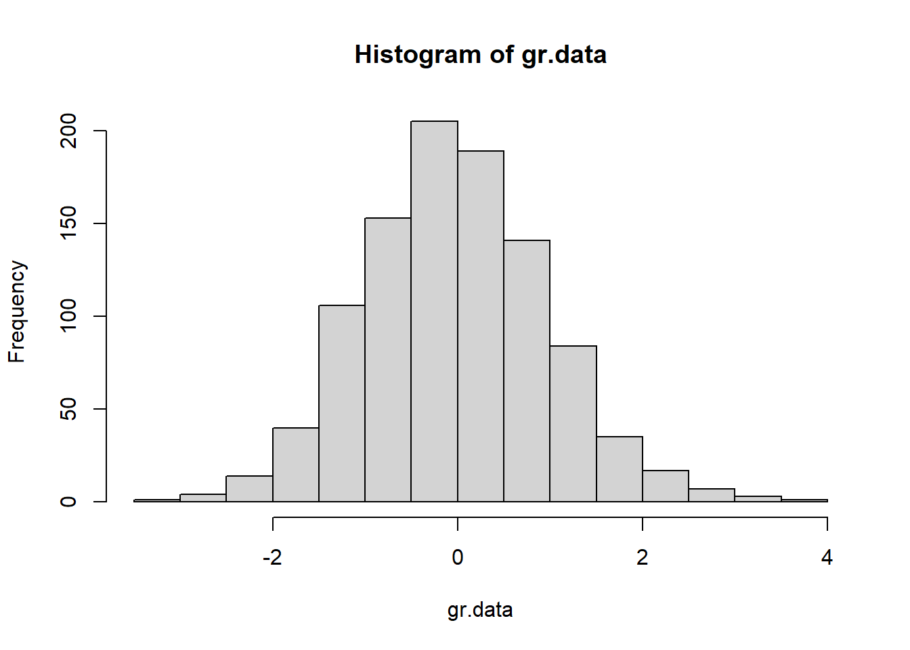
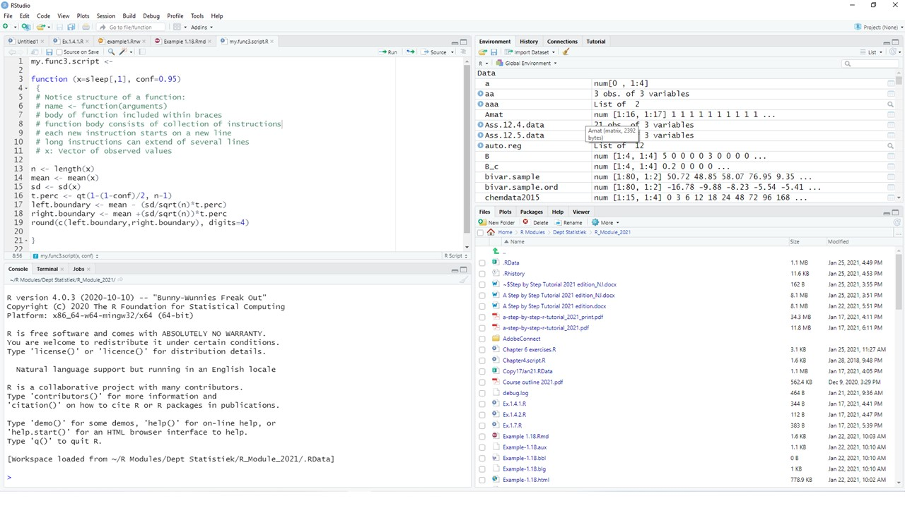

# Introducing the R System {#intro}

##	Introduction

This chapter introduces the R system to the new R user. The Windows operating system is emphasized but most of the material covered also applies to other operating systems after allowing for the requirements of the particular operating system in use. Users with some experience with R should quickly glance through this chapter making sure they have mastered all topics covered here before proceeding with the main tutorial starting with Chapter 2.

In the computer age statistics has become inseparable from being able to write computer programs. Therefore, let us start with a reminder of the Fundamental Goal of S:

::: {style="color: #FF9966;"}
__*Conversion of an idea into useful software*__
:::

The challenge is to pursue this goal keeping in mind the Mission of R [@Chambers2008]:

::: {style="color: #FF9966;"}
__*... to enable the best and most thorough exploration of data possible*__
:::

and its Prime Directive [@Chambers2008]:

::: {style="color: #FF9966;"}
__*... places and obligation on all creators of software to program in such a way that the computations can be understood and trusted*__.
:::

##	Downloading the R system

[Website for downloading R](http://www.R-project.org).
 
To download R to your own computer: Navigate to *.../bin/windows/base* and save the file  *<span style="color:#BE99FF">R-x.y.z.-win.exe</span>* on your computer. Click this file to start the installation procedure and select the defaults unless you have a good reason not to do so. If you select ‘Create desktop icon’ during the installation phase, an icon similar to the one below should appear on the desktop. Alternatively, you can find R under *All Applications*. 


The core R system that is installed includes several *<span style="color:#FF9966">packages</span>*. Apart from these installed packages several thousands of dedicated *<span style="color:#FF9966">contributed packages</span>* are available to be downloaded by users in need of any of them.

##	A quick sample R session {#QuickSample}

Click the R icon created on your desktop to open the *<span style="color:#FF9966">Commands Window</span>* or *<span style="color:#FF9966">Console</span>*. Notice the R prompt `>` waiting for some instruction from the user. 

(a)	At the R prompt `>` enter `5 – 8`. We will follow the following convention to write instructions:


``` r
5 - 8
#> [1] -3
```

(b)	Repeat (a) but enter only 5 – and see what happens:


``` default
> 5 -
> +
> +
```

<div style="margin-left: 25px; margin-right: 20px;">
The above `+` is the secondary R prompt. It indicates that an instruction is unfinished. Either respond by completing the instruction or press the <span style="color:#BE99FF">Esc</span> key to start all over again from the primary prompt.
</div>

(c)	Enter 


``` r
xx <- 1:10
```
 
<div style="margin-left: 25px; margin-right: 20px;">
This instruction creates an R object with name (or label) `xx` containing the vector 
(1, 2, 3, 4, 5, 6, 7, 8, 10). 
</div>

(d)	Enter 


``` r
yy <- rnorm(n = 20, mean = 50, sd = 15) 
```

<div style="margin-left: 25px; margin-right: 20px;">
This instruction creates an R object with name `yy` containing a random sample of 20 values from a normal distribution with a mean of 50 and a standard deviation of 15. 
</div>

(e) Enter


``` r
xx
#>  [1]  1  2  3  4  5  6  7  8  9 10
```

<div style="margin-left: 25px; margin-right: 20px;">
The above example shows that <span style="color:#FF9966">when the name of an R object is entered at the prompt, R will respond by displaying the contents of the object</span>.
</div>

(f)	Obtain a representation of the contents of the object `yy` created in (d). 

(g)	A program in R is called a *<span style="color:#FF9966">function</span>*. Any function in R is also an R *<span style="color:#FF9966">object</span>* and therefore has a name (or label). It follows from (e) that if the name of a function is entered at the prompt, R will respond by displaying the contents of the function.  

    How then can an R function be executed i.e. how can an R function be called? Apart from its name an R function has a list of arguments enclosed within parentheses. An R function is called by entering its name followed by a list of arguments enclosed within parentheses. As an example, let us calculate the mean of the object `yy` created above by calling the function `mean`:


``` r
mean(yy) 
#> [1] 44.44551
```

<div style="margin-left: 25px; margin-right: 20px;">
Note that the prompt appear followed by the mean of object `yy`.
</div>

(h)	Objects created during an R session in the *<span style="color:#3399FF">workspace</span>* are stored in a database *<span style="color:#FF9696">.RData</span>* in the current folder. A listing of all the objects in a database can be obtained by calling the functions `ls()` or `objects()`. Now, first enter, at the R prompt, the instruction `objects` (or `ls`) and then the instruction `objects()` (or `ls()`). Explain what has happened.

(i)	Objects can be removed by the following instruction: `rm(name1, name2, ... )`.

(j)	Apart from the *<span style="color:#FF9966">console</span>* there are several other types of windows available in R e.g. graphs are displayed in graph windows. To illustrate, enter the following instructions at the R prompt in the console or commands window:


``` r
gr.data <- rnorm(1000) 
hist(gr.data)
```



<div style="margin-left: 25px; margin-right: 20px;">
These instructions have resulted in the opening of a graph window containing the required histogram and the user can switch from the console to the graph window and back again to the console.
</div>

(k)	The R session can be terminated by closing the window or entering `q()` at the R prompt. Either way the user is prompted to save the *<span style="color:#3399FF">workspace</span>*. If the user chooses not to save, all objects created during the session are lost. 

## Working with RStudio

Many users of R prefer working with *<span style="color:#BE99FF">RStudio</span>*.  *<span style="color:#BE99FF">RStudio</span>* is a free and open source integrated development environment for R which works with the standard version of R available from CRAN. It can be downloaded from the [RStudio](www.rstudio.com) home page to be run from your desktop (*<span style="color:#BE99FF">Windows</span>*, *<span style="color:#BE99FF">Mac</span>* or *<span style="color:#BE99FF">Linux</span>*). Full details about the functionality of *<span style="color:#BE99FF">RStudio</span>* are available from its home page. Here, only a brief introduction to *<span style="color:#BE99FF">RStudio</span>* is given.

When *<span style="color:#BE99FF">RStudio</span>* is installed on your computer the following icon is created on the desktop:

 

Clicking the above icon open the *<span style="color:#BE99FF">RStudio</span>* development environment as shown in Figure \@ref(fig:RStudioLayout). In order to open any R *<span style="color:#3399FF">workspace</span>* with *<span style="color:#BE99FF">RStudio</span>* drag the corresponding *<span style="color:#FF9696">.RData</span>* file to the above *<span style="color:#BE99FF">RStudio</span>* icon and drop it as soon as  ‘Open with RStudio’ becomes visible.

<div class="figure">

<p class="caption">(\#fig:RStudioLayout)The RStudio development environment for R.</p>
</div>

The bottom left-hand panel is the familiar R console.

The bottom right-hand panel is used for :
(a)	a listing of the files in the folder where the *<span style="color:#3399FF">workspace</span>* (*<span style="color:#FF9696">.RData</span>*) for the active project is kept
(b)	a listing of all installed packages available to be attached to the search path as well as menus for installing and updating packages
(c)	the graph windows (if any)
(d)	the Help facilities.

The top left-hand panel can be used for creating and managing script files (see \@ref(script)) while the top right-hand panel provides information on the objects in the current folder as well as the history of previous commands given in the console. 

##	R: an interpretive computer language

Essentially, in an interpretive language instructions are given one by one. Each instruction is then evaluated or interpreted in turn by an internal program called an *<span style="color:#FF9966">interpreter</span>* or *<span style="color:#FF9966">evaluator</span>* and some immediate action is taken. For example, the instruction given in \@ref(QuickSample)(a) is evaluated by the R evaluator resulting in the answer `–3` being returned. On the other hand, in \@ref(QuickSample)(b) the evaluator found the instruction to be incomplete and therefore asked for more information.

An advantage of an interpretive language is that intermediate results can be obtained quickly without having first to wait for a complete program to finish as is the case with a compiler language. In the latter case a complete program is translated (or compiled) by a program called a compiler. The compiled program can then be converted to a standalone application that can be called by other programs to perform a complete task. In general compiler languages handle computer memory relatively more efficiently and calculations are executed more speedily.
Communication with the R evaluator takes place through a set of instructions called *<span style="color:#FF9966">escape sequences</span>*. These escape sequences take the form of a backslash preceding a character. Examples of such escape sequences are:

`\n` 	new line 

`\r` 	carriage return 

`\t` 	go to next tab stop 

`\b` 	backspace 

`\a` 	bell 

`\f` 	form feed 

`\v` 	vertical tab

A consequence of the above role of the backslash in R is that a single backslash in a filename will not be properly recognized. Therefore, when referring in R to the following file path *<span style="color:#FF9696">"c:\\My Documents\\myFile.txt"</span>* all backslashes must be entered as double backslashes i.e. `"c:\\My Documents\\myFile.txt"` or as `"c:/My Documents/myFile.txt"`.

### Exercise

::: {style="color: #80CC99;"}
The `cat()` function can be used to write a text message to the console. Initialize a new R session and investigate the results of the following R instructions:


``` r
cat("aaa bbb")
cat("aaa bbb \n")
cat("aaa \n bbb \n")
cat("aaa \nbbb \n")
cat("aaa \t\t bbb \n") 
cat("aaa\b\b\bbbb \n") 
cat("aaa \n\a bbb \a\n") 
cat("1\a\n"); cat("2\a\n")
```

What is the purpose of the semi-colon in the line above? 

Could you distinguish the two soundings of the bell? Try the following:


``` r
cat("1\a\n"); Sys.sleep(2); cat("2\a\n") 
```

Could you now distinguish the two soundings of the bell? 

What is the purpose of the `Sys.sleep()` instruction?
:::

### Exercise

::: {style="color: #80CC99;"}
Write R code to achieve the following output:

`My name is:`

Bell sounds once. 

Your name appears on a new line. 

Two distinct sounds of the bell are heard and 

`Thank you` is visible on a new line.

The cursor appears on a new line.
:::

## Accessing the Help functionality

(a) Use


``` r
?mean
```

<div style="margin-left: 25px; margin-right: 20px;">
to obtain help on the usage of the R function `mean()`.
</div>

(b) Find out what is the difference between the instructions


``` r
?mean
```

<div style="margin-left: 25px; margin-right: 20px;">
and
</div>


``` r
??mean
```

(c) What help is available via the instruction


``` r
help.start()
```

(d) Use


``` r
?help.search()
```

<div style="margin-left: 25px; margin-right: 20px;">
to find out how to obtain help using the R function `help.search(xx)`. Note: For hep on an operator or reserved word quotes are needed, e.g.
</div>


``` r
?matrix
```

<div style="margin-left: 25px; margin-right: 20px;">
but
</div>


``` r
?"?"
```

<div style="margin-left: 25px; margin-right: 20px;">
or
</div>


``` r
?"for"
```

##	More R basics { #MoreBasics }

(a)	R as an *<span style="color:#FF9966">interactive</span>* language allows for fast acquisition of results.

(b)	R is a *<span style="color:#FF9966">functional</span>* language in two important senses: In a more technical sense it means the R model of computation relies more on *<span style="color:#FF9966">function evaluation</span>* than by procedural computations and changes of state. The second sense refers to the way how users communicate to R namely almost entirely through *<span style="color:#FF9966">function calls</span>*.

(c)	R as an *<span style="color:#FF9966">object-oriented</span>* language refers in a technical sense to the S4 or S5 type of objects with their associated classes and methods as mentioned in the Preface. In a less technical sense it means that everything in R is an object.

(d)	R objects will be studied in detail in later chapters. What is important for now, is the following: 

*	Everything in R is an object. 
* There are different types of objects e.g. function objects, data objects, graphics objects, character objects, numeric objects. 
* Usually objects are stored in the current folder called the *<span style="color:#FF9966">Global environment</span>*; recognized by R under the name `.GlobalEnv` and available in the file system under the name *<span style="color:#FF9696">.RData</span>*.
* Objects are created from the console by *<span style="color:#FF9966">assignment</span>* through the instruction 


``` r
name <- object
```

<div style="margin-left: 32px; margin-right: 20px;">
or
</div>


``` r
object <- name
```

* In R names are *<span style="color:#FF9966">case sensitive</span>* i.e. peter and Peter are two different objects. 
* Objects created by assignment during an R session are stored permanently in the Global environment (working directory) unless the user chooses not to save when terminating an R session. 
* Care must be exercised when creating a new object by assignment: if an object with the name my.object already exists in the Global environment and a new object is created by assigning it to the name my.object then the old my.object is over-written and it is replaced by the new object *<span style="color:#FF9966">without any warning</span>*. 
* Remember the way the R evaluator operates: if an object name is given at the R prompt the R evaluator responds by displaying the content of the object. Review the difference between the instructions 


``` r
q
```

<div style="margin-left: 32px; margin-right: 20px;">
and
</div>


``` r
q()
```


(e) The symbol `#` marks a comment. Everything following a `#` on a line is ignored by the R evaluator. Check for example the result of the instruction 


``` r
5+8 # +12
#> [1] 13
```

(f) Usage of the symbols `<-`, `=` and `==`. The symbol `<-` is used for assigning the object on its right-hand side to a name (label) on its left-hand side; the equality sign `=` is used for specifying the arguments of functions while the double equality symbol `==` is used for comparison purposes. In earlier versions of R these rules were strictly applied by the R evaluator. However, in recent versions of R the evaluator allows the equality sign also in the case for assigning an object to a name. We believe that reserving the equality sign only for argument specifications in functions leads to more clarity when writing complex functions and therefore we discourage its usage for creating objects by assignment. In this book creating objects by assignment will be exclusively carried out with the assignment symbol `<-`. 

(g)	The symbol `->` assigns the object on its left-hand side to the name (label) on its right-hand side. 

(h) Working with packages: The core installation includes several packages. To see them issue the command `search()` from the R prompt in the console. Notice that the first object in the search list is `.GlobalEnv`. This is followed by other objects. Packages are recognized by the string package followed by a colon and the name of the package. In order for a package to be used the following steps must be followed: if the package has been *<span style="color:#FF9966">installed</span>* previously it needs only to be *<span style="color:#FF9966">loaded</span>* into the search path using the command `library(packagename)` from the R prompt. This will load the package by default in the second position on the search path. If the package has not been installed previously it must first be installed. This is most easily done using the top menu Packages. The command `require(packagename)` appears to be identical to `library(packagename)`. The function `require()` is designed for use inside other functions as it gives a warning, rather than an error, if the package does not exist.

(i) More on the help (`?`) facility: Table \@ref(tab:HelpQueries) contains details about help available for some special keywords. 

Table: (\#tab:HelpQueries) Some useful keywords available for help queries.

| *<span style="color:#F7CE21">Help query</span>* | *<span style="color:#F7CE21">Explanation</span>* |
| ------ | --------------- |
| `?Arithmetic` |	Unary and binary operators to perform arithmetic on numeric and complex vectors |
| `?Comparison` |	Binary operators for comparison of values in vectors |
| `?Control` | The basic constructs for control of the flow in R instructions |
| `?dotsMethods` | The use of the special operator `...` | 
| `?Extract` | Operators to extract or replace parts of vectors, matrices, arrays and lists |
| `?Logic` | Logical operators for operating on logical and numeric vectors |
| `?.Machine` |	Information on the variable `.Machine` holding information on the numerical  characteristics of the machine R is running on |
| `?NumericConstants` |	How R parses numeric constants including `Inf`, `NaN`, `NA` |
| `?options` | Allow the user to set and examine a variety of global options which affect the way in which R computes and displays its results |
| `?Paren` |	Parentheses and braces in R |
| `?Quotes` | Single and double quotation marks. Back quote (backtick) and  backslash for starting an escape sequence |
| `?Reserved` |	Description of reserved words in R |
| `?Special` | Special mathematical functions related to the beta and gamma functions including permutations and combinations |
| `?Syntax` |	Outlines R syntax and gives the precedence of operators |

## Regular expressions in R: the basics

It follows from \@ref(MoreBasics)(d) that care must be taken when objects are assigned to names. Furthermore, the Global environment or any other R database may easily contain hundreds of objects. Therefore, a frequent task is to search for patterns in the names of objects e.g. searching for all object names starting with “Figure” or ending in “.dat”. The R function `objects()`  or `ls()` has arguments `pos` and `pattern` for specifying the position of a database to search and a pattern of characters appearing in a name (or string), respectively. The pattern argument can be given any *<span style="color:#FF9966">regular expression</span>*. Regular expressions provide a method of expressing patterns in character values and are used to perform various tasks in R. Here we are only considering the task of extracting certain specified objects in a database using the pattern argument of `objects()`  or `ls()`.

The syntax of regular expressions follows different rules to the syntax of ordinary R instructions. Moreover its syntax differs depending on the particular implementation a program uses. By default, R uses a set of regular expressions similar to those used by UNIX utilities, but function arguments are available for changing the default e.g. by setting argument `perl = TRUE`.

Regular expressions consist of three components: *<span style="color:#FF9966">single characters</span>*, *<span style="color:#FF9966">character classes</span>* and *<span style="color:#FF9966">modifiers</span>* operating on single characters and character classes.

Character classes are formed by using square brackets surrounding a set of characters to be matched e.g. `[abc123]`, `[a-z]`, `[a-zA-Z]`, `[0-9a-z]`.  Note the usage of the dash to indicate a range of values.

The modifiers operating on characters or character classes are summarized in Table \@ref(tab:RegExprMod).

Table: (\#tab:RegExprMod) Modifiers for regular expressions.

| *<span style="color:#F7CE21">Modifier</span>* | *<span style="color:#F7CE21">Operation</span>* |
| ------ | --------------- |
| `^` | Expression anchors at beginning of target string |
| `$` | Expression anchors at end of target string |
| `.` | Any single character except newline is matched |
| `|` |	Alternative patterns are separated |
| `( )` |	Patterns are grouped together |
| `*` |	Zero or more occurrences of preceding entity are matched |
| `?` |	Zero or one occurrences of preceding entity are matched |
| `+` |	One or more occurrences of preceding entity are matched |
| `{n}` |	Exactly n occurrences of preceding entity are matched |
| `{n,}` |	At least n occurrences of preceding entity are matched |
| `{n, m}` |	At least n and at most m occurrences of preceding entity are matched |

Because of their role as modifiers or in forming character classes the following characters must be preceded by a backslash when their literal meaning is needed:

	[  ]  {  }  (  )  ^  $  .  |  *  +  \

Note that in R this means that whenever one of the above characters needs to be escaped in a regular expression it must be preceded by double backslashes. Table \@ref(tab:RegExpr) contains some examples of regular expressions.

Table: (\#tab:RegExpr) Examples of regular expressions.

| *<span style="color:#F7CE21">Regular expression</span>* | *<span style="color:#F7CE21">Meaning</span>* |
| ------ | --------------- |
| `"[a-z][a-z][0-9]"` |	Matches a string consisting of two lower case letters followed by a digit |
| `"[a-z][a-z][0-9]$"` | Matches a string ending in two lower case letters followed by a digit |
| `"^[a-zA-Z]+\\."` |	Matches a string beginning with any number of lower or upper case letters followed by a period |
| `"(ab){2}(34){2}$"` |	Matches a string ending in `abab3434`

### Exercise

::: {style="color: #80CC99;"}
Initialize an R session 

(a)	Attach the MASS package in the second (the default) position on the search path by issuing the command


``` r
library(MASS)
```

(b)	Get a listing of all the objects in package MASS by requesting


``` r
objects(pos=2)
```

(c)	Explain the difference between `objects(pos=2, pat=".")` and `objects(pos=2, patt="\\.")`.
(d)	Obtain a listing of all objects with names starting with three letters followed by a digit.
(e)	Obtain a listing of all objects with names ending with three letters followed by a digit.
(f)	Obtain a listing of all objects with names ending in a period followed by exactly three or four letters.
:::

## 	From single instructions to sets of instructions: introducing R functions { #FunctionIntro }

Consider the following problem: the R data set `sleep` contains the extra hours of sleep of 20 patients after a drug treatment. Suppose this data set can be considered a sample from a normal population. A 95% confidence interval is required for the mean extra hours of sleep. It is known that the confidence interval is given by $\left[ \mathbf{\bar{x}}- \left( \frac{s}{\sqrt(n)} \right) t_{n-1,0.025}; \mathbf{\bar{x}}+ \left( \frac{s}{\sqrt(n)} \right) t_{n-1,0.025} \right]$. This problem can be solved by entering the following instructions one by one:


``` r
sleep.data <- sleep[ ,1]   
sleep.mean <- mean(sleep.data)   
sleep.sd <- sd(sleep.data)    
t.perc <- qt(0.975,19) 
left.boundary <- sleep.mean - (sleep.sd/sqrt(length(sleep.data)))*t.perc 
right.boundary <- sleep.mean + (sleep.sd/sqrt(length(sleep.data)))*t.perc
cat ("[", left.boundary, ";", right.boundary, "]\n")
#> [ 0.5955845 ; 2.484416 ]
```

In situations like the above, the problem can be addressed using a *<span style="color:#FF9966">script file</span>* or writing a *<span style="color:#FF9966">function</span>*. We are going to introduce two methods for writing functions in R:

(i) using a script file and
(ii) using the function `fix()`.

### Writing an R function using a script file { #script }

(a)	From the R top menu select *File; New script*.  A script window will open with a simultaneous change in the menu bar. 
(b)	Type the instructions in the script window.
(c)	Select all the typed text and run the script by clicking the run icon (or Ctrl+R).
(d)	Note what is shown in the R console window.
(e)	Script files are ordinary text files. They can be saved, edited and opened using any text editor.
(f)	By convention R script files have the extension <span style="color:#FF9696">xxxx.r</span>.
(g)	Next, change the spelling in the last two lines from `right.boundary` to `Right.boundary`. Select all the text and run the script.  Check the output appearing on the console. 
(h)	Script windows can also be used for creating an R function.
(i)	Create an R function by changing the text as shown below.


``` r
conf.int <- function (x = sleep[,1])
{
  x.mean <- mean(x)   
  x.sd <- sd(x)    
  t.perc <- qt(0.975,19) 
  left.boundary <- x.mean - (x.sd/sqrt(length(x)))*t.perc 
  right.boundary <- x.mean + (x.sd/sqrt(length(x)))*t.perc
  list (lower = left.boundary, upper = right.boundary)  
}
```

(j)	Select the text and notice what happens in the R commands window (the console).
(k)	Give the instruction `objects()` at the R prompt. What has happened?
(l) You can now run the function from the commands window (the console) by typing:


``` r
conf.int (x = sleep[,1])
#> $lower
#> [1] 0.5955845
#> 
#> $upper
#> [1] 2.484416
```


(l)	If you want to create and run the function `conf.int` in a script window then add the instruction `conf.int (x = sleep[,1])` as the last line in the script window. Now, select only this line and run it. Check the R console.

(m)	What will happen if a syntax error is made in the script window? Change the code in the script file as follows, deliberately deleting the last closing parenthesis in the last line of the function.  


``` r
conf.int <- function (x = sleep[,1])
{
  x.mean <- mean(x)   
  x.sd <- sd(x)    
  t.perc <- qt(0.975,19) 
  left.boundary <- x.mean - (x.sd/sqrt(length(x)))*t.perc 
  right.boundary <- x.mean + (x.sd/sqrt(length(x)))*t.perc
  list (lower = left.boundary, upper = right.boundary
}
conf.int (x = sleep[,1])
```

(n) Select *only the final line* and run it. Check the R console. No problem, the function executed correctly. This is because the code for `conf.int` in the script file was changed, but the updated object was not created by running it in the console.
(o) Select *all the code* in the script and run it.  Check the R console. Discuss.

### Writing an R function using `fix()`

When using `fix()` the built-in *<span style="color:#FF9966">R text editor</span>* can be used when using script files but in the windows environment <span style="color:#3399FF">notepad</span> or preferably [notepad++](www.notepad-plus-plus.org/download/) or [Tinn-R](https://tinn-r.org/en/) is preferred. 

The following instruction is necessary for changing the default editor to be used with `fix()`: 


``` r
options(editor = "notepad")
```

or


``` r
options(editor = "full path to the relevant exe file")
```

(a)	Enter `fix (my.func)` at the R prompt. A text editor will open. Type the instructions as shown below. 


``` default
function (x = sleep[,1])
{
  x.mean <- mean(x)`
  x.sd <- sd(x)
  t.perc <- qt(0.975,19)
  left.boundary <- x.mean - (x.sd/sqrt(length(x)))*t.perc
  right.boundary <- x.mean + (x.sd/sqrt(length(x)))*t.perc
  list (lower = left.boundary, upper = right.boundary)
}
```

<div style="margin-left: 32px; margin-right: 20px;">
Close the window. Check what happens in the R console.

You can now run the function from the commands window (the console) similar to in \@ref(script)(l), but changing the name of the function from `conf.int` to `my.func`.
</div>

(b)	What will happen if a syntax error is made when using fix? At the R prompt type `fix (my.func)`. Make a deliberate syntax error, e.g. delete the last closing brace. Close the text editor window. What happens in the console? What is to be done to correct the mistake?

(c)	Carefully study the message in the R console when a syntax error occurred in a function created by `fix()`:


``` default
> Error in edit(name, file, title, editor) :
	unexpected 'yyy' occurred on line xx
  	use a command like
  	x <- edit()
  	to recover
```


(d)	The following is the correct way to respond to the above message from the R evaluator:


``` r
my.func <- edit()
```

<div style="margin-left: 32px; margin-right: 20px;">
If you simply use `fix(my.func)` at this point, the R and the editor will revert to the version of the function *before* the previous edit.
</div>

::: {style="color: #FF9966;"}
**WARNING**

Before writing a function for solving any problem: make sure the problem is understood exactly; make 100% sure the relevant statistical theory is understood correctly. Failure to do so is careless and dangerous!
:::

## R Projects

The different windows in R are the Data window, Script window, Graph window and Menus and Dialog windows. The current *<span style="color:#3399FF">workspace</span>* in R is `.GlobalEnv`. The function `getwd()` is used to obtain the path to the current folder’s *<span style="color:#FF9696">.Rdata</span>* and *<span style="color:#FF9696">.Rhistory</span>*.

*Note*: In order to see the files *<span style="color:#FF9696">.Rdata</span>* and *<span style="color:#FF9696">.Rhistory</span>* being displayed as such, it may be necessary to turn off the option “Hide extensions for known file types” in *<span style="color:#BE99FF">Windows Explorer</span>*.

It is important to make provision for different *<span style="color:#3399FF">workspaces</span>* associated with different *<span style="color:#FF9966">projects</span>*. In R, different *<span style="color:#FF9696">.Rdata</span>* files in different folders would separate different projects. There is however much to gain in using *Projects* in *<span style="color:#BE99FF">RStudio</span>*.

### Creating a project in RStudio

From the top menu, select *File, New Project*. Follow the prompts to create a new project, either in an existing folder or creating a new folder for your project, say *<span style="color:#BE99FF">MyProject</span>*.

(a) Navigate to the folder *<span style="color:#BE99FF">MyProject</span>* in *<span style="color:#BE99FF">Windows Explorer</span>*.

(b) Notice a file *<span style="color:#FF9393">MyProject.Rproj</span>* has been created in the folder.

(c) By double-clicking on this file you open the project in *<span style="color:#BE99FF">RStudio</span>*. The advantages of opening the project this way are:

* your *<span style="color:#3399FF">workspace</span>* from the file *<span style="color:#FF9696">MyProject\.Rdata</span>* is automatically loaded

* by placing any related files like data set in the folder *<span style="color:#BE99FF">MyProject</span>* or a subfolder, say *<span style="color:#BE99FF">MyProject\\data</span>* means that in your code you only have to use relative folder references, i.e. refer to *<span style="color:#BE99FF">MyProject\\mydata.xlsx</span>* or *<span style="color:#BE99FF">MyProject\\data\\mydata.xlsx</span>* instead of something like *<span style="color:#BE99FF">c:\\users\\myname\\Documents\\MyProject\\data\\mydata.xlsx</span>*.

* the major advantage of relative references is that it is not specific to the computer and makes porting between devices possible

* sharing your project with a collaborator will simply entail copying the entire contents of the *<span style="color:#BE99FF">MyProject</span>* folder.

##	A note on computations by a computer

When writing R functions it is important to keep in mind that the way computations are performed by a computer are not always according to the rules of algebra. Two important occurrences are given below.  

* In mathematics the following statement is incorrect: `x = x + k` for $k \neq 0$ but in computer programming the statement `x = x + k` is legitimate and it means `x` is replaced by `x + k`.

* In general, the treatment of integers and real numbers for which R uses floating point representation happens at a fundamental level over which R has no control. Real numbers cannot necessarily be exactly represented in a computer – some can only be approximated. Furthermore, there are limitations to the minimum and maximum numbers that can be represented in a computer. This might lead to what is known as *<span style="color:#FF9966">underflow</span>* or *<span style="color:#FF9966">overflow</span>*.  A more detailed discussion appears in a later chapter.

Open an R session and issue the command   


``` r
.Machine
```

for details about the numerical environment of your computer.

## Built-in data sets in R

R contains several built-in data sets collected in the package `datasets`. This package is automatically attached to the search path. Type  `?datasets`  at the R prompt for details. Apart from these data sets several other data sets from other packages are also used in this book.

##	The use of `.First()` and `.Last()`
The function `.First()` is executed at the beginning of every R session. *<span style="color:#FF9966">This only works in R and not in RStudio</span>*.

Instead of having to specify


``` r
options(editor = "notepad")
```

each time an R session is initialized, create the following function and save in the <span style="color:#FF9696">.Rdata</span> before exiting R.


``` r
.First <- function() { options(editor = "notepad") }
```

to ensures that  Notepad is the text editor during any subsequent session.

Similar to `.First()` the function `.Last()` can be created for execution at the end of an R session.

### Security: an example of the usage of `.First()`

The `.First()` facility can be used to prevent access to a R *<span style="color:#3399FF">workspace</span>* by setting a password protection.  This can be done as follows:

Create a new *<span style="color:#3399FF">workspace</span>* for running the example on security. In this *<span style="color:#3399FF">workspace</span>* create the following R function 


``` r
password <- function()        # Note the structure of a function
{ cat("Password? \n")
  password <- readline()      # What is the usage of readline()? 
  if (password != "PASSWORD") 
    q(save="no")              # The meaning of !=  is "not equal to"
  else (cat("You can proceed \n"))
}				
```

Now create the function:


``` r
.First <- function()
{   #  What must you be careful of?
   password()
}
```

* Terminate your R session and open it again.
*	Discuss the construction and usage of the above functions.
*	Can you break the above security?
*	Can you make changes to the above security to make it more safe?

##	Options

Study the result of the instruction `> options()` in R.

## Creating PDF and HTML documents from R output: R Markdown

The R package `knitr` is used to obtain reproducible results from R code in the form of *<span style="color:#BE99FF">.pdf</span>* or *<span style="color:#BE99FF">.html</span>* documents. In addition to `knitr`, *<span style="color:#BE99FF">R Markdown</span>* can be used to create *<span style="color:#BE99FF">.html</span>*, *<span style="color:#BE99FF">.pdf</span>* or even *<span style="color:#BE99FF">MS Word</span>* documents. *<span style="color:#BE99FF">Markdown</span>* is a so-called markup language with plain-text-formating syntax. An *<span style="color:#BE99FF">R Markdown</span>* document is written in markdown and contains chunks of embedded R code. Although the `render()` function in the package `rmarkdown` can be used (similar to the `knit()` function from the package `knitr`), to create the output document from the *<span style="color:#BE99FF">R Markdown</span>* *<span style="color:#FF9696">.Rmd</span>* file, *<span style="color:#BE99FF">R Markdown</span>* is typically used in conjunction with *<span style="color:#3399FF">RStudio</span>*. In the top menu, select *File, New File, R Markdown…* to open the *<span style="color:#FF9696">example.Rmd</span>* file providing the user with the structure of an *<span style="color:#BE99FF">R Markdown</span>* file. For our illustration, we will select the output format as *<span style="color:#BE99FF">.html</span>*.

Edit the *<span style="color:#FF9696">example.Rmd</span>* file to contain the following:


```` default
---
title: "An Illustration of Some Capabilities of R Markdown"
author: "Niel le Roux and Sugnet Lubbe"
date: "22/01/2021"
output: html_document
---

```{r setup, include=FALSE}
knitr::opts_chunk$set(echo = TRUE)
```

## Short description

Code chunks in .Rmd files are delimited with ` ```{r} ` at the top where a chunk 
label and any chunk options can appear and  ` ``` ` at the end. In-line R code 
chunks are indicated with single ` `r ` on either side.

*****

Here is an example containing several chunks of code. Note that in the first 
chunk R code is not shown due to the option `echo = FALSE`. In the remaining 
chunks R code is shown due to the option above 'echo = TRUE'.

_Note R code not shown for this chunk._

```{r y, echo=FALSE}
y <- 1
y
```

```{r rnorm}
require(lattice)
set.seed(123)
x <- rnorm(1000, 20, 5)
```

We analyse data drawn from $\mathcal{N}(20,25)$. The mean is 
`r round(mean(x),3)`. The following code shows the distribution via a histogram

```{r histexample}
  hist(x)
```

and the code below via a boxplot.

```{r boxexample}
  boxplot(x)
```

The first element of \texttt{x} is `r x[1]`. Note the usage of ` \texttt{x} ` 
above.

*two plots side by side (option fig.show='hold')*

```{r side-by-side, fig.show='hold', out.width="50%"}
  par(mar=c(4,4,0.1,0.1), cex.lab=0.95, cex.axis=0.9, mgp=c(2,0.7,0), 
      tcl=-0.3, las=1)
  boxplot(x)
  hist(x,main="")
```

```{r linear_model}
  n <- 10
  x <- rnorm(n)
  y <- 2*x + rnorm(n)
  out <- lm(y ~ x)
  summary(out)$coef
```

````

At the top of the text editor, click on *Knit* to create the *<span style="color:#BE99FF">.html</span>* document. Note that with the down arrow, options *Knit to PDF* and *Knit to Word* can also be chosen. The output format is also specified in line 5 of the text file with `output: html_document`. Had we chosen *<span style="color:#BE99FF">.pdf</span>* as output format, it would be `output: pdf_document`. Typically, *<span style="color:#BE99FF">R Markdown</span>* is used for reporting, directly incorporating the R code and output. For more formal documents with Figure and Table caption references, tables of content, etc. the R package `bookdown` should be used. Install the package and replace the output statement with `output:bookdown::pdf_document2`. For more information on the use of bookdown, [click here](https://bookdown.org/). 

## Command line editing

Commands given in an R session are stored together with commands given in previous sessions in a file *<span style="color:#FF9696">.History</span>* in the same folder as the *<span style="color:#FF9696">.RData</span>* file. In an R session previous commands can be retrieved at the R prompt by pressing the *up* and *down* arrow keys. A previous command can then be edited using the *backspace*, *delete*, *home*, *end* keys as well as the shortcuts for *copy* and *paste*.

