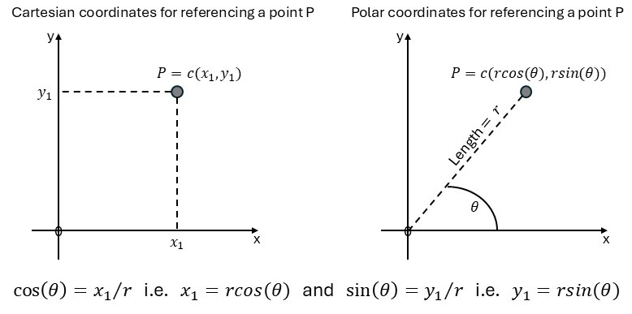

# Revision tasks {#revision}

In general, the purpose of writing a program in R is to address some practical problem directly or indirectly. To prepare the student for seriously writing R functions (programs) this chapter consists of a mixture of revision tasks. While some of these tasks are straight forward others need more thought and preparation before starting with the writing of R code. In Section \@ref(guidelines) some guidelines are considered for writing R code to address a practical problem.  

##	Guidelines for problem solving by writing R code { #guidelines }

(a)	Make sure the problem is clearly understood.  You cannot write good code for something that is not correctly grasped.

(b)	Break complex problems into simpler components. Formulate these simpler components in terms of specific questions to be answered.

(c)	Think in terms of the way R operates e.g. vectorized arithmetic, recycling principle, operating on objects as wholes/units, subscripting, R data structures . . . 

(d)	Spend time to prepare your data.

(e)	Ask yourself the question what information do you need before attempting to write code for coming up with an answer. Then, what facilities are provided in R to get the necessary information and once the information is available what manipulations are needed to code useful output.

(f)	Write dedicated code for answering the specific questions in (b). 

(g)	Do not neglect the debugging/optimizing phase of code that succeeds in providing a first round answer.

##	Exercise

::: {style="color: #80CC99;"}

1.	Use R to obtain a five-point summary of the variable `dpi` in the `LifeCycleSavings` data set. Illustrate the difference between the working of `fivenum()` and `quantile()`. *Hint*: See `boxplot.stats()` for the definition of hinges.

2.	Display the pdf of a $normal (100, 15)$ distribution graphically. The area under the density bounded by the 70th and 90th percentiles must appear in red.

3. Use R to obtain the following graphical representations:

    (i)	The pdf as well as the cdf of a $F (15, 10)$ and a $F (10, 15)$ stochastic variable. These graphs must be on one graph window with the same set of axes for both F-distributions and be supplied with suitable titles. Furthermore, they must be line graphs that contain no other plotting characters except lines. 
    
    (ii)	Obtain representations as line graphs of the inverses of the above cdfs on a single separate graph page.


4.	First set the seed to 172389 and then generate a random sample of size 500 from a $normal (100, 20)$ distribution. Give the necessary R instructions to determine the class frequencies in the class intervals “Smaller than 50”,  “50 to 75–“,  “75 to 90–“,  “90 to 100”,  “100+ to 110”,  “Larger than 110”.

5.	Generate a random sample of size 80 from a bivariate normal distribution with mean vector $(50, 100)$. The variances of the two variables are 900 and 2500 respectively with a correlation 0.90. Store the sample in an R matrix object and obtain a scatterplot in the form of

    (i)  a point diagram and
    (ii)  a line graph of the sample.
	
	
6. Define the harmonic mean for a vector of observations. What conditions must be satisfied by the observations?

    (i)	Write your own function for calculating a harmonic mean and use it to calculate the harmonic mean of variable `dpi` in the `LifeCycleSavings` data set. 
    
    (ii)	Calculate the ordinary mean of variable `dpi` in the `LifeCycleSavings` data set. Compare the answer with the answer in (a).  Which answer would you use in practice? Motivate.
	
7. Fisher’s linear discriminant function in the case of two groups is defined as follows:

<div style="margin-left: 25px; margin-right: 20px;">
$LDF = (\mathbf{\bar{x}}_1 - \mathbf{\bar{x}}_2)' \mathbf{S}^{-1} \mathbf{x}$ where $\mathbf{S} = [(n_1-1)\mathbf{S}_1 + (n_2-1)\mathbf{S}_2]/(n_1 + n_2 - 2)$ with $\mathbf{\bar{x}}_i$ and $\mathbf{S}_i$ the vector of means and the covariance matrix of the $i$th group (sample), respectively.
    
The corresponding classification function is written as $CF =(\mathbf{\bar{x}}_1 - \mathbf{\bar{x}}_2)' \mathbf{S}^{-1} \mathbf{x} - \frac{1}{2} (\mathbf{\bar{x}}_1 - \mathbf{\bar{x}}_2)' \mathbf{S}^{-1} (\mathbf{\bar{x}}_1 + \mathbf{\bar{x}}_2)$. The expression (\mathbf{\bar{x}}_1 - \mathbf{\bar{x}}_2)' \mathbf{S}^{-1} is referred to as the discriminant coefficients.
    
In agreement with section \@ref(guidelines) make sure what an $LDF$ and a $CF$ entail. The `crabs` data set in package `MASS` consists of 200 rows and 8 columns, describing 5 morphological measurements on 50 crabs each of two colour forms and both sexes, of the species *Leptograpsus variegatus* collected at Fremantle, Western Australia.

(i)	Obtain the covariance matrix for each of the two species of crabs.
    
(ii)	Obtain the vector of means for each of the two species of crabs.
    
(iii)	Use standard R functions operating on matrices to write a function or code that calculates the discriminant coefficients for the given linear discriminant function. 
    
(iv) Write a function that determines the linear discriminant function and return
    
* the discriminant coefficients;
    
* The CF for each observation.
    
(v)	Repeat the discriminant analysis above, discriminating between male and female crabs, ignoring differences in species.

(vi) Compare your results to using the `lda()` function in the package `MASS` with the command
</div>


``` r
predict (lda (sex ~ FL + RW + CL + CW + BD, data=crabs))$class
```

8. Consider the matrix $\mathbf{A}:n \times m$. What is understood by the column space $V(\mathbf{A})$ and the orthogonal complement $V^⊥(\mathbf{A})$? The R function `svd()` can be used to obtain an orthogonal basis for $V(\mathbf{A})$ when the rank of $\mathbf{A}$ is $k$. We also want to determine an orthogonal basis for $V^⊥(\mathbf{A})$. How can the function `svd()` be used to simultaneously find a basis for $V(\mathbf{A})$ and for $V^⊥(\mathbf{A})$? 

<div style="margin-left: 25px; margin-right: 20px;">
The above propositions can be proved as follows: Assume that $n≥m$ and that an orthonormal basis for $V(\mathbf{A})$  as well as for $V^⊥(\mathbf{A})$ must be found.  Append $n-m$ zero vectors of size $n$ to the matrix $\mathbf{A}$. Write $\mathbf{A}^0$ for the appended matrix and perform the function `svd()` on  $\mathbf{A}^0$. It follows that $\mathbf{A}^0 = \mathbf{UDV}'$  so that $\mathbf{A}^0 \mathbf{V} = \mathbf{UD}$, i.e. 

$$
\begin{bmatrix} 
\mathbf{A}^0 \mathbf{v}_{(1)} & \mathbf{A}^0 \mathbf{v}_{(2)} & \dots & \mathbf{A}^0 \mathbf{v}_{(n)}
\end{bmatrix} = \begin{bmatrix} 
d_1 \mathbf{u}_{(1)} & d_2 \mathbf{u}_{(2)} & \dots & d_n \mathbf{u}_{(n)}
\end{bmatrix}.
$$
Now $\mathbf{A}^0 \mathbf{v}_{(i)} \in V(\mathbf{A}^0) = V(\mathbf{A})$. (*Motivate in detail*.) It follows that $\mathbf{u}_{(i)} \in V(\mathbf{A}), i = 1, 2, \dots, k$ . (*Motivate in detail*.) Therefore the columns of $\mathbf{U}$ that correspond to the non-zero $d$s form an orthonormal basis for $V(\mathbf{A})$  while the columns of $\mathbf{U}$ that correspond to the zero $d$s form an orthonormal basis for the orthogonal complement of $V(\mathbf{A})$. Motivate the last statement in detail.
</div>

9.	Based on the results in (8) above, write an R function that returns $rank(\mathbf{A})$, an orthogonal basis for $V(\mathbf{A})$ and an orthogonal basis for $V^⊥(\mathbf{A})$. Test your function on the matrix:

$$
\mathbf{A} = \begin{bmatrix} 
                    1 & 1 & 2 \\
                    2 & 2 & 4 \\
                    3 & 2 & 7 \\
                    -1 & -5 & 2 \\
                    2 & 7 & -1
              \end{bmatrix} 
$$


10.	In many graphical displays whose purpose it is to represent distances in two dimensions,  it is essential that the scales of the axes are geometrically accurate. This is called the aspect ratio of the graph and the R graphics parameter `par` is used for controlling the aspect ratio of graphics in R. The default value of `par` generally does not ensure that the scales of the horizontal and vertical axes are geometrically accurate. For ensuring geometrically accurate scales the setting `asp = 1` must be explicitly specified e.g. `plot(x =, y =, asp = 1)`.

<div style="margin-left: 25px; margin-right: 20px;">
We are going to investigate the effect of the aspect ratio on graphs by writing our own function for drawing a circle. In agreement with section \@ref(guidelines) we will start our project by reviewing some basic concepts regarding coordinates for graphical purposes. Figure \@ref(fig:coordinates) summarizes how to reference a point in geometric space by using (a) Cartesian coordinates and (b) polar coordinates.
</div>
  
<div class="figure">

<p class="caption">(\#fig:coordinates)Cartesian and polar coordinates for referencing a point on a graph.</p>
</div>

<div style="margin-left: 25px; margin-right: 20px;">
(i)	Consider the following function for drawing a circle with a specified radius and centred at the origin:
</div>
  

``` r
my.circle <- function (r = 1, xrange = -2:2, yrange = -2:2) 
{ plot (x = xrange, y = yrange, type = 'n', xlab = '', ylab = '',
        xaxt = 'n', yaxt = 'n')
  theta <- seq(from = 0, to = 2 * pi, by = 0.01) 
  # Notice the use of radians.
  lines (x = r*cos(theta), y = r*sin(theta))
  abline(h = 0)
  abline(v = 0)
}
```

<div style="margin-left: 52px; margin-right: 20px;">
  Run the above function and consider the graph window. Increase and decrease the size of the graph window by dragging its edges.  Does the figure look like a circle?
  </div>
  
<div style="margin-left: 25px; margin-right: 20px;">
  (ii) Next, add the argument `asp = 1` to the call to `plot` in `my.circle`. Run the changed function; change the size of the graph window. What happens?
  
  (iii)	What changes are necessary for producing a circle centred at any point in a geometrical space? Make the necessary changes in `my.circle()` for constructing a circle centred at any user specified point on a graph.
</div>

11.	What is understood by a p-dimensional ellipsoid?
  
    (i)	Give a mathematical expression in matrix notation that describes an ellipsoid in p dimensions.

    (ii) Describe the axes of the ellipsoid in terms of eigenvalues and eigenvectors.

    (iii) Let $p = 2$. Simplify the expression for the ellipse concerned in terms of scalar quantities.

    (iv) Use `plot()` and write an R-function to draw an ellipse.  Make provision for the centre point to be at $(0, 0)$ as well as at an arbitrary $(x_1,x_2)$ point; for no correlation between the two variables as well as for positive and negative correlation.

    (v)	Use your function written in (iv) to illustrate differences between plot (using the default value of argument `asp`) and plot with `asp=1`.


12.	During experimental design it is often useful to predict the value of the dependent variable at every combination of the levels of the factor variables. Write an R function for this task that makes provision for any number of factor arguments and that also provides a dataframe with the factors as the columns and every combination of levels as the rows.  Every levels-combination can only appear once. The function must be user friendly and must test if a given independent variable is a factor variable. *Hint*: Study the help file of `expand.grid()`.

13.	Consider the following game. You are given a computer screen containing a rectangle filled at random with evenly spaced letters. Repetitions of the same letter are allowed. The challenge to the user is to sequentially select the first $n$ letters of the alphabet as quickly as possible. The user must read each line from left to right and from top to bottom. Going backwards is not allowed. The time to complete the task is taken as well as whether the rules have been obeyed. Program an R version of this game.

:::
 

