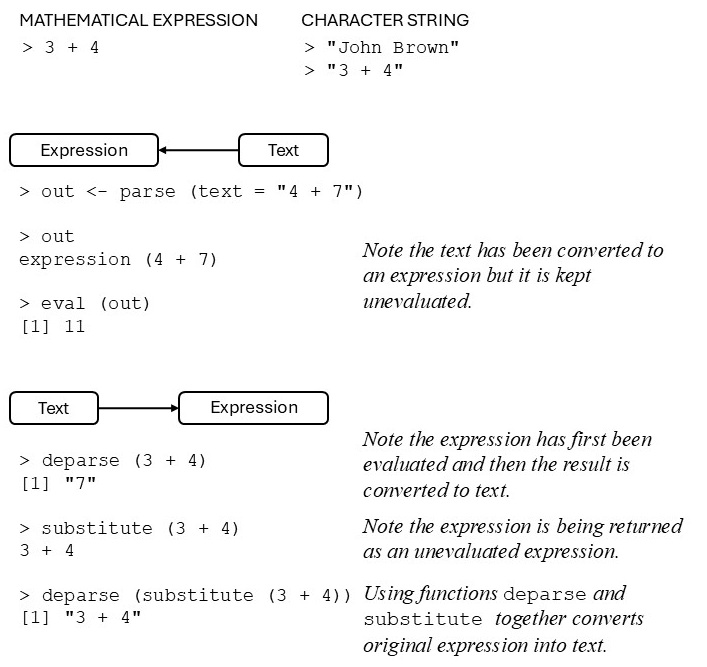

# Writing functions in R {#functions}

Although we have already written various functions in R, in this chapter the writing of R functions will be approached systematically.

##	General
A good way to learn about functions or to write a new function is to look at existing ones. As an example consider that we would like to write a function to implement a novel plotting procedure. So we start by taking a look at the existing `plot` function. 


``` r
plot
#> function (x, y, ...) 
#> UseMethod("plot")
#> <bytecode: 0x000002aca2980380>
#> <environment: namespace:base>
```

This is not very helpful so we give the instruction:


``` r
methods(plot)
#>  [1] plot.acf*           plot.data.frame*   
#>  [3] plot.decomposed.ts* plot.default       
#>  [5] plot.dendrogram*    plot.density*      
#>  [7] plot.ecdf           plot.factor*       
#>  [9] plot.formula*       plot.function      
#> [11] plot.hclust*        plot.histogram*    
#> [13] plot.HoltWinters*   plot.isoreg*       
#> [15] plot.lm*            plot.medpolish*    
#> [17] plot.mlm*           plot.ppr*          
#> [19] plot.prcomp*        plot.princomp*     
#> [21] plot.profile*       plot.profile.nls*  
#> [23] plot.R6*            plot.raster*       
#> [25] plot.spec*          plot.stepfun       
#> [27] plot.stl*           plot.table*        
#> [29] plot.ts             plot.tskernel*     
#> [31] plot.TukeyHSD*     
#> see '?methods' for accessing help and source code
```

If we decide to take a look at `plot.default` we can do so by


``` r
plot.default
#> function (x, y = NULL, type = "p", xlim = NULL, ylim = NULL, 
#>     log = "", main = NULL, sub = NULL, xlab = NULL, ylab = NULL, 
#>     ann = par("ann"), axes = TRUE, frame.plot = axes, panel.first = NULL, 
#>     panel.last = NULL, asp = NA, xgap.axis = NA, ygap.axis = NA, 
#>     ...) 
#> {
#>     localAxis <- function(..., col, bg, pch, cex, lty, lwd) Axis(...)
#>     localBox <- function(..., col, bg, pch, cex, lty, lwd) box(...)
#>     localWindow <- function(..., col, bg, pch, cex, lty, lwd) plot.window(...)
#>     localTitle <- function(..., col, bg, pch, cex, lty, lwd) title(...)
#>     xlabel <- if (!missing(x)) 
#>         deparse1(substitute(x))
#>     ylabel <- if (!missing(y)) 
#>         deparse1(substitute(y))
#>     xy <- xy.coords(x, y, xlabel, ylabel, log)
#>     if (is.null(xlab)) 
#>         xlab <- xy$xlab
#>     if (is.null(ylab)) 
#>         ylab <- xy$ylab
#>     if (is.null(xlim)) 
#>         xlim <- range(xy$x[is.finite(xy$x)])
#>     if (is.null(ylim)) 
#>         ylim <- range(xy$y[is.finite(xy$y)])
#>     dev.hold()
#>     on.exit(dev.flush())
#>     plot.new()
#>     localWindow(xlim, ylim, log, asp, ...)
#>     panel.first
#>     plot.xy(xy, type, ...)
#>     panel.last
#>     if (axes) {
#>         localAxis(if (is.null(y)) 
#>             xy$x
#>         else x, side = 1, gap.axis = xgap.axis, ...)
#>         localAxis(if (is.null(y)) 
#>             x
#>         else y, side = 2, gap.axis = ygap.axis, ...)
#>     }
#>     if (frame.plot) 
#>         localBox(...)
#>     if (ann) 
#>         localTitle(main = main, sub = sub, xlab = xlab, ylab = ylab, 
#>             ...)
#>     invisible()
#> }
#> <bytecode: 0x000002aca4c1bd58>
#> <environment: namespace:graphics>
```

Since our new plotting method is aimed at categorical data we decide rather to take a look at `plot.factor`.   But this is an asterisked function and hence is not visible:


``` r
plot.factor
#> Error: object 'plot.factor' not found
```

Asterisked functions can be inspected using the following method:


``` r
getAnywhere(plot.factor)
#> A single object matching 'plot.factor' was found
#> It was found in the following places
#>   registered S3 method for plot from namespace graphics
#>   namespace:graphics
#> with value
#> 
#> function (x, y, legend.text = NULL, ...) 
#> {
#>     if (missing(y) || is.factor(y)) {
#>         dargs <- list(...)
#>         axisnames <- dargs$axes %||% if (!is.null(dargs$xaxt)) 
#>             dargs$xaxt != "n"
#>         else TRUE
#>     }
#>     if (missing(y)) {
#>         barplot(table(x), axisnames = axisnames, ...)
#>     }
#>     else if (is.factor(y)) {
#>         if (is.null(legend.text)) 
#>             spineplot(x, y, ...)
#>         else {
#>             args <- c(list(x = x, y = y), list(...))
#>             args$yaxlabels <- legend.text
#>             do.call("spineplot", args)
#>         }
#>     }
#>     else if (is.numeric(y)) 
#>         boxplot(y ~ x, ...)
#>     else NextMethod("plot")
#> }
#> <bytecode: 0x000002aca66a69a8>
#> <environment: namespace:graphics>
```


(a)	How are default values assigned to arguments of functions?

(b)	What is the default behaviour of  `plot.factor()`?

(c)	What tasks can be achieved with `pmatch()` and what is understood by partial matching? What will happen if `plot.factor()` is called with (i) `legend.text = 'AA=Agecat'`;  (ii) `leg = 'AA=Agecat'`? Explain.

(d)	Discuss the usage of `missing()`.

(e)	Give an example of the usage of the function `stop(message= " ")`.

(f)	Give an example of the usage of the function `warning(message= " ")`.

(g)	What is the usage of the function `warnings()`?

(h)	Why can functions be called without specifying any arguments e.g. `q()`? 

(i)	If the body of a function consists only of a single instruction it is not necessary to enclose it with braces.

(j)	The convention is to use the last evaluated statement as a function’s return value. If several objects are to be returned gather them in a list.

(k)	The function `return()` with a single object or a list of objects is useful to interrupt a function at some intermediate stage and return an object or a list of objects at that particular stage. This is usually done when a function is under development.

(l)	Sometimes there is no meaningful value to return e.g. when a function is written primarily to produce some plot. In cases like this the function `invisible()` can be used as the last statement of the function. As an example of the usage of `invisible()` give the following instructions:


``` r
boxplot(rnorm(100), plot = TRUE)
```


``` r
boxplot(rnorm(100), plot = FALSE)
#> $stats
#>            [,1]
#> [1,] -2.4133647
#> [2,] -1.0989645
#> [3,] -0.1852800
#> [4,]  0.4397061
#> [5,]  1.6786131
#> 
#> $n
#> [1] 100
#> 
#> $conf
#>             [,1]
#> [1,] -0.42838996
#> [2,]  0.05782995
#> 
#> $out
#> [1]  3.047846 -3.733350
#> 
#> $group
#> [1] 1 1
#> 
#> $names
#> [1] "1"
```

Now look at the end of function `boxplot.default()` to see how `invisible()` has been implemented.

(m)	Libraries (packages) of R functions.  Attaching and detaching libraries to the search path. (Revise Chapter \@ref(intro))

(n)	Creating a new function using scripts or `fix()`. (Revise Chapter \@ref(intro))

(o)	Editing an existing function using scripts or `fix()`. (Revise Chapter \@ref(intro)) 

(p)	Note that when writing a function a line can be interrupted at any place and be continued on a next line. *<span style="color:#FF9966">Warning:  Be careful not to put the break point where it marks the completion of an executable statement.</span>* Explain.

##	Writing a new function

Determining the indices of elements in a vector or matrix that meet a certain condition: the function `where()`

(a)	Write the following function: 


``` r
where <- function(x, cond)
{ # Argument cond must evaluate to a logical value
     if(!is.matrix(x))
       seq(along = x)[cond]
     else matrix(c(row(x)[cond], col(x)[cond]), ncol = 2)
}
```

(b)	Inspect the *airquality* data set using the command `str(airquality)`.

(c)	Use the `where()` function to find the indices of (i) the `NA`s, (ii) the maximum value  and   (iii) the minimum value in the airquality data set.

(d)	Repeat (b) using the built-in function `which()`.

## Checking for object name clashes

(a)	What happens if an R object is given the same name as an existing object?

(b)	Discuss the usages of the functions `apropos()`, `conflicts()`, `find()` and  `match()` for the naming of objects.

(c)	Remember that when a function is called the R evaluator first looks in the *<span style="color:#3399FF">global environment</span>* for a function with this name and subsequently in each of the attached packages or date bases in the order shown by `search()`. The evaluator generally stops searching when the name is found for the first time. If two attached packages have functions with the same name one of them will *<span style="color:#FF9966">mask</span>* the object in the other.  For example, the function `gam()` exists in two packages: `gam` and `mgcv`. If both were attached the command  


``` r
library (mgcv)
#> Loading required package: nlme
#> This is mgcv 1.9-3. For overview type 'help("mgcv-package")'.
library (gam)
#> Loading required package: splines
#> Loading required package: foreach
#> Loaded gam 1.22-6
#> 
#> Attaching package: 'gam'
#> The following objects are masked from 'package:mgcv':
#> 
#>     gam, gam.control, gam.fit, s
find("gam")
#> [1] "package:gam"  "package:mgcv"
```

<div style="margin-left: 25px; margin-right: 20px;">
will return both version.
</div>

(d)	The operator `::` can be used to access the intended version of `gam()` by using the call  `mgcv::gam()`  or `gam::gam()`.

(e)	When writing R packages the *<span style="color:#3399FF">namespace</span>* of the package provides another mechanism for ensuring that the correct version of a function is used. Note in this regard that the operator `:::` can be used to access objects that are not exported.

## Returning multiple values

### Exercise

::: {style="color: #80CC99;"}

Write an R function that returns the mean, median, variance, minimum, maximum and coefficient of variation of a numeric vector of sample data. The different components must be accessible by name. Test your function with the value of `rnorm(1000)`. *Hint*: Use the construct `list (mean = ..., median = ..., ...)`.

:::

##	Local variables and evaluation environments

(a)	Where is an object stored that is created by a script or `fix()`?

(b)	Where are local objects (objects that are created during the execution of a function) stored?

(c)	Explain how the evaluation environment works.

(d)	What is understood by the *<span style="color:#3399FF">global environment</span>*?

(e)	Study the R help-file w.r.t. the operator `<<-`.  When is it useful to use this operator?  What are the dangers inherent to this operator?

(f)	What is understood by the scope of an expression or function? 

The symbols which occur in the body of a function can be divided into three classes: *<span style="color:#FF9966">formal parameters</span>*, *<span style="color:#FF9966">local variables</span>* and *<span style="color:#FF9966">free variables</span>*. The formal parameters of a function are those appearing within the parentheses denoting the argument list of the function. Their values are determined by the process of *<span style="color:#FF9966">binding</span>* the actual function arguments to the formal parameters. Local variables are created by the evaluation of expressions in the body of the functions. Variables which are neither formal parameters nor local variables are called free variables. Free variables become local variables when they are assigned to. Consider the following function definition.


``` r
fun <- function(datvec) {
          mean <- mean(datvec)
          print(mean)
          plot(datvec)
          plot(Traffic)
       }
```

In this function, `datvec` is a formal parameter, the object `mean` on the left-hand of the assignment symbol is a local variable (not to be confused with the function `mean()` on the right-hand side of the assignment symbol) while `Traffic` is a free variable. In R the free variable bindings are resolved by first looking in the *<span style="color:#3399FF">environment</span>* in which the function was created. This is called *<span style="color:#FF9966">lexical scope</span>*. 

If the following function call is made from the prompt in the working directory `fun(1:25)` the  formal parameter `datvec` within the body of the function is assigned the value `1:25` (the actual argument) and its mean is assigned to the local object `mean`. If the free parameter `Traffic` is found in the *<span style="color:#3399FF">global environment</span>* or in a data base on the search path the required graph will be created else an error message will be sent to the console. Perform the above call. 

##	Cleaning up

(a)	Study how the function `on.exit()` is used. This function can be used to reset options that are changed during an R-session back to their original values when the session is ended or a function terminates with an error message. It is also convenient for removal of temporary files.

(b)	Study the uses of the functions `.First()` and `.Last()`. 

(c)	Write a function that automatically opens a graph window with a square plot region when an R-session is started.

##	Variable number of arguments: argument `...`

(a)	Consider the following situation: You want to write a function for a complex task. At a particular stage a graph of some intermediate results is to be constructed.  This requires the calling function to contain a call to the hist function. Here is an example of  a chunk of code for executing this task:


``` r
complexfun <- function(datmat,colgraph)
	{ datmat <- scale(datmat) 
       # Several lines of complex code here 
      hist(datmat, col = colgraph)              }
```

A call like `complexfun(rnorm(1000), 'yellow')` can now be executed for the desired result. The problem is that the hist function has several arguments that you would like to be able to access by passing suitable actual values to them through the calling function `complexfun`. Instead of having to resort to provide a complete set of arguments in the argument list of `complexfun` R provides a neat way of addressing this situation: The argument `...` which acts like any other formal argument except that it can represent a variable number of arguments. To see how the argument `...`  works change the above function to:


``` r
complexfun2 <- function(datmat, ... )
 { datmat <- scale(datmat) 
       # Several lines of complex code here 
   hist(datmat, ... )    }
```

Arguments represented by argument `...` in the argument list of hist are passed to hist through the argument `...` appearing in the arguments list of function `complexfun2`:


``` r
complexfun2(datmat = rnorm(1000), col = 'yellow', 
        probability = TRUE, xlim = c(-5,5))
```

(b)	Write a function that will retrieve the maximum length of any of an unspecified number of arguments of a specified mode. This is another example of the use of the `...` argument:


``` r
maxlen <- function (mode.use="numeric", ...) 
  { my.list <- list(...)
    out <- 0
    for(x in my.list) 
      if(mode(x) == mode.use) out <- max(out,length(x))
    out
  }
```

Note that the named argument must be specified as such in the function call:


``` r
maxlen(1:10, 1:15, 1:3, letters)
#> Error in if (mode(x) == mode.use) out <- max(out, length(x)): the condition has length > 1
maxlen(mode.use="numeric", 1:10, 1:15, 1:3, letters)
#> [1] 15
maxlen(1:10, 1:15, 1:3, letters, mode.use="character")
#> [1] 26
maxlen(mode.use="character", 1:10, 1:15, 1:3, letters)
#> [1] 26
```

## Retrieving names of arguments: functions `deparse()` and `substitute()`

There are many practical situations requiring the conversion of mathematical expressions into character strings (text) or, conversely, requiring the conversion of text into mathematical expressions. The tools (functions) provided in R for achieving such conversions are summarized in Figure \@ref(fig:expression).

<div class="figure">

<p class="caption">(\#fig:expression)Converting text into mathematical expression or mathematical expressions into text.</p>
</div>
