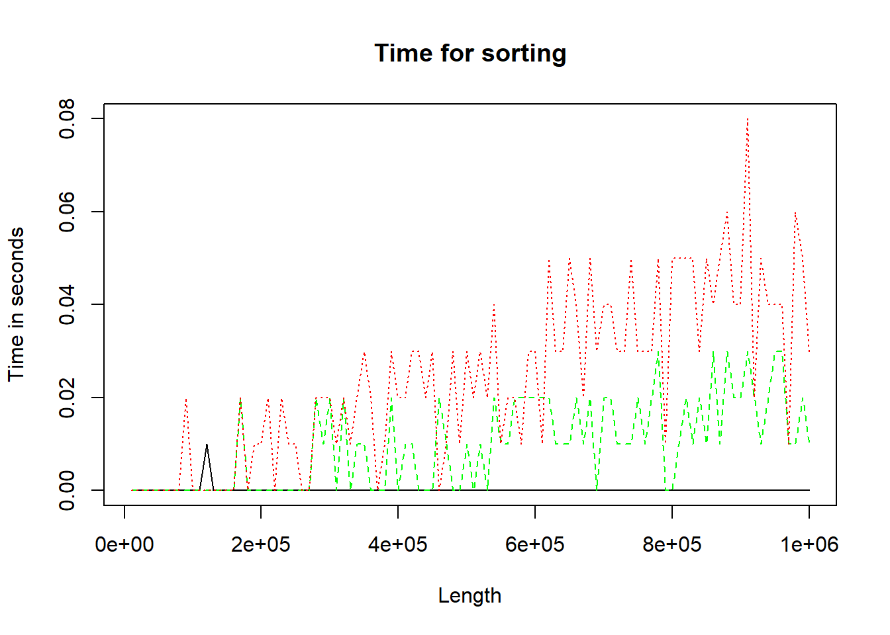
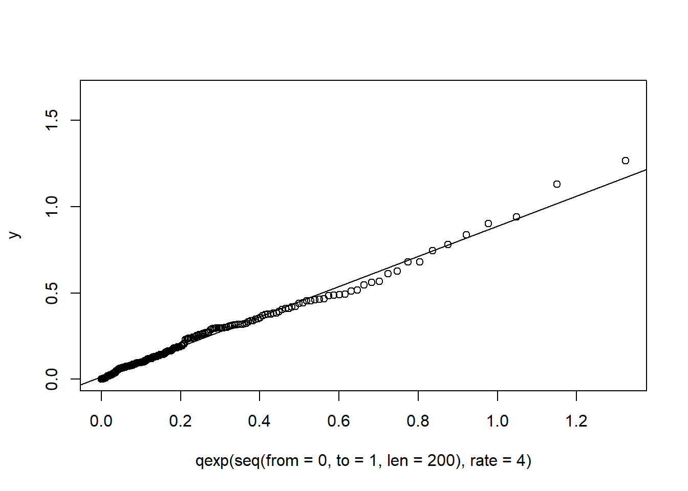
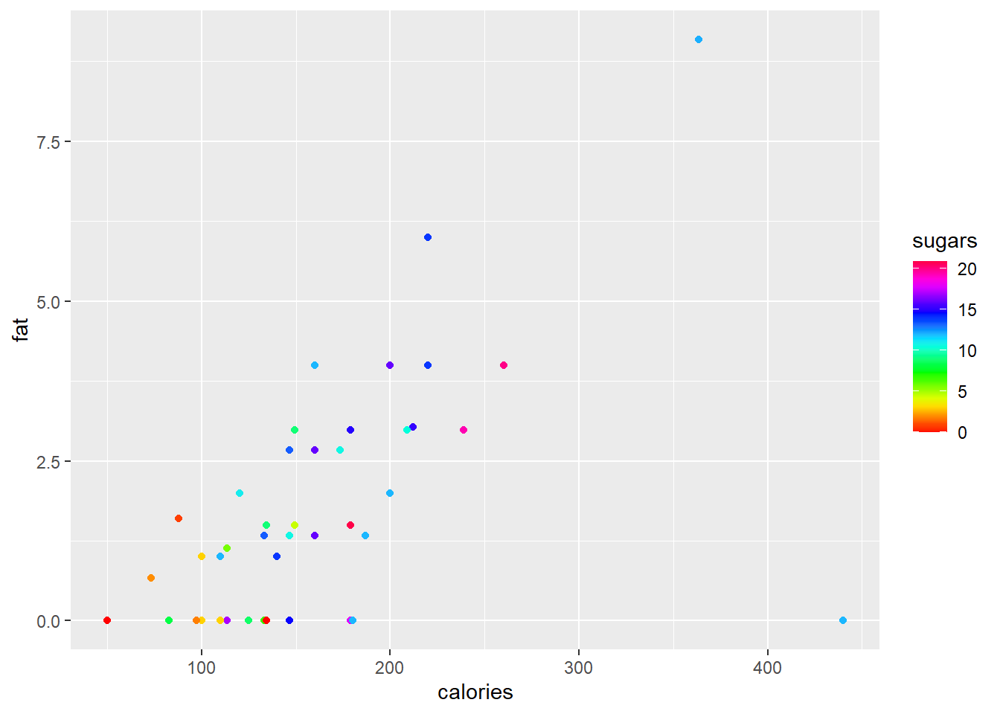
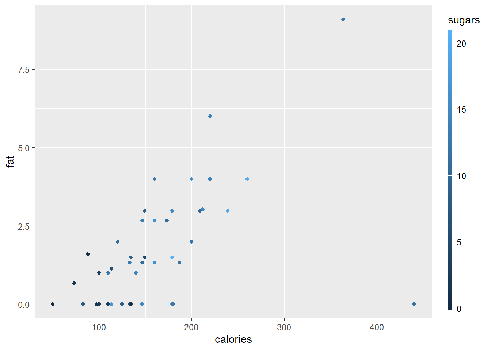

# R graphics: Round II {#graphics2}

R offers several different types of graphics: *<span style="color:#FF9966">grid</span>* graphics is contained in package `grid`; the package `lattice` contains *<span style="color:#FF9966">trellis</span>* graphics; the package `ggplot2` introduces *<span style="color:#FF9966">ggplot</span>* graphics to be implemented by the function `ggplot()`.  In this chapter, further aspects of what is known as *traditional R graphics* are studied before moving on to ggplot graphics.

## Graphics parameters

(a)	Study the help file of `par()`. Execute `par()` to obtain a list of all the current values of the graphical parameters. 

(b)	How is `par()` used to obtain the current setting of a specific graphics parameter e.g. the parameter `fin`?


``` r
par("fin")
#> [1] 6.999999 4.999999
```

(c)	How is `par()` used to change a graphics parameter e.g. `mfrow`?

(d)	How do you reset the changed values to their original values? Note the `no.readonly` argument of `par()`. *Hint*:  Study the following instructions and there effects carefully:


``` r
par('col')
#> [1] "black"
```

<div style="margin-left: 25px; margin-right: 20px;">
The current colour for graphics is "black".
</div>


``` r
temp <- par(col = "blue")
```

<div style="margin-left: 25px; margin-right: 20px;">
Change colour for graphics to "blue".
</div>


``` r
temp
#> $col
#> [1] "black"
```

<div style="margin-left: 25px; margin-right: 20px;">
Temp is a list of parameter(s) **BEFORE** change was made.
</div>


``` r
par('col')
#> [1] "black"
```

<div style="margin-left: 25px; margin-right: 20px;">
Shows that the colour for graphics was indeed changed to "blue". 
</div>

(e)	It is sometimes useful to use `par (ask = TRUE)` to instruct R to ask you whether an existing graph should be replaced by a new one.

(f)	Draw a histogram of variable Ozone in the data set `airquality` where each class interval is randomly represented by a different colour. What happened to the `NA` values?

## Layout of graphics

(a)	Review Figure \@ref(fig:figRegion).  Note the parameters that are discussed there.

(b)	Multiple figures on one page:  How do the graphical parameters `mfg` and `mfrow` or `mfcol` differ?  What are represented in the R data sets `ldeaths`, `mdeaths` and `fdeaths`? Use  `mfg` and `mfrow`  to obtain Figure \@ref(fig:fmdeaths). *Hint*: The graphics parameters `mfg` and `mfrow` are used together.

<div class="figure">

<p class="caption">(\#fig:fmdeaths)Plots of the fdeaths and mdeaths data sets.</p>
</div>


``` r
par (mfrow = c(3, 2), mfg = c(1, 1))
```

<div style="margin-left: 25px; margin-right: 20px;">
The `mfrow` setting reserves three rows and two columns for graphics to be filled row-wise. The `mfg` setting specifies that the next graph will be placed in the position defined by row one column one. Once this graph has been constructed the instruction
</div>


``` r
par (mfg = c(1, 2))
```

<div style="margin-left: 25px; margin-right: 20px;">
will result in the next graph to appear in the position defined by row one and column two. Next we need the instruction
</div>


``` r
par (mfrow = c(3, 1), mfg = c(2, 1))
```
  
<div style="margin-left: 25px; margin-right: 20px;">
requesting a graph window having three rows and one column with the next graph to appear at position row two (only one column in row two).
</div>

(c)	Note how the meaning of the margins changes when more than one figure is drawn on a page to make provision for an *<span style="color:#FF9966">outer margin</span>* surrounding all figures in addition to the *<span style="color:#FF9966">margin</span>* surrounding each separate figure.

(d)	Study how the functions `split.screen()`, `screen()` and `close.screen()` work as explained in the help facility.

(e)	Study the usage of the function `layout()` in detail for more complicated arrangements of the graph window. An example of its usage is deferred until later in the chapter.

## Low-level plotting commands

*	The functions in Table \@ref(tab:lowlevelPlotFuncs) are used to edit existing graphs.  
*	Study these functions carefully.
*	Study how the right mouse button is used with R graphs.
*	Most plotting tasks require some combination of high-level and low-level plotting commands.

Table: (\#tab:lowlevelPlotFuncs) Low-level plotting functions.

| *<span style="color:#CC99FF">Function</span>* | *<span style="color:#CC99FF">Description</span>*  |
| ------ | --------------- | 
| `abline()`   |	Add regression lines to a plot; Also for adding a vertical and horizontal lines to a plot |
| `arrows()`   |	Draw arrow on plot |
| `axis()`     |	Add custom axis to plot |
| `box()`      |	Draw box around plot |
| `chull()`    |	Compute a convex hull |
| `jitter()`   |	Add a small amount of noise |
| `legend()`   |	Add a legend to a plot |
| `lines()`    |	Add lines to a plot |
| `mtext()`    |	Write text in margins |
| `points()`   |	Add points to a plot |
| `polygon()`  |	Draw and shade polygons |
| `rug()`      |	Add data-based marks to an axis |
| `segments()` |	Draw disconnected line segments |
| `symbols()`  |	Draw symbols on a plot |
| `text()`     |	Add text to a plot |
| `title()`    |	Add titles or axis labels to a plot |
	
## Using the plotting commands

### Multiple lines or groups of points on the same graph {#matplot}

Study how the function  `matplot()` works. Note the functions `matlines()` and `matpoints()`. Study and execute the following example:


``` r
my.func <- function () 
{ times <- matrix(0,100,3)
  for(i in 1:100)
    {  n <- i * 10000
       s1 <- 1:n
       s2 <- sample(n)
       s3 <- rnorm(n)
       times[i,1] <- system.time(sort(s1))[1]
       times[i,2] <- system.time(sort(s2))[1]
       times[i,3] <- system.time(sort(s3))[1]
     }
  matplot(x = (1:100)*10000, y= times, type = "l", lty = 1:3,
          col = c("black", "green", "red"), xlab = "Length",  
          ylab = "Time in seconds", main = "Time for sorting")  
}
my.func()
```

<div class="figure">

<p class="caption">(\#fig:matplotExample)Three methods of performing sort.</p>
</div>

###	Multiple lines or groups of points on the same graph but the lines (points) are not all the same length (number) {#multipleLines}

What technique must be followed?  First study the `Cars93` data set in package `MASS`; then study and execute the code below. Experiment with different values of `spar`.


``` r
my.func <- function (spar = 0.9)
{ require (MASS)                             # What is the effect of require()?
  oldstate <- par (no.readonly = TRUE)       # Describe object 'oldstate'
  on.exit (par (oldstate))                   # Of what use is on.exit()?

  cargrp <- Cars93[ , "Type"]
  price <- Cars93[ , "Price"]
  mpg.city <- Cars93[ , "MPG.city"]
  mpg.highway <- Cars93[ , "MPG.highway"]
  plot(price, mpg.city, type = "n", ylim = c(0, max(mpg.city)), 
       main = "Fuel Consumption vs Price for City Drive", xlab = "Price", 
       ylab = "Miles per Gallon in City")
  jj <- 0
  for(i in levels(cargrp))
    {  jj <- jj+1
       lines (smooth.spline (price[cargrp==i], mpg.city[cargrp==i], spar=spar),
              lty = jj, col = jj, lwd=2)
    }
  plot(price, mpg.highway, type = "n", ylim = c(0, max(mpg.highway)), 
       main = "Fuel Consumption vs Price for Highway Drive", xlab = "Price", 
       ylab = "Miles per Gallon on Highway")
  jj <- 0
  for(i in levels(cargrp))
    {  jj <- jj+1
       lines (smooth.spline (price[cargrp==i], mpg.highway[cargrp==i], 
                             spar = spar),
              lty = jj, col = jj, lwd = 2)
    }
}
my.func ()
#> Loading required package: MASS
```

<div class="figure">

<p class="caption">(\#fig:diffLengths-1)Plotting multiple lines of different lenghts</p>
</div><div class="figure">

<p class="caption">(\#fig:diffLengths-2)Plotting multiple lines of different lenghts</p>
</div>

(a)	Explain the output generated by the above function call.

(b)	What technique can also be followed in the case of point diagrams?

### Adding legends to a graph {#Legends}

(a)	Study how the function `legend()` and the graphical parameter `usr` work.  Study the code used to obtain Figure \@ref(fig:cargrps).  Revise the `locator()` function.

(b)	Use the facts that one USA gallon of liquid is equal to $0.83267$ UK (imperial) gallon of liquid and one mile is equal to $1.6093$ kilometres to obtain a figure similar to Figure 10.4.1 but with a kilometres per litre scale on the right-hand side that corresponds to the miles per gallon (USA) on highway scale on the left-hand side.


``` r
my.func <- function()
{ require (MASS)  
  oldstate <- par (no.readonly = TRUE) 
  on.exit (par (oldstate)) 

  cargrp <- Cars93[ , "Type"]
  price <- Cars93[ , "Price"]
  mpg.city <- Cars93[ , "MPG.city"]
  plot(price, mpg.city, type = "n", ylim = c(0, max(mpg.city)), 
       main = "Fuel Consumption vs Price for City Drive", xlab = "Price", 
       ylab = "Miles per Gallon in City")
  char <- substring (as.character (cargrp), 1, 2)
  text (x = price, y = mpg.city, labels = char, pos = 1, cex = 0.75)
  labs <- paste (substring (levels (cargrp), 1, 2), levels(cargrp), sep=":  ")
  legend(x = 40, y = 42, legend = labs)
}
my.func ()
```

<div class="figure">

<p class="caption">(\#fig:cargrps)Illustrating adding a legend to a plot.</p>
</div>

### Multiple plots with identical axes {#multAxes}

How can various graphs with identical axes be obtained?  Show how this can be done by graphing the sorting time for the three procedures considered in \@ref(matplot) above in three separate plots in the same graph window.

### Providing a single legend for multiple plots

Suppose there were two sorting methods for each of the three situations described in\@ref(matplot) and \@ref(multAxes) above. How can the three graphs be provided with a single legend without the legend appearing in one of the graphs?  Explain in detail.

### Changing the plotting character: common plotting characters in R

Note the use of graphical parameters `pch` and `mkh`. What plotting characters are available?  Study the help file of `par()` and `points()`. Study the plotting characters displayed in Figure \@ref(fig:pch) and the code used to produce the figure. How can plotting characters be made to appear in legends?


``` r
plot (x = rep(1:10, 2), y = rep (c(1,2), c(10,10)), pch = 0:19, cex = 2, 
      pty = "p", ylim = c(0,3), xlab = "", ylab = "", xaxt = "n", yaxt = "n")
```

<div class="figure">

<p class="caption">(\#fig:pch)Some common plotting characters available in R.</p>
</div>

###	Changing the colour in plots

The graphical parameter `col` allows the user to specify the colour(s) in number format as given in Figure \@ref(fig:col). The full list of named colours can be obtained with the command `colors()` in the Console.

Alternatively, the colour can be specified by hue, saturation and value with `hsv (h = , s = , v = )`, hue, chroma and luminance with `hcl (h = , c = , l = )` or red, green and blue with `rgb (red = , green = , blue = )`. The `rgb()` function has an argument `maxColorValue` with default value `1` which indicates the range known as the gamma-compressed values. Typically, the red, green and blue values range between 0 and 255 or video display or 8-bit graphics. To select a specific shade of light blue, the following command can be used:


``` r
plot (ldeaths, col = rgb (red = 167, green = 227, blue = 227, 
                          maxColorValue = 255))
```

<div class="figure">

<p class="caption">(\#fig:colExample)Colour selection with rgb().</p>
</div>

The output of the `rgb()` function is in the hexidemical colour number format, e.g. "#A7E3E3". The function `col2rgb()` accepts a colour name, hexadecimal colour number format or colour number and provides the red, green and blue values in the 0 to 255 range.

<div class="figure">

<p class="caption">(\#fig:col)The default colour palette available in R.</p>
</div>
 
A sequence of $n$ colours can be generated with the function `colorRampPalette()`.  As an example, the colour vector used for plotting in Figure \@ref(fig:colRamp) were generated with the call `colorRampPalette (c ("red", "green", "white", "gold"))(20)`. Study how the following instructions generate colour sequences: `rainbow()`, `heat.colors()`, `terrain.colors()`, `topo.colors()`, `cm.colors()`.

<div class="figure">

<p class="caption">(\#fig:colRamp)User specified colour sequence with colorRampPalette().</p>
</div>
 
###	Logarithmic axes

The `log()` function and the `log` argument of the `plot()` function are useful in this regard. The `log` argument of the `plot()` function can be specified as `log="x"`; or `log="y"`; or `log="xy"` depending on whether the x-axis, the y-axis, or both axes should be plotted logarithmically.

### Graphs with character strings as the ‘scale’ on the axis

Figure \@ref(fig:catAxis) illustrates how user defined character strings can appear as calibrations on an axis. Furthermore, this figure illustrates several techniques to fine-tune plots. Study the code resulting in Figure \@ref(fig:catAxis) in detail.


``` r
my.func <- function()
{ old.state <- par(no.readonly = TRUE)
  on.exit (par (old.state))
  area <- state.x77[, "Area"]
  income <- state.x77[, "Income"]
  area.grp <- cut(area, c(0, quantile (area, c(1/3, 2/3, 1))),
                  labels = c("Small", "Medium", "Large"))
  income.grp <- cut(income, c(0, quantile (income, c(1/2, 1))),
                    labels = c("Below Median", "Above Median"))
  mns <- tapply(state.x77[, "Illiteracy"], list(area.grp, income.grp), mean)
  par(mfrow = c(1, 2))
  plot(c(0.8, 3.2), range(mns), type = "n", xaxt = "n", xlab = "Area Group", 
       ylab ="Mean Illiteracy", sub = "Function plot() used")
  axis(side = 1, at = 1:3, labels = levels(area.grp))
  lines(1:3, mns[, 1])
  lines(1:3, mns[, 2], lty = 2)
  par(usr = c(0, 1, 0, 1))
  legend(0.56, 0.96, lty = c(1,2), legend = levels(income.grp), cex= 0.5)
  text(0.63, 0.98, adj = 0, "Income Group", cex = 0.5)
	interaction.plot(area.grp, income.grp, state.x77[,"Illiteracy"], 
	                 xlab = "Area Group", ylab = "Mean Illiteracy", 
	                 sub = "Interaction.plot used", lty = 1:2, xtick = TRUE, 
	                 legend = FALSE)
  par(mfrow = c(1,1))
  par(new = T)
  plot(1:10, 1:10, type="n", xlab="", ylab="",axes = FALSE)
  title(main = "Illiteracy vs Size for States grouped by Income")
}
my.func ()
```

<div class="figure">

<p class="caption">(\#fig:catAxis)Figures with character strings as axis calibrations and other enhancements to plots.</p>
</div>
 
###	Customizing bar charts and histograms

(a) How can every bar in a bar chart be represented in a different colour and be given separate headings? 

(b)	How can only a line graph without any colours be obtained?  

(c)	How can a probability density function be superimposed on a histogram?  

(d)	How can bar charts be provided with user-defined axes?  

Use the `Cars93` data set to answer the above four questions by constructing a figure similar to the one shown in Figure \@ref(fig:BarHist). Note: In the Mean MPG plot not all car types are used. If a factor variable is subsetted the original levels will be kept although some of them might not occurr. Hence it might be necessary to create a new factor variable with only the levels that are needed by using `factor()`.

<div class="figure">

<p class="caption">(\#fig:BarHist)Enhanced bar charts and histograms.</p>
</div>


###	Three-dimensional graphical displays

(a) Study how the function `persp()` works.

(b) Work through the example code that creates Figure \@ref(fig:persp).  Apart from the arrow that points to the maximum, different colours must be used to highlight the different aspects of the graph.

(c)	Provide horizontally and vertically rotated views of the 3D plot.


``` r
my.func <- function () 
{ x <- seq(-10, 10, length= 30)
  y <- x
  ff <- function(x,y) { r <- sqrt(x^2+y^2); 10 * sin(r)/r }
  z <- outer(x, y, ff)
  z[is.na(z)] <- 1
  op <- par(bg = "white")
#  persp(x, y, z, theta = 30, phi = 30, expand = 0.5, col = "lightblue")
  res <- persp(x, y, z, theta = 30, phi = 30, expand = 0.5, col = "lightblue", 
               ltheta = 120, shade = 0.75, ticktype = "detailed", xlab = "X", 
               ylab = "Y", zlab = "Z" ) 
  print (round(res, 3))
  
  #--- Add to existing persp plot : ---
  #--- Function trans3d() -------------
 	trans3d <- function(x,y,z, pmat) 
 	{
 	  tr <- cbind(x,y,z,1) %*% pmat
    list(x = tr[,1]/tr[,4], y = tr[,2]/tr[,4])
  }
  # ----------------------------------
  z1 <- ff(1e-10, 1e-10)
  transfrm <- trans3d (c(0,-2.5), c(0,5), c(z1,z1), res)
  arrows(transfrm$x[1], transfrm$y[1], transfrm$x[2], transfrm$y[2], 
         length = 0.1, code = 1)
  text(transfrm$x[2], transfrm$y[2]+0.02, "Maximum occurs here")
  return(z1)
}
my.func()
```

<div class="figure">

<p class="caption">(\#fig:persp)Annotated 3D perspective plot.</p>
</div>

```
#>       [,1]   [,2]   [,3]   [,4]
#> [1,] 0.087 -0.025  0.043 -0.043
#> [2,] 0.050  0.043 -0.075  0.075
#> [3,] 0.000  0.074  0.042 -0.042
#> [4,] 0.000 -0.273 -2.890  3.890
#> [1] 10
```
 
###	Diagrams

Use R to draw a simple flow diagram.  The diagram must contain at least one rectangle, one square, one circle and one triangle.  Furthermore, there must be straight and curved lines as well as text describing the different elements.  *Hint*:  Study how the functions `arrows()`, `lines()`, `text()` and `symbols()` work as discussed in their respective help facilities.

###	Annotating graphics with special symbols

Construct a graph of a $normal(0, 1)$ density function. Give as a title to the plot the expression "Density of a normal random variable with $\mu = 0$ and $\sigma^2 = 1$."  *Hint*: Consult the help file of `plotmath()`. Within the plot draw an arrow to the density and label it $\frac{1}{\sqrt{2 \pi}} e^{-\frac{1}{2}x^2}$.

## Quantile plots {#qqplot}

Consider the histogram of weight in Figure \@ref(fig:BarHist). Does this variable follow a normal distribution? A normal quantile plot, shows the observations vs the corresponding quantiles of a standard normal distribution. If the observations correspond to a normal distribution, this will approximately form a straight line. Use the `qqline()` function to add a straing line to the plot.


``` r
qqnorm (Cars93$Weight)
qqline (Cars93$Weight)
```


In a similar manner, quantile-quantile plots for other probability distributions can be constructed with the function `qqplot()`.


``` r
y <- rexp(200, rate=4)
qqplot (qexp (seq (from = 0, to = 1, len = 200), rate=4), y)
qqline(y, distribution = function(p) qexp(p, rate=4))
```



## Estimating a density {#density}

The histograms in Figure \@ref(fig:histDiffBins) show 200 observations generated, 100 from a $normal (9,2^2)$ and 100 from a $normal (13,1)$ distribution. Histograms are very sensitive to the choice of the number of bins and the starting values of the bins. The wider bins do not show any evidence of a bimodal distribution. Using the smaller bins, the location of the bins can suggest either a bimodal or trimodal distribution. 

<div class="figure">

<p class="caption">(\#fig:histDiffBins)Histograms with different bin sizes and bin locations of the same normal mixture data set.</p>
</div>

One possible solution to the bin selection problem for histograms is the Average Shifted Histogram (ASH). First we define a *<span style="color:#FF9966">density histogram</span>*. Since we aim to estimate the density (which integrates to one) a density histogram is normalised such that the area in the histogram is equal to one.

Consider a set of bins $B_k=[b_k, b_{(k+1)})$ with fixed bin width $λ=b_{(k+1)}-b_k$  $∀ k$, then the density histogram is defined as $\hat{f} = \frac{1}{N\lambda} \sum_{i=1}^{N}{I_{[b_k,b_{k+1})}(x_i)}$ for $x∈B_k$. Consider a collection of $m$ histograms $\hat{f}_1, \hat{f}_2, \dots, \hat{f}_m$ each with bin width $h$, but with respective bin origins $b_{01}=0, b_{02}=\frac{h}{m}, b_{03}=\frac{2h}{m}, \dots, b_{0m}=\frac{(m-1)h}{m}$. The *<span style="color:#FF9966">average shifted histogram</span>* is defined as $\hat{f}_{ASH} = \frac{1}{m} \sum_{i=1}^{m}{\hat{f}_i}$.


``` r
ASH <- function (x, b0 = 1, bk = 15, h = 0.5, m = 5) # h=lambda
{
  Bvec <- as.vector ((bk - b0)/h+2, "list")
  fhat <- matrix (nrow = m, ncol = (bk-b0)/h+1) 
  for (i in 1:m)
    { Bvec[[i]] <- seq (from = b0+(i-1)*h/m, to = bk+h+(i-1)*h/m, by = h)
      fhat[i,] <- hist (x, breaks = Bvec[[i]], right = T, plot = F)$density
    }
  fhat.ASH <- apply(fhat, 2, mean)
  x.vec <- seq (from = b0, to = bk+h,length = length(fhat.ASH))
  plot (x.vec, fhat.ASH, type="l")
}
ASH(x, m=20, h=1, b0=-2, bk=18)
```

<div class="figure">

<p class="caption">(\#fig:ASH)Average shifted histogram of normal mixture data.</p>
</div>

The ASH is given in Figure \@ref(fig:ASH) A more sophisticated method for estimating a density is with a kernel density estimate. The density histograms is replaced by a smooth kernel function, leading to a smoother estimate. The R function `density()` provides a variety of kernels. Using the default kernel, a Gaussian distribution, the kernel density estimate is given in Figure \@ref(fig:densityExample).


``` r
plot(density(x), type="l")
```

<div class="figure">

<p class="caption">(\#fig:densityExample)Guassian kernel density estimate of the normal mixture data.</p>
</div>

Experiment with different kernel function and different choices of bandwidth (argument bw) for controlling the amount of smoothing.

## A coplot with two conditioning variables {#coplot}

Consider the `state.x77` data set. In section \@ref(highLevelPlotting) the `coplot()` function was used to construct a plot of `Illiteracy` and `Area` conditional on `Income`. This can be expanded to two conditions, for example plotting `Illiteracy` and `Life expectancy` conditional on `Income` and `Area`. Interpret. The number of panels and overlap of given intervals can be controlled with the arguments number and overlap.


``` r
coplot (state.x77 [,"Illiteracy"] ~ state.x77 [,"Life Exp"] | 
                                   state.x77 [,"Income"] + state.x77 [,"Area"], 
                                number = c(4,3), overlap=c(0,0.2))
```


## Exact distances in graphics

(a) Obtain a random sample of size 50 from a bivariate normal distribution with $n(50,20)$ marginals and a correlation coefficient of 0.90.  

* Present the data in the form of a scatterplot.

* Next, write an R function to perform the following task on the scatterplot:  
    
    *	Choose an arbitrary point and label it “A”.
    
    * Draw a line connecting A to a circle with centre exactly 25mm away from A. The diameter of the circle must be exactly 40mm. 
    * Label the centre point of the circle with a “B”.
    
    * Use a ruler to check the length of the connecting line and diameter of the circle.
    
* Obtain a print copy of the graph and check the lengths again.*Hint*: Study the help file of function `par()`.

(b) Use R to make a ruler calibrated in centimetres from zero to 15 cms.

## Multiple graphics windows in R
	
(a)	Study how the following instructions work to control multiple graphics windows in R:


``` r
dev.new() 
dev.list()	
dev.set()	
dev.next()
dev.cur()	
dev.copy()	
dev.prev()
dev.off()	
dev.ask()	
graphics.off()
```

(b) Study the information that R gives via the execution of `help.search ("graph")`.

## More complex layouts

Study the graphical requirements needed for constructing Figure \@ref(fig:complexLayout) and how to code these requirements.


``` r
my.func <- function () 
{ old.state <- par (no.readonly = TRUE)
 on.exit (par (old.state))
   
 par (omd = c(0, 0.66, 0, 1), mfcol = c(2, 1))
 ts.plot (mdeaths, xlab = "Year", ylab = "Male deaths")
 ts.plot (fdeaths, xlab = "Year", ylab = "Female deaths")

 par (omd = c(0.66, 1, 0, 1), mfcol = c(2, 1), mfg = c(1, 1), new=TRUE)
 hist (mdeaths, xlab = "Male deaths", ylab = "Frequency", main = "")
 hist (fdeaths, xlab = "Female deaths", ylab = "Frequency", main= "")

 par (omd = c(0, 1, 0, 1), mfcol = c(1, 1))
 title ("Line plot and Histogram for male deaths")
   
 par(omd = c(0, 1, 0, 0.5), mfcol = c(1, 1))
 title ("Line plot and Histogram for female deaths")          
}
my.func ()
```

<div class="figure">

<p class="caption">(\#fig:complexLayout)A complex graphics layout.</p>
</div>

## Dynamic 3D graphics in R
	
* Study the R package `rgl`.

* Attach library `rgl` to the search path and then issue the R command `example (plot3d)`. Use the mouse buttons to rotate and zoom the rgl graph.

* Next, issue the R command `example (surface3d)` and interactively explore the 3D figure.

## Animation

Study the following two functions in detail:


``` r
anim1 <- function (sleep = 0.05) 
 { # Press ESC to end animation
   n <- 40
   t <- seq (0, 2*pi, length = n)
   x <- cos(t)
   y <- sin(t)
   for (i in 1:n)
   {  plot.new ()
      plot.window (c(-1, 1), c(-1, 1), asp = 1)
      points (x[i], y[i], pch = 16, cex = 2)
      Sys.sleep(sleep) 
      #Sys.sleep() suspends execution for a given number of seconds
    }
   Recall(sleep) 
 }

anim2 <- function (sleep = 0.01) 
{ for (i in seq (from = 1, to = 3, by = 0.01))
  {  plot.new ()
     plot.window (c (1, 16), c(1, 16), asp = 1)
     arrows(2*i, 2*i, 4*i, 4*i)
     Sys.sleep(sleep)
  }
  Recall(sleep)
}
```

Write an R function to show a wheel with two spokes moving forward with adjustable speed.

##	Exercise {#Ex10}

::: {style="color: #80CC99;"}

(1)	In many real life situations it is necessary to identify an object when only limited information is available. The following problem how such a problem can be empirically investigated.

<div style="margin-left: 25px; margin-right: 20px;">
The function  `persp()` used for constructing Figure \@ref(fig:persp) requires a regular pattern of $x$ and $y$ coordinates.  If such a pattern is not available it is necessary to interpolate e.g. with `interp()` (available in package `akima`) using the available values. 

Use the function `expand.grid()` to create a grid of regularly spaced $x$ and $y$ values and evaluate the “sombrero” function of Figure \@ref(fig:persp) at each of these points.

Now use `sample()` to randomly sample points from that grid and then the `interp()` function to interpolate the values of z throughout the grid.

Finally, use `persp()` to construct a plot of the interpolated values.

What fraction of data is needed in the sample to get a good representation of the true shape of the data. *Hint*: since `persp()` does not accept `NA`s replace `NA`s with the minimum of the non-missing z values.
</div>

(2) Use `locator()` and write a function to allow placing a legend with a pointing device anywhere on an existing plot.

(3) Use the `state.x77` data set to construct a scatterplot of `Illiteracy` as a function of `Income`.  Now construct a second scatterplot of the same data but with the origin on the right-hand side of the x-axis.  In order to complete this task it is necessary that the values on the x-axis increase from the left-hand side to the right-hand side. 

(4)	Consider the following data

|          | Test 1  | Test 2  | Test 3  | Test 4  |
| -------  | --------| ------- | --------| --------| 
| Group A: |	10      | 15      | 30     | 12      |
| Group B: |	125     | 130     | 148    | 115     |

<div style="margin-left: 25px; margin-right: 20px;">
Plot the data of the two groups in the form of two profiles on the same set of axes.  
Plot the data against Test 1, Test 2, Test 3 and Test 4 on the x-axis. 
The scale of the data of Group A must appear on the y-axis on the left-hand side and that of Group B on the y-axis on the right-hand side. A detailed legend must be provided.
</div>

:::

## The package ggplot2

The package `ggplot2` is based on the ideas of @Wickham2010 as described in the paper “A layered grammar of graphics” and makes use of the The Grammar of Graphics by @Wilkenson2005.

<div class="figure">

<p class="caption">(\#fig:ggplotStructure)Layer structure of ggplot2 package.</p>
</div>

In Figure \@ref(fig:ggplotStructure)(a) the components of a *<span style="color:#FF9966">layer</span>* is depicted. The first essential component is the *<span style="color:#FF9966">data</span>* to be represented in the graphic. Together with the data, there needs to be an *<span style="color:#FF9966">aesthetic mapping</span>*, describing which variable is mapped to the x-direction, y-direction, the size, shape, colour, etc. The *<span style="color:#FF9966">statistics</span>* component optionally transforms the data to quantities that needs to be plotted. Typically, the transformation is used to summarise the data. It is possible to map aesthetics to these new variables. The *<span style="color:#FF9966">geometry</span>* defines how each aesthetic is displayed, as points, lines, boxplots, densities, histograms, etc. Each geometry can only display specific aesthetics, for example a point has position, colour, shape and size. Position adjustment is needed in cases where geometric elements overlap, for example using jitter in scatterplots or placing multiple bars stacked or side-by-side in a barplot.

A graphic can consist of several layers, as shown in Figure \@ref(fig:ggplotStructure)(b). According to the grammar of graphics, a *<span style="color:#FF9966">scales</span>* component needs to be specified. The scales are common across layers and describe the mapping of the data to aesthetic attributes such as which colour is associated with which level of a categorical variable. One scale is needed for each aesthetic property used in the layers. In order to place the geometric objects on the plotting plane, a scale is needed. The most commonly used scale is the Cartesian axes, while others such as polar coordinates is also available.

*<span style="color:#FF9966">Faceting</span>* splits the data into small multiples of different subsets of the data set. With this component we identify the variable(s) for splitting and how the splitting should be arranged. *<span style="color:#FF9966">Themes</span>* are not linked to the data but provide instructions on aspects such as titles, labels, fonts, background, gridlines, and legends.

The full specification of all the components in a ggplot, can be very cumbersome. Defaults are specified, for instance for each geometry there is a default statistic and for each statistic a default geometry. We can therefore build our plot stepwise, fine-tuning detailed aspects until the required graphic is obtained.

We will start with some simple plots and then build more complicated graphics. We will use the `cereal` tibble created from the `UScereal` data in package `MASS` (see section \@ref(dplyr)) for illustration.


``` r
library (MASS)
library (tidyverse)
#> ── Attaching core tidyverse packages ──── tidyverse 2.0.0 ──
#> ✔ dplyr     1.1.4     ✔ readr     2.1.5
#> ✔ forcats   1.0.0     ✔ stringr   1.5.1
#> ✔ ggplot2   3.5.2     ✔ tibble    3.3.0
#> ✔ lubridate 1.9.4     ✔ tidyr     1.3.1
#> ✔ purrr     1.1.0     
#> ── Conflicts ────────────────────── tidyverse_conflicts() ──
#> ✖ dplyr::filter() masks stats::filter()
#> ✖ dplyr::lag()    masks stats::lag()
#> ✖ dplyr::select() masks MASS::select()
#> ℹ Use the conflicted package (<http://conflicted.r-lib.org/>) to force all conflicts to become errors
cereal <- tibble (UScereal)
```

###	Barplot
The command 


``` r
ggplot(data = cereal, 
       mapping = aes(x = mfr)) +   
       geom_bar()
```


produces a simple barplot of the `cereal` data with `mfr` on the x-axis and counts of each level in the `bars`.  No position adjustments are made, while the default colour for the bars is used to plot the complete data set on Cartesian axes with the default theme.

We can change the colour of the bars with the command


``` r
ggplot(data = cereal, 
       mapping = aes(x = mfr)) +   
       geom_bar(fill = "gold")
```


Now we add an aesthetic for the bars to be coloured according to the vitamin enrichment, while at the same time, changing the orientation. Note that in the previous example, the fill colour was specified outside of the function `aes()`, while here, it is specified as an aesthetic.


``` r
ggplot(data = cereal, 
       mapping = aes(y = mfr, fill = vitamins)) +   
       geom_bar() 
```


The default is to stack the bars. In order to position the bars side-by-side we use the function `position_dodge()`.


``` r
ggplot(data = cereal, 
       mapping = aes(y = mfr, fill = vitamins)) +   
       geom_bar(position = position_dodge())
```


###	Scatterplot

The simplest call to produce a scatterplot uses the identity statistical transformation with no position adjustment on the complete data set with default size, shape and colour of the plotting characters.


``` r
ggplot(data = cereal, 
       mapping = aes(x = calories, y = fat)) +        
       geom_point()
```


The point colours can be specified either according to a categorical variable, or a spectra based on a continuous variable.


``` r
ggplot(data = cereal, 
       mapping = aes(x = calories, y = fat)) + 
       geom_point(mapping = aes(colour = factor(shelf)))
```


``` r

ggplot(data = cereal, 
       mapping = aes(x = calories, y = fat)) + 
       geom_point(mapping = aes(colour = sugars))
```


A scatterplot smoother can be added to our plot with the function `geom_smooth()`.


``` r
ggplot(data = cereal, 
       mapping = aes(x = calories, y = fat)) + 
       geom_point(mapping = aes(colour = sugars)) +
       geom_smooth()
#> `geom_smooth()` using method = 'loess' and formula = 'y ~
#> x'
```


The smooth function can also be a linear regression line.


``` r
ggplot(data = cereal, 
       mapping = aes(x = calories, y = fat)) + 
       geom_point(mapping = aes(colour = sugars)) +
       geom_smooth(method = "lm")
#> `geom_smooth()` using formula = 'y ~ x'
```


To add different sizes and shapes according to `shelf` and `mfr`, respectively, we need the command


``` r
ggplot(data = cereal, 
       mapping = aes(x = calories, y = fat)) + 
       geom_point(mapping = aes(colour = sugars, 
                                shape = mfr, 
                                size = factor(shelf)))
#> Warning: Using size for a discrete variable is not advised.
```


Finally, since there are multiple observations with zero fat, we want to jitter the observations in the vertical direction with a random amount in the interval $±0.05$.


``` r
ggplot(data=cereal, 
       mapping = aes(x = calories, y = fat)) + 
       geom_point(mapping=aes(colour = sugars),
                              shape = "cross",
                              position = position_jitter(height=0.05))
```


The `geom_text()` and `geom_label()` functions are useful to replace plotting characters with sample names or a specified label.


``` r
ggplot(data = cereal, 
       mapping = aes(x = calories, y = fat)) + 
       geom_text(mapping = aes(label=mfr))
```


``` r

ggplot(data = cereal, 
       mapping = aes(x = calories, y = fat)) + 
       geom_text(mapping=aes(label=mfr), check_overlap=T)
```


``` r

ggplot(data = cereal, 
       mapping = aes(x = calories, y = fat)) + 
       geom_label(mapping = aes(label=mfr))
```


### Dotplot

Below a simple dotplot of the carbo variable followed by another dotplot with several tweaks in presentation.


``` r
ggplot (data = cereal, mapping = aes(x = carbo)) + 
        geom_dotplot()  
#> Bin width defaults to 1/30 of the range of the data. Pick
#> better value with `binwidth`.
```


``` r

ggplot (data = cereal, mapping = aes(x = carbo)) + 
        geom_dotplot(binwidth = 2, stackdir = "center", 
                     stackratio = 0.8, dotsize = 1.2)  
```


###	Boxplot

The `geom_boxplot()` function allows us to make a simple boxplot. However, below we make several boxplots according to vitamin enrichment and overlay the observed data.


``` r
ggplot (data = cereal, 
        mapping = aes(x = vitamins, y = sodium)) +
        geom_boxplot() + geom_jitter()
```


``` r

ggplot (data = cereal, 
        mapping = aes(x = vitamins, y = sodium)) +
        geom_boxplot() + geom_jitter()
```


###	Line plot

To illustrate plotting lines with `ggplot2` we will create a small data set $y_a=log(x)$⁡ and $y_b=2log(x)$ with $0 < x< 1$.


``` r
x <- seq(from = 0.01, to = 0.99, len = 100) 
y <- c(log(x), 2 * log(x))   
z <- rep(c("a", "b"), each = 100) 

dat <- tibble(x=rep(x,2), y, z) 
dat
#> # A tibble: 200 × 3
#>         x     y z    
#>     <dbl> <dbl> <chr>
#>  1 0.01   -4.61 a    
#>  2 0.0199 -3.92 a    
#>  3 0.0298 -3.51 a    
#>  4 0.0397 -3.23 a    
#>  5 0.0496 -3.00 a    
#>  6 0.0595 -2.82 a    
#>  7 0.0694 -2.67 a    
#>  8 0.0793 -2.53 a    
#>  9 0.0892 -2.42 a    
#> 10 0.0991 -2.31 a    
#> # ℹ 190 more rows

ggplot(dat, aes(x = x, y = y)) + 
       geom_line(aes(colour = z))
```


###	Density estimates

Non-parametric density estimates are useful to summarise the distribution of data. For a single variable, the `geom_density()` function produces a density estimate (see section \@ref(density)). Here we illustrate the use of the two-dimensional density estimate with the function `geom_density_2d()` and the Old Faithful data from package `datasets`. Note that the call to `ggplot()` is written to the object `p1`. The content of `p1` is the plot. Assigning the name `p1` to the plot prevents having to retype the full call for every subsequent execution.


``` r
p1 <- ggplot (faithful, 
              aes(x = eruptions, y = waiting)) +
              geom_point() + xlim(0.5,5) + ylim(40,110)

p1
#> Warning: Removed 3 rows containing missing values or values outside
#> the scale range (`geom_point()`).
```


``` r
p1 + geom_density_2d()
#> Warning: Removed 3 rows containing non-finite outside the scale
#> range (`stat_density2d()`).
#> Removed 3 rows containing missing values or values outside
#> the scale range (`geom_point()`).
```


In the above examples, the geometry is specified, without any specification of statistical transformations. Although not specified explicitly, statistical transformations are performed. For instance in the barplot above, the `stat_count()` is the default for `geom_bar()` to determine the frequencies plotted on the vertical axis. In most instances, the default `stat_xxx()` function is appropriate for the particular `geom_yyy()` function and specifying other statistical transformations could lead to non-sensicle calls. In most calls to `ggplot()`, the default `stat_xxx()` is appropriate and not explicitly specified. Below, we look at a few exceptions.

### Empirical cumulative distribution function

The empirical cumulative distribution function also provide details on the shape of the distribution underlying the observations and can be plotted with `stat_ecdf()`.


``` r
n.1.1 <- rnorm(100, 1, 1)
F.4.9 <- rf(100, 4,9)
dat <- tibble(n.1.1,F.4.9)
dat2 <- pivot_longer(dat, cols = everything())
ggplot (dat, aes(x=n.1.1)) + stat_ecdf()
```


``` r
ggplot (dat2, aes(x=value, colour = name)) + stat_ecdf()
```


###	Mathematical functions

Any function $f(x)$ can be plotted, or added to a plot with `stat_function()`. First we will plot the function $f(x)=2e^xcos⁡(x)$.


``` r
p2 <- ggplot() + xlim(-5,5)
p2 + geom_function(fun = function(x) 2*exp(x)*cos(x))
```


Next we will compare our empirical cumulative distribution function, to the cumulative distribution functions of a Poisson and normal distribution. (Remember, the normal distribution provides an approximation to the Poisson).


``` r
x3 <- rpois(100, 5)
dat3 <- tibble(x3)
ggplot (dat3, aes(x = x3)) + stat_ecdf() + 
        geom_function(fun = ppois,    
                args=list(lambda=mean(x3)), col="blue") +
        geom_function(fun = pnorm, 
               args=list(mean=mean(x3), sd=sqrt(mean(x3))), 
               col="red")
```


### `after_stat()` function

When constructing a histogram, the frequencies appear on the vertical axis. These frequencies are the output of the function `stat_bin()` which means they are not available up front in the data set itself. The `after_stat()` function allows us to use the computed variables, for instance to scale the histogram to area $=1$ in order to compare the observed distribution to a theoretical probability density function.


``` r
x4 <- rgamma(1000, 5, 3)
dat4 <- tibble(x4)
ggplot (dat4, aes(x4)) + geom_histogram()
#> `stat_bin()` using `bins = 30`. Pick better value with
#> `binwidth`.
```


``` r
  
ggplot(dat4, aes(x4)) +
       geom_histogram(aes(y=after_stat(density)), 
                      fill="pink") +
       geom_function (fun = dgamma, 
                      args=list(shape = 5, rate = 3))
#> `stat_bin()` using `bins = 30`. Pick better value with
#> `binwidth`.
```


### Scales

The scales link the aesthetic attributes such as colours, plotting characters, line types, axis scales etc. to the data. Implicitly, in all the calls above, default scales are specified. Should we wish to change the defaults, the scales need to be specified explicitly.

In the call


``` r
ggplot(data = cereal, 
       mapping = aes(x = calories, y = fat)) + 
       geom_point(mapping = aes(colour = mfr))
```


different colours are assigned to the points, based on the content of `mfr`. Since `mfr` is a categorical variable with six levels, the first six default colours are used. The user can specify their own colour selection with the function `scale_colour_manual()`. However, the Brewer palettes are convenient colour schemes designed by Cynthia Brewer as described at 
<http://colorbrewer2.org>. Below a qualitative scale is used according to the levels of `mfr`.


``` r
ggplot(data = cereal, 
       mapping = aes(x = calories, y = fat)) + 
       geom_point(mapping = aes(colour = mfr)) +
       scale_colour_brewer(type = "qual")
```


Next, we will define our own gradient fill scaling for use with the continuous variable `sugars`. The default scale ranges from light blue to dark blue.


``` r
ggplot(data = cereal, 
       mapping = aes(x = calories, y = fat)) + 
       geom_point(mapping = aes(colour = sugars))
```


The built in colour palettes `hcl.colors`, `hcl.pals`, `rainbow`, `heat.colors`, `terrain.colors`, `topo.colors` and `cm.colors` can be selected with the function `scale_colour_gradientn()` or `scale_fill_gradientn()`.


``` r
ggplot(data = cereal, 
       mapping = aes(x = calories, y = fat)) + 
       geom_point(mapping = aes(colour = sugars))+
       scale_colour_gradientn(colours = rainbow(21))
```



The functions `scale_colour_gradient()` and `scale_fill_gradient()` allows the user to specify a two-colour gradient scale while `scale_colour_gradient2()` and `scale_fill_gradient2()` allows for specification of a three-colour gradient scale.


``` r
ggplot(data = cereal, 
       mapping = aes(x = calories, y = fat)) + 
       geom_point(mapping = aes(colour = sugars))+
       scale_colour_gradient(low = "black", 
                             high = "orange")
```


In a final example of scales we will change the vertical axis to a log scale while changing the axis markers on the horizontal scale.


``` r
ggplot(data = cereal, 
       mapping = aes(x = calories, y = fat)) + 
       geom_point(mapping = aes(colour = sugars))+
       scale_colour_gradient(low = "black", 
                             high = "orange") +
       scale_x_continuous(breaks = seq(from = 50, to = 450, by = 50)) + 
       scale_y_continuous(trans = "log")
#> Warning in scale_y_continuous(trans = "log"): log-2.718282
#> transformation introduced infinite values.
```


###	Coordinates

By default, all the plots we have made are on the Cartesian axes. One alternative would be to use a polar coordinate system.


``` r
# Hadley's favourite pie chart
df <- data.frame(
  variable = c("does not resemble", "resembles"),
  value = c(20, 80)
)

ggplot(df, aes(x = "", y = value, fill = variable)) +
       geom_col(width = 1) +
       scale_fill_manual(values = c("red", "yellow")) +
       coord_polar("y", start = pi / 3) +
       labs(title = "Pac man")
```


To plot the function $f(\theta)=\theta sin(\theta)$, $0 \le \theta \le \frac{\pi}{2}$ we need to following code:


``` r
theta.vec <- seq(from = 0, to = pi/2, len = 200)
my.dat <- tibble (theta = theta.vec,
                  r = theta.vec*sin(theta.vec))
ggplot (my.dat) + geom_line(aes(x = theta, y=r)) +
                  coord_polar(theta = "x")
```


As illustrated in Exercise \@ref(Ex6) number 10 it is sometimes essential to keep the aspect ratio in the graphic fixed, usually at $1:1$. Classical scaling is a method to produce a map from a given matrix of pairwise distances. In the code below, a map (subject to rotation and reflection) of cities in Europe is produce with the function `cmdscale()`. In order to visually assess intercity distances, it is important to have one unit in the horizontal direction equal to one unit in the vertical direction. This is achieved with `coord_fixed (ratio = 1)`.


``` r
city.coords <- data.frame(city=attr(eurodist,"Labels"),
                          cmdscale(eurodist))
colnames(city.coords)[2:3] <- paste("dim",1:2,sep="")
city.coords <- tibble(city.coords)
ggplot (city.coords, mapping = aes(x = dim1, y = dim2)) +
        geom_text(mapping = aes(label=city)) +
        coord_fixed(ratio = 1)         
```


###	Facets

Facets allows for the grouping of the data set into smaller similar data sets. We can plot the `fat` vs `calories` for every manufacturer separately.


``` r
ggplot(data = cereal, 
       mapping = aes(x = calories, y = fat)) + 
       geom_point() +
       facet_grid (vars(mfr))
```


``` r

ggplot(data = cereal, 
       mapping = aes(x = calories, y = fat)) + 
       geom_point() +
       facet_wrap (vars(mfr))
```


Although it does not allow for comparison across plots, each plot can have its own axis range while splitting the data according to two variables.


``` r
ggplot(data = cereal, 
       mapping = aes(x = calories, y = fat)) + 
       geom_point() +
       facet_wrap (vars(mfr, vitamins), scales = "free")
```


### Themes

As mentioned before, themes is disconnected with the data. Themes allow for the formatting of the background, gridlines, titles, etc.


``` r
p3 <- ggplot(data = cereal, 
      mapping = aes(y = mfr, fill = vitamins)) +   
      geom_bar() + 
      facet_wrap(vars(mfr))
p3
```


``` r
p3 + theme_classic()
```


``` r
p3 + theme_minimal()
```


``` r
p3 + theme(panel.grid.major = element_line("gray", size = 0.5))
#> Warning: The `size` argument of `element_line()` is deprecated as of
#> ggplot2 3.4.0.
#> ℹ Please use the `linewidth` argument instead.
#> This warning is displayed once every 8 hours.
#> Call `lifecycle::last_lifecycle_warnings()` to see where
#> this warning was generated.
```


``` r
p3 + theme(axis.text.y = element_text(size = 18))
```


``` r
p3 + ggtitle("Heading") + theme(plot.title = element_text(family = "serif"))
```


``` r

p4 <- ggplot(data = cereal, 
             mapping = aes(x = calories, y = fat)) + 
             geom_point(mapping = aes(colour = sugars))
p4 + guides(colour = guide_colourbar(barwidth = 0.25, barheight = 20,
                                        nbin=100))
```



``` r
p4 + guides (col = guide_legend(ncol=2, reverse=TRUE))
```


``` r
p4 + scale_x_continuous(breaks = seq(from = 50, to = 450, by = 25),
                        guide = guide_axis(n.dodge = 2)) + 
     guides(y = guide_axis(angle = 90), y.sec = guide_axis())
```


## Exercise

::: {style="color: #80CC99;"}

1 (a) Convert the `state.region` and `state.x77` data into a dataframe `USA.states` and construct a histogram  of the population. Set the bin widths at 2000 (thousands).

<div style="margin-left: 25px; margin-right: 20px;">
(b)	Make a boxplot of the `Income` for each region separately.

(c)	A violin plot is based on a boxplot but also show the probability density of the data at different values, usually smoothed by a kernel density estimator. Make violin plots of the `Income` for each region separately and assign a custom scale to the violin fill values.
</div>

2. (a)	Set the seed to 7453 and generate a matrix of 100 values from a $n(10,2^2)$ distribution arranged in two columns of 50 values each. Construct a data frame with numeric variables `val1` and `val2` containing the coordinates of a convex hull around the data in your matrix by using the function `chull()`. Now make a plot of the data and add the convex hull with the function `geom_polygon()`. The convex hull should be in red with no fill. Note that you will need two dataframes or tibbles, one for the data points in the matrix and another for the convex hull.

<div style="margin-left: 25px; margin-right: 20px;">
(b)	Study the code below for the construction of rectangles on a graphic.
</div>


``` r
df <- data.frame(x = rep(c(2, 5, 7, 9, 12), 2),
                 y = rep(c(1, 2), each = 5),
                 z = factor(rep(1:5, each = 2)),
                 w = rep(diff(c(0, 4, 6, 8, 10, 14)), 2))
ggplot(df, aes(x, y)) + 
       geom_tile(aes(fill = z), colour = "grey50")
ggplot(df, aes(x, y, width = w)) +
       geom_tile(aes(fill = z), colour = "grey50")
ggplot(df, aes(xmin = x - w / 2, 
               xmax = x + w / 2, 
               ymin = y, ymax = y + 1)) +
       geom_rect(aes(fill = z), colour = "grey50")
```

3. 	(a)	Use the `USA.states` data from (1) and construct a density plot of the `Frost` variable. Set the bandwidth `bw = 10` to determine the amount of smoothing.

<div style="margin-left: 25px; margin-right: 20px;">
(b)	Next, construct four density plots on the same set of axes for the four regions, using different colours for each.

(c)	Now, make four separate plots by using the function `facet_wrap()`. Change the line type to type 3 and a line width of 1.5.

(d)	Set the random seed to 8359 and generate a vector of length 500 of random values from a $n(-1,0.04)$ distribution. Construct a density plot, with x-axis range (i) in reverse by using function `scale_x_reverse()` and (ii) from 0 on the left and -2 on the right by using function `xlim()`.
</div>

4. 	(a)	The data set `fujitopo` in the package `geomapdata` contains a list with three components: `lat` (latitude), `lon` (longitude) and `z` (elevation). Construct a tibble with three columns `lat`, `lon` and `z` and then use the function `geom_contour()` to construct a contour plot. Since it is a topographic map, ensure that you have an aspect ratio of 1.

<div style="margin-left: 25px; margin-right: 20px;">
(b)	Repeat exercise \@ref(Ex10) number 1 using the `geom_raster()` function and making contour plots instead of 3D plots.	

    * First make a contour plot of the full data set.
    * Select a sample of size 500 and make a contour plot.
    * Repeat the above with `geom_raster ( , interpolate = TRUE)`.
</div>

5.	The maps package can be used to draw a world map or a map of a specific country or region. The `ggplot2` function `map_data()` converts the data from the maps package in to a data frame suitable for plotting with `ggplot()`. Study the maps constructed below and comment on the different “projections”.


``` r
crimes <- data.frame(state = tolower(rownames(USArrests)), USArrests)
library (maps)
#> 
#> Attaching package: 'maps'
#> The following object is masked from 'package:purrr':
#> 
#>     map
states_map <- map_data("state")
pp <- ggplot(crimes, aes(map_id = state)) +
             geom_map(aes(fill = Murder), map = states_map) +
             expand_limits(x = states_map$long, 
                           y = states_map$lat) 
pp + coord_map()
```


``` r
pp + coord_map("azequalarea")
```


``` r
pp + coord_map("orthographic")
```


``` r

usamap <- ggplot(states_map, aes(long, lat, group = group)) +
                 geom_polygon(fill = "white", colour = "black")
usamap
```


``` r
usamap + coord_map()
```


``` r
usamap + coord_map("azequalarea")
```


``` r
usamap + coord_map("orthographic")
```


``` r
usamap + coord_map("orthographic", orientation = c(90, 0, 90))
```


6.	Reproduce the plot created in section \@ref(multipleLines) with `ggplot()`. 

7.	Reproduce the plot created in section \@ref(Legends) with `ggplot()`. 

8.	Reproduce the left panel of the plot in Figure \@ref(fig:catAxis) with `ggplot()`. 

:::


