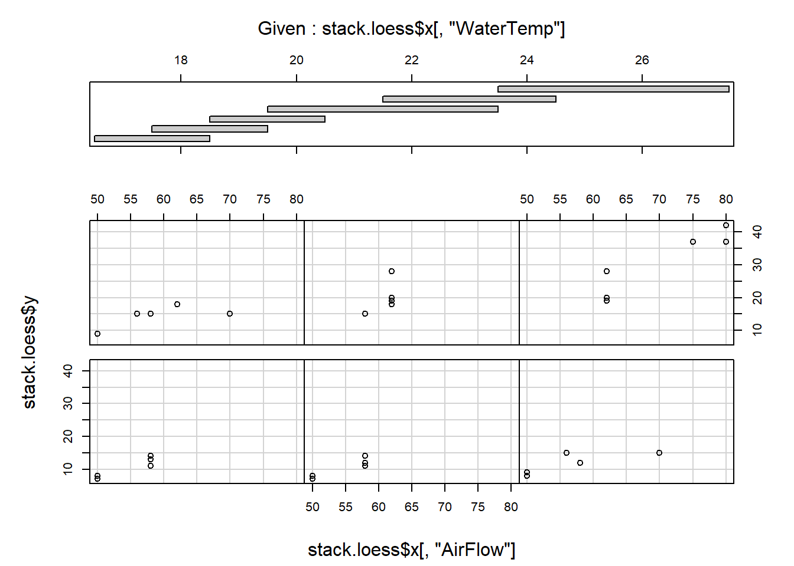
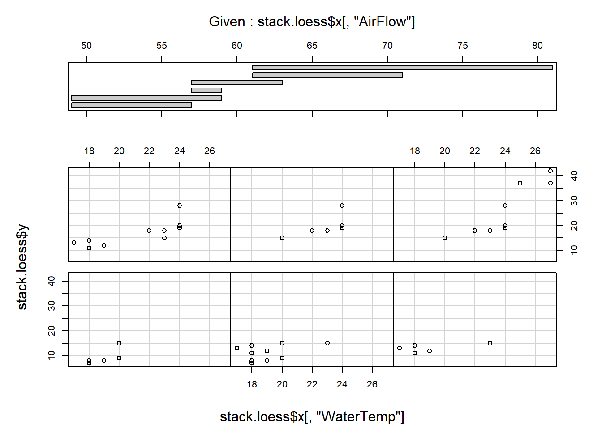
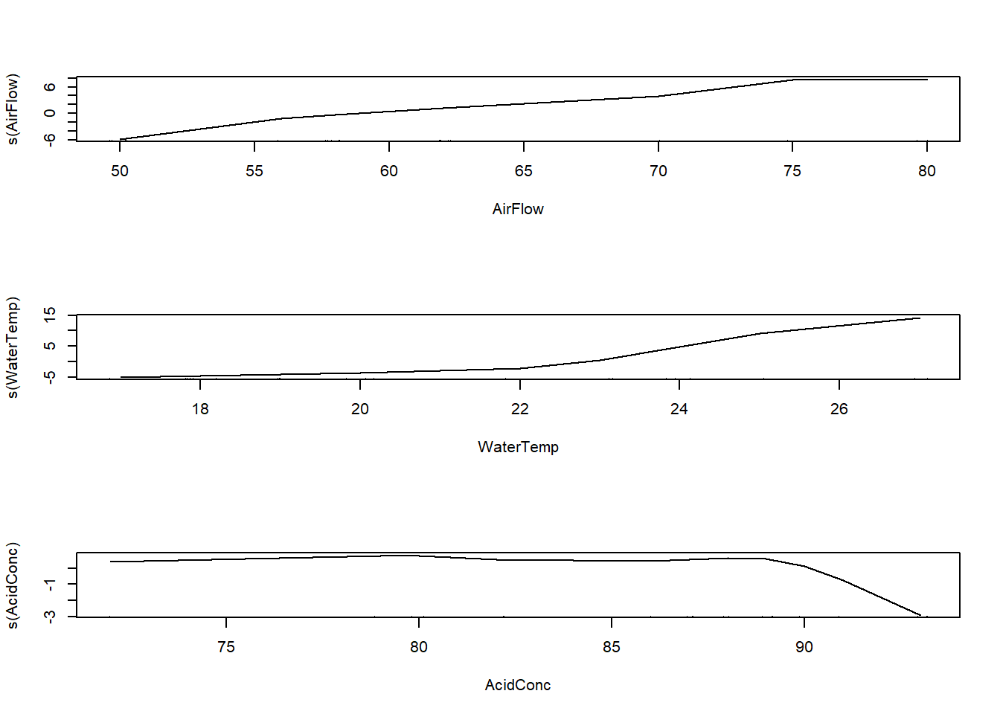
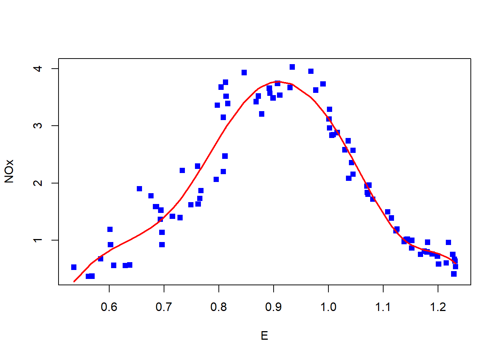
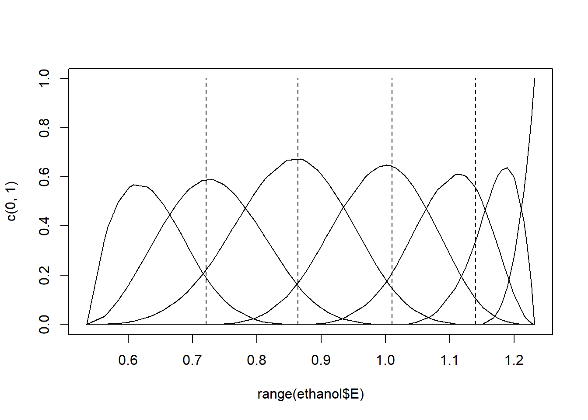
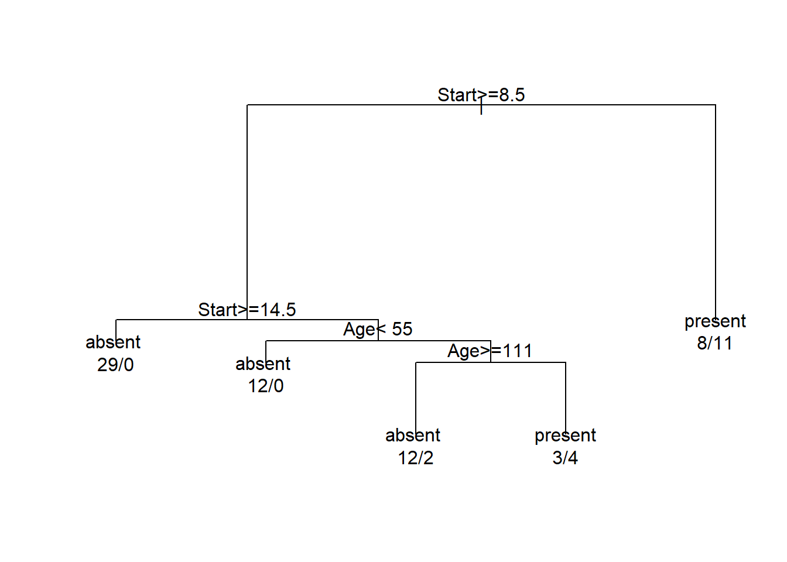
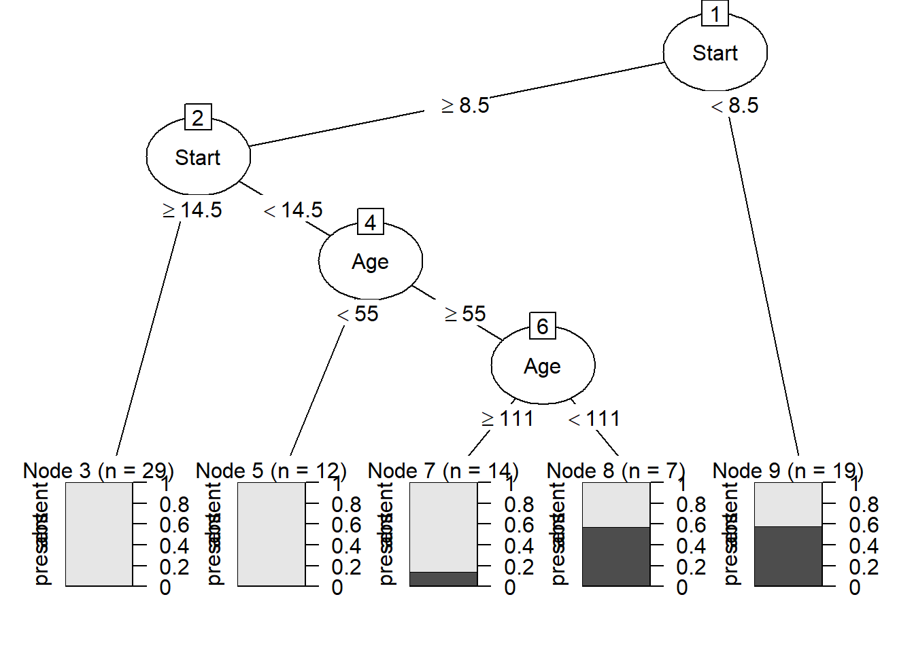
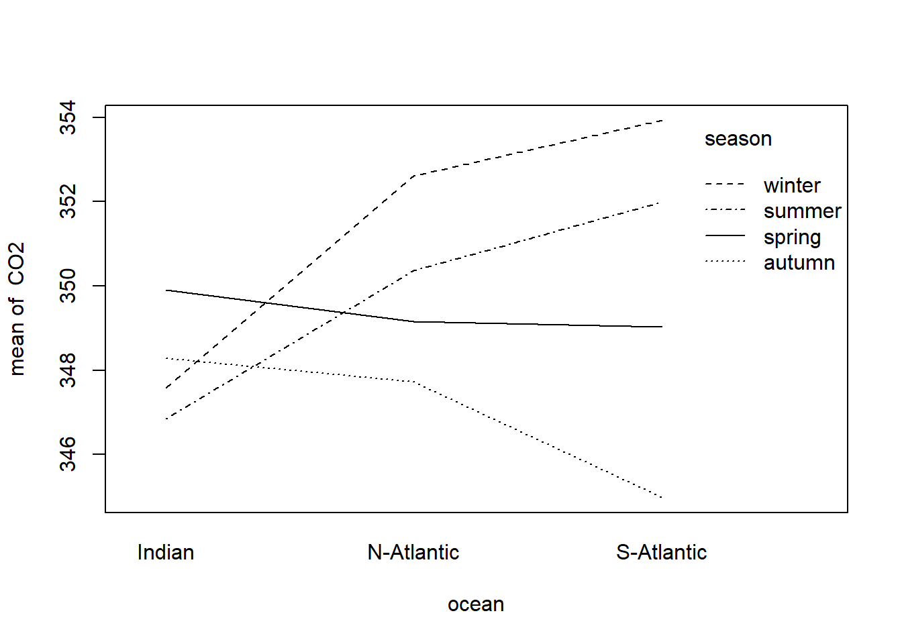

# Statistical modelling with R {#modelling}

This chapter is an introduction to statistical modelling with R. There are a substantial number of dedicated R modelling packages available. In this chapter only the basics of statistical modelling with R are considered. However, a thorough understanding of these principles is an invaluable aid in mastering any of the available R packages on statistical modelling and related topics.

## Introduction

Some of the aims of statistical modelling are: assessing the relative importance of a set of variables in relation to another variable(s); predicting the value of a dependent variable from those of a set of predictor variables; defining a statistical relationship between the dependent and the independent variables.

Here the following generic functions are considered.

Table: (\#tab:ModelFuncs) Generic modelling functions in R.

| *<span style="color:#CC99FF">Function</span>* | *<span style="color:#CC99FF">Model</span>*  | *<span style="color:#CC99FF">Package</span>* |
| ------ | --------------- | ------ |
| `lm()`   |	Linear models | `stats` |
| `aov()`   |	Analysis of variance | `stats` |
| `glm()`   |	Generalized linear models | `stats` |
| `gam()`   |	Generalized additive models| `gam`, `mgcv` |
| `loess()`   |	Local regression models | `stats` |
| `rpart()`   |	Tree-based models | `rpart` |
| `nls()`   |	Nonlinear models | `stats` |

## Data for statistical models

(a) Note the difference between *<span style="color:#FF9966">factors</span>* (categorical or classification variables), *<span style="color:#FF9966">regressors</span>* (continuous or *<span style="color:#FF9966">numeric</span>* variables) and frequency data.

(b) Why must the data be in the form of a dataframe when statistical modelling is carried out with R?

(c)	How are the functions `factor()`, `is.factor()` and `is.ordered()` used to set or determine the class attributes of variables that must behave as factors in further analyses? Note especially the usage of argument `'ordered = '` of function `factor()`.

## Expressing a statistical model in R

(a)	What role does the tilde-operator (`~`) play in statistical models in R?

(b)	Study how the operators in Table \@ref(tab:ModelOperators) work.  These operators have a different meaning when they appear in a statistical model.  

Table: (\#tab:ModelOperators)  Operators used in model formulae after the `~`.

| *<span style="color:#CC99FF">Operator</span>* | *<span style="color:#CC99FF">Algebraic meaning</span>*  | *<span style="color:#CC99FF">Meaning in formula after `~`</span>* |
| ------ | --------------- | --------------- |
| `+`    |	Addition       | Add a term |
| `-`    |	Subtraction    | Remove or exclude a term |
| `*`    |  Multiplication | 	Main effects and interactions |
| `/`    |	Division       | Main effect and nesting |
| `:`    |	Sequence       | Interaction |
| `^`    |	Exponentiation | Limit depth of interactions |
| `%in%` |	Matching       | Nesting |

(c)	In order to ensure that the operators in Table \@ref(tab:ModelOperators) have their usual meaning when appearing at the right-hand side of `~` in a statistical model use the `I()` function e.g. `I(a+b)`.

(d)	Note how *<span style="color:#FF9966">regression terms</span>*, *<span style="color:#FF9966">main effects</span>*, *<span style="color:#FF9966">interaction effects</span>*, *<span style="color:#FF9966">higher-order interaction effect</span>*, *<span style="color:#FF9966">nested effects</span>* and *<span style="color:#FF9966">covariate terms</span>* are specified.

(e)	The following summary illustrates the correspondence between the *<span style="color:#FF9966">model notation</span>* of R and the *<span style="color:#FF9966">algebraic notation</span>* of models for factors `a` and `b` with numeric (continuous) variable `x`:

| Model notation  | Algebraic notation  | 
| --------------- | --------------- | 
| `y~a+x`     |	$y = \mu + \alpha_a + \beta x + \epsilon$      | 
| `y~a+b+a:b` |	$y = \mu + \alpha_a + \beta_b + \gamma_{ab} + \epsilon$  | 
| `y~a+a:x`   |	$y = \mu + \alpha_a + \beta_a x + \epsilon$  | 
| `y~a*x`     |	$y = \mu + \alpha_a + \beta x + \gamma_a x + \epsilon$   | 
| `y~-1+a/x`  |	$y = \alpha_a + \beta_a x + \epsilon$    | 

(f)	Every numeric variable on the right-hand side of `~` generates one coefficient to be estimated in a fitted model; each *<span style="color:#FF9966">level</span>* of a factor variable generates one coefficient to be estimated in a fitted model.  What is an *<span style="color:#FF9966">estimable function</span>*?

(g)	Note how transformation of variables can be achieved and how model formulae are stored as R objects of class *<span style="color:#FF9966">formula</span>*.

## Common arguments to R modelling functions

(a)	The *<span style="color:#FF9966">formula</span>* argument.  Study how this argument and the period operator work.  If a dataframe is specified as an argument to the modelling function a period on the right-hand side of the `~` indicates that the additive effects of all the variables in the dataframe (except those used at the left-hand side of the `~`) are included in the model specification.

(b)	The *<span style="color:#FF9966">data</span>* argument.  Study how this argument works.  Note that this argument will accept any R expression that evaluates to a dataframe. Important: if a dataframe is specified in the data argument (i) variables may be referred to by their names; (ii) the dataframe is searched first for a name before the global environment and the rest of the search path; (iii) any other existing object can also be used as a variable. 

(c)	The *<span style="color:#FF9966">subset</span>* argument.  Note how statistical models can be fitted to subsets of data.

(d)	The *<span style="color:#FF9966">weights</span>* argument. Study how this argument works especially when iterative procedures are used.

(e)	The *<span style="color:#FF9966">na.action</span>* argument.  This argument controls how missing values are handled.

(f)	The *<span style="color:#FF9966">control</span>* argument.  What is the purpose of this argument?

## Using the statistical modelling objects

*Note*: each of the modelling functions returns an object whose class attribute has been set to the name of the function e.g. the value of `lm()` is set to be of class `lm`. A set of generic functions are available to provide access to the information contained in them.

To see what is available for a particular modelling function use `methods (class = function)` e.g.


``` r
methods (class = lm)
#>  [1] add1           alias          anova         
#>  [4] case.names     coerce         confint       
#>  [7] cooks.distance deviance       dfbeta        
#> [10] dfbetas        drop1          dummy.coef    
#> [13] effects        extractAIC     family        
#> [16] formula        hatvalues      influence     
#> [19] initialize     kappa          labels        
#> [22] logLik         model.frame    model.matrix  
#> [25] nobs           plot           predict       
#> [28] print          proj           qr            
#> [31] residuals      rstandard      rstudent      
#> [34] show           simulate       slotsFromS3   
#> [37] summary        variable.names vcov          
#> see '?methods' for accessing help and source code
```

Table: (\#tab:ModelObjectFuncs)  Functions for Model Objects.

| *<span style="color:#CC99FF">Function</span>* | *<span style="color:#CC99FF">Description</span>*  |
| ------ | --------------- | 
| `add1()`        |	Add all possible single terms in a model |
| `anova()`       |	Return a sequential analysis of variance table or a comparison of two hierarchical models | 
| `coef()` or `coefficients()` |	Extract estimated coefficients |
| `deviance()`    |	Return the deviance |
| `df.residual()` |	Return the residual degrees of freedom |
| `drop1()`       |	Drop all possible single terms in a model |
| `fitted()` or `fitted.values() ` |	Extract fitted values |
| `formula()`     |	Extract the formula on which the model is based |
| `influence()`   |	Extract several types of influence measures |
| `plot()`        |	Construct relevant plots |
| `predict()`     |	Calculate predictions (means) optionally with standard errors |
| `print()`       |	Extract information about the analysis |
| `resid()` or `residuals()`  |	Extract residuals |
| `step()`        |	Stepwise selection of a model using a AIC criterion |
| `summary()`     |	Extract information about the analysis |
| `update()`      |	Modify and/or refit models |

*Note*:  Do not confuse function `anova()` which operates on an `lm` object with function `aov()` for fitting an analysis of variance model.

*Recall*: Asterisked  functions are non-visible.  Such functions can be accessed using for example


``` r
getAnywhere(add1.lm)
```

(a)	Note the use of `print()`, `summary()` and `plot()` to retrieve information about model objects.

(b)	Study the functions that are used to retrieve information about model objects or to modify them as summed up in Table \@ref(tab:ModelObjectFuncs).

## Usage of the function `with()`

Study the help file of function `with()` and take note specifically of its usage when calling `lm()`. 

## Linear regression and anova {#lmAnova}

(a) Consider the `Cars93` data set available in package `MASS`.  Use the `lm()` function to perform a regression analysis of `MPG.city` as a function of  a constant term,  `Length`, `(Rev.per.mile)`$^{–1}$, `Weight`, `RPM`  and `(Horsepower)`${–1}$.  Note how the function `update()` works. Illustrate the use of the functions `drop1()` and `add1()`:


``` r
library (MASS)
lm.city <- lm (MPG.city ~ 1+ Length + I(1/Rev.per.mile)+ Weight + RPM +
                 I(1/Horsepower), data=Cars93)
summary (lm.city)
#> 
#> Call:
#> lm(formula = MPG.city ~ 1 + Length + I(1/Rev.per.mile) + Weight + 
#>     RPM + I(1/Horsepower), data = Cars93)
#> 
#> Residuals:
#>     Min      1Q  Median      3Q     Max 
#> -5.2344 -1.4863 -0.1570  0.8975 14.0030 
#> 
#> Coefficients:
#>                     Estimate Std. Error t value Pr(>|t|)
#> (Intercept)       -2.913e+00  1.076e+01  -0.271 0.787288
#> Length             4.115e-02  3.393e-02   1.213 0.228518
#> I(1/Rev.per.mile)  7.439e+03  4.760e+03   1.563 0.121750
#> Weight            -3.345e-03  1.221e-03  -2.740 0.007448
#> RPM                2.750e-03  7.812e-04   3.521 0.000688
#> I(1/Horsepower)    1.287e+03  2.379e+02   5.410 5.48e-07
#>                      
#> (Intercept)          
#> Length               
#> I(1/Rev.per.mile)    
#> Weight            ** 
#> RPM               ***
#> I(1/Horsepower)   ***
#> ---
#> Signif. codes:  
#> 0 '***' 0.001 '**' 0.01 '*' 0.05 '.' 0.1 ' ' 1
#> 
#> Residual standard error: 2.677 on 87 degrees of freedom
#> Multiple R-squared:  0.7855,	Adjusted R-squared:  0.7732 
#> F-statistic: 63.72 on 5 and 87 DF,  p-value: < 2.2e-16
# update() is used here to restrict the model fitted in lm.city to cars with 
# front wheel drives
lm.city.front <- update (lm.city, subset = DriveTrain=="Front")
summary (lm.city.front)
#> 
#> Call:
#> lm(formula = MPG.city ~ 1 + Length + I(1/Rev.per.mile) + Weight + 
#>     RPM + I(1/Horsepower), data = Cars93, subset = DriveTrain == 
#>     "Front")
#> 
#> Residuals:
#>     Min      1Q  Median      3Q     Max 
#> -5.6598 -1.4476  0.0102  0.9468 13.7023 
#> 
#> Coefficients:
#>                     Estimate Std. Error t value Pr(>|t|)
#> (Intercept)        1.599e+00  1.418e+01   0.113 0.910571
#> Length             2.711e-02  4.875e-02   0.556 0.580093
#> I(1/Rev.per.mile)  7.895e+03  6.518e+03   1.211 0.230462
#> Weight            -3.808e-03  1.707e-03  -2.230 0.029406
#> RPM                2.672e-03  1.016e-03   2.630 0.010784
#> I(1/Horsepower)    1.246e+03  3.070e+02   4.058 0.000143
#>                      
#> (Intercept)          
#> Length               
#> I(1/Rev.per.mile)    
#> Weight            *  
#> RPM               *  
#> I(1/Horsepower)   ***
#> ---
#> Signif. codes:  
#> 0 '***' 0.001 '**' 0.01 '*' 0.05 '.' 0.1 ' ' 1
#> 
#> Residual standard error: 2.93 on 61 degrees of freedom
#> Multiple R-squared:  0.7656,	Adjusted R-squared:  0.7464 
#> F-statistic: 39.85 on 5 and 61 DF,  p-value: < 2.2e-16

# drop1 (lm object, scope) shows the effect of dropping the Length term from 
# the fitted model
drop1 (lm.city, . ~ Length)
#> Single term deletions
#> 
#> Model:
#> MPG.city ~ 1 + Length + I(1/Rev.per.mile) + Weight + RPM + I(1/Horsepower)
#>        Df Sum of Sq    RSS    AIC
#> <none>              623.27 188.92
#> Length  1    10.536 633.80 188.48

# Shows the effect of dropping each term in turn from the fitted model 
drop1 (lm.city)
#> Single term deletions
#> 
#> Model:
#> MPG.city ~ 1 + Length + I(1/Rev.per.mile) + Weight + RPM + I(1/Horsepower)
#>                   Df Sum of Sq    RSS    AIC
#> <none>                         623.27 188.92
#> Length             1    10.536 633.80 188.48
#> I(1/Rev.per.mile)  1    17.495 640.76 189.50
#> Weight             1    53.796 677.06 194.62
#> RPM                1    88.801 712.07 199.31
#> I(1/Horsepower)    1   209.659 832.93 213.89

lm.city.const <- lm (MPG.city ~ 1, data=Cars93)
anova (lm.city.const)
#> Analysis of Variance Table
#> 
#> Response: MPG.city
#>           Df Sum Sq Mean Sq F value Pr(>F)
#> Residuals 92 2905.6  31.582

# add1 (lm object, scope) shows the effect of adding the terms in scope 
# individually in turn to the model in lm object 
add1 (lm.city.const, . ~ Length + I(1/Rev.per.mile) + Weight + RPM + 
       I(1/Horsepower))
#> Single term additions
#> 
#> Model:
#> MPG.city ~ 1
#>                   Df Sum of Sq     RSS    AIC
#> <none>                         2905.57 322.09
#> Length             1   1289.71 1615.86 269.52
#> I(1/Rev.per.mile)  1   1090.68 1814.89 280.32
#> Weight             1   2065.52  840.05 208.68
#> RPM                1    382.96 2522.61 310.94
#> I(1/Horsepower)    1   1927.30  978.27 222.85
```

(b)	Is the object `a <- as.data.frame(matA)` identical with the object  `a1 <- data.frame(matA)`?

(c)	Once again, consider the `Cars93` data set: Consider cars manufactured by Buick, Chevrolet, Oldsmobile and Pontiac.  Use the median of `Weight` to create two car weight groups.

    * Construct an interaction plot to study the interaction between `Manufacturer` and `Weight` with respect to the highway fuel consumption. Interpret the graph. 
    * Use the function `aov()` to perform a two-way anova with highway fuel consumption as dependent variable  and  as independent (explanatory) variables weight-group and manufacturer.
    * What do you conclude about the main effects and the interaction effects?
    * Repeat the above using lm().
    
(d)	Study the help file of the `whiteside` data set available in package `MASS`.  Plot the gas consumption as a function of the temperature. Use different plotting characters and colours for the two levels of the factor variable `Insul`.  Add the regression lines of gas consumption on the temperature for the two levels of `Insul` to the graph . What do you conclude? Now test for the parallelism of the two regression lines using `lm()` with terms for `Insul`, `Temp` and `Insul:Temp`. Discuss the results of the analysis.

##	Regression diagnostics

(a)	Study the help file of `lm.influence()` for information on its return values.

(b)	Standardized residuals as well as jackknife residuals where $stdres = \frac{\hat{e}_i}{s\sqrt{1-h_{ii}}}$ and $studres = \frac{y_i-\hat{y}_{(i)}}{\sqrt{var(y_i-\hat{y}_{(i)})}}$ can be obtained with the help of the following functions: `stdres()` and `studres()` available in package `MASS`.  Study the help files of these functions.

(c)	Study how `predict()` and `fitted()` work.

(d)	Stepwise model selection: study the use of `step()`.

(e)	What is returned by the function `dfbetas()`?

(f) Discuss the output of


``` r
step (lm (MPG.highway ~ Length + Width + Weight + EngineSize + RPM + 
            Rev.per.mile, data = Cars93))
#> Start:  AIC=210.55
#> MPG.highway ~ Length + Width + Weight + EngineSize + RPM + Rev.per.mile
#> 
#>                Df Sum of Sq     RSS    AIC
#> - RPM           1      1.58  771.32 208.74
#> - EngineSize    1     10.36  780.10 209.79
#> - Width         1     13.91  783.64 210.22
#> <none>                       769.74 210.55
#> - Rev.per.mile  1     17.66  787.39 210.66
#> - Length        1     50.29  820.02 214.44
#> - Weight        1    687.78 1457.52 267.93
#> 
#> Step:  AIC=208.74
#> MPG.highway ~ Length + Width + Weight + EngineSize + Rev.per.mile
#> 
#>                Df Sum of Sq     RSS    AIC
#> - EngineSize    1      9.19  780.50 207.84
#> - Width         1     12.56  783.87 208.24
#> <none>                       771.32 208.74
#> - Rev.per.mile  1     18.36  789.67 208.93
#> - Length        1     50.39  821.71 212.63
#> - Weight        1    699.81 1471.13 266.79
#> 
#> Step:  AIC=207.84
#> MPG.highway ~ Length + Width + Weight + Rev.per.mile
#> 
#>                Df Sum of Sq     RSS    AIC
#> - Rev.per.mile  1     10.79  791.29 207.12
#> <none>                       780.50 207.84
#> - Width         1     21.50  802.00 208.37
#> - Length        1     56.14  836.64 212.30
#> - Weight        1    710.64 1491.14 266.05
#> 
#> Step:  AIC=207.12
#> MPG.highway ~ Length + Width + Weight
#> 
#>          Df Sum of Sq     RSS    AIC
#> - Width   1     13.71  805.00 206.72
#> <none>                 791.29 207.12
#> - Length  1     52.31  843.61 211.07
#> - Weight  1    749.41 1540.70 267.09
#> 
#> Step:  AIC=206.72
#> MPG.highway ~ Length + Weight
#> 
#>          Df Sum of Sq     RSS    AIC
#> <none>                 805.00 206.72
#> - Length  1     91.62  896.62 214.74
#> - Weight  1   1039.48 1844.48 281.82
#> 
#> Call:
#> lm(formula = MPG.highway ~ Length + Weight, data = Cars93)
#> 
#> Coefficients:
#> (Intercept)       Length       Weight  
#>   37.521781     0.115526    -0.009633
```

(g) Calculate and interpret the `dfbetas` associated with the object `lm.city.front` created in Section \@ref(lmAnova).

(h)	Continuing (f): obtain a graph with the standardized residuals on the y-axis and the fitted y-values on the x-axis and interpret the graph.

(i)	Continuing (f): obtain a histogram of the studentized residuals. Interpret.

(j)	Consider the object `lm.city` created in section  \@ref(lmAnova). Verify the assumption of normally distributed residuals with the function `qqnorm()`. See section  \@ref(qqplot).

## Non-parametric regression

(a)	Inspect the help file of the `stackloss` data set.

(b)	Execute the following R code:


``` r
stack.data <- data.frame (stackloss)
names (stack.data) <- c("AirFlow", "WaterTemp", "AcidConc", "Loss")
```

(c)	Describe briefly what is understood by a Local regression model using the help file of the function `loess()`.

(d)	Execute the following R code:


``` r
stack.loess <- loess(Loss ~ AirFlow * WaterTemp, data = stack.data)
summary(stack.loess)
#> Call:
#> loess(formula = Loss ~ AirFlow * WaterTemp, data = stack.data)
#> 
#> Number of Observations: 21 
#> Equivalent Number of Parameters: 8.86 
#> Residual Standard Error: 2.986 
#> Trace of smoother matrix: 10.53  (exact)
#> 
#> Control settings:
#>   span     :  0.75 
#>   degree   :  2 
#>   family   :  gaussian
#>   surface  :  interpolate	  cell = 0.2
#>   normalize:  TRUE
#>  parametric:  FALSE FALSE
#> drop.square:  FALSE FALSE
names(stack.loess)
#>  [1] "n"         "fitted"    "residuals" "enp"      
#>  [5] "s"         "one.delta" "two.delta" "trace.hat"
#>  [9] "divisor"   "robust"    "pars"      "kd"       
#> [13] "call"      "terms"     "xnames"    "x"        
#> [17] "y"         "weights"

stack.loess$x
#>    AirFlow WaterTemp
#> 1       80        27
#> 2       80        27
#> 3       75        25
#> 4       62        24
#> 5       62        22
#> 6       62        23
#> 7       62        24
#> 8       62        24
#> 9       58        23
#> 10      58        18
#> 11      58        18
#> 12      58        17
#> 13      58        18
#> 14      58        19
#> 15      50        18
#> 16      50        18
#> 17      50        19
#> 18      50        19
#> 19      50        20
#> 20      56        20
#> 21      70        20
coplot (stack.loess$y ~ stack.loess$x[,"AirFlow"] | stack.loess$x[,"WaterTemp"],
       panel = points)
```



``` r
coplot (stack.loess$y ~ stack.loess$x[,"WaterTemp"] | stack.loess$x[,"AirFlow"],
        panel=points)
```



Comment on the results.

(e)	Alternatively, splines can be used to fit a nonparametric regression model. The package `splines` provides for fitting B-splines with the `bs()` function and natural cubic splines with the `ns()` function.

(f)	Study the help files of the `bs()` and `ns()` functions.

(g)	Inspect the help file of the `ethanol` data set available in package `lattice`.

    (i) Plot `NOx` versus `E`. 

    (ii) Use `lm()` and fit a straight line to the data. Add this line to the plot made above. Why is it necessary to order the observations?
    

``` r
y <- ethanol$NOx [order (ethanol$E)]
x <- ethanol$E [order (ethanol$E)]
yhat <- fitted (lm (y ~ x))
lines (x, yhat, col = "blue")
```

<div style="margin-left: 25px; margin-right: 20px;">
(iii) Use `lm()` and fit a third degree polynomial to the data. Also add this line to the plot in (i).
</div>


``` r
yhat <- fitted (lm (y ~ x + I(x^2) + I(x^3)))
lines (x, yhat, col = "magenta")
```

<div style="margin-left: 25px; margin-right: 20px;">
(iv) Use `loess()` with a default `span = 0.75` to fit a local regression function to the data and add this line to the plot.
</div>


``` r
yhat <- fitted (loess (y ~ x))
lines (x, yhat, col = "green")
```

<div style="margin-left: 25px; margin-right: 20px;">
(v) Use `bs()` to fit a B-spline with default `degree = 3` and `knots = NULL`.  Notice that a third degree polynomial is fitted, similar to (iii).
</div>


``` r
yhat <- fitted (lm (y ~ bs(x, degree=3)))
lines (x, yhat, col = "gold")
```

<div style="margin-left: 25px; margin-right: 20px;">
(vi) Use `bs()` to fit a cubic B-spline with 7 degrees of freedom.
</div>


``` r
yhat <- fitted (lm (y ~ bs(x, df=7)))
lines (x, yhat, col="red")
```

<div style="margin-left: 25px; margin-right: 20px;">
(vii) Compare the number of knots for the two fits in (v) and (vi).
</div>


``` r
attr (bs(x), "knots")
attr(bs(x), "Boundary.knots")
attr(bs(x, df=7), "knots")
attr(bs(x, df=7), "Boundary.knots")
```

<div style="margin-left: 25px; margin-right: 20px;">
(viii) Experiment with different values of the span for the `loess()` function and the `df` argument of the `bs()` function. 
</div>

(h)	When producing a coplot (refer to section \@ref(coplot)) it is helpful to draw lines or curves in each of the dependency panels, to make the relationship easier to appreciate. Use the panel argument of `coplot()` to draw  in each panel

    * a straight line representing the linear regression between the variables;
    * a curve representing the polynomial regression; 
    * a spline using `smooth.spline()`.


<div style="margin-left: 25px; margin-right: 20px;">
*Hint*:  Graphical arguments are passed to `coplot()` by writing a suitable panel function as ‘value’ for argument panel of  `coplot()`. Study the examples of panel functions below:
</div>


``` r
panel.straight.line <- function(x, y, col = par("col"), bg = NA, 
                                pch = par("pch"), cex = 1, col.smooth = "red")
{ datmat <- cbind (x, y)
  datmat <- datmat [order (datmat[, 1]),  ]
  points (datmat[, 1], datmat[, 2], pch = pch, col = col, bg = bg, cex = cex)
  lines (datmat[, 1], fitted (lm (datmat[, 2] ~ datmat[, 1])), col = col.smooth)
}

panel.poly <- function(x, y, col = par("col"), bg = NA, pch = par("pch"), 
                       cex = 1, col.smooth = "red")
{ datmat <- cbind(x, y)
  datmat <- datmat [order (datmat[, 1]),  ]
  points (datmat[, 1], datmat[, 2], pch = pch, col = col, bg = bg, cex = cex)
  lines (datmat[, 1], fitted (lm (datmat[, 2] ~ poly (datmat[, 1], 2))), 
         col = col.smooth)
}
               
panel.smooth <- function (x, y, col = par("col"), bg = NA, pch = par("pch"), 
                          cex = 1, col.smooth = "red", span = 2/3, iter = 3, 
                          ...) 
{ points(x, y, pch = pch, col = col, bg = bg, cex = cex)
  ok <- is.finite (x) & is.finite (y)
  if (any (ok)) 
  lines (stats::lowess(x[ok], y[ok], f = span, iter = iter), 
         col = col.smooth, ...)
}
```

<div style="margin-left: 25px; margin-right: 20px;">
An example
</div>


``` r
coplot (Illiteracy ~ Life.Exp | Income * Area, data = state, 
        given = list (co.intervals (state$Income, 4), 
                      co.intervals (state$Area, 4)), 
        panel = panel.straight.line)
coplot (Illiteracy ~ Life.Exp | Income * Area, data = state, 
        given = list (co.intervals (state$Income, 4), 
                      co.intervals (state$Area, 4)), 
        panel = panel.poly)
coplot (Illiteracy ~ Life.Exp | Income * Area, data = state, 
        given = list (co.intervals (state$Income, 4), 
                      co.intervals (state$Area, 4)), 
        panel = panel.smooth)
```

## The function glm()

Consider the following data frame treatments

| *<span style="color:#CC99FF">TreatA</span>* | *<span style="color:#CC99FF">TreatB</span>*  | *<span style="color:#CC99FF">Counts</span>* |
| ------ | ------  | ------ |
| 1   |	1 | 18 |
| 1   |	2 | 17 |
| 1   |	3 | 15 |
| 2   |	1 | 20 |
| 2   |	2 | 10 |
| 2   |	3 | 20 |
| 3   |	1 | 25 |
| 3   |	2 | 13 |
| 3   |	3 | 12 |

Why is a two-way anova not appropriate here?  

GLM extends the linear model in two ways: (a) the expected value is replaced by a *<span style="color:#FF9966">function</span>* of the expected value, called the link function and (b) the assumption of observations from a Gaussian distribution is extended to include other distributions from the exponential family of probability distributions.

Use `glm()` with `family = poisson()` to fit the following generalized linear models to the data: `Counts ~ TreatA + TreatB` and `Counts ~ TreatA * TreatB`.

What are your conclusions?

## The function gam()

(a)	Describe briefly what is understood by a *<span style="color:#FF9966">generalized additive model</span>*.


``` r
library (gam) 
#> Loading required package: splines
#> Loading required package: foreach
#> Loaded gam 1.22-6
stack.gam <- gam::gam (Loss ~ s(AirFlow) + s(WaterTemp) + s(AcidConc),
                       control = gam.control (bf.maxit = 50), data = stack.data)
summary(stack.gam)
#> 
#> Call: gam::gam(formula = Loss ~ s(AirFlow) + s(WaterTemp) + s(AcidConc), 
#>     data = stack.data, control = gam.control(bf.maxit = 50))
#> Deviance Residuals:
#>     Min      1Q  Median      3Q     Max 
#> -3.0831 -1.6186  0.2447  0.8839  3.9253 
#> 
#> (Dispersion Parameter for gaussian family taken to be 8.4463)
#> 
#>     Null Deviance: 2069.238 on 20 degrees of freedom
#> Residual Deviance: 67.5711 on 8.0001 degrees of freedom
#> AIC: 112.1371 
#> 
#> Number of Local Scoring Iterations: NA 
#> 
#> Anova for Parametric Effects
#>                  Df  Sum Sq Mean Sq  F value    Pr(>F)    
#> s(AirFlow)   1.0000 1435.95 1435.95 170.0095 1.136e-06 ***
#> s(WaterTemp) 1.0000  272.77  272.77  32.2944 0.0004635 ***
#> s(AcidConc)  1.0000    8.23    8.23   0.9742 0.3525476    
#> Residuals    8.0001   67.57    8.45                       
#> ---
#> Signif. codes:  
#> 0 '***' 0.001 '**' 0.01 '*' 0.05 '.' 0.1 ' ' 1
#> 
#> Anova for Nonparametric Effects
#>              Npar Df Npar F   Pr(F)  
#> (Intercept)                          
#> s(AirFlow)         3 1.0050 0.43916  
#> s(WaterTemp)       3 3.3321 0.07703 .
#> s(AcidConc)        3 0.9953 0.44293  
#> ---
#> Signif. codes:  
#> 0 '***' 0.001 '**' 0.01 '*' 0.05 '.' 0.1 ' ' 1
par(mfrow=c(3,1))
plot(stack.gam)
```



<div style="margin-left: 25px; margin-right: 20px;">
Comment on the results.
</div>

(b)	Return to the `ethanol` data set available in package `lattice`.

    (i)	Use `gam()` in package `mgcv` and fit a B-spline to the data.  The following code can be used for that:  
    

``` r
detach ('package:gam')
library (mgcv)
#> Loading required package: nlme
#> This is mgcv 1.9-3. For overview type 'help("mgcv-package")'.
library (lattice)
library (splines)

out <- mgcv::gam (NOx ~ bs(E, df = 7), data = ethanol)
# str(out)    # inspect output components

# data must be sorted according to E values
data.temp <- data.frame (ethanol [,c(1,3)], fitted = fitted(out))
data.ordered <- with (data.temp, data.temp [order(E),])
with (data.ordered, plot (x = E, y = NOx, pch = 15, col = 'blue'))
with (data.ordered, lines (x = E, y = fitted, col = 'red', lwd = 2))
```



<div style="margin-left: 45px; margin-right: 20px;">
The domain of the predictor is divided by knots and a B-spline generates a set of piecewise polynomials restricted to be continuous at the knots. Execute the following command:
</div>


``` r
plot (range (ethanol$E), c(0,1), type = "n")
apply (bs (ethanol$E, df = 7), 2, function(y, x)
                              lines (x[order(x)], y[order(x)]), x = ethanol$E)
#> NULL
knot.vec <- attr (bs (ethanol$E [order (ethanol$E)], df = 7), "knots")
for (i in knot.vec) lines (rep(i,2), c(0,1), lty = 2)
```

<div class="figure">

<p class="caption">(\#fig:knots)Cubic B-spline basis functions with 4 interior knots.</p>
</div>

<div style="margin-left: 45px; margin-right: 20px;">
A set of $7$ basis functions were generated, each a degree $3$ polynomial in an interval with 
$7 - 3 = 4$ interior knots. Experiment with specifying either a different degree for the polynomials, or different numbers of knots. The specific knots can also be specified, e.g. `bs (ethanol$E, knots = c (0.7, 0.9, 1.1))`.
</div>

<div style="margin-left: 25px; margin-right: 20px;">
(ii)	It has been shown that B-splines can exhibit erratic behavior beyond the boundary knots. Repeat the fits and plots above, replacing the B-splines with natural cubic splines with the function `ns()`. Natural cubic splines constrain the basis functions to be linear beyond the boundary knots. As a result, a natural cubic spline with $K$ knots is represented by $K$ basis functions.

(iii)	Selecting the position and number of knots can be subjective. Smoothing splines solves the knot selection problem by making each observation a knot and controlling the overfitting with a single penalty parameter. Repeat the fits and plots in (i), replacing the B-splines with smoothing splines with the function `s()`, similar to the fit in (a).
</div>

## The function rpart()

(a)	Describe briefly what is understood by *<span style="color:#FF9966">Regression and Classification Trees</span>* using the help file of the function `rpart()` in package `rpart`.

(b)	Study the help file of the `kyphosis` data set available in package `MASS`.

(c)	Execute the following R code:


``` r
library (rpart)
fit <- rpart(Kyphosis ~ Age + Number + Start, data=kyphosis)
plot(fit)
text(fit, use.n = TRUE, xpd = NA)
```



Comment on the results.

(d)	The package `partykit()` provides a toolkit for recursive partitioning. A more informative tree diagram compared to (c) can be obtained with the code:


``` r
library (partykit)
#> Loading required package: grid
#> Loading required package: libcoin
#> Loading required package: mvtnorm
fit2 <- as.party(fit)
plot(fit2)
```



## Nonlinear regression and the function nls()

The asymptotic regression model has the form: 

$$
y = \alpha + \beta e^{\gamma x}.
$$

When $\alpha > 0$, $\beta < 0$ and $\gamma < 0$ the above model becomes Mistcherlich’s model of the law of diminishing returns.  According to the law of diminishing returns the yield, $y$, initially increases quickly with increasing values of $x$, but then the yield slows down and finally levels off just below the value of $\alpha$. The parameters $\alpha > 0$, $\beta < 0$ and $\gamma < 0$ have the following meaning:

<div style="margin-left: 25px; margin-right: 20px;">
* $\alpha$ represents the upper asymptote for yield

* $\beta$ is the difference between the value of $y$ when $x = 0$ and the upper asymptote
</div>

The asymptotic regression model may be reparameterized such that $\beta$ is replaced by $\delta - \alpha$ where $\delta$ represents the yield when $x = 0$. A special case of the asymptotic regression model occurs when $\delta = 0$:

$$
y = \alpha - \alpha e^{\gamma x} = \alpha (1 - e^{\gamma x}).
$$

The asymptotic regression model represents a nonlinear regression model and in general no closed form solution exists for estimating its parameters. The R function `nls()` can be used to estimate the parameters of the model. When function `nls()` is employed starting values for the iterative estimating procedure are necessary.

### Choosing starting values

(1)	A starting value for \alpha can be found by looking at a scatterplot of $y$ as a function of $x$ and then chooses as starting value just larger than the largest value of $y$.

(2) \beta is the difference between the value of $y$ when $x = 0$ and the upper asymptote. A reasonable starting value is the minimum value of $y - \alpha$.

(3) \gamma can be roughly initially estimated by the negative of the slope between two "well separated" points on the plot.

(a)	Study the help file of `nls()`.  Notice carefully how `nls()` is called.

(b)	The data below is the `Yield` of a product after a chemical treatment of different time duration. Three replicates were made at each treatment time. 

| *<span style="color:#CC99FF">Time (Hrs)</span>* | *<span style="color:#CC99FF">Rep1</span>*  | *<span style="color:#CC99FF">Rep2</span>* | *<span style="color:#CC99FF">Rep3</span>* |
| ------ | ------  | ------ | ------ |
| 0      |	0.0000 | 0.0000 | 0.0000 |
| 3      |	0.0846 | 0.0556 | 0.0501 |
| 6      |	0.1072 | 0.0604 | 0.0545 |
| 12     |	0.1255 | 0.0590 | 0.0705 |
| 18     |	0.1671 | 0.0799 | 0.0687 |
| 24     |	0.1988 | 0.0958 | 0.0655 |
| 48     |	0.2927 | 0.1739 | 0.1075 |
| 72     |	0.3713 | 0.1910 | 0.1418 |
| 96     |	0.4773 | 0.2669 | 0.1725 |
| 168    |	0.6158 | 0.3584 | 0.3224 |
| 336    |	0.7297 | 0.4339 | 0.3322 |
| 504    |	0.8083 | 0.4816 | 0.3309 |
| 672    |	0.7019 | 0.4497 | 0.3798 |
| 840    |	0.6038 | 0.4851 | 0.3757 |
| 1008   |	0.7386 | 0.5332 | 0.3798 |

<div style="margin-left: 25px; margin-right: 20px;">
Plot the data.
</div>

(c) The above plot suggests a relationship of the form:

$$
y = \alpha - \alpha e^{\gamma x} = \alpha (1 - e^{\gamma x}).
$$

<div style="margin-left: 25px; margin-right: 20px;">
Explain the term: *<span style="color:#FF9966">nonlinear regression</span>*. Use `nls()` to estimate the parameters $\alpha$ and $\gamma$ in the above model. What effect does the changing of the start values have on the result of `nls()`? Experiment with different start values for the parameters. Add the estimated line to the plot in (b) and interpret the graph.
</div>

## Detailed example: Analysis of Variance and Covariance

### One-way ANOVA models

About 90 percent of the ozone in the atmosphere is contained in the stratosphere. Although only a small proportion of atmospheric ozone is found in the troposphere this ozone plays an important role in various climatic phenomena. Research has shown the highest amounts of ozone over the Arctic are found during the spring months of March and April, while the Antarctic has its lowest amounts of ozone during its autumn months of September and October, Atmospheric carbon dioxide not only plays an important role in global warming but its concentration is related to height above sea level and ocean temperature. In order to study relationships between ozone levels, CO_2 concentration, height above sea level, ocean and seasonality a small-scale simulation study has been undertaken. A very simple model was constructed for simulating the data called `climate.sim`. This simple simulation procedure was performed as described below. Here we show how the `climate.sim` data were subjected to various, ANOVA, regression and ANCOVA procedures.


``` r
library (tidyverse)
#> ── Attaching core tidyverse packages ──── tidyverse 2.0.0 ──
#> ✔ dplyr     1.1.4     ✔ readr     2.1.5
#> ✔ forcats   1.0.0     ✔ stringr   1.5.1
#> ✔ ggplot2   3.5.2     ✔ tibble    3.3.0
#> ✔ lubridate 1.9.4     ✔ tidyr     1.3.1
#> ✔ purrr     1.1.0     
#> ── Conflicts ────────────────────── tidyverse_conflicts() ──
#> ✖ purrr::accumulate() masks foreach::accumulate()
#> ✖ dplyr::collapse()   masks nlme::collapse()
#> ✖ dplyr::filter()     masks stats::filter()
#> ✖ dplyr::lag()        masks stats::lag()
#> ✖ dplyr::select()     masks MASS::select()
#> ✖ purrr::when()       masks foreach::when()
#> ℹ Use the conflicted package (<http://conflicted.r-lib.org/>) to force all conflicts to become errors
set.seed (7343)
ocean <- factor (c (rep ("N-Atlantic", 20), rep ("S-Atlantic", 20), 
                    rep ("Indian", 20)))
season <- factor (rep (rep (c ("summer", "autumn", "winter", "spring"), 
                            each = 5), 3))
height <- runif (60, 100, 750)
climate.sim <- tibble (ocean, season, height)
CO2 <- 350 + (as.numeric (ocean) - 2) + (as.numeric (season) - 2.5) * 1.8 + 
       (as.numeric (ocean) - 2) * (as.numeric (season) - 2.5) * 2 -
       0.012 * (height - 390) + rnorm (60, 0, 2)
ozone <- 15 + (as.numeric (ocean) - 2) + 0.02 * (height - 390) + 
         rnorm (60, 0, 0.4)
climate.sim <- mutate (climate.sim, CO2, ozone)
```

The researcher would like to know whether the CO2 levels are the same in the three oceanic regions.  Analysis of variance decomposes the total variance in the dependent variable into a between-groups variance and a within-groups variance (or error variance).  The underlying model can be written as

$$
Y_{ij} = \mu + \alpha_i + \epsilon_{ij}
$$

where $Y_{ij}$ represents the value of the numeric dependent variable for observation $j$ coming from population $i$; $\mu$ is an effect common to all observations; $\alpha_i$ represents an effect found only in population $i$ and $\epsilon_{ij}$ is an effect (e.g. measurement error) that is specific to only observation ($ij$). It is assumed that the $\epsilon_{ij}$ is normally distributed with a mean of zero and a constant variance $\sigma^2$  (i.e. the variance is the same in each of the populations).  The statistical models to be tested is

$$
H_0: \alpha_1 = \alpha_2 = \dots = \alpha_k
$$

where $k$ denotes the number of different populations, versus

$$
H_A: \text{At least one of the } \alpha \text{s differs from the rest}.
$$

In general $\mu, \alpha_1, \dots, \alpha_k$ cannot all be estimated uniquely.  In order for a statistical hypothesis to be *<span style="color:#FF9966">testable</span>* it must be expressed in terms of *<span style="color:#FF9966">estimable functions</span>* of the parameters.  A statistical hypothesis can often be expressed in different equivalent forms. The null hypothesis above, for example, is equivalent to the following hypotheses:

$$
H_0': \mu+\alpha_1 = \mu+\alpha_2 = \dots = \mu+\alpha_k
$$

$$
H_0'': \alpha_1 - \alpha_k = \alpha_2 - \alpha_k = \dots = \alpha_{k-1} - \alpha_k = 0 
$$

The latter two hypotheses are both in terms of  $k - 1$ linearly independent estimable functions and hence are testable. The default behaviour of R is to estimate $\mu$ (the intercept) using the data, take (estimate) one of the $\alpha$s as zero and then estimate the remainder of the $\alpha$s as deviations from the estimated intercept using the data. Notice, that in doing so the given null hypothesis above can still be tested.

(a)	Use `str(climate.sim)` to inspect the structure of the R object `climate.sim`. Note that the factor season has 4 levels, with the first two levels “autumn” and “spring”. R automatically order the levels alphabetically. In this case, we want the seasons to follow in the order we observe them, especially when making plots, such as `boxplot (CO2 ~ season, data = climate.sim)`.

<div style="margin-left: 25px; margin-right: 20px;">
To change the order of the levels, the R function `relevel()` allows putting a specific level first. Sequentially calling this function, allows one to place the levels in any required order. As part of the tidyverse ecosystem, the package `forcats` is loaded and the following calls allows the user to change the order of the levels in a single call.
</div>


``` r
climate.sim$season <- fct_relevel (climate.sim$season, 
                                   c("summer", "autumn", "winter", "spring"))
str(climate.sim)
#> tibble [60 × 5] (S3: tbl_df/tbl/data.frame)
#>  $ ocean : Factor w/ 3 levels "Indian","N-Atlantic",..: 2 2 2 2 2 2 2 2 2 2 ...
#>  $ season: Factor w/ 4 levels "summer","autumn",..: 1 1 1 1 1 2 2 2 2 2 ...
#>  $ height: num [1:60] 534 477 633 256 267 ...
#>  $ CO2   : num [1:60] 350 348 347 352 355 ...
#>  $ ozone : num [1:60] 17.5 17.1 20.4 12.1 11.9 ...
```

(b)	Use `with()` and `tapply()` to obtain the mean and the standard deviation of CO2 for the different seasons.

(c)	Test if the effects of the four seasons on CO2 are the same by executing the R command `lm (CO2 ~ season, data = climate.sim)` and using the commands `summary()` and `anova()`.

(d)	Use `coefficients()` and interpret the estimates referring to (b).

(e)	Obtain the residuals and plot them against the fitted values. Use different colours for the different seasons. Interpret the plot.

### Two-way ANOVA models: main effects and interaction effects

Inspection of the `climate.sim` data by requesting `str(climate.sim)` reveals the presence of a second factor variable ocean.

We are interested in CO2 as a function of the two factor variables season and ocean.  In addition to the *<span style="color:#FF9966">main effects</span>* of season and ocean, respectively, we also have to consider *<span style="color:#FF9966">interaction effects</span>*.  

*<span style="color:#FF9966">Interaction can be defined as the result where the effect of one factor depends on the level of another factor.</span>* 

In order to provide for a second factor together with interaction effects the two-way model is given by

$$
Y_{ij} = \mu + \alpha_i + \beta_j + (\alpha\beta)_{ij} + \epsilon_{ij}
$$

In this model $\alpha$ represents the main effect of season and $\beta$ the main effect of ocean while the interaction effect is represented by $(\alpha\beta)_{ij}$.  The first hypothesis to be tested is the null hypothesis that there exist no interaction effects or that the interaction effects are negligible. Symbolically this is the hypothesis

$$
H_0: (\alpha\beta)_{11} = (\alpha\beta)_{12} = \dots = (\alpha\beta)_{km}
$$

where $k$ denotes the number of levels in the first factor variable and $m$ the number of levels in the second factor variable. In order to test for interaction we must have $r > 1$ repetitions (replicates) of each $\alpha_i\beta_j$ combination. The value of $r$ in our example can be found using the following code:


``` r
with(climate.sim, table(season, ocean))
#>         ocean
#> season   Indian N-Atlantic S-Atlantic
#>   summer      5          5          5
#>   autumn      5          5          5
#>   winter      5          5          5
#>   spring      5          5          5
```

From the table above it is clear that all treatment combinations occur exactly the same number of times. Had there been some missing values in the data, the correct solution to the problem is to estimate the missing values by the mean values of the available data in the affected cells. These values are then substituted in place of the missing values to form a complete data set. The ANOVA is then performed on the complete data set but the degrees of freedom for error is reduced with the number of missing values.

The presence of interaction can be investigated with an interaction plot using the following instruction


``` r
with(climate.sim, interaction.plot (ocean, season, response = CO2)) 
```

<div class="figure">

<p class="caption">(\#fig:interactionSeasonOcean)Interaction plot of factors season and ocean associates with the dependent variable CO2</p>
</div>

What can be deduced from Figure \@ref(fig:interactionSeasonOcean)? Explain in detail.

The formal ANOVA can be performed with the instruction


``` r
two.way.anova <- lm(CO2 ~ season + ocean + season:ocean, data=climate.sim)
```

An analysis-of-variance table can be constructed with the instruction:

``` r
anova(two.way.anova)
#> Analysis of Variance Table
#> 
#> Response: CO2
#>              Df Sum Sq Mean Sq F value   Pr(>F)   
#> season        3 146.93  48.977  4.9041 0.004718 **
#> ocean         2  44.20  22.099  2.2128 0.120437   
#> season:ocean  6 170.41  28.401  2.8439 0.018870 * 
#> Residuals    48 479.37   9.987                    
#> ---
#> Signif. codes:  
#> 0 '***' 0.001 '**' 0.01 '*' 0.05 '.' 0.1 ' ' 1
```

It is clear from the above table that the null hypothesis of no interaction is to be rejected. This means that it would not make sense to test the main effects of season and ocean. On the other hand, if no significant interaction would have been found then the F-values associated with the two main effects could have been investigated to conclude if none, one or both of the main effects are significant.

(a) Repeat the above analysis using in turn each of the other numeric variables as the response variable.

(b) Plot the residuals versus the fitted values and interpret the graphs. What can be concluded regarding the assumptions of the two-way ANOVA model?
 
#### Types of ANOVA tables

When fitting a two-way ANOVA model for season and ocean to CO2, there is no statistically significant interaction effect. Notice the difference in the p-values of the following two ANOVA tables.


``` r
anova (lm (CO2 ~ season + ocean, data = climate.sim))
#> Analysis of Variance Table
#> 
#> Response: CO2
#>           Df Sum Sq Mean Sq F value  Pr(>F)  
#> season     3 146.93  48.977  4.0702 0.01116 *
#> ocean      2  44.20  22.099  1.8365 0.16919  
#> Residuals 54 649.78  12.033                  
#> ---
#> Signif. codes:  
#> 0 '***' 0.001 '**' 0.01 '*' 0.05 '.' 0.1 ' ' 1
anova (lm (CO2 ~ ocean + season, data = climate.sim))
#> Analysis of Variance Table
#> 
#> Response: CO2
#>           Df Sum Sq Mean Sq F value  Pr(>F)  
#> ocean      2  44.20  22.099  1.8365 0.16919  
#> season     3 146.93  48.977  4.0702 0.01116 *
#> Residuals 54 649.78  12.033                  
#> ---
#> Signif. codes:  
#> 0 '***' 0.001 '**' 0.01 '*' 0.05 '.' 0.1 ' ' 1
```
