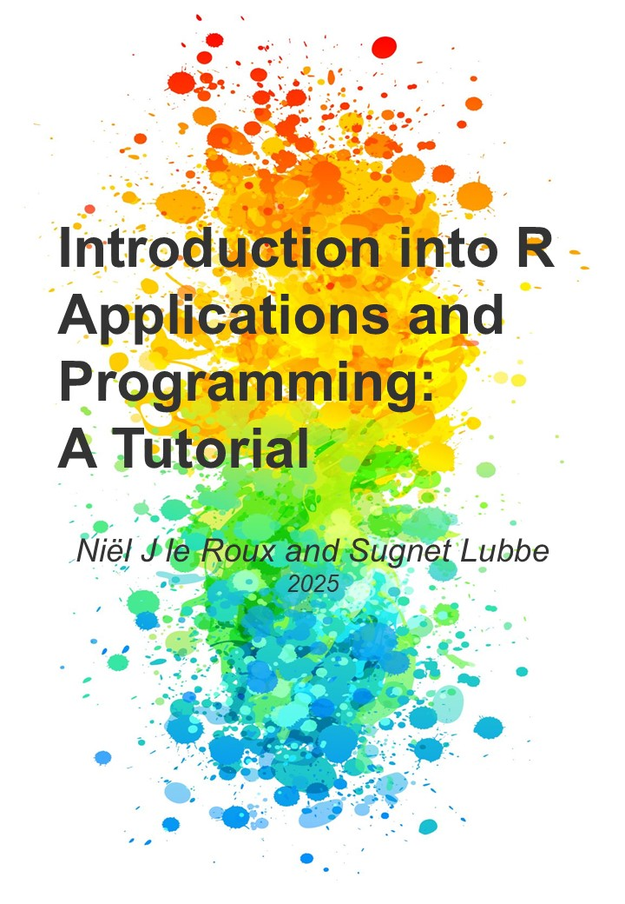

--- 
title: "Introduction into R Applications and Programming: A Tutorial"
author: "Niël J le Roux and Sugnet Lubbe"
date: "2025"
site: bookdown::bookdown_site
documentclass: book
bibliography: [book.bib]
url: https://github.com/sugnet/RTutorial
cover-image: frontcover.jpg
description: |
  Textbook for the R block module.
biblio-style: apalike
csl: harvard-stellenbosch-university.csl
# The framework allows for easy customization of colors and fonts via the bslib R package

---

# Preface {-}

{width=80%}  

This book is an updated version of [@StepbyStep].

## Preface to A Step-by-Step R Tutorial (2013) {-}

The R system is an open-source software project for analyzing data and constructing graphics. It provides a general computer language for performing tasks like organizing data, statistical analyses, simulation studies, model fitting, building of complex graphics and many more. 

Central to the R system is the high-level R computer language. Its roots date back to the birth of the computer language S on May 5, 1976 at Bell Labs, Murray Hill, New Jersey [@Chambers2008]. In its early days S underwent several revisions and extensions mainly for implementation on the UNIX operating system. Eventually an enhanced version of S was licensed under the name S-PLUS and became available for the Windows operating system under the name S-PLUS for Windows. The earlier versions of R adhered to the principles of functional programming and with the release of version S3 in the middle eighties its building blocks were dynamically generated, self-describing objects. The publication The New S Language [@BeckerChambersWilks1988] provides a detailed description of S3. The next major development of S was the release of Statistical Models in S [@ChambersHastie1993] which involved the merging of the functional style of S with object-oriented programming concepts of classes and methods. However, S3 has only limited formal support for classes and methods. The introduction of S4 objects [@Chambers1998] introduced a new class and method system but retains S3 compatibility. In the meantime several versions of S-PLUS based upon S3 at first and later on S4 were released in the commercial market. 

The R language itself was introduced in a paper published by Ross Ihaka and Robert Gentleman of Auckland, New Zealand in 1996 [@IhakaGentleman1996]. This proposal was to a large extent compatible with S but included features from the Lisp/Scheme family of languages. An important aspect of R was its availability as an open-source system. 

Both R and S-PLUS can be considered to be clones of the same underlying S. That means that if you are able to program in the one you can quite easily program in the other but be warned: there are also fundamental differences between the two systems. 

In the first two decades of the twenty-first century interest in R has exceeded all possible expectations. Apart from a well-maintained core system with new releases every few months there are currently literally thousands of researchers contributing add-on packages on cutting-edge developments in statistics and data analysis. 

This book is a tutorial with a twofold aim; learning the basics of the R system and how to program efficiently in R. It is the result of an introductory course in S-PLUS taught at the University of Stellenbosch since 1995. The initial course was based on the book An Introduction to S and S-Plus [@Spector1994]. Since 2002 increasingly more emphasis was put on R to such an extent that it is currently exclusively devoted to R. This change necessitated the preparation of class notes for a ten-day (eight hours a day) tutorial course in R. The result is A Step-by-Step R Tutorial: An introduction into R applications and programming.

## Preface to A Step-by-Step R Tutorial (2021) {-}

Since the first publication of A Step-by-Step R Tutorial: An introduction into R applications and programming the R system has experienced a dramatic evolutionary process. This edition still maintains the twofold aim of the first edition while adapting its contents to the needs of the modernization that has been happening within the R system itself. Deprecated or outdated material has been omitted and new developments included. What follows is a brief description of these changes.

Chapter 1 contains a new section explaining how to use R Markdown for creating PDF and HTML documents from R output. Chapters 2, 3, 4 and 5 see only minor changes. In Chapter 6 changes are made in the data sets used as well as in some exercises being borrowed from later chapters in the first edition. In Chapter 7, ‘Writing R Functions’, a notable reference is made to the `Rcpp` package for the inclusion of C++ code into R. This package allows compiled code to be included  considerably easier and more robust. Vectorized programming and mapping functions are enhanced in Chapter 8 by a discussion of the function `mapply()`. A major addition is a discussion in section 8.14 for writing user-friendly applications using the package `shiny`. This replaces the usage of the function `menu()`. An exercise to create a simple shiny App is also included.

In the first part of Chapter 9, ‘Reading data files into R, formatting and printing’, methods for reading Microsoft Excel files have been updated; functions like `readRDS()` and `writeRDS()` for transporting R objects are introduced; and the `clipr` package is discussed. A major addition to this chapter is the section devoted to the functionality provided by the `tidyverse` collection of R packages for data manipulation and exploration; `tibbles` are discussed in detail as well as the pipe operator `%>%`,  tidy data is illustrated and the data manipulation functions of `dplyr` illustrated in detail.

Chapter 10, ‘R graphics: Round II’, has been considerably extended by the inclusion of a section on how to specify colours; a rewritten section on quantile plots and inclusion of material previously in Chapter 11. There is now a section on density estimation, which includes a discussion of density histograms and average shifted histograms. In the new section 10.14 the package `ggplot2` is discussed with many examples of its capabilities.

The chapter on ‘Modelling in R’ (Chapter 11) and the extensive discussion of the Analysis of Variance and Covariance  (Chapter 12) in the previous edition have been rewritten completely and consolidated into a new Chapter 11. The final chapter is now Chapter 12, ‘Introduction to Optimization’. Apart from a new data set the material is similar to that in Chapter 13 of the previous edition. 
